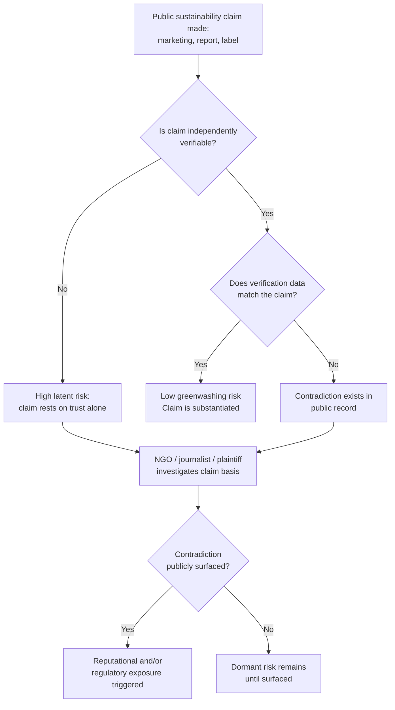

## Greenwashing and Misleading Sustainability Claims

### Overview

Greenwashing refers to the practice of making environmental or sustainability claims — through marketing, labeling, sustainability reports, or public statements — that are false, exaggerated, unsubstantiated, or materially misleading relative to an organization's actual environmental performance or practices. From a reputation and crisis management perspective, greenwashing is distinct from most other reputational risks in that it is frequently *self-inflicted and discoverable through the organization's own public record* — the contradiction usually exists between the company's own marketing and its own filed disclosures, litigation history, or operational data, rather than requiring an external leak.

### Why Greenwashing Is a Distinct Risk Category

**Key Points**

- Unlike many reputational risks that originate from external events, greenwashing risk is generated internally, typically by marketing or communications teams operating with incomplete visibility into sustainability, legal, or operations data.
- The exposure mechanism has matured significantly: NGOs, financial journalists, plaintiffs' firms, and regulators now routinely cross-reference public claims against SEC filings, CDP responses, litigation records, and audited emissions data using increasingly systematic (sometimes automated) methods.
- Because the underlying contradiction is documentable, greenwashing disputes are less about competing narratives and more about verifiable claims — which limits the effectiveness of standard reputation-defense tactics (reframing, distraction, third-party validators) that work better in ambiguous disputes.

### Taxonomy of Greenwashing Claim Types

A widely referenced practitioner taxonomy (originating from environmental marketing research and adapted across ESG/legal literature) identifies several recurring patterns:

| Pattern | Description | Example |
| --- | --- | --- |
| Vagueness | Claims using undefined terms with no verifiable standard | "Eco-friendly," "natural," "green" without supporting specification |
| Hidden Trade-off | Highlighting one positive attribute while omitting a larger negative one | Marketing "recyclable packaging" while the product's manufacturing process is carbon-intensive |
| No Proof | Claims lacking accessible supporting evidence or third-party verification | "Carbon neutral" with no published methodology or verified offset registry |
| Irrelevant Claim | Technically true but immaterial claims used to imply broader virtue | "CFC-free" on a product where CFCs were already banned industry-wide |
| Lesser of Two Evils | True claims used to distract from the product category's inherent harm | Marketing a "greener" cigarette or a "sustainable" fast-fashion line |
| Fibbing | Outright false claims | Fabricated certifications or unverified compliance claims |
| Worshipping False Labels | Implying third-party certification via look-alike seals or badges that are not independently verified | Self-designed "eco-certified" badges with no issuing authority |

[Inference] This taxonomy is widely cited across environmental marketing and legal-compliance literature, though the exact category boundaries and naming vary somewhat by source; it should be treated as a practitioner framework rather than a single codified legal standard.

### Regulatory Exposure Landscape

- **United States**: The FTC's "Green Guides" provide non-binding but influential guidance on environmental marketing claims, and the FTC has authority to pursue deceptive advertising claims under the FTC Act. State attorneys general and private plaintiffs' firms have also pursued greenwashing litigation under state consumer protection statutes.
- **European Union**: Frameworks addressing green claims (including directives targeting unsubstantiated environmental claims and "green claims" verification requirements) have moved toward requiring independent substantiation before claims can be marketed, with the general direction of travel being stricter pre-approval and verification requirements rather than after-the-fact enforcement only.
- [Unverified] Specific enforcement volumes, penalty amounts, and the precise current status of pending EU green-claims legislation change frequently; given the pace of regulatory activity in this area, current statutory status should be verified against primary regulatory sources rather than relied upon from general knowledge, as details may have shifted since this material was prepared.

### Detection and Exposure Pathways





```
### Response Framework When a Greenwashing Accusation Surfaces

Unlike many reputational crises, the first internal step here is investigative, not communicative.

1. **Verify before responding.** Determine internally whether the underlying claim is factually accurate, partially accurate, or indefensible. Responding publicly before this internal verification is complete is a common and serious unforced error.
2. **If the claim is accurate and well-substantiated**: respond with the underlying evidence directly (methodology documents, third-party certifications, audit trail) rather than reasserting the claim rhetorically.
3. **If the claim is partially accurate or imprecisely worded**: correct the imprecision publicly and specifically; vague reassurance ("we take this seriously and remain committed to sustainability") tends to be read as evasive in claims-based disputes, more so than in reputational disputes based on opinion or interpretation.
4. **If the claim is materially false or unsubstantiated**: the recommended path is correction and disclosure rather than defense. Attempting to defend an indefensible factual claim typically extends the story's news cycle and adds a credibility-crisis dimension on top of the original substantive issue.
5. **Engage legal and sustainability teams jointly with communications** before any public response, since greenwashing disputes frequently carry simultaneous litigation, regulatory, and reputational tracks that require coordinated (not sequential) input.

### Distinguishing Genuine Greenwashing from Contested Interpretation

Not every accusation of greenwashing reflects a factual misrepresentation; some reflect legitimate disagreement about ambitious-but-uncertain claims (e.g., forward-looking net-zero targets dependent on future technology).

- **Genuine greenwashing**: claim contradicts already-known, present-tense facts (e.g., claiming a product is "recyclable" when local recycling infrastructure does not accept it).
- **Contested interpretation**: claim is a forward-looking target or aspiration, disclosed as such, that critics argue is unrealistic — this is a legitimate debate about credibility of forecasting, not necessarily a factual misrepresentation.

[Inference] Treating contested forward-looking targets identically to present-tense factual misrepresentations in a public response often weakens the organization's position, because it concedes more culpability than the underlying facts necessarily support; distinguishing these categories in the response itself is generally advisable.

### Preventive Architecture

**Key Points**
- **Claims substantiation review**: a formal, cross-functional sign-off process (legal, sustainability/ESG, communications) required before any public environmental claim is published, analogous to financial disclosure review processes.
- **Centralized claims registry**: a maintained internal record of every public environmental claim and its underlying substantiation source, so that claims can be defended consistently and rapidly if challenged.
- **Marketing-sustainability data alignment**: regular reconciliation between what marketing/communications teams are claiming publicly and what is reflected in filed ESG disclosures, to catch drift before external parties do.
- **Third-party verification prioritization**: claims backed by independent, recognized certification bodies carry materially more credibility under scrutiny than self-asserted claims, and should be prioritized in public messaging over unverified internal metrics.

### Common Failure Modes

1. **Marketing-Led Claims Without Substantiation Review** — public claims originating from marketing teams without sign-off from sustainability, legal, or data teams, creating an internal contradiction that did not need to exist.
2. **Defending Indefensible Claims** — continuing to publicly assert a claim after internal verification has already established it is false or unsupportable, which compounds reputational damage with a credibility dimension.
3. **Conflating Aspiration with Achievement** — describing a forward-looking target ("net zero by 2040") using present-tense language ("we are net zero") in marketing materials, blurring a legitimate distinction that regulators and critics scrutinize closely.
4. **Self-Designed Certification Badges** — using visually authoritative-looking seals or badges without a genuine issuing/verifying third party, which is increasingly and specifically targeted by regulators and researchers.
5. **Slow Internal Escalation** — sustainability or legal teams identifying an internal claims problem but lacking an established escalation path to communications before the issue becomes public.

### Conclusion

Greenwashing exposure differs from most reputational risk categories in being largely self-created and internally documentable before it ever becomes public. The organizations best positioned to manage this risk treat environmental and sustainability claims with the same rigor as financial disclosures — requiring substantiation, cross-functional sign-off, and a maintained evidentiary record — and, when an accusation does surface, prioritize internal verification and factual correction over rhetorical defense, particularly because the underlying facts in these disputes are frequently verifiable rather than a matter of competing narrative.

**Next Steps**
- FTC Green Guides and Environmental Marketing Compliance Review Processes
- EU Green Claims Directive: Substantiation and Verification Requirements
- Building a Cross-Functional Claims Substantiation Review Board
- Carbon Offset Credibility and Verification Registries
- Litigation Risk: Plaintiffs' Bar Activity in Greenwashing Cases
- Distinguishing Forward-Looking Targets from Present-Tense Claims in Public Communications
- Third-Party Certification Body Selection and Credibility Assessment


```