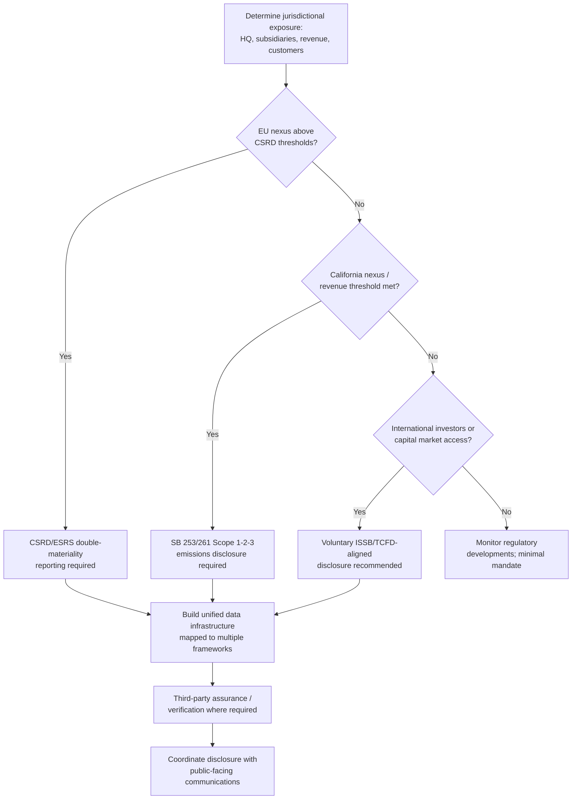

## ESG Disclosure Regulation and Compliance


### Overview

ESG disclosure regulation refers to the legal and quasi-legal frameworks requiring organizations to report standardized environmental, social, and governance data — as distinct from voluntary sustainability communications. From a reputation and crisis management standpoint, disclosure regulation matters because it converts previously discretionary narrative choices into compliance obligations with legal consequences for inaccuracy, and because the current global landscape is fragmented, actively shifting, and jurisdiction-dependent, which itself creates reputational risk from inconsistent multi-jurisdiction reporting.

**[Unverified]** This is an actively moving regulatory area. The specifics below reflect the state of major frameworks as of mid-to-late 2026 based on available reporting; given the pace of legislative and judicial activity in this space, current obligations for any specific organization should be verified against primary regulatory text and current legal counsel rather than relied upon from this material alone.

### Current Global Landscape (as of 2026)

**Key Points**

- The ESG regulatory landscape in 2026 differs markedly from even two years prior: CSRD Wave 2 is live, ISSB is mandatory in more than 21 jurisdictions, and the EU's Omnibus package has reshaped the scope of EU reporting requirements. [ESGsource](https://esgsource.com/global-esg-regulatory-landscape)
- Close to 40 global jurisdictions have adopted or are planning to adopt climate disclosure frameworks aligned with the International Sustainability Standards Board (ISSB). [ESG Dive](https://www.esgdive.com/news/corporate-climate-risk-disclosure-landscape-2026-challenges-data-outlook/810854/)
- The EU's CSRD/ESRS framework remains the most comprehensive mandatory disclosure standard globally, while ISSB has become the baseline framework most referenced by investors internationally. [ESGsource](https://esgsource.com/global-esg-regulatory-landscape)
- Major Asia-Pacific markets — including Japan, Australia, Singapore, Hong Kong, South Korea, and India — have adopted or are implementing mandatory sustainability disclosure requirements, most aligned with ISSB frameworks. [ESGsource](https://esgsource.com/global-esg-regulatory-landscape)

### Key Frameworks Summary

| Framework | Jurisdiction/Scope | 2026 Status |
| --- | --- | --- |
| CSRD / ESRS | European Union | Following the Sustainability Omnibus update in early 2026, the EU raised its reporting thresholds to capture only the largest firms — specifically those with over 1,000 employees and €450 million in net turnover. Core double-materiality obligation retained. |
| ISSB (IFRS S1 / S2) | Global baseline | The 2025–2026 period confirms massive adoption of IFRS S1 (general requirements) and IFRS S2 (climate) as the global disclosure baseline. |
| SEC Climate Disclosure Rule | United States (federal) | The rule appears effectively dead, though the administrative process is still being worked through; it has been subject to legal challenges and a judicial stay, with federal enforcement currently paused. |
| California SB 253 / SB 261 | United States (state, California nexus) | Scope 1 and 2 emissions data collection systems were being prepared ahead of a proposed August 10, 2026 deadline for SB 253, applicable to companies meeting California revenue/nexus thresholds. |
| UK SDR | United Kingdom | Labelling and disclosure rules are being phased in under the UK Sustainability Disclosure Requirements regime. |
| CDP Questionnaire | Global (investor/supply-chain driven, not statutory) | Required by many of the world's largest institutional investors and increasingly embedded in corporate supply chain requirements; for suppliers to large multinationals with Scope 3 obligations, completing the CDP questionnaire is often a condition of continued supplier status. |

### The Double Materiality Concept (CSRD)

**Key Points**

- Despite higher EU reporting thresholds under the Omnibus update, the core obligation of double materiality remains: companies must report on financial materiality (how climate change affects the company's own value and financial health) and impact materiality (how the company's activities affect the environment and society). [EcoVadis](https://ecovadis.com/regulations/sec-climate-risk-disclosure-rule/)
- This is a more expansive materiality concept than what US SEC registrants have traditionally been required to apply, presenting process, legal, and disclosure considerations for multinational filers. [EY](https://www.ey.com/en_us/insights/esg-reporting/esg-and-sec-climate-disclosure-rule-update)
- CSRD compliance is not one-size-fits-all: companies have a range of reporting options depending on their scope, but regardless of the specific reporting level chosen, a consistent internal process for materiality assessment and disclosure stance is required. [EY](https://www.ey.com/en_us/insights/esg-reporting/esg-and-sec-climate-disclosure-rule-update)

### The US Fragmentation Problem

Reputation and compliance teams operating in the US face a distinctly fragmented picture compared to the EU's unified CSRD approach:

- ESG compliance requirements for US companies in 2026 come from three overlapping layers rather than a single federal mandate, following the effective withdrawal/stalling of the federal SEC rule. [OneStop ESG](https://onestopesg.com/esg-resources/esg-compliance-usa-regulations-reporting-2026)
- The US approach combines a stalled federal SEC rule with state-level laws such as California SB 253 (requiring Scope 1, 2, and 3 emissions disclosure), alongside some states enacting anti-ESG legislation restricting ESG considerations in state investment decisions. [ESGsource](https://esgsource.com/global-esg-regulatory-landscape)
- For US companies accessing international capital markets — through global bond markets, cross-border M&A, or institutional investor relationships — ISSB alignment is increasingly a de facto prerequisite even without a domestic regulatory mandate. [OneStop ESG](https://onestopesg.com/esg-resources/esg-compliance-usa-regulations-reporting-2026)
- US multinationals with significant European operations remain subject to CSRD regardless of US federal rule status, and EU regulations create incentives toward global policy harmonization even for companies without a formal domestic mandate. [Breatheesg](https://www.breatheesg.com/resources/esg-regulations-usa-2026)

This creates a distinct reputational risk: an organization can be simultaneously *under-regulated* at the US federal level and *heavily regulated* at the EU/state level, and stakeholders (investors, NGOs, media) frequently do not distinguish between these layers when evaluating perceived compliance seriousness.

### Regulatory Compliance Decision Flow





```
### Investor Sentiment on Regulation

- While views on ESG regulations vary by jurisdiction, asset owners have largely viewed them as a "net-help," according to a major 2025 asset owner survey that received responses from over 500 global asset owners of varying sizes, with 55% considering ESG regulation a net positive.
- This matters for reputation management because it suggests that robust, standardized disclosure is generally rewarded by capital markets rather than viewed as pure compliance burden — reinforcing the ESG-as-reputation-driver dynamic covered elsewhere in this chapter.

### Reputational Risk Points Specific to Disclosure Regulation

**Key Points**
- **Cross-jurisdiction inconsistency**: Reporting more rigorously under CSRD (due to legal obligation) while providing materially thinner voluntary disclosure in jurisdictions with no mandate invites accusations of selective transparency.
- **Portfolio/investee gaps**: Asset managers and portfolios must now anticipate data gaps as fewer companies fall under mandatory CSRD following threshold increases, and are advised to engage investee companies directly on voluntary VSME+ or ISSB-aligned reporting — a dynamic that shifts reputational pressure onto asset managers to demonstrate due diligence despite reduced mandatory data availability.
- **Regulatory whiplash**: The SEC rule's stall/legal-challenge status creates a scenario where organizations that built compliance infrastructure in anticipation of the rule must decide whether to maintain voluntary disclosure at that standard or scale back — either choice carries reputational signaling risk to different stakeholder groups.
- **Extraterritorial scope confusion**: ISSB requirements have been adopted, at least in part, by jurisdictions such as Mexico, Brazil, and Australia among many others, and many of these regulations have extraterritorial effects, not being limited to entities domiciled in those jurisdictions. Organizations frequently underestimate exposure from customer or supply-chain relationships in regulated jurisdictions even absent direct domicile there.

### Common Failure Modes

1. **Assuming Federal US Inaction Means No Exposure** — ignoring state-level (California) and international (CSRD, ISSB-adopting jurisdictions) obligations because the federal SEC rule is stalled, while material exposure exists at other levels.
2. **Single-Framework Tunnel Vision** — building disclosure infrastructure for only one framework (e.g., CSRD) without mapping to ISSB or other frameworks investors may reference, duplicating effort and creating inconsistency risk.
3. **Static Compliance Posture in a Moving Landscape** — treating disclosure compliance as a one-time build rather than an ongoing monitoring function, given how frequently thresholds, enforcement status, and jurisdictional scope have shifted even within a single year.
4. **Disclosure-Marketing Misalignment** — filing conservative, legally-reviewed disclosures while allowing marketing claims to run ahead of what is substantiated in those filings (directly connects to greenwashing risk).
5. **Underestimating Supply-Chain-Driven Obligations** — treating CDP and similar investor/customer-driven questionnaires as optional when, in practice, they function as de facto mandatory requirements for continued commercial relationships with regulated counterparties.

### Conclusion

ESG disclosure regulation in 2026 is defined by fragmentation and active flux rather than a single stable global standard: the EU's CSRD/ESRS framework anchors the most comprehensive mandatory regime, ISSB serves as the emerging global investor baseline across dozens of jurisdictions, and the US presents a patchwork of stalled federal rulemaking, active state-level requirements, and investor-driven voluntary pressure. For reputation and compliance functions, the practical implication is that organizations need jurisdiction-mapped compliance infrastructure built for convergence across multiple frameworks simultaneously, rather than optimizing for any single regulatory regime — and disclosure accuracy must be actively reconciled with public-facing sustainability marketing to avoid the greenwashing exposure this fragmentation makes easier to overlook.

**Next Steps**
- CSRD/ESRS Double Materiality Assessment Methodology
- SEC Climate Rule Litigation Tracking and Contingency Planning
- California SB 253/SB 261 Scope 1-2-3 Emissions Data Infrastructure
- ISSB (IFRS S1/S2) Adoption Roadmap for Multinational Filers
- Building Multi-Framework Disclosure Data Architecture
- Third-Party Assurance and Verification Requirements by Jurisdiction
- Coordinating Legal, Sustainability, and Communications Functions on Disclosure Accuracy


```