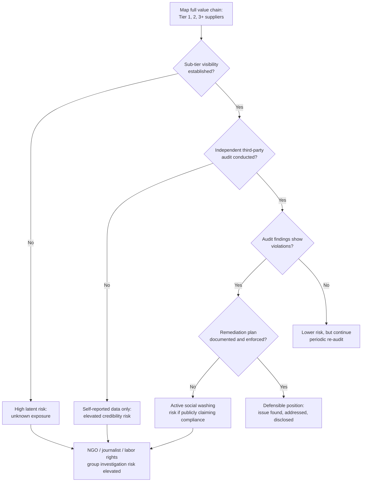

## Social Washing and Human Rights Risk

### Overview

Social washing refers to the practice of overstating, misrepresenting, or selectively presenting an organization's social performance — labor practices, diversity commitments, supply chain conditions, community impact — in ways that outpace the underlying reality. It is the "S" pillar analogue to greenwashing, but carries distinct risk characteristics: social claims are generally harder to independently verify than environmental data (which increasingly has standardized metrics like tCO2e), the underlying facts often involve third parties (suppliers, contractors) outside the organization's direct operational control, and the reputational and legal consequences frequently intersect with human rights law, forced labor statutes, and international frameworks rather than purely consumer-protection or securities law.

### Distinguishing Social Washing from Greenwashing

**Key Points**

- Environmental claims are increasingly benchmarked against quantifiable, standardized metrics (emissions volumes, energy mix); social claims (fair wages, safe working conditions, freedom of association) are more qualitative, harder to standardize across jurisdictions, and more dependent on self-reported or third-party-audited data of variable rigor.
- Social risk is disproportionately concentrated in extended supply chains — the organization's direct workforce practices may be exemplary while sub-tier suppliers (raw material extraction, component manufacturing) carry the majority of the actual human rights exposure.
- Because supply chains span multiple jurisdictions with different labor law regimes and enforcement capacity, social washing disputes frequently involve genuine visibility gaps (the organization may not have known) rather than deliberate misrepresentation — this distinction matters significantly for both legal exposure and appropriate crisis response.

### Taxonomy of Social Washing Patterns

| Pattern | Description | Example |
| --- | --- | --- |
| Tier-1 Only Auditing | Auditing and certifying only direct (Tier-1) suppliers while sub-tier (Tier-2/3) suppliers, where much labor risk concentrates, go unaudited | A garment brand certifies its cut-and-sew factories but does not trace or audit the raw material/fiber suppliers further upstream |
| DEI Metric Inflation | Publicizing favorable-but-narrow diversity metrics while omitting less favorable ones | Highlighting board gender diversity while omitting pay-equity gaps or promotion-rate disparities |
| Code of Conduct Without Enforcement | Publishing a supplier code of conduct with no meaningful audit, remediation, or termination mechanism behind it | A "zero tolerance" forced labor policy with no documented supplier audit or termination history |
| Community Investment Spotlighting | Highlighting a small, high-visibility philanthropic program while operational practices in the same community cause net harm | A mining company funding a local school while community water contamination claims remain unaddressed |
| Symbolic Solidarity Statements | Public statements of support for social causes (e.g., during awareness months) without corresponding internal policy, pay, or hiring practice changes | A public statement supporting pay equity with no internal pay-equity audit ever conducted or disclosed |

[Inference] This taxonomy synthesizes common patterns identified across ESG, labor-rights, and corporate accountability literature; exact categorization varies by source, and the boundaries between "washing" and genuine good-faith gaps in supply chain visibility are often contested in practice.

### Human Rights Due Diligence Frameworks

The dominant international framework organizations are increasingly expected to align with is the **UN Guiding Principles on Business and Human Rights (UNGPs)**, which establishes a three-pillar structure:

1. **State duty to protect** human rights (government obligation, not directly an organizational one).
2. **Corporate responsibility to respect** human rights — requiring organizations to conduct human rights due diligence (identify, prevent, mitigate, and account for how they address impacts).
3. **Access to remedy** — ensuring affected individuals have a route to grievance and remediation, whether through judicial mechanisms or company-level grievance processes.

Several binding legal frameworks have operationalized elements of this in recent years, most notably human rights and environmental due diligence directives in the EU (requiring in-scope companies to conduct due diligence across their value chains) and various national supply chain due diligence acts (e.g., German-style supply chain acts requiring documented risk analysis and remediation processes).

[Unverified] The specific scope, thresholds, and enforcement status of EU-level corporate due diligence directives have been subject to ongoing legislative revision (including scope-narrowing efforts analogous to the CSRD Omnibus process); current applicability to any specific organization should be verified against current statutory text rather than relied upon from general knowledge, as this area has continued to evolve.

### Human Rights Risk Identification Flow





```
### Response Framework When Human Rights Allegations Surface

Unlike consumer-facing environmental disputes, human rights allegations frequently involve vulnerable individuals, ongoing harm, and sometimes physical safety concerns — which changes both the ethical stakes and the appropriate response sequencing.

1. **Immediate priority is fact-finding focused on affected individuals' welfare**, not reputational containment. Response frameworks that lead with messaging strategy before establishing facts and addressing immediate harm are a common and serious failure mode in this category specifically.
2. **Engage independent, credible investigators** rather than relying solely on internal or existing supplier-relationship-holding auditors, since the latter carry an inherent conflict of interest.
3. **Avoid premature denial.** Given that much social risk sits in extended supply chains genuinely outside direct operational visibility, categorical denial before investigation frequently proves false and compounds the crisis with a credibility dimension — a pattern structurally similar to greenwashing disputes but with higher stakes given the underlying subject matter (human welfare rather than environmental metrics).
4. **Distinguish "we did not know" from "we should have known."** Genuine lack of visibility into distant sub-tier suppliers is a materially different position than failure to act on known or reasonably discoverable risk indicators (e.g., ignoring prior audit red flags), and response messaging should not conflate these.
5. **Commit to remediation with verification, not just termination.** Simply severing a supplier relationship upon discovery of a violation can leave affected workers without recourse or income and is increasingly criticized by labor rights organizations as a reputational-protection move rather than a genuine remedy; frameworks increasingly favor documented remediation (often called "responsible exit" when termination is unavoidable) over immediate severance alone.

### Coordination Requirements

Human rights and social washing crises typically require simultaneous coordination across more functions than a standard reputational crisis:

| Function | Role |
|---|---|
| Legal | Assess regulatory exposure (due diligence directive compliance, forced labor import bans, litigation risk) |
| Supply Chain / Procurement | Establish factual chain-of-custody and supplier relationship history |
| Human Rights / Sustainability | Lead independent investigation and remediation planning |
| Communications | Coordinate disclosure timing with investigation findings; avoid outpacing verified facts |
| Executive/Board | Governance-level accountability, especially where prior audit findings were known and unaddressed |

### Common Failure Modes

1. **Tier-1-Only Due Diligence** — limiting audit and certification scope to direct suppliers while the majority of actual labor risk sits further upstream, then claiming supply-chain-wide compliance based on this partial picture.
2. **Premature Public Denial** — issuing categorical denials before investigation, which frequently must later be walked back as facts emerge, compounding the original issue with a credibility crisis.
3. **Audit Theater** — conducting audits that are announced in advance, narrowly scoped, or structurally unable to detect the violations in question (e.g., short-notice document reviews that miss unrecorded overtime or subcontracted labor).
4. **Symbolic-Only Response** — public statements of concern or solidarity without documented, verifiable changes to sourcing, remediation, or policy.
5. **Severance Without Remedy** — terminating a flagged supplier relationship without ensuring affected workers have access to remediation, which is increasingly recognized as harmful to the very individuals the response is nominally protecting.
6. **Conflating Genuine Visibility Gaps with Deliberate Concealment** — either in internal response strategy or public communications, failing to distinguish between "we lacked visibility" and "we knew and did not act," which affects both legal exposure and the appropriate tone of public accountability.

### Conclusion

Social washing and human rights risk differ from environmental "washing" risk primarily in the depth of the value chain involved, the qualitative and jurisdiction-dependent nature of the underlying standards, and the human welfare stakes when allegations prove true. Effective management requires human rights due diligence extending meaningfully beyond Tier-1 suppliers, independent (not relationship-compromised) verification, and a crisis response sequence that prioritizes affected individuals' welfare and factual investigation ahead of reputational messaging — recognizing that premature denial in this category carries especially high compounding risk given how frequently genuine visibility gaps in extended supply chains turn out to contain real violations.

**Next Steps**
- UN Guiding Principles on Business and Human Rights: Implementation Frameworks
- Sub-Tier Supplier Mapping and Traceability Technology
- Independent Third-Party Labor Audit Selection and Governance
- EU Corporate Sustainability Due Diligence Directive: Scope and Compliance
- Responsible Exit Frameworks for Supplier Relationship Termination
- DEI Metric Selection and Disclosure Rigor
- Grievance Mechanism Design for Affected Rights-Holders


```