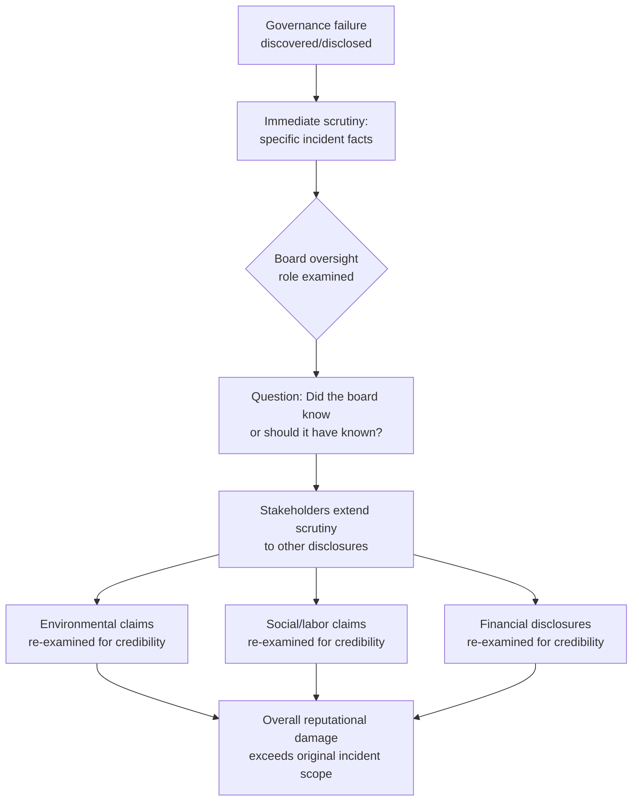

## Governance Failures and Board-Level Reputation Risk

### Overview

Governance failures — breakdowns in board oversight, executive accountability, internal controls, or ethical decision-making at the leadership level — represent the highest-severity category of reputational risk within the ESG framework. Unlike environmental or social pillar issues, which can often be attributed to operational, supply chain, or communications shortcomings, governance failures implicate the credibility of the organization's leadership and oversight structures directly. This has a distinct amplifying property: a governance scandal tends to cause stakeholders to retroactively question the reliability of *all* previously reported metrics and claims, not just the specific matter at hand.

### Why Governance Failures Amplify Rather Than Isolate

**Key Points**

- Environmental and social claims are typically evaluated on their own terms — a weak environmental record does not usually cause stakeholders to doubt an organization's labor practices reporting.
- Governance failures function differently because the board and executive leadership are the parties who authorize, sign off on, and are ultimately accountable for *all* disclosures, including environmental and social ones. A demonstrated failure of oversight or integrity at that level reasonably raises the question of what else has been inadequately overseen or misrepresented.
- [Inference] This is why governance scandals frequently produce reputational damage disproportionate to the narrow financial or legal scope of the underlying incident — the damage is largely about inferred unreliability of the broader information environment the organization has produced, not just the specific misconduct.

### Categories of Governance Failure

| Category | Description | Reputational Mechanism |
| --- | --- | --- |
| Executive Misconduct | Fraud, harassment, self-dealing, or ethical violations by senior executives | Direct personal accountability question; often triggers "did the board know" scrutiny |
| Board Independence Failures | Insufficient independent directors, conflicts of interest, related-party transactions inadequately disclosed or scrutinized | Undermines credibility of all board-approved disclosures and oversight claims |
| Executive Compensation Controversy | Pay packages perceived as misaligned with performance, especially during layoffs or poor results | Shareholder and public perception of value misalignment; frequent proxy advisor and activist target |
| Whistleblower Retaliation | Punishing or failing to protect internal reporters of misconduct | Signals that internal accountability mechanisms are performative rather than functional |
| Internal Controls Failures | Material weaknesses in financial or operational controls, restatements | Direct credibility hit to financial reporting reliability, often triggers auditor and regulator scrutiny |
| Succession Planning Failures | Chaotic, opaque, or conflict-driven leadership transitions | Signals instability and raises questions about board's oversight function generally |

### The "Trust Cascade" Effect

Governance failures tend to propagate reputational doubt outward in a predictable pattern, distinct from single-issue crises.





```
### Board-Level Response Requirements

**Key Points**
- Governance crises are structurally different from operational or communications-led crises in that the board itself is frequently a required actor in the response, not merely a recipient of communications advice — because the failure occurred at or near the level the board is responsible for overseeing.
- A communications-only response (statement, apology, messaging campaign) without accompanying structural remedy (board composition changes, policy changes, executive departures, enhanced controls) is a common failure pattern precisely because it does not address the "was oversight adequate" question that drives the trust cascade.
- Independent investigation — commissioned by the board or a special committee of independent directors, using outside counsel or investigators — carries materially more credibility than an internally-led review, particularly when the allegations concern executives who would otherwise be involved in commissioning or reviewing an internal investigation.

### Response Sequencing Framework

1. **Establish independence of the investigative process** before any public statement. A response that precedes a credible, independent fact-finding process risks being contradicted by subsequent findings, compounding the crisis with a credibility failure layered on top of the original governance failure.
2. **Assess and disclose board awareness timeline.** Whether the board knew, when it knew, and what it did upon learning are typically the most scrutinized facts in governance crises — more so than the underlying misconduct itself in many cases, because they speak directly to the oversight function's reliability.
3. **Separate the individual from the institution where facts support it.** Where misconduct is attributable to a specific individual and the board acted appropriately upon discovery, response messaging can (accurately) distinguish individual wrongdoing from institutional failure. Where the board itself failed to act on known or discoverable red flags, this distinction is not available and should not be attempted.
4. **Pair statements with structural remedy.** Executive departures, board composition changes, enhanced internal controls, or policy changes provide verifiable evidence of response, which is generally more credibility-restoring than statements alone.
5. **Coordinate legal, board, and communications functions simultaneously**, not sequentially — governance crises typically carry parallel litigation, regulatory (SEC or equivalent), and reputational tracks, and messaging developed without legal input risks creating admissions or inconsistencies that complicate the legal track.

### Board Composition and Independence as Preventive Architecture

- **Independent director majority**: boards with a substantial majority of independent (non-executive, non-affiliated) directors are generally viewed by governance rating agencies and investors as lower-risk for undetected executive misconduct or related-party issues, though independence alone does not guarantee effective oversight.
- **Audit committee rigor**: a functioning, adequately resourced audit committee with direct access to internal and external auditors (without management filtering) is a key structural safeguard against internal controls failures reaching crisis scale before detection.
- **Whistleblower protection and reporting channels**: documented, independently-monitored reporting channels (not routed solely through management) with demonstrated non-retaliation enforcement history provide both an early-warning mechanism and, if a crisis occurs, evidence that the organization had functioning internal accountability structures.
- **Board refreshment practices**: regular, planned board turnover and skills-gap assessment reduces the "entrenched board" perception that can compound scrutiny during a crisis, where a long-tenured, static board is read as less likely to have exercised independent scrutiny of management.

### Distinguishing Genuine Failures from Contested Governance Disputes

Not every governance controversy reflects an actual failure; some reflect legitimate disagreement about governance philosophy or strategic direction (e.g., shareholder activist campaigns for board seats, disputes over executive compensation structure design).

- **Genuine failure**: documented instance of the board failing to act on known misconduct, inadequate disclosure of material conflicts, or demonstrable internal controls breakdown.
- **Contested dispute**: disagreement about governance structure preferences (e.g., separation of Chair/CEO roles, say-on-pay outcomes, activist investor demands) where reasonable governance philosophies differ.

[Inference] Treating contested governance-philosophy disputes with the same crisis-response intensity as documented failures can be counterproductive, both because it concedes more culpability than warranted and because it may signal to investors that the organization cannot distinguish between legitimate governance debate and actual malfeasance.

### Common Failure Modes

1. **Internally-Led Investigation Perceived as Compromised** — using internal or existing-relationship auditors/counsel to investigate matters involving senior executives, undermining the credibility of findings regardless of their actual accuracy.
2. **Communications-First Sequencing** — issuing reassurance statements before investigation facts are established, risking later contradiction.
3. **Statement Without Structural Remedy** — apologizing or expressing concern without any verifiable governance change, which stakeholders and rating agencies increasingly discount as insufficient.
4. **Board Silence or Invisibility** — allowing communications teams or executives to be the sole public face of a crisis that is fundamentally about board oversight, when direct board-level accountability communication is what the situation requires.
5. **Conflating Individual and Institutional Accountability** — either over-shielding the institution when the board itself failed, or over-penalizing the institution when an individual's misconduct was promptly and appropriately addressed upon discovery.
6. **Underestimating Rating Agency Sensitivity** — treating governance crises as primarily a public-relations matter while underestimating how disproportionately governance rating agencies weight documented governance failures relative to environmental or social metrics.

### Conclusion

Governance failures occupy the highest-severity tier of ESG-linked reputational risk because they compromise the credibility of the oversight function responsible for all other organizational claims and disclosures, producing a trust cascade that extends well beyond the original incident's substantive scope. Effective management requires board-level (not merely communications-level) response, genuinely independent investigation, honest assessment and disclosure of what the board knew and when, and structural remedy rather than statement alone — recognizing that the credibility-restoring power of governance response comes primarily from verifiable action, not messaging quality.

**Next Steps**
- Independent Investigation Protocols for Executive Misconduct Allegations
- Audit Committee Structure and Effectiveness Assessment
- Whistleblower Protection Program Design and Enforcement Tracking
- Board Composition Rating Agency Criteria (ISS, Glass Lewis)
- Executive Compensation Design and Proxy Advisor Engagement
- Crisis Communication Sequencing for Board-Level Incidents
- Distinguishing Governance Philosophy Disputes from Documented Failures


```