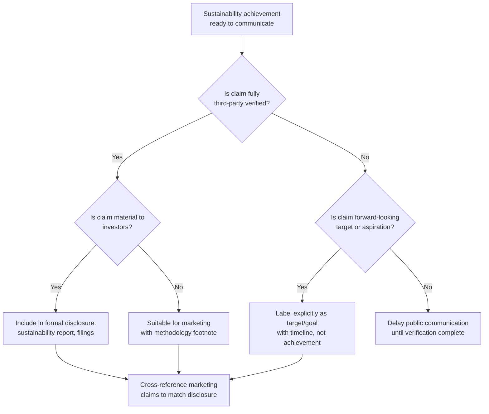

## Communicating Genuine Sustainability Progress

### Overview

Communicating genuine sustainability progress is the practice of publicly reporting authentic, substantiated environmental, social, and governance performance in a way that builds durable credibility rather than inviting greenwashing or social-washing scrutiny. This is distinct from the risk-mitigation topics covered elsewhere in this chapter in that it addresses the *positive* communications discipline organizations need even when their underlying performance is genuinely strong — good performance, poorly or overconfidently communicated, can still generate reputational damage.

### Why Genuine Progress Still Fails Communicatively

**Key Points**

- A common and underappreciated failure pattern is organizations with legitimately strong sustainability performance nonetheless drawing greenwashing-style criticism because of *how* the progress is communicated, not because the underlying claims are false.
- This typically occurs through overclaiming relative to what is actually substantiated (rounding up), omitting material context that would qualify the achievement, or using promotional language patterns that trigger the same skepticism reflexes as genuinely false claims, regardless of accuracy.
- [Inference] Because journalists, NGOs, and researchers increasingly apply the same scrutiny heuristics to all sustainability communications regardless of underlying accuracy, organizations with genuine progress bear a communications burden to differentiate themselves from bad-faith actors through specificity and restraint, rather than assuming accuracy alone will be self-evident.

### The Credibility-Building Framework

#### 1. Specificity Over Superlative

Replace broad claims with specific, falsifiable ones.

| Weak (Superlative) | Strong (Specific) |
| --- | --- |
| "Industry-leading sustainability performance" | "Reduced Scope 1 and 2 emissions by 34% against a 2019 baseline, verified by [named third-party auditor]" |
| "Committed to a greener future" | "Transitioned 60% of owned vehicle fleet to electric as of Q2, with remaining transition scheduled by [specific date]" |
| "Proud to support our communities" | "Invested $X in [named program], serving Y documented beneficiaries in [specific region]" |

Specific claims are more defensible under scrutiny because they are falsifiable and therefore signal confidence in the underlying data; vague claims invite the assumption that specificity was avoided because the underlying data would not support it.

#### 2. Methodology Transparency

**Key Points**

- Publishing the calculation methodology behind a headline claim (baseline year, scope boundaries, emission factors used, verification standard applied) materially increases credibility because it allows independent verification rather than requiring trust alone.
- This is particularly important for claims involving offsets, carbon accounting, or "neutral"/"net zero" language, where methodology choices (e.g., market-based vs. location-based emissions accounting, offset quality standards) can produce dramatically different headline numbers from the same underlying operations.
- Organizations that disclose methodology proactively are generally better positioned to withstand third-party recalculation attempts than those that state only the conclusion.

#### 3. Progress-Relative-to-Baseline Framing, Not Absolute Perfection Framing

- Sustainability communications framed as "we have solved X" invite disproportionate scrutiny and a single counterexample can undermine the entire claim.
- Communications framed as "we have reduced X by Y% against Z baseline, and here is our remaining gap and timeline" are more resilient, because they build in acknowledgment of incompleteness rather than implying a finished state that critics can disprove with one data point.

#### 4. Disclosing Setbacks Alongside Progress

- Sustainability reporting that includes years or metrics where performance declined or targets were missed, alongside an explanation, is generally read as more credible than reporting that shows uninterrupted improvement — the latter pattern itself raises scrutiny because genuine operational performance rarely improves linearly across every metric every year.
- [Inference] This "credibility through imperfection" dynamic is a recurring theme in sustainability communications guidance, though the degree to which it improves actual stakeholder trust versus simply reducing suspicion has not been rigorously isolated as a distinct causal effect in available research.

### Communication Channel Selection by Claim Type





```
### Internal Coordination Requirements

**Key Points**
- Sustainability communications credibility depends on structural coordination between the teams that generate the underlying data (sustainability/ESG function), the teams that verify it (internal audit, external assurance providers), and the teams that communicate it (marketing, communications, investor relations) — the same substantiation-review architecture referenced under greenwashing prevention applies here in the affirmative case, not only the defensive one.
- A common structural gap is treating positive-news sustainability communications as lower-risk than crisis communications and therefore routing them through less rigorous review — when in practice, positive claims made without adequate substantiation review create exactly the future greenwashing exposure that a crisis-response protocol will later have to manage.

### Audience-Specific Calibration

| Audience | What Builds Credibility | What Undermines It |
|---|---|---|
| Institutional investors / ESG raters | Standardized metrics, third-party assurance, consistent year-over-year methodology | Metric changes without explanation, cherry-picked comparison years |
| General public / consumers | Concrete, relatable specifics (e.g., "equivalent to removing X cars from the road") alongside methodology access | Jargon-heavy disclosure language, superlative claims without specifics |
| Employees | Internal transparency on both progress and shortfalls, visibility into how their function contributes | Public claims that read as disconnected from lived internal experience |
| NGOs / advocacy groups | Willingness to engage on methodology critique, responsiveness to third-party research | Defensive non-engagement with methodology questions |

### Common Failure Modes

1. **Rounding Up** — describing a partial or in-progress achievement using completed-state language ("we achieved" instead of "we are on track to achieve"), which becomes indistinguishable from genuine overclaiming if the timeline slips.
2. **Methodology Opacity in Good-News Communications** — disclosing only the headline percentage or metric without the underlying calculation basis, leaving the claim vulnerable to third-party recalculation using different assumptions.
3. **Uninterrupted Improvement Narratives** — reporting patterns showing continuous improvement across every metric every period, which read as curated rather than authentic and invite scrutiny of what was omitted.
4. **Treating Marketing Claims as Lower-Risk than Disclosure Filings** — applying less substantiation rigor to consumer-facing marketing than to investor disclosures for the same underlying claim, creating the exact marketing-disclosure gap that produces greenwashing exposure even when the underlying performance is genuine.
5. **Non-Engagement with Legitimate Methodology Critique** — responding defensively or dismissively to good-faith questions about calculation methodology from researchers or NGOs, which reads similarly to bad-faith stonewalling even when the organization's underlying position is defensible.

### Conclusion

Communicating genuine sustainability progress credibly requires treating positive claims with the same substantiation discipline typically reserved for crisis response — specificity over superlative language, transparent methodology, honest disclosure of setbacks alongside achievements, and consistent coordination between data-generating, verifying, and communicating functions. Organizations with genuinely strong underlying performance that skip this discipline remain exposed to greenwashing-style scrutiny not because their claims are false, but because the communication pattern itself is indistinguishable from bad-faith overclaiming without the specificity and transparency that differentiate the two.

**Next Steps**
- Sustainability Report Design and Third-Party Assurance Standards
- Carbon Accounting Methodology: Market-Based vs. Location-Based Reporting
- Building Cross-Functional Substantiation Review for Positive-News Claims
- Employee-Facing Sustainability Transparency Practices
- Engaging Constructively with NGO and Researcher Methodology Critique
- Comparative Analysis: High-Credibility vs. Low-Credibility Sustainability Reporting Case Studies


```