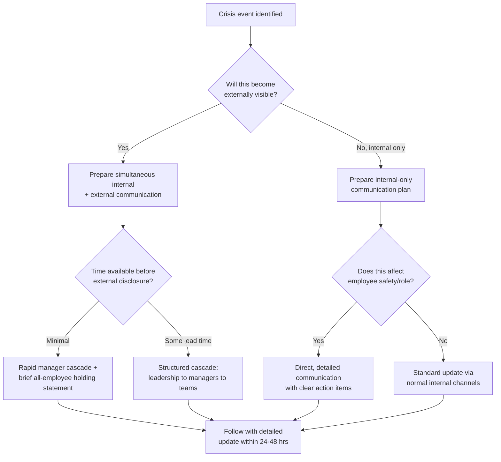

## Employee Communication Strategy in a Crisis


### Overview

Employee communication strategy during a crisis refers to the deliberate design of internal information flows — timing, channel, content, and tone — to the organization's own workforce during an acute reputational, operational, or safety event. Internal communication during crisis is frequently under-resourced relative to external/media communication, despite employees functioning as one of the most consequential audiences: they are simultaneously a source of operational continuity, a source of potential leaks, an informal (and increasingly public) commentary channel via social media, and the group whose trust most directly determines whether the organization can function through the crisis period.

### Why Employee Communication Requires a Distinct Strategy

**Key Points**

- Employees receive crisis information from multiple competing channels simultaneously (official internal communication, external media, social media, personal networks, rumor), and the organization does not control the relative timing or accuracy of these channels the way it can attempt to with press communications.
- If external media or social channels reach employees with crisis information before internal channels do, the organization has effectively ceded its most trusted-audience relationship to an uncontrolled information source at the exact moment trust matters most.
- Employees are also potential amplifiers or detractors in public discourse — internal Slack screenshots, personal social media posts, and informal commentary from employees are increasingly treated as credible primary sources by journalists and the public, meaning internal communication quality has direct external reputational consequences.

### The "Employees First" Sequencing Principle

**Key Points**

- A widely followed practitioner norm is that employees should learn of significant crisis-relevant news from internal channels at or before the same time external audiences do, not after.
- This is not merely a courtesy norm — organizations that are perceived to have prioritized external messaging (press statements, investor calls) ahead of informing their own workforce frequently face a secondary, employee-trust-focused crisis layered on top of the original incident.
- Practical implementation requires coordinated timing between communications, HR, legal, and executive teams so that an internal announcement (email, town hall, cascading manager briefing) is ready to deploy simultaneously with or immediately before any external statement.

### Core Decision Framework





```
### Channel Selection by Crisis Severity and Urgency

| Channel | Best For | Limitations |
|---|---|---|
| All-hands / town hall (live or virtual) | High-severity crises requiring leadership visibility and Q&A | Requires scheduling lead time; unscripted Q&A carries leak/clip risk |
| Cascading manager briefing | Crises requiring localized, role-specific context or sensitivity | Dependent on manager quality and consistency; risk of message drift |
| All-employee email/memo | Time-sensitive, needs-to-be-documented, broad-audience updates | One-directional; no immediate Q&A; can feel impersonal for high-emotion events |
| Internal chat/intranet post | Fast-moving situations, frequent updates, lower-severity issues | Persistent and searchable — anything posted should be written assuming eventual external visibility |
| One-on-one/small group (HR-led) | Individually sensitive matters (layoffs, safety incidents, misconduct involving specific individuals) | Resource-intensive; does not scale to large organizations quickly |

[Inference] Channel selection guidance here reflects common internal-communications practice; the optimal mix is highly dependent on organization size, existing communication infrastructure, and the specific nature of the crisis, and should be adapted rather than applied as a fixed formula.

### Content Principles for Crisis Employee Communication

- **Lead with what is known, then what is being done, then what employees should do.** Structuring communication in this order reduces the perception that the organization is either withholding known facts or has no action plan.
- **Acknowledge uncertainty explicitly rather than filling gaps with reassurance.** Statements like "we do not yet have full details on X; we will update by [specific time]" are generally more credible than vague reassurance that implies more certainty than exists.
- **Avoid language that will not survive external leak.** Because internal communications are frequently screenshotted and shared externally (intentionally or not), internal crisis messaging should be drafted assuming it may become a public document — inconsistency between internal and external messaging tone or content is a common source of secondary reputational damage.
- **Provide concrete, actionable guidance where relevant.** For crises with operational impact (safety incidents, system outages, facility closures), employees need specific instructions, not just sentiment; vague empathetic language without operational clarity leaves employees to improvise, which increases both safety risk and inconsistent external commentary.
- **Designate and communicate a single source of truth channel.** Employees should know where to check for verified updates (a specific intranet page, a pinned channel post) to reduce reliance on rumor or external media as their primary information source during the acute phase.

### Manager Enablement

**Key Points**
- Frontline and middle managers are typically the channel employees trust most and turn to first with questions, yet they are frequently the last to be briefed in practice, creating a structural gap between what leadership has communicated and what managers can credibly answer.
- Effective crisis communication strategy includes manager-specific briefing materials distinct from the general employee communication: anticipated employee questions with suggested (not scripted verbatim) responses, escalation paths for questions managers cannot answer, and explicit guidance on what information is and is not yet approved for sharing.
- Managers who are under-briefed relative to their teams' information needs frequently either improvise (creating message inconsistency) or become visibly evasive (undermining trust) — both outcomes are generally worse than a brief, honest "I don't have that information yet, here is where updates will be posted."

### Handling Employee Questions and Dissent During Crisis

- **Create structured channels for questions** (town hall Q&A, dedicated intranet form, HR office hours) rather than leaving employees to raise concerns only informally, which increases the likelihood those concerns surface externally instead.
- **Distinguish operational questions from advocacy positions.** An employee asking "will this affect my job" requires a direct operational answer; an employee using the crisis as a vehicle to advocate for an unrelated organizational change requires a different, more measured response that does not conflate the two.
- **Avoid punitive responses to good-faith internal questions**, even difficult ones — visible retaliation against employees for asking hard questions during a crisis is a common trigger for the crisis to escalate into an internal-culture story that extends well beyond the original incident.

### Common Failure Modes

1. **External-First Sequencing** — employees learning of major crisis-relevant news via media or social channels before internal communication reaches them, which damages trust independent of the underlying crisis facts.
2. **Manager Information Gap** — briefing all-employee communications before equipping managers to field the resulting questions, leaving managers visibly less informed than the employees they supervise.
3. **Reassurance Without Specificity** — communicating tone (empathy, confidence) without operational content (what is known, what is being done, what employees should do), which employees frequently perceive as evasive regardless of intent.
4. **Internal-External Message Inconsistency** — drafting internal communication with a different tone, level of candor, or factual framing than external statements, creating a documented contradiction risk when internal messages leak.
5. **No Designated Update Channel** — failing to establish a single, known source of ongoing truth, leaving employees to rely on inconsistent secondhand information as the crisis develops.
6. **Treating Silence as Safe** — assuming that not communicating internally avoids risk, when in practice the resulting information vacuum is typically filled by rumor, external media, or informal employee speculation, all of which the organization has less control over than its own communication.

### Conclusion

Employee communication during a crisis functions as both a trust-preservation function and a direct driver of external reputational outcomes, given how frequently internal communications now surface publicly. The most durable approach sequences employees at or ahead of external audiences, equips managers as a credible first line of response rather than leaving them uninformed, structures content around known facts and concrete actions rather than reassurance alone, and treats every internal message as a document that may eventually be read externally.

**Next Steps**
- Manager Cascade Briefing Design and Training
- Internal-External Message Consistency Auditing
- Employee Sentiment Monitoring During Active Crisis
- Leak Prevention and Internal Communication Security
- Town Hall Facilitation for High-Emotion Crisis Events
- HR and Communications Coordination Protocols for Sensitive Incidents
- Post-Crisis Internal Trust Recovery Measurement


```