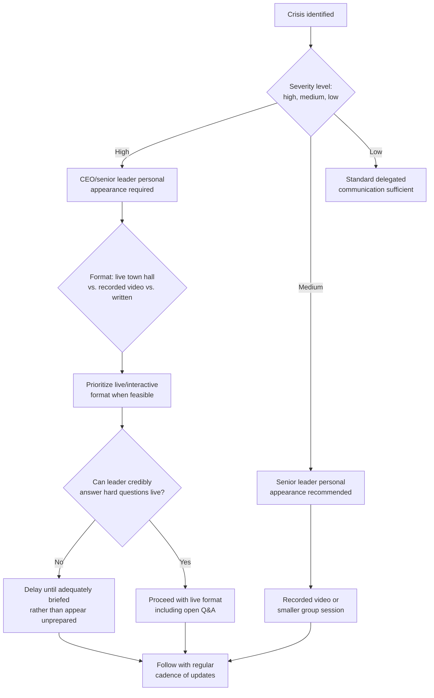

## Leadership Visibility and Internal Trust-Building

### Overview

Leadership visibility during a crisis refers to the degree to which senior executives are personally, directly, and consistently present in internal communication rather than delegating crisis messaging entirely to communications staff, HR, or written statements issued in the leader's name but not delivered by them. Internal trust-building is the cumulative effect of that visibility, combined with consistency between what leadership says and does, over the duration of a crisis. This topic is distinct from general employee communication strategy in that it focuses specifically on the *leader-employee relationship* as a trust asset that can be built, spent, or depleted through crisis-period behavior, independent of the specific content of any single message.

### Why Leadership Visibility Functions Differently from Standard Communication

**Key Points**

- Employees generally interpret a leader's personal presence (live town halls, video messages, direct Q&A) as a signal of how seriously the organization is treating a situation, independent of the actual content delivered — visibility itself carries informational weight.
- Conversely, leadership absence or over-delegation to written statements during a high-severity crisis is frequently interpreted as evasion or lack of seriousness, even when the delegated communication is factually complete and well-written.
- [Inference] This asymmetry — where presence is read as commitment and absence is read as evasion, regardless of message content — means leadership visibility decisions carry reputational weight that is somewhat independent of, and in practice sometimes larger than, the specific words used in any single communication.

### The Visibility-Trust Relationship

Trust is not built by visibility alone; visibility without substance or consistency can produce a specific and damaging failure mode where employees perceive leadership as performing presence without genuine engagement or follow-through. The relationship operates on several dimensions simultaneously:

| Dimension | Builds Trust | Erodes Trust |
| --- | --- | --- |
| Frequency | Regular, predictable check-ins during extended crises | Appearing only once at the outset, then going silent |
| Directness | Leader personally answering hard questions, including "I don't know yet" | Redirecting hard questions to spokespeople or deflecting with talking points |
| Consistency | Leadership statements matching subsequent actions and later disclosures | Statements later contradicted by facts or leadership's own subsequent decisions |
| Accessibility | Genuine, unscripted Q&A opportunities | Tightly controlled, submitted-question-only formats perceived as filtering hard questions |
| Emotional Register | Acknowledging difficulty or uncertainty in a measured, human way | Either excessive corporate detachment or performative emotionality that reads as insincere |

### Decision Framework: When and How Leadership Should Appear





```
### The "I Don't Know Yet" Principle

**Key Points**
- One of the most consistently cited trust-building behaviors in crisis leadership literature is a leader's willingness to say "I don't know yet" or "we haven't decided that" rather than fabricating certainty or false reassurance.
- Employees generally extend more trust to leaders who acknowledge the boundaries of current knowledge than to leaders who project confidence that is later revealed to have been unfounded — the latter pattern, once discovered even once, tends to retroactively discount the leader's credibility on all subsequent statements during the same crisis.
- This requires leaders to be adequately prepared to distinguish genuinely unknown information from information they are simply declining to share (often for legal reasons) — conflating the two by claiming ignorance of something the organization has actually decided is a distinct and more damaging failure mode once discovered.

### Pre-Briefing and Preparation Requirements

Visibility without adequate preparation is a common source of leadership crisis missteps. Effective visibility requires:

- **Anticipated question mapping**: identifying the most likely difficult questions in advance (job security, financial impact, accountability, timeline) and preparing the leader with substantive, honest answers or an honest acknowledgment of current uncertainty for each.
- **Legal and HR coordination on disclosure boundaries**: establishing clearly, before any public appearance, what the leader can and cannot say due to legal, regulatory, or ongoing-investigation constraints, so the leader is not placed in a position of improvising boundaries live.
- **Media training adapted for internal audiences**: internal town halls are frequently recorded, screenshotted, or described externally, so leaders should be prepared with the same rigor as for external media appearances, while maintaining a tone appropriately calibrated for an internal (not external-facing) audience.
- **Emotional preparation, not just factual preparation**: leaders should be prepared for the possibility of visible employee frustration, difficult personal stories, or emotionally charged questions, and should have a planned approach for acknowledging emotion without becoming defensive or dismissive.

### Consistency Across Leadership Levels

**Key Points**
- Visibility and trust-building are not solely a top-executive function; middle managers and team leads are frequently the more immediate and trusted source of information for most employees, and inconsistency between what senior leadership communicates and what middle management is equipped to reinforce creates a credibility gap.
- Cascading leadership visibility — ensuring that senior leader messaging is reinforced (not merely repeated) by properly briefed middle management — extends the trust-building effect beyond the reach of any single town hall or video message.
- A common failure pattern is strong senior leadership visibility (a well-received CEO town hall) undermined by unprepared middle managers who cannot answer team-level follow-up questions consistently with what senior leadership communicated.

### Distinguishing Genuine Visibility from Performative Visibility

Employees are generally adept at distinguishing authentic engagement from performative gestures, and misjudging this distinction is a common executive miscalculation.

- **Genuine visibility markers**: unscripted or lightly scripted engagement, willingness to sit with uncomfortable questions, follow-through on commitments made during the appearance, sustained presence across the crisis duration rather than a single appearance.
- **Performative visibility markers**: tightly scripted appearances with pre-screened questions only, one-time appearances with no follow-up cadence, commitments made publicly that are not subsequently followed through on, visible discomfort or reluctance that undercuts the stated message of care.

[Inference] The specific behavioral cues that read as "performative" versus "genuine" likely vary somewhat by organizational culture and workforce expectations, but the underlying pattern — that employees weigh follow-through and consistency more heavily than the polish of any single appearance — is a recurring theme across crisis leadership and internal communications practitioner literature.

### Common Failure Modes

1. **Single-Appearance Visibility** — a leader appearing once at the outset of an extended crisis and then receding into written or delegated communication for the remainder, which reads as declining commitment over time.
2. **Over-Scripted Q&A** — restricting town halls to pre-submitted, screened questions only, which employees frequently perceive as avoidance even when the underlying answers are substantively adequate.
3. **Unprepared Appearances** — leaders appearing visibly unprepared for foreseeable hard questions, projecting either false confidence or visible discomfort, both of which undermine the credibility benefit visibility is intended to provide.
4. **Middle-Management Gap** — strong senior leadership visibility not reinforced by adequately briefed middle managers, creating inconsistent follow-up experiences for employees at the team level.
5. **Commitment Without Follow-Through** — making specific commitments during a visible appearance (a follow-up timeline, a promised policy review) that are not subsequently honored, which retroactively damages the credibility of the original appearance.
6. **Conflating Confidentiality with Evasion** — failing to clearly explain when information is being withheld for legitimate legal or process reasons versus genuinely unknown, leaving employees to assume evasion in cases where a straightforward explanation would have preserved trust.

### Conclusion

Leadership visibility functions as a distinct trust-building mechanism, separate from and often more consequential than the specific content of crisis messaging: presence signals seriousness, and absence or over-delegation signals the opposite, largely independent of message quality. The organizations that manage this most effectively pair visibility with genuine preparation (including comfort acknowledging uncertainty), extend that visibility consistently across the crisis duration rather than as a single event, and ensure middle management is equipped to reinforce — not merely echo — senior leadership's message at the team level.

**Next Steps**
- Executive Media Training for Internal Town Halls
- Middle Management Briefing and Reinforcement Protocols
- Crisis Q&A Format Design: Live vs. Screened vs. Written
- Tracking Leadership Commitment Follow-Through During Extended Crises
- Legal and Communications Coordination on Disclosure Boundaries
- Measuring Internal Trust Recovery Post-Crisis
- Distinguishing Confidentiality Constraints from Perceived Evasion in Messaging


```