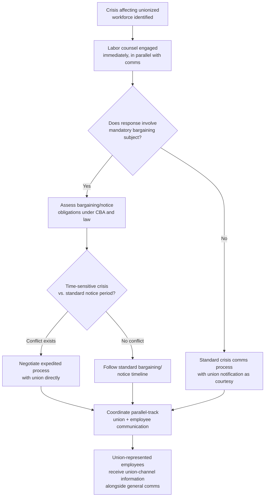

## Union and Labor Relations Considerations

### Overview

Union and labor relations considerations during a crisis address the distinct legal, procedural, and communications constraints that apply when part or all of an organization's workforce is represented by a labor union, or when a crisis intersects with active or potential union organizing activity. This differs materially from standard employee communication in that unionized environments carry statutory obligations (bargaining obligations, information-sharing rights, protected concerted activity) that constrain what an organization can communicate, to whom, and through which channels — meaning crisis communication strategy in a unionized context is inseparable from labor law compliance, not merely a stylistic consideration.

**[Unverified]** Labor law varies significantly by jurisdiction (collective bargaining frameworks, unfair labor practice standards, and information-sharing obligations differ substantially between, for example, the US National Labor Relations Act framework and EU works council models). The frameworks below reflect general practitioner patterns; specific obligations for any organization should be verified against jurisdiction-specific labor counsel rather than relied upon from general principles alone.

### Why Unionized Environments Require Distinct Crisis Protocols

**Key Points**

- Communication that would be routine in a non-union setting (a direct all-employee email describing a proposed operational change) may constitute a legally significant act in a unionized environment — potentially implicating bargaining obligations, past-practice arguments, or unfair labor practice exposure if it bypasses the union's representative role.
- Crisis situations frequently create time pressure that conflicts with bargaining or notice obligations that may apply under a collective bargaining agreement (CBA) or applicable labor law, requiring communications, HR, and labor counsel to coordinate on a compressed timeline rather than the standard advance-notice cadence.
- Communications directed at unionized employees during a crisis, particularly one touching on job security, compensation, or working conditions, are more likely to be scrutinized for consistency with the CBA and applicable labor law than equivalent communications in a non-union context.

### Core Legal Considerations (General Patterns)

| Consideration | Description |
| --- | --- |
| Duty to Bargain (where applicable) | Certain crisis-driven operational changes (facility closures, changes to compensation or working conditions) may trigger a legal obligation to bargain with the union before implementation, depending on jurisdiction and CBA terms |
| Direct Dealing Risk | Communicating directly with unionized employees about mandatory subjects of bargaining, bypassing the union's representative role, can in some jurisdictions constitute an unfair labor practice regardless of the organization's intent |
| Information-Sharing Obligations | Unions in many jurisdictions have a legal right to request relevant information from the employer to fulfill their representative duties, which may apply during crisis-driven changes |
| Past Practice Doctrine | Ad hoc crisis communications or accommodations may later be cited as establishing a "past practice" that constrains future flexibility, even if intended as a one-time exception |
| Protected Concerted Activity | Employee discussion of working conditions (including crisis-related concerns) is frequently protected activity in many jurisdictions, meaning restricting such discussion — even during a crisis — carries independent legal risk |

### Coordination Requirements Distinct from Non-Union Crisis Response





```
### The Union as a Communication Channel, Not Only a Legal Constraint

**Key Points**
- Labor relations practitioners generally emphasize that the union should be understood as a legitimate communication and trust channel to unionized employees, not solely as a legal obstacle to be managed around — union leadership often has established credibility with the workforce that management may lack, particularly during a trust-sensitive crisis.
- Engaging union leadership as an informed partner early in a crisis (within the bounds of what can legally be shared) can extend credible information reach to the workforce through a trusted channel, rather than treating the union purely as a compliance checkbox.
- Bypassing or minimizing union engagement, even where not legally required in a specific instance, frequently damages the labor relationship in ways that outlast the immediate crisis and can affect future bargaining dynamics.

### Communication Sequencing Considerations

- **Union notification timing relative to general employee communication** requires case-by-case legal assessment; in some circumstances, union leadership should be briefed concurrently with or ahead of the general workforce, while in others, simultaneous communication is appropriate — this determination should be made with labor counsel input rather than defaulting to a single universal sequence.
- **Avoiding the appearance of bypassing the union** even in permissible direct communications (e.g., general safety information not implicating a bargaining subject) by ensuring the union is not blindsided by direct-to-employee communication that touches on their represented interests.
- **Documenting communication and bargaining-related interactions carefully**, since crisis-period ad hoc decisions are more likely to be scrutinized in subsequent labor disputes or grievance processes than routine, non-crisis communications.

### Crisis Types with Elevated Labor Relations Sensitivity

| Crisis Type | Elevated Consideration |
|---|---|
| Layoffs / Facility Closures | Frequently triggers statutory notice requirements (e.g., WARN Act-type frameworks in the US) in addition to bargaining obligations; timelines must be reconciled with crisis urgency |
| Safety Incidents | May trigger both labor relations and regulatory (occupational safety) considerations simultaneously; union safety committees or representatives often have a formal role that must be engaged |
| Compensation/Benefits Changes | High risk of direct-dealing concerns if communicated without union engagement; CBA terms typically govern change process explicitly |
| Allegations of Misconduct Involving Represented Employees | Discipline and investigation processes for unionized employees are frequently governed by specific CBA procedures (e.g., just-cause standards, representation rights during investigatory interviews) distinct from at-will processes |
| Organizing Campaigns Coinciding with Unrelated Crisis | Requires particular care to avoid any appearance that crisis communications are being used to influence organizing activity, which carries independent legal exposure |

### Common Failure Modes

1. **Comms-First, Legal-Second Sequencing** — drafting and issuing crisis communications to unionized employees before labor counsel has assessed bargaining or notice implications, creating legal exposure that is more difficult to remedy after the fact.
2. **Treating the Union Purely as an Obstacle** — engaging union leadership only to the minimum legally required extent, foregoing an opportunity to use an existing trusted channel to reach the workforce credibly during a high-uncertainty period.
3. **Direct-Dealing by Well-Intentioned Managers** — managers or executives communicating directly with unionized employees about matters touching on bargaining subjects, without realizing the legal significance, often out of a genuine desire to be transparent rather than any intent to undermine the union.
4. **Inconsistent Ad Hoc Accommodations** — making crisis-driven exceptions or accommodations without considering past-practice implications, inadvertently constraining future organizational flexibility.
5. **Conflating Represented and Non-Represented Employee Communication** — issuing identical communications to unionized and non-unionized segments of the workforce without accounting for the different legal frameworks that may apply to each.
6. **Delayed Union Notification Perceived as Bypass** — even when not strictly required, notifying the union significantly after general employee communication in a way that reads as intentional minimization of the union's role, damaging the ongoing labor relationship independent of the crisis's legal resolution.

### Conclusion

Crisis communication in a unionized environment cannot be separated from labor law compliance and the ongoing labor relationship; legal counsel engagement at the outset of crisis planning is a structural requirement rather than an optional safeguard. Organizations that manage this well engage labor counsel and union leadership in parallel with standard crisis communications planning, treat the union as a credible communication channel and relationship to preserve rather than solely a legal constraint to route around, and carefully document crisis-period decisions given their potential to be scrutinized in subsequent labor disputes or to inadvertently establish future past-practice obligations.

**Next Steps**
- Duty to Bargain Analysis for Crisis-Driven Operational Changes
- WARN Act and Equivalent Notice Requirement Compliance in Layoff Scenarios
- Direct Dealing Risk Assessment and Prevention Protocols
- Union Leadership Engagement Strategy During Acute Crisis
- Just-Cause Investigation Procedures for Represented Employees
- Coordinating Safety Committee Involvement During Safety-Related Crises
- Jurisdiction-Specific Labor Law Considerations for Multinational Workforces


```