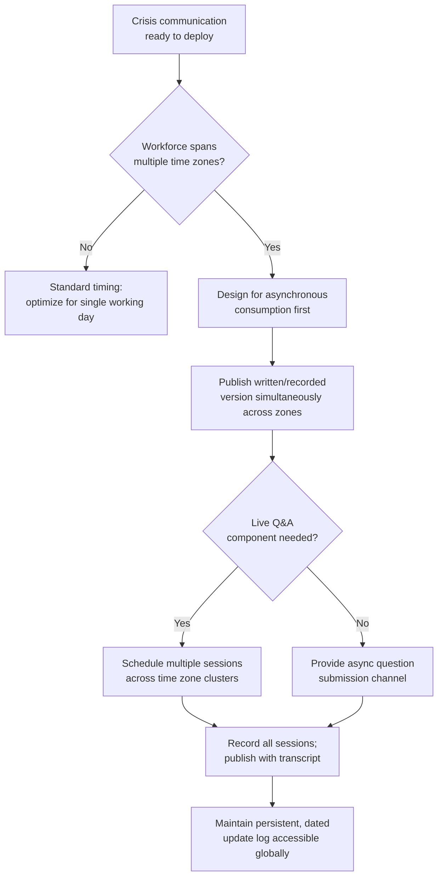

## Remote and Distributed Workforce Crisis Communication

### Overview

Remote and distributed workforce crisis communication addresses the distinct challenges of delivering timely, consistent, and trust-building crisis information to employees who are not co-located, span multiple time zones, work asynchronously, or are geographically dispersed across offices, home locations, or field sites. This differs from traditional employee crisis communication in that it cannot rely on the informal correction mechanisms of a physically shared workspace (overheard conversations, hallway clarifications, visible leadership presence) and instead depends entirely on deliberately designed digital channels, timing strategies, and documentation practices to achieve the same trust and consistency outcomes.

### Why Distributed Workforces Present Distinct Crisis Communication Challenges

**Key Points**

- In a co-located environment, informal information correction happens organically — an employee who misunderstands an announcement can often clarify it through overheard conversation or a quick hallway question; distributed employees generally lack this informal correction layer, making formal channels bear more of the information-accuracy burden.
- Time zone spread means a single-moment announcement (a live town hall, a same-day email) reaches different employees at radically different points in their workday, creating unequal access to real-time context, leadership Q&A, and immediate colleague discussion.
- Asynchronous work patterns mean employees may encounter a crisis communication hours or days after colleagues have already processed and discussed it internally (via chat, informal calls), arriving into an already-formed internal narrative without the context of how that narrative developed.
- [Inference] These structural gaps likely increase the relative importance of written, asynchronous-friendly communication formats (detailed FAQs, recorded video with transcripts, persistent update channels) relative to live, synchronous formats for distributed workforces, though the ideal channel mix remains dependent on the specific organization's existing communication culture and tooling.

### Time Zone and Asynchronous Communication Strategy





```
### Channel Design for Distributed Environments

| Channel Type | Distributed-Specific Consideration |
|---|---|
| Live town hall | Schedule multiple sessions across time zone clusters rather than one session that structurally excludes portions of the workforce; always record and publish with transcript for those who cannot attend live |
| Written announcement (email/intranet) | Should be treated as the primary, not secondary, channel for distributed workforces given asynchronous consumption patterns; must be self-contained enough to not require live clarification |
| Recorded video message | Effective for leadership visibility without time zone exclusion; should include captions/transcripts for accessibility and searchability |
| Persistent update log/FAQ | Particularly critical for distributed teams, functioning as the designated single-source-of-truth channel referenced in general rumor management, but with added importance given the absence of informal correction channels |
| Asynchronous question submission | Allows employees in any time zone to submit questions without needing to be present for a live session; requires a committed response cadence to remain credible |

### Manager Enablement Across Distributed Teams

**Key Points**
- Distributed managers frequently have less real-time visibility into their teams' reactions and concerns than co-located managers, since they cannot observe body language, overhear informal reactions, or gauge sentiment through physical presence.
- Providing distributed managers with structured guidance on checking in with team members individually (rather than relying on passive observation) becomes more important, not less, in remote settings, since the informal signals that might prompt a co-located manager to notice team distress are largely absent.
- Manager briefing materials for distributed teams should explicitly account for time zone gaps — a manager who receives leadership briefing at the start of their day but whose team includes members already deep into or finishing their workday needs a plan for reaching those team members promptly rather than waiting for a standard cadence.

### Documentation as a Trust Mechanism

- Because distributed employees cannot rely on ambient informal correction, the written record of crisis communication (FAQs, update logs, recorded sessions) functions as a more central trust mechanism than in co-located environments, where verbal informal channels can partially substitute for documentation quality.
- This elevates the importance of documentation accuracy and consistency — inconsistencies between written communications that would be quickly informally corrected in a co-located office can persist unnoticed and cause confusion for longer in a distributed environment before being identified and corrected.
- Version control and dating of updates (clearly marking when a document was last updated, and what changed) is particularly important for distributed workforces, since employees may reference an outdated version without the informal social cues that might otherwise prompt them to check for a newer one.

### Equity of Information Access

**Key Points**
- A specific risk in distributed environments is unequal information access based on time zone, connectivity, or seniority-proximity to headquarters — employees physically or organizationally closer to where decisions are made may receive information earlier or more completely than distant colleagues, even unintentionally.
- This can create a perceived (or real) two-tier information environment where certain offices or regions feel like an information "periphery," which is a distinct trust-erosion risk specific to distributed organizations and less applicable to fully co-located ones.
- Deliberate design choices — publishing to all channels simultaneously, avoiding headquarters-timezone-optimized scheduling that structurally disadvantages other regions, and explicit sensitivity to regional/office-level information equity — help mitigate this risk.

### Technology and Access Considerations

- **Platform reliability and access assumptions should not be uniform.** Employees in different regions may have different levels of access to specific platforms (bandwidth constraints, platform availability in certain countries, device access) — crisis communication plans should account for this rather than assuming universal access to a single primary channel.
- **Multilingual considerations** are frequently more prominent in distributed workforces than co-located single-office environments; crisis communication should assess whether translation is needed and build adequate lead time for accurate (not just literal) translation, since mistranslation of crisis-sensitive content carries elevated risk.
- **Redundant channel strategy** (e.g., email plus intranet plus chat platform) reduces the risk that a single platform outage or access issue leaves a segment of the distributed workforce without access to critical information during the exact period it is most needed.

### Common Failure Modes

1. **Headquarters-Timezone-Centric Communication** — scheduling live sessions or same-day-only communications optimized for the headquarters time zone, structurally disadvantaging other regions' access to real-time information and leadership presence.
2. **Over-Reliance on Live Formats** — treating a single live town hall as sufficient crisis communication for a distributed workforce, leaving employees who could not attend live without equivalent access to context or Q&A.
3. **Informal-Channel Assumption Carryover** — applying communication norms designed for co-located environments (assuming informal correction will occur) to distributed teams where no such informal correction layer exists.
4. **Manager Passive-Observation Reliance** — expecting distributed managers to gauge team sentiment through the same passive observation methods used in co-located settings, missing signals that require active, structured check-ins to surface.
5. **Undocumented or Poorly Versioned Updates** — failing to clearly date and version crisis communication updates, leading distributed employees to reference outdated information without realizing it.
6. **Uniform Access Assumptions** — assuming all employees have equal access to a single primary communication platform, disadvantaging employees in regions with different connectivity, platform availability, or device access.
7. **Delayed or Inadequate Translation** — treating translation as an afterthought rather than building it into the initial communication timeline, leaving non-primary-language employees with delayed or lower-quality access to crisis information.

### Conclusion

Distributed and remote workforce crisis communication requires deliberately engineered replacements for the informal correction, real-time observation, and ambient trust-building mechanisms that co-located environments provide organically. Effective approaches prioritize asynchronous-friendly, well-documented, and consistently versioned communication; design channel timing to avoid structural time-zone disadvantage; equip managers with active (not passive) methods for gauging distributed team sentiment; and treat information-access equity across regions and platforms as a distinct and deliberate design requirement rather than an assumed default.

**Next Steps**
- Multi-Time-Zone Town Hall Scheduling and Recording Protocols
- Manager Check-In Frameworks for Distributed Teams
- Version Control and Documentation Practices for Crisis Communication
- Multilingual Crisis Communication Planning and Translation Lead Time
- Redundant Channel Strategy for Platform Outage Resilience
- Information Equity Auditing Across Regional Offices
- Async-First Communication Design for Global Organizations


```