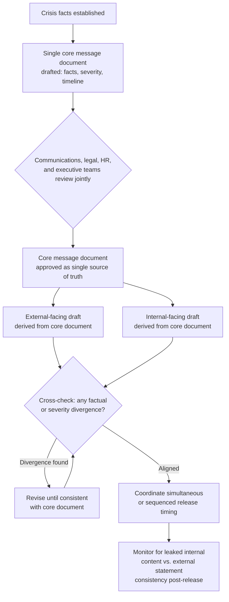

## Aligning Internal and External Messaging

### Overview

Aligning internal and external messaging refers to the deliberate coordination of what an organization communicates to its own employees versus what it communicates to media, customers, investors, and the general public during a crisis, ensuring the two are consistent in substance even where they differ appropriately in tone, detail, or audience-specific framing. Misalignment between these two communication streams is one of the most common and most damaging categories of self-inflicted crisis escalation, because in the current media and social environment, internal communications routinely become external ones — through leaks, screenshots, employee social media posts, or formal disclosure processes — collapsing the assumed separation between the two audiences.

### Why Internal-External Alignment Is a Distinct Discipline

**Key Points**

- The traditional assumption that internal and external communications occupy separate, non-overlapping spaces no longer reliably holds; internal Slack messages, town hall recordings, and leaked memos are now routinely treated as primary sources by journalists and are shared directly on public platforms by employees themselves.
- When internal and external messages diverge — in facts, tone, or acknowledged severity — the discovery of that divergence typically becomes a second, independent crisis layered on top of the original issue, because it raises a credibility question ("what else are they saying differently to different audiences") distinct from the substance of the original event.
- Alignment does not mean identical messaging; audience-appropriate differences in tone, level of operational detail, and framing are expected and appropriate. What must remain consistent is the underlying factual substance and the acknowledged severity of the situation.

### The Alignment Spectrum: What Should Match vs. What Can Differ

| Element | Should Be Consistent | Can Legitimately Differ |
| --- | --- | --- |
| Core facts of what happened | Yes — same underlying facts to both audiences | — |
| Acknowledged severity/seriousness | Yes — should not minimize internally what is treated seriously externally, or vice versa | — |
| Timeline of known events | Yes — dates and sequence should match across audiences | — |
| Level of operational detail | — | Internal audiences may receive more granular operational detail relevant to their roles |
| Tone and register | — | Internal tone may be more direct/informal; external tone often more formal or legally reviewed |
| Emotional register | — | Internal communication may acknowledge employee-specific concerns (job security, workload) not relevant externally |
| What is not yet known | Yes — should not claim more certainty to one audience than the other | — |

### Coordination Architecture





```
### The Single Source Document Practice

**Key Points**
- A widely used practitioner method is drafting one internal "core facts" document — capturing what is known, what is being done, and how serious the organization considers the situation — before any audience-specific communication is drafted, so that both internal and external messages derive from the same factual foundation rather than being drafted independently by separate teams.
- This reduces the risk of unintentional divergence that arises when communications teams and executive spokespeople draft external messaging separately from HR or internal communications teams drafting employee-facing messaging, each working from a slightly different understanding of the facts or severity.
- The core document should be treated as the single point of factual truth that both audience-specific versions must trace back to, with any legitimate audience-specific differences layered on top rather than introduced through independent drafting.

### Sequencing Considerations

- As addressed under employee communication strategy, the general practitioner norm favors employees learning significant information at or before external audiences — alignment does not override this sequencing principle, but rather ensures that whichever audience receives information first, the substance awaiting the second audience is already consistent and finalized, not still being separately negotiated.
- Simultaneous release (internal and external communication issued at the same time) is often the most defensible approach when sequencing cannot clearly favor one audience, since it removes the risk of a gap period during which one audience has more or different information than the other.

### Common Divergence Triggers

| Trigger | Mechanism |
|---|---|
| Separate drafting teams without shared source document | Communications and HR/internal teams independently interpret the same underlying facts differently, absent a shared reference point |
| Legal review applied unevenly | External statements receiving more rigorous legal review than internal communications (or vice versa), producing inconsistent claims or hedging |
| Time pressure leading to rushed internal drafting | Internal communication drafted quickly and informally under the assumption it carries lower stakes, while external statements receive more careful scrutiny — despite internal messages carrying equivalent leak risk |
< Executive ad-libbing in internal settings | Leaders speaking more candidly or speculatively in a town hall than official statements allow, creating a documented (often recorded) divergence from the approved external position |
| Evolving facts without synchronized updates | Both messaging streams updated as facts develop, but on different timelines, creating temporary but discoverable inconsistency |

### Legal and Disclosure Coordination

- For publicly traded companies, external disclosure obligations (material information, timing rules around public statements) add a further layer of complexity: internal communications that reveal material information ahead of a coordinated public disclosure can create securities disclosure and selective-disclosure concerns, meaning legal review of internal crisis communications is not merely a stylistic safeguard but frequently a compliance requirement.
- Legal counsel should generally review both internal and external messaging streams as a linked review process, rather than treating internal communication review as secondary or optional relative to external statement review.

### Handling Legitimate Timing Gaps

Some situations genuinely require sequencing rather than simultaneous release (e.g., informing directly affected employees individually before a broader announcement). In these cases:

- The gap period should be as short as operationally possible, and messaging prepared for both audiences in advance so the second communication can follow immediately once appropriate.
- Employees informed first should generally receive guidance on what they can and cannot share externally during the gap period, reducing the risk of premature leakage that itself creates inconsistency with an external statement not yet issued.

### Common Failure Modes

1. **Independent Drafting Without a Shared Source** — communications and HR/internal teams each drafting their audience's message from separate interpretations of the underlying facts, producing avoidable inconsistency.
2. **Unequal Legal Scrutiny** — applying rigorous legal review to external statements while treating internal communications as lower-stakes and less reviewed, despite equivalent leak risk.
3. **Executive Ad-Libbing Beyond Approved Messaging** — leaders speaking more candidly, speculatively, or informally in internal settings than the coordinated position allows, creating a recorded or reported divergence.
4. **Asynchronous Updates** — updating internal and external messaging on different timelines as facts evolve, creating temporary but discoverable windows of inconsistency.
5. **Treating Internal Communication as Inherently Private** — drafting internal messages without accounting for the realistic likelihood of external visibility through leaks, screenshots, or employee social media sharing.
6. **Sequencing Without Bridging Guidance** — creating a legitimate timing gap (informing some employees before a public announcement) without equipping those employees with guidance on what can be shared externally during that gap, increasing premature leakage risk.

### Conclusion

Internal and external messaging alignment is best achieved through a shared, single-source factual and severity foundation from which both audience-specific communications are derived, rather than through independent drafting processes that assume separation between the two audiences. Given how routinely internal communications now surface externally, treating internal messaging with equivalent legal and consistency rigor to external statements — while preserving legitimate, audience-appropriate differences in tone and operational detail — is a structural requirement for avoiding the compounding credibility crisis that discovered divergence reliably produces.

**Next Steps**
- Building a Single Source-of-Truth Crisis Fact Document Process
- Legal Review Protocols for Internal Crisis Communications
- Securities Disclosure Considerations for Internal Crisis Messaging
- Executive Preparation to Avoid Ad-Lib Divergence in Internal Settings
- Sequencing Strategy: Simultaneous vs. Staggered Internal/External Release
- Leak Risk Assessment for Internal Communication Channels
- Post-Crisis Auditing of Internal-External Message Consistency


```