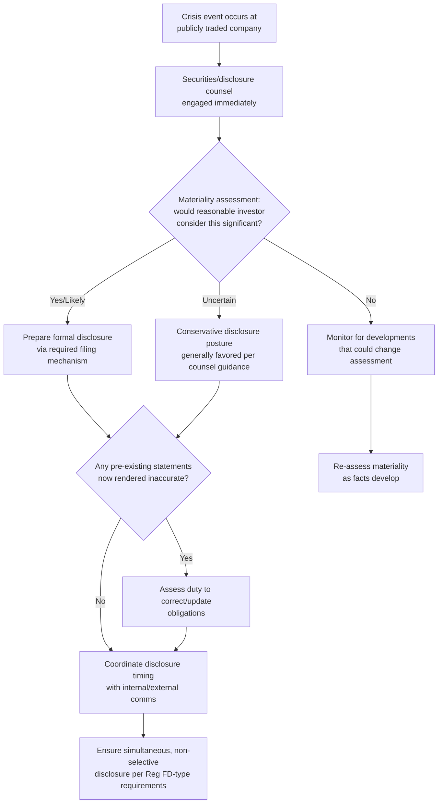

## Investor Relations Fundamentals During Crisis


### Overview

Investor relations (IR) fundamentals during a crisis address the specific legal, disclosure, and communications obligations that apply when an organization communicates with shareholders, analysts, and capital markets during a period of acute reputational or operational disruption. IR crisis communication is distinct from general public or media communication in that it operates under statutory disclosure frameworks (securities law) rather than discretionary communications judgment alone — meaning legal compliance and reputational strategy are inseparable in this function to a degree not typically present in other crisis communication contexts.

### Why Investor Relations Crisis Communication Is Legally Distinct

**Key Points**

- Publicly traded companies operate under securities regulation (in the US, primarily governed by SEC rules and case law around materiality and disclosure) that creates affirmative and prohibitive obligations largely absent from general reputational communication: obligations around timely disclosure of material information, prohibitions on selective disclosure, and liability exposure for materially misleading statements.
- The core legal concept governing IR crisis communication is **materiality** — whether a reasonable investor would consider the information important to an investment decision. Crisis events frequently raise novel materiality determinations quickly, under time pressure, before all facts are known.
- Legal counsel (securities/disclosure counsel specifically, not general corporate counsel) must be involved in IR crisis communication from the outset, given the direct liability exposure for missteps — this is a compliance requirement, not merely good practice.

### Core Disclosure Obligations Relevant to Crisis Events

| Obligation | Description |
| --- | --- |
| Timely Disclosure of Material Information | Once information is determined material, disclosure must generally occur promptly through appropriate channels (e.g., 8-K filings in the US for specified events, press releases meeting Regulation FD requirements) |
| Regulation FD (Fair Disclosure, US) | Prohibits selective disclosure of material information to select analysts or investors ahead of the general public; crisis communications to investors must be coordinated with public disclosure timing |
| Anti-Fraud Provisions | Statements made to investors (in filings, calls, or public statements) must not be materially false or misleading; this creates elevated scrunity of language choices during crisis communication compared to non-securities-regulated communications |
| Duty to Correct/Update | Previously made statements that become materially inaccurate due to crisis developments may create an obligation to correct or update, depending on jurisdiction and circumstances |

[Unverified] Specific disclosure obligations, filing deadlines, and materiality standards vary by jurisdiction and by exchange listing requirements; this is a rapidly precedent-driven area of law, and specific obligations for any given organization and event should be assessed by qualified securities counsel rather than derived from general frameworks.

### Materiality Assessment as the First Crisis Step

**Key Points**

- Before any investor-facing crisis communication is drafted, a materiality assessment must generally occur: does this event, on current known facts, meet the threshold a reasonable investor would consider significant to an investment decision?
- Materiality determinations are frequently made under significant time pressure and incomplete information, and organizations should be prepared to revisit the determination as facts develop rather than treating an initial assessment as final.
- [Inference] Erring toward disclosure when materiality is genuinely uncertain is a commonly cited conservative practice in securities law guidance, given that under-disclosure liability risk is generally considered more severe than the reputational cost of disclosing an event that, in hindsight, proves less significant than initially assessed — though this is a legal judgment that should be made with counsel, not a default rule applied without that input.

### Decision Framework





```
### Coordination with Analysts and Institutional Investors

- **Earnings calls and investor briefings during active crises** require particular preparation: anticipated analyst questions should be mapped in advance, with legally reviewed responses that avoid both over-reassurance (creating future liability if conditions worsen) and excessive hedging (which can itself trigger stock volatility disproportionate to the underlying facts).
- **Avoiding selective color** — a common temptation during a crisis is providing informal, more candid context to specific analysts or institutional investors in one-on-one settings; this creates direct Regulation FD (or equivalent) exposure if the informal color includes material, non-public information not simultaneously available to all investors.
- **Coordinating with sell-side and buy-side relationships carefully** — existing analyst relationships can be valuable for accurately contextualizing a crisis, but conversations must stay within previously disclosed, public information boundaries until formal disclosure occurs.

### Stock Price Volatility as a Distinct Consideration

**Key Points**
- Unlike reputational damage measured through sentiment or media coverage, IR crisis impact has an immediate, quantifiable, and public marker: stock price movement, which itself becomes a visible signal analyzed by media, further amplifying the crisis narrative.
- Sharp stock price movements during a crisis can trigger additional regulatory scrutiny (unusual trading activity inquiries) and can affect covenant compliance, credit ratings, or trigger contractual provisions (e.g., material adverse change clauses in pending transactions) — meaning IR crisis management frequently has direct financial and legal consequences beyond communications outcomes alone.
- [Inference] Rapid, credible, and legally sound disclosure is generally believed by IR practitioners to reduce (though not eliminate) excess volatility relative to prolonged uncertainty or perceived withholding of information, on the reasoning that markets tend to price in worst-case uncertainty more severely than a clearly disclosed, bounded negative fact — though this relationship is not something that can be reliably quantified in advance for any specific crisis.

### Coordination with Broader Crisis Communication Function

- IR communication should be coordinated with, but distinguished from, general public/media crisis communication — the audiences have different information needs (investors require materially complete, legally precise information; general public communication can be more narratively oriented) but must remain factually consistent, per the alignment principles covered under internal-external messaging.
- A common structural failure is IR and general communications teams operating with insufficiently synchronized information, producing statements that are individually accurate to their own audience but inconsistent when compared side by side — a discrepancy sophisticated investors and financial journalists are likely to identify and scrutinize.

### Common Failure Modes

1. **Delayed Materiality Assessment** — treating disclosure obligations as a secondary consideration behind reputational messaging strategy, when materiality assessment should occur first and inform the communications approach, not the reverse.
2. **Selective Disclosure to Favored Analysts** — providing more candid or complete information informally to specific analysts or investors, creating direct regulatory exposure under fair disclosure requirements.
3. **Over-Reassurance Under Pressure** — making confident forward-looking statements to calm markets that later prove inaccurate as the crisis develops, creating both credibility damage and potential securities liability exposure.
4. **IR-Communications Desynchronization** — general public communications and investor-facing statements developed independently, producing discoverable factual inconsistencies.
5. **Underestimating Duty to Correct** — failing to assess whether prior public statements have been rendered materially inaccurate by crisis developments, leaving an uncorrected misstatement in the public record.
6. **Treating Stock Volatility as Purely a Market Reaction** — failing to recognize that volatility itself can trigger secondary legal and contractual consequences (covenant, ratings, M&A clause implications) requiring coordination beyond the communications function alone.

### Conclusion

Investor relations crisis communication operates within a statutory disclosure framework that makes legal compliance and reputational strategy inseparable, with materiality assessment as the necessary first step before any investor-facing messaging is prepared. Effective management requires early and continuous securities counsel involvement, strict adherence to non-selective, simultaneous disclosure principles, careful coordination (without sacrificing consistency) between IR-specific and general public communications, and recognition that stock price volatility carries its own downstream legal and contractual consequences distinct from reputational sentiment alone.

**Next Steps**
- Materiality Assessment Frameworks and Documentation Practices
- Regulation FD Compliance in Crisis-Period Analyst Communications
- Duty to Correct and Update: Legal Standards and Triggers
- Earnings Call Preparation for Crisis-Period Analyst Q&A
- Coordinating IR and General Communications Functions During Crisis
- Material Adverse Change Clause Implications of Crisis-Driven Stock Volatility
- Cross-Border Securities Disclosure Considerations for Multinational Issuers


```