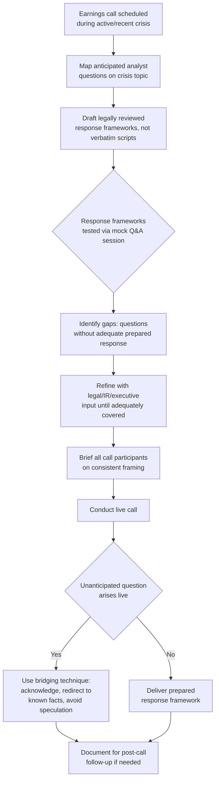

## Earnings Calls and Analyst Communication

### Overview

Earnings calls and analyst communication address the specific preparation, execution, and risk-management practices for quarterly (or other periodic) earnings calls and ongoing analyst relationships when an organization is navigating an active or recent crisis. This is a distinct discipline from general investor relations crisis fundamentals in that it focuses on a recurring, scheduled, high-visibility communication format with its own structural conventions (prepared remarks, live Q&A, analyst follow-up) that create specific and recurring risk points not present in one-off crisis disclosures.

### Why Earnings Calls Carry Distinct Crisis Risk

**Key Points**

- Earnings calls combine scripted, legally reviewed prepared remarks with live, largely unscripted Q&A — the Q&A segment is structurally the highest-risk portion of any earnings call because executives are responding to analyst questions in real time, without the benefit of the same legal review applied to prepared remarks.
- Analysts covering a company during an active crisis will predictably direct a disproportionate share of Q&A time toward the crisis itself, meaning management cannot treat crisis-related Q&A preparation as optional even when the earnings results themselves are unrelated to the crisis.
- Earnings calls occur on a fixed, publicly known schedule, meaning the market has advance notice of the opportunity to press management on crisis-related questions — unlike an ad hoc press conference, management cannot control timing to occur when preparation is more complete.

### Structural Components and Associated Risk

| Component | Description | Crisis-Specific Risk |
| --- | --- | --- |
| Prepared Remarks | Scripted opening statements from CEO/CFO, legally reviewed in advance | Lower risk given review, but must proactively address the crisis with appropriate specificity rather than omission, which analysts will notice and probe |
| Q&A Session | Live, analyst-driven questioning, largely unscripted | Highest risk segment; executives must respond in real time without the safety net of legal pre-review |
| Guidance Statements | Forward-looking financial projections | Elevated liability risk during crisis periods if guidance does not adequately account for crisis-related uncertainty or downside scenarios |
| Non-GAAP Adjustments | Company-specific adjusted metrics excluding certain items | Crisis-related costs excluded from adjusted metrics can draw analyst and regulatory scrutiny if perceived as obscuring crisis impact |

### Q&A Preparation Framework





```
### The "Bridging" Technique for Unanticipated Questions

**Key Points**
- When a live question arises that was not anticipated or falls outside legally reviewed response boundaries, a widely used technique is "bridging" — acknowledging the question directly, then transitioning to what can be accurately and appropriately stated, without fabricating certainty or speculating beyond disclosed facts.
- Effective bridging avoids two failure extremes: appearing evasive by refusing to engage with the question at all, and over-answering by speculating beyond what has been legally reviewed or factually established.
- Example structure: acknowledge the question's legitimacy → state what is currently known and disclosed → explain what is not yet determined and why → commit to a specific future update mechanism (e.g., "we will address this in our next disclosure" or "we're not able to speculate on that, but here is what we can confirm today").

### Guidance and Forward-Looking Statement Considerations

- Providing forward-looking financial guidance during an active crisis carries elevated risk: if guidance does not adequately account for crisis-related downside scenarios and is later missed due to crisis developments, this can create both credibility damage and potential securities liability exposure for materially misleading forward-looking statements.
- A common practitioner approach during active crises is either widening guidance ranges to reflect genuine uncertainty, explicitly caveating guidance with crisis-specific risk factors, or in some cases suspending guidance entirely for the affected period — each choice carries tradeoffs between market clarity and liability protection that should be assessed with securities counsel.
- Safe harbor provisions for forward-looking statements (where applicable under securities law) generally require specific, meaningful cautionary language identifying the factors that could cause results to differ; generic boilerplate cautionary language is less protective and increasingly scrutinized.

### Non-GAAP Metrics and Crisis-Related Adjustments

- Companies frequently exclude crisis-related costs (litigation settlements, remediation costs, restructuring charges) from adjusted/non-GAAP metrics presented on earnings calls; while a common and often legitimate practice, this requires careful framing to avoid the perception of obscuring the crisis's true financial impact.
- Reconciliation between GAAP and non-GAAP figures should be clearly presented, and analysts should be given adequate access to understand the basis for exclusions — opacity in this reconciliation during a crisis period tends to draw disproportionate scrutiny compared to non-crisis periods, since analysts and media are actively looking for signs of obscured impact.

### Analyst Relationship Management Beyond the Call

**Key Points**
- Ongoing, one-on-one analyst relationship management (outside the earnings call itself) requires the same Regulation FD-type discipline addressed under general IR crisis fundamentals — informal color provided to individual analysts must not include material non-public information not otherwise disclosed.
- Analysts who cover a company through a crisis and observe consistent, credible, appropriately specific communication (as opposed to evasion or later-contradicted reassurance) generally extend more benefit of the doubt in subsequent coverage; this reputational capital with the analyst community operates somewhat independently of, but is influenced by, general public reputation.
- Post-call analyst notes and reports should be monitored closely, as they frequently reveal which aspects of crisis-related messaging were or were not perceived as adequately addressed, providing signal for what needs clarification before the next disclosure opportunity.

### Common Failure Modes

1. **Treating Q&A Preparation as Optional** — preparing rigorously for scripted remarks while under-preparing for live Q&A, despite Q&A being the higher-risk segment specifically because it lacks the same legal review.
2. **Over-Scripted, Robotic Bridging** — using bridging language so mechanically that it reads as evasive rather than genuinely responsive, undermining rather than preserving credibility.
3. **Guidance That Ignores Crisis Risk** — issuing forward guidance that does not adequately account for crisis-related downside scenarios, creating both a credibility and liability exposure if results subsequently miss due to crisis developments.
4. **Opaque Non-GAAP Exclusions** — excluding crisis-related costs from adjusted metrics without clear reconciliation or explanation, inviting a "hiding the impact" narrative that compounds the original crisis.
5. **Inconsistent Messaging Across Multiple Speakers** — CEO, CFO, and other call participants providing subtly different framing or emphasis on the same crisis topic, which analysts are well-positioned to notice and probe further.
6. **Ignoring Post-Call Analyst Signal** — failing to review analyst notes and follow-up questions after the call to identify what remains inadequately addressed before the next communication opportunity.

### Conclusion

Earnings calls during an active crisis concentrate reputational and legal risk disproportionately in the live Q&A segment, which cannot rely on the same legal review protections as prepared remarks. Effective management requires rigorous anticipated-question mapping and mock Q&A rehearsal, disciplined (not robotic) bridging techniques for unanticipated questions, careful calibration of forward guidance to reflect genuine crisis-related uncertainty, transparent non-GAAP reconciliation, and continuous monitoring of analyst reaction to refine messaging ahead of subsequent disclosure opportunities.

**Next Steps**
- Mock Q&A Rehearsal Design and Facilitation
- Safe Harbor Language Drafting for Crisis-Period Forward Guidance
- Non-GAAP Reconciliation Best Practices During Crisis Periods
- Analyst Note Monitoring and Signal Extraction Post-Call
- Multi-Speaker Message Consistency Preparation
- Guidance Suspension vs. Range-Widening Decision Criteria
- Regulation FD Compliance in Ongoing One-on-One Analyst Relationships


```