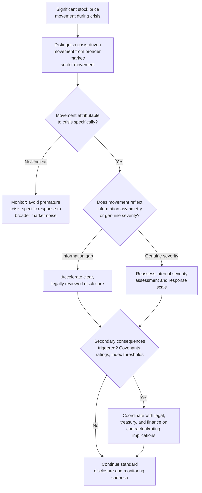

## Managing Market and Stock Price Reactions

### Overview

Managing market and stock price reactions addresses how organizations monitor, interpret, and respond to acute stock price movement and broader market signals during a crisis, distinct from the disclosure-focused obligations covered under general investor relations fundamentals. While materiality assessment and disclosure compliance determine *what* must be communicated, this topic addresses the *ongoing market-facing response* once a crisis is already affecting trading activity, valuation, and market perception — including how to interpret market signals correctly, when and how to respond to volatility itself, and how to manage the secondary consequences that acute price movements can trigger.

### Why Stock Price Reaction Requires Distinct Management

**Key Points**

- Stock price movement functions as a uniquely public, quantifiable, and continuously updating signal of market sentiment — unlike media coverage or social sentiment, which are qualitative and episodic, price movement is a real-time number that itself becomes a story, often amplifying media coverage of the underlying crisis.
- Market reactions can diverge significantly from the "true" severity of a crisis in either direction: markets can overreact to limited, contained issues (pricing in worst-case uncertainty) or underreact to serious issues not yet fully understood by market participants — both directions have important reputational implications for the response.
- Sharp price movements can trigger secondary consequences independent of the crisis's underlying severity: credit rating reviews, debt covenant implications, margin calls for leveraged holders, index inclusion/exclusion thresholds, and heightened regulatory attention to unusual trading activity.

### Distinguishing Overreaction from Underreaction

| Market Response Pattern | Likely Interpretation | Response Consideration |
| --- | --- | --- |
| Sharp initial drop, partial recovery as facts clarify | Market priced in worst-case uncertainty, then recalibrated with more information | Reinforces value of clear, prompt, credible disclosure to accelerate recalibration |
| Sharp initial drop, no recovery or continued decline | Market may be pricing in a severity the organization has not yet fully acknowledged | Warrants internal reassessment of whether initial materiality/severity assessment was adequate |
| Minimal initial reaction to a serious issue | Market may not yet have full information, or may be underestimating downstream impact | Does not necessarily indicate the crisis is well-managed; requires monitoring for delayed reaction as facts spread |
| Volatile, inconsistent trading pattern | Market uncertainty/disagreement among participants about severity | Signals a need for more, not less, disclosure clarity to reduce information asymmetry driving the volatility |

[Inference] These are general interpretive patterns drawn from market-behavior and IR practitioner literature; actual market reactions are influenced by many confounding factors (broader market conditions, sector-wide movements, prior expectations) and should not be read as a precise or mechanical signal of crisis severity without accounting for this context.

### Response Framework





```
### Secondary Consequences of Sharp Price Movement

**Key Points**
- **Credit rating implications**: rating agencies may initiate reviews or place ratings on watch following significant crisis-driven price or fundamental deterioration signals, which can itself affect borrowing costs and is a distinct process from equity market reaction requiring separate agency engagement.
- **Debt covenant and contractual triggers**: some credit agreements or contracts include provisions triggered by stock price thresholds, rating changes, or material adverse change language; treasury and legal teams should assess these exposures promptly rather than assuming market reaction is a purely equity-market concern.
- **Index inclusion/exclusion thresholds**: sustained price deterioration can affect eligibility for market-cap-weighted index inclusion, which can itself trigger further selling pressure from index-tracking funds — a mechanical, non-sentiment-driven consequence distinct from the underlying crisis narrative.
- **Unusual trading activity scrutiny**: exchanges and regulators may inquire about unusual trading volume or price movement, particularly around the timing of material disclosures, requiring coordinated legal and IR response to such inquiries.

### What Not to Do: Direct Price Intervention Risks

- Organizations generally cannot and should not attempt to directly counter stock price movement through public statements asserting the market has mispriced the situation — this creates securities liability risk if the statement is later shown to have been made to influence price without adequate factual basis, and is generally viewed skeptically by sophisticated market participants regardless.
- Share buyback programs are sometimes discussed as a market-signaling tool during periods of perceived undervaluation; however, buyback decisions during active crises carry their own disclosure timing sensitivities (potential insider trading and disclosure timing concerns) and should be assessed with securities counsel as a distinct, carefully sequenced decision rather than an improvised crisis response.
- The generally more defensible approach is influencing the *information environment* (accurate, prompt, complete disclosure) that markets price against, rather than attempting to influence market sentiment or price directly through unsubstantiated reassurance.

### Coordination with Broader Crisis Response

- Stock price monitoring and response should be integrated with, not siloed from, the broader crisis response function — a significant price movement is itself a signal that may indicate the crisis is being perceived as more (or less) severe than internal teams have assessed, and this signal should feed back into overall crisis severity assessment and resource allocation.
- Finance, treasury, legal, and IR functions require a coordinated monitoring and escalation protocol so that price-triggered secondary consequences (covenant reviews, rating agency inquiries) are identified and addressed promptly rather than discovered reactively.

### Distinguishing Crisis-Driven Movement from Market Noise

**Key Points**
- A common analytical error is attributing all price movement during a crisis period to the crisis itself, when broader market conditions, sector-wide trends, or unrelated company-specific news may be contributing factors.
- Benchmarking movement against relevant sector indices or peer companies helps isolate the crisis-specific component of price movement from broader market conditions, informing a more accurate assessment of how the market is actually interpreting the crisis specifically.
- Overattributing routine market volatility to the crisis can lead to disproportionate internal alarm and potentially premature or unnecessary additional disclosure, while underattributing genuine crisis-driven movement to "just market noise" risks missing a genuine signal requiring response.

### Common Failure Modes

1. **Attempting Direct Price Intervention** — issuing public statements asserting the market has mispriced the situation without adequate factual basis, creating securities liability risk and generally failing to achieve the intended price effect.
2. **Ignoring Secondary Contractual Consequences** — treating stock price movement as purely a market/communications issue while covenant, rating, or index-threshold consequences develop unaddressed in parallel.
3. **Misattributing Market Noise as Crisis Severity** — treating routine sector-wide or broader-market movement as a crisis-specific signal, leading to disproportionate response.
4. **Missing Genuine Severity Signals** — dismissing sustained, crisis-specific price deterioration as temporary market overreaction when it may reflect a more accurate market assessment than the organization's internal severity determination.
5. **Improvised Buyback Timing** — considering share buybacks as a crisis-response signaling tool without adequate securities counsel review of disclosure timing and insider trading considerations.
6. **Siloed Monitoring** — stock price and market reaction monitoring conducted separately from the broader crisis response function, missing the feedback signal price movement can provide to overall severity assessment.

### Conclusion

Stock price and market reaction during a crisis function as both a consequence of the crisis and an independent signal requiring careful interpretation, with genuine risk of both overreaction and underreaction in either direction. Effective management requires distinguishing crisis-specific movement from broader market noise, treating price-triggered secondary consequences (covenants, ratings, index thresholds) as a coordinated cross-functional concern rather than a communications-only issue, avoiding direct attempts to influence price through unsubstantiated public statements, and using market signal as feedback into the organization's own internal severity assessment rather than treating internal and market assessments as independent.

**Next Steps**
- Credit Rating Agency Engagement During Active Crisis Periods
- Debt Covenant and Material Adverse Change Clause Auditing
- Index Inclusion Threshold Monitoring and Contingency Planning
- Share Buyback Timing and Disclosure Considerations During Crisis
- Sector and Peer Benchmarking Methodologies for Isolating Crisis-Specific Movement
- Cross-Functional Escalation Protocols for Price-Triggered Secondary Consequences
- Unusual Trading Activity Inquiry Response Coordination


```