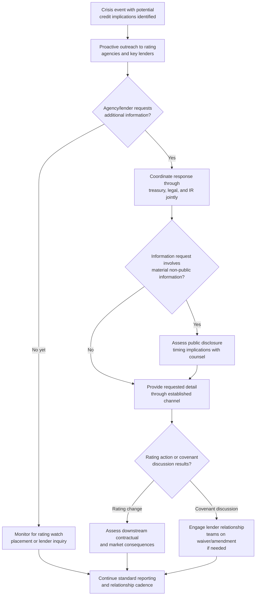

## Rating Agency and Lender Communication

### Overview

Rating agency and lender communication addresses the distinct engagement practices required when an organization manages relationships with credit rating agencies (Moody's, S&P, Fitch, and equivalents) and lenders (banks, bondholders, private credit providers) during a crisis. This is a specialized subset of financial stakeholder communication, separate from equity-market-facing investor relations, in that it centers on creditworthiness and debt-repayment capacity rather than equity valuation, operates on different disclosure conventions (often more direct, non-public exchanges rather than broad-market disclosure), and carries its own consequence structure (rating downgrades, covenant triggers, refinancing risk) distinct from stock price movement.

### Why Rating Agency and Lender Relationships Require Distinct Management

**Key Points**

- Credit rating agencies and lenders are fundamentally assessing a different question than equity investors: not "what is this company worth" but "how likely is this company to meet its debt obligations on time and in full" — this reframes what information is most relevant and how a crisis should be characterized to this audience.
- Unlike public equity disclosure, communication with rating agencies and lenders frequently occurs through more direct, sometimes confidential channels (analyst calls, private briefings, information requests under credit agreement terms) rather than broad public disclosure, though care must still be taken not to selectively disclose material non-public information to lenders in ways that would create equity-market disclosure concerns.
- Rating agencies and lenders generally have access to and expect more granular financial and operational detail than public equity markets receive, given their direct contractual or credit-analysis relationship with the organization — withholding the depth of detail they reasonably expect can itself be read as a negative signal independent of the crisis's substance.

### Credit Rating Process During Crisis

| Stage | Description |
| --- | --- |
| Rating Watch/Outlook Change | Agency signals a potential future rating action (e.g., "negative outlook" or "on watch for downgrade") without an immediate rating change, often the first formal agency response to a crisis |
| Formal Rating Review | Agency conducts deeper analysis, often including direct management engagement, to determine whether an actual rating change is warranted |
| Rating Action | Agency issues an upgrade, downgrade, or affirmation, typically accompanied by a public rationale statement |
| Ongoing Monitoring | Agency continues surveillance, potentially requesting periodic updates during extended crisis situations before the next formal review cycle |

### Engagement Framework





```
### Proactive vs. Reactive Engagement

**Key Points**
- Proactively reaching out to rating agencies and key lenders when a crisis emerges — rather than waiting for them to initiate contact or discover developments through public disclosure alone — is generally viewed favorably and signals organizational control and transparency, which itself can influence the tenor of subsequent rating or covenant discussions.
- Reactive engagement (responding only once an agency has already placed a rating on watch, or a lender has already raised covenant concerns) generally starts the conversation from a more defensive posture, since the counterparty's initial impression is that the organization did not consider them a priority stakeholder to inform proactively.
- [Inference] While proactive engagement is widely recommended in credit relationship management practice, its specific effect on rating outcomes is difficult to isolate from the underlying credit fundamentals themselves — proactive communication is generally understood to affect tone and process rather than to override an agency's fundamental credit assessment.

### Covenant Compliance and Waiver Negotiations

- Crisis-driven financial deterioration can bring an organization close to or in breach of financial covenants in credit agreements (leverage ratios, interest coverage ratios, minimum liquidity requirements); early identification of this risk allows for proactive lender engagement before an actual breach occurs.
- Where a covenant breach is anticipated or has occurred, waiver or amendment negotiations with lenders typically require a credible remediation plan and transparent financial projections — lenders generally respond more favorably to organizations that identify and disclose the issue proactively with a plan than to those where the breach is discovered through routine covenant compliance certificates without prior warning.
- These negotiations frequently involve confidential information exchange under the terms of existing credit agreements, requiring careful coordination with legal counsel to ensure such exchanges do not create unintended public disclosure obligations or selective disclosure concerns if the organization is also publicly traded.

### Key Messaging Considerations for Credit-Focused Audiences

| Consideration | Rating Agency / Lender Framing |
|---|---|
| Crisis characterization | Framed around cash flow, liquidity, and debt-service capacity impact specifically, not general reputational narrative |
| Remediation plan | Requires specific, credible operational and financial detail (cost reduction plans, asset sales, refinancing options) rather than general reassurance |
| Timeline | Credit-focused audiences generally want clear near-term liquidity runway assessments, distinct from longer-term reputational recovery timelines discussed with other audiences |
| Management credibility | Historical accuracy of prior financial projections and covenant compliance carries significant weight in how current crisis communications are received |

### Coordination with Broader IR and Communications Functions

- Rating agency and lender communication should be factually consistent with public disclosure and general crisis communications, consistent with the alignment principles addressed elsewhere in this chapter — credit-focused audiences frequently cross-reference public statements, and inconsistency between what is told to lenders privately and what is disclosed publicly creates significant credibility and potential legal exposure.
- Treasury teams (who typically hold the primary lender relationship) and IR teams (who typically hold the primary rating agency and equity investor relationships) should coordinate closely during a crisis, since messaging inconsistency between these functions is a common and avoidable failure point given that both ultimately draw on the same underlying financial facts.

### Common Failure Modes

1. **Reactive-Only Engagement** — waiting for rating agencies or lenders to initiate contact rather than proactively informing them of a crisis with credit implications, starting the relationship from a defensive posture.
2. **Withholding Granular Detail Expected by Credit Audiences** — applying the same level of detail appropriate for broad public equity disclosure to rating agency and lender communications, when these audiences reasonably expect and are entitled to greater specificity.
3. **Covenant Breach Discovered Rather Than Disclosed** — allowing a covenant breach to be identified through routine compliance certificates rather than proactively flagging anticipated issues, which generally damages the lender relationship independent of the underlying financial facts.
4. **Treasury-IR Message Inconsistency** — treasury and IR teams communicating subtly different characterizations of the crisis to lenders versus equity investors and rating agencies, creating a discoverable and damaging inconsistency.
5. **Generic Reassurance to Credit Audiences** — providing general reputational reassurance language to rating agencies and lenders when these audiences require specific, credible operational and financial remediation detail.
6. **Inadequate Legal Coordination on Confidential Exchange** — sharing material non-public information with lenders under credit agreement information rights without adequately assessing public equity disclosure implications, particularly for publicly traded organizations.

### Conclusion

Rating agency and lender communication during a crisis requires a distinct approach centered on debt-service and liquidity capacity rather than general reputational or equity-valuation narrative, generally conducted through more direct and detailed channels than public equity disclosure. Proactive, transparent engagement — particularly around anticipated covenant issues — combined with close coordination between treasury and IR functions to maintain factual consistency across all financial stakeholder communications, is the generally recommended approach, recognizing that credit-focused audiences weigh management's historical communication credibility heavily in evaluating current crisis claims.

**Next Steps**
- Covenant Compliance Monitoring and Early Warning Systems
- Rating Agency Methodology Review and Engagement Protocols
- Waiver and Amendment Negotiation Strategy During Financial Distress
- Treasury-IR Coordination Frameworks for Crisis Periods
- Confidential Information Exchange and Public Disclosure Boundary Management
- Liquidity Runway Assessment and Communication to Credit Stakeholders
- Refinancing Risk Assessment During Active Reputational or Operational Crises


```