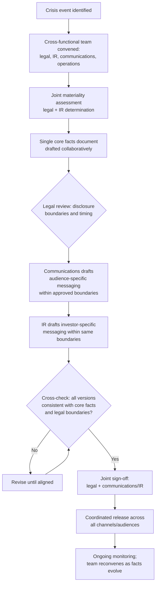

## Coordinating Investor Relations, Legal, and Communications

### Overview

Coordinating investor relations, legal, and communications addresses the cross-functional governance structure required to manage a crisis when these three functions — each operating under different obligations, audiences, and risk considerations — must produce a unified, consistent, and compliant response. This topic synthesizes the coordination principles referenced throughout this chapter (materiality assessment, disclosure alignment, message consistency) into an explicit operational framework for how these functions should be structured to work together, rather than addressing any single function's obligations in isolation.

### Why Structural Coordination Is Required, Not Optional

**Key Points**

- Each function operates under a genuinely different primary obligation: legal is oriented toward regulatory compliance and liability minimization, IR is oriented toward accurate, materially complete disclosure to capital markets, and communications is oriented toward broader stakeholder trust and narrative management — these obligations are generally complementary but can create tension in specific moments (e.g., legal caution favoring minimal disclosure versus communications favoring proactive transparency).
- Without a deliberate coordination structure, these functions frequently develop crisis response independently and in parallel, producing the exact misalignment risks addressed elsewhere in this chapter: inconsistent internal/external messaging, IR statements diverging from general communications, or communications strategy developed without adequate legal review of disclosure timing implications.
- [Inference] Organizations that have pre-established coordination protocols (rather than improvising cross-functional structure during the crisis itself) are generally believed by crisis management practitioners to respond more quickly and consistently, though the specific performance difference is difficult to isolate empirically given that crises are not directly comparable across organizations.

### Core Tension Points Between Functions

| Function Pair | Common Tension | Resolution Principle |
| --- | --- | --- |
| Legal vs. Communications | Legal caution favoring minimal, carefully hedged disclosure vs. communications favoring proactive, complete transparency for trust-building | Legal review determines disclosure boundaries; communications determines how to convey approved information as clearly and credibly as possible within those boundaries |
| Legal vs. IR | Legal conservatism on timing vs. IR's disclosure obligations under securities law, which may compel disclosure sooner than legal instinct alone would suggest | Materiality assessment (a legal/IR joint determination) should drive timing, not general legal risk-aversion alone |
| IR vs. Communications | IR's audience-specific, technically precise framing vs. communications' broader, more narrative-accessible framing for general/media audiences | Both must derive from the same core facts document; audience-appropriate framing differences are legitimate, factual differences are not |

### Governance Structure: The Crisis Coordination Function

**Key Points**

- A commonly recommended structure is a designated cross-functional crisis response team with clear representation from legal, IR, communications, and relevant operational leadership, convened at the outset of any crisis with potential financial, legal, or reputational materiality — rather than each function initiating separate, uncoordinated response processes.
- This team should have a clear internal escalation and decision-making protocol: who has final sign-off authority on public statements (typically requiring joint legal and communications/IR sign-off), how quickly the team can convene during an acute event, and how information flows between functions in real time as facts develop.
- Establishing this structure in advance (as part of general crisis preparedness, addressed in earlier chapter material) is generally more effective than attempting to design coordination processes during an active crisis, when time pressure makes deliberate structural design more difficult.

### Coordination Workflow





```
### Decision Rights and Sign-Off Protocols

- Establishing clear decision rights in advance — who must approve a public statement before release, and in what sequence — prevents the common failure of a statement being released by one function without adequate review from another, particularly under time pressure when informal shortcuts are more likely to occur.
- A generally recommended minimum standard is that any public-facing crisis statement (whether IR-specific, general communications, or internal messaging with realistic external visibility) receives joint sign-off from legal and the relevant communications/IR function before release, with executive sign-off required for statements above a certain materiality or visibility threshold.
- Sign-off protocols should include a defined process for time-sensitive situations where the standard full-review cycle is not feasible (e.g., live Q&A during an earnings call, as addressed under earnings call communication) — these situations require pre-established response frameworks and bridging techniques rather than real-time cross-functional review, since that review cannot occur live.

### Information Flow and Shared Fact Base

- As addressed under aligning internal and external messaging, a single, jointly maintained "core facts" document — capturing what is known, what is being done, current materiality assessment, and disclosure status — should serve as the shared reference point for all three functions, updated collaboratively as facts develop rather than maintained separately by each function.
- Establishing a regular (potentially frequent, during acute crisis phases) cross-functional check-in cadence ensures that legal's evolving view of disclosure obligations, IR's read of market reaction, and communications' read of media/public sentiment remain synchronized rather than developing on separate tracks that only intersect at the point of drafting a statement.

### Escalation Protocols for Genuine Disagreement

**Key Points**
- Genuine disagreement between functions (e.g., legal recommending against a disclosure that communications believes is necessary for public trust) should have a defined escalation path — typically to a senior executive or a designated crisis committee chair — rather than being resolved informally or through the most senior person in the room at that moment defaulting to their own function's instinct.
- [Inference] Legal obligations (disclosure requirements, liability exposure) generally should take precedence in genuine conflicts, since regulatory and legal consequences carry more concrete, immediate, and quantifiable risk than the comparatively harder-to-measure reputational cost of a specific communications choice — but this is a general orientation rather than an absolute rule, since a legal position that is technically compliant but creates disproportionate reputational damage (e.g., minimal disclosure that later appears evasive) may itself warrant executive-level reconsideration of the underlying strategy, not just the communications framing.

### Common Failure Modes

1. **Parallel, Uncoordinated Development** — legal, IR, and communications each developing crisis response independently based on their own read of the situation, discovered to be inconsistent only at or after release.
2. **No Pre-Established Sign-Off Protocol** — improvising decision rights and approval sequences during an active crisis, increasing the risk of a statement being released without adequate cross-functional review under time pressure.
3. **Legal as Sole Gatekeeper Without Communications Input** — treating legal review as the final word on communications strategy rather than a boundary-setting function within which communications and IR determine effective framing, resulting in legally accurate but poorly received messaging.
4. **Communications Proceeding Without Materiality Input** — general communications teams drafting and releasing crisis messaging without adequate coordination with IR/legal on whether the same information triggers separate disclosure obligations.
5. **Undefined Escalation Path for Genuine Disagreement** — lacking a clear process for resolving legitimate tension between functions, leading to ad hoc resolution that may not reflect the organization's actual risk priorities.
6. **Treating Coordination as a One-Time Drafting Exercise** — establishing coordination only for the initial crisis statement, then allowing functions to drift back into independent operation as the crisis extends, losing alignment as facts evolve over time.

### Conclusion

Effective crisis response requires legal, investor relations, and communications functions to operate from a shared factual foundation with pre-established decision rights, sign-off protocols, and escalation paths — rather than each function independently pursuing its own obligations and discovering misalignment only at the point of public release. The functions' distinct obligations are generally complementary rather than contradictory, and the coordination structure's purpose is to ensure legal boundaries, disclosure accuracy, and effective audience-appropriate communication are achieved simultaneously rather than sequentially or in competition.

**Next Steps**
- Designing Pre-Established Crisis Coordination Team Structures
- Sign-Off Protocol Design for Time-Sensitive Crisis Statements
- Shared Core Facts Document Templates and Maintenance Practices
- Escalation Path Design for Cross-Functional Disagreement Resolution
- Cross-Functional Crisis Simulation and Tabletop Exercise Design
- Measuring Coordination Effectiveness in Post-Crisis Reviews
- Legal-Communications Joint Training on Disclosure Boundary Communication


```