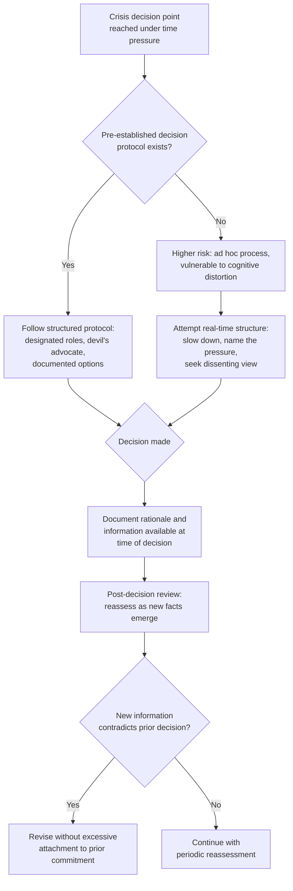

## Leadership Psychology Under Pressure


### Overview

Leadership psychology under pressure addresses how acute stress, time compression, and high-stakes uncertainty affect executive decision-making capacity during a crisis, and what structural and individual practices help leaders maintain sound judgment under these conditions. This topic sits at the intersection of cognitive psychology, decision science, and crisis management practice, and is foundational to the rest of this chapter: many of the leadership failures addressed in adjacent topics (poor visibility decisions, inconsistent messaging, premature or delayed statements) trace back to identifiable, well-documented ways that acute stress degrades decision quality, rather than being purely failures of character or preparation.

### Why Crisis Conditions Degrade Decision-Making

**Key Points**

- Acute stress activates physiological and cognitive responses (frequently described in stress research using the general framework of "fight, flight, or freeze") that were evolutionarily adaptive for immediate physical threats but are poorly suited to the sustained, complex, ambiguous decision-making a reputational or organizational crisis requires.
- Time pressure combined with incomplete information — the near-universal condition of an active crisis — pushes decision-making toward heuristic, pattern-matching responses rather than deliberate analysis, which can produce faster decisions but at a documented cost to accuracy and completeness of consideration.
- [Inference] This does not mean crisis leaders are incapable of good decisions under pressure; rather, the cognitive science literature on stress and decision-making suggests that specific structural supports (described below) are needed to counteract predictable degradation patterns, rather than assuming individual willpower or experience alone reliably overcomes them.

### Common Cognitive Distortions Under Crisis Pressure

| Distortion | Description | Crisis Manifestation |
| --- | --- | --- |
| Tunnel Vision | Narrowed attention to the most immediately salient threat, at the expense of peripheral but important considerations | Focusing entirely on media narrative while missing developing employee or regulatory dimensions of the same crisis |
| Confirmation Bias (heightened under stress) | Tendency to favor information confirming an already-formed view | Dismissing early warning signs that a chosen crisis narrative is incorrect or incomplete |
| Overconfidence in Incomplete Information | Acting with more certainty than the available facts warrant | Making public commitments or denials based on partial information that is later contradicted |
| Escalation of Commitment | Continuing a chosen course of action because of prior investment in it, rather than reassessing based on new information | Persisting with an initial (flawed) crisis response strategy despite emerging evidence it is not working |
| Groupthink Under Time Pressure | Suppression of dissenting views in favor of rapid consensus | A crisis team converging quickly on a response without adequately surfacing disagreement or alternative framings |

[Inference] This taxonomy draws on well-established concepts from decision science and organizational psychology literature; the degree to which any specific leader or team exhibits these patterns under a given crisis is highly individual and situational, and should not be treated as a deterministic prediction.

### Structural Supports for Sound Crisis Decision-Making





```
### The Role of Pre-Established Protocols

**Key Points**
- Decision protocols established in advance of a crisis (designated decision-making roles, a requirement to document at least one alternative course of action considered, a designated "devil's advocate" role in crisis deliberations) function as external structure that compensates for the cognitive degradation acute stress produces, rather than relying on individual leaders to consciously counteract their own stress response in the moment.
- Pre-established protocols are generally more effective than attempting to design good decision-making practice during the crisis itself, since the same cognitive pressures that degrade decision quality also degrade the capacity to recognize in the moment that structural support is needed.
- A simple, frequently cited practice is a mandatory brief pause before high-stakes crisis decisions (even a few minutes) specifically to ask "what are we not seeing, and who disagrees with this course of action" — a deliberate counter to the time-pressure-driven rush toward premature consensus.

### Physical and Physiological Considerations

- Sustained crisis periods (extending over days or weeks) introduce fatigue-related decision degradation distinct from acute initial-response stress; leaders and crisis teams operating for extended periods without adequate rest are subject to well-documented decision-quality decline from sleep deprivation and sustained cognitive load.
- [Unverified] While the general relationship between sleep deprivation and impaired judgment is well-established in broader cognitive science research, applying specific quantitative thresholds (e.g., "decision quality degrades measurably after X hours") to crisis leadership specifically would overstate the precision available from current evidence; the practical takeaway generally offered by crisis management practitioners is structuring rotation and rest into extended crisis response plans, not a specific numeric threshold.
- Building deliberate rotation into crisis response team structures — ensuring no single leader or small group is expected to sustain acute decision-making responsibility without relief over an extended crisis — is a structural practice addressing this risk directly.

### Emotional Regulation and Public Composure

**Key Points**
- Leaders are frequently observed publicly during a crisis (town halls, press appearances, earnings calls), and visible emotional dysregulation (excessive defensiveness, visible panic, dismissiveness) can independently damage trust regardless of the substantive content of what is said, connecting directly to the leadership visibility principles addressed elsewhere in this material.
- This does not mean suppressing all visible emotion is desirable — as noted under leadership visibility, appropriately calibrated acknowledgment of difficulty or seriousness is generally received as more authentic than flat affect or false positivity — but rather that leaders benefit from preparation specifically addressing how to remain composed and measured while still conveying appropriate seriousness.
- Executive coaching and crisis-specific media training that includes stress-response preparation (not just message content preparation) is increasingly recognized as a distinct preparatory need, separate from standard media training focused on message discipline alone.

### Distinguishing Individual Leadership Capacity from Structural Design

**Key Points**
- A common but limited framing treats crisis leadership quality as primarily a function of individual leader temperament or experience ("some people are just good in a crisis"); while individual variation in stress tolerance is real, this framing risks under-investing in the structural supports (protocols, rotation, designated dissent roles) that can meaningfully improve decision quality regardless of any individual leader's natural disposition.
- [Inference] Organizations that invest primarily in identifying or promoting individuals perceived as naturally strong crisis leaders, without also building structural decision-making supports, may be more vulnerable to decision quality degradation during crises that exceed the intuitive pattern-matching capacity of even experienced leaders — though isolating the relative contribution of individual capacity versus structural support is difficult to establish with precision.

### Common Failure Modes

1. **No Pre-Established Decision Protocol** — improvising crisis decision-making structure during the acute event itself, when cognitive capacity for designing good process is already degraded by the same pressures the process is meant to address.
2. **Suppressing Dissent Under Time Pressure** — a crisis team converging rapidly on a response without a designated mechanism (devil's advocate role, structured alternative-option documentation) to surface disagreement before commitment.
3. **Escalating Commitment to an Initial Flawed Response** — continuing a chosen crisis strategy well past the point where new information suggests reassessment, due to prior public or internal commitment to that course.
4. **Extended Crisis Without Rotation** — sustaining the same small leadership group in acute decision-making roles over an extended crisis period without built-in rest or relief, risking fatigue-driven decision decline.
5. **Treating Composure as Suppression** — over-coaching leaders toward flat, unemotional public affect in an attempt to project control, which can read as inauthentic or dismissive rather than composed.
6. **Individual-Capacity-Only Investment** — relying solely on identifying naturally strong crisis leaders without building structural decision-making supports that benefit any leader operating under acute stress.

### Conclusion

Crisis leadership decision-making is measurably affected by well-documented cognitive and physiological responses to acute stress and time pressure, and sound crisis leadership depends substantially on structural supports established before a crisis occurs — pre-defined decision protocols, designated dissent mechanisms, rotation to manage fatigue over extended crises, and stress-specific preparation for public composure — rather than relying primarily on individual leader temperament or in-the-moment willpower to counteract predictable decision-quality degradation.

**Next Steps**
- Designing Pre-Crisis Decision-Making Protocols and Devil's Advocate Roles
- Crisis Team Rotation and Fatigue Management Planning
- Executive Stress-Response Training and Composure Coaching
- Groupthink Prevention Techniques in Crisis Deliberation
- Post-Crisis Decision Review and Organizational Learning Processes
- Distinguishing Genuine Reassessment from Escalation of Commitment
- Building Structured Dissent Mechanisms into Crisis Governance


```