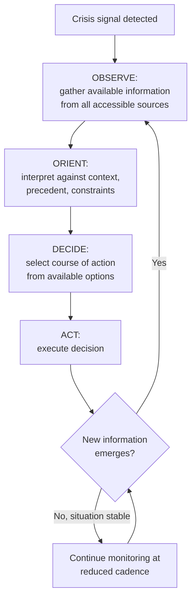

## Decision-Making Frameworks in High-Uncertainty Events


### Overview

Decision-making frameworks in high-uncertainty events provide structured methodologies for making sound crisis decisions when complete information is unavailable, timelines are compressed, and the cost of both inaction and premature action can be severe. Where the preceding topic addressed the psychological and cognitive conditions that make crisis decision-making difficult, this topic addresses the practical, applicable frameworks organizations use to structure that decision-making process itself — providing external scaffolding that compensates for the cognitive pressures already discussed.

### Why Standard Decision-Making Models Are Insufficient

**Key Points**

- Conventional business decision-making models generally assume adequate time for data-gathering, stakeholder consultation, and iterative analysis — conditions that are frequently absent or severely compressed during an acute crisis.
- High-uncertainty crisis decisions frequently involve incomplete, conflicting, or rapidly changing information, meaning frameworks optimized for eventual accuracy (extensive analysis before action) can result in decision paralysis precisely when timely action is most needed.
- The frameworks below are specifically adapted for conditions of genuine uncertainty (where probabilities of outcomes are not reliably knowable) as distinct from conditions of mere risk (where probabilities are estimable), a distinction with a long history in decision theory that has particular relevance to crisis contexts where truly novel situations are common.

### The OODA Loop Framework

Originally developed in a military aviation context, the OODA Loop (Observe, Orient, Decide, Act) is among the most widely adapted frameworks for high-tempo, high-uncertainty decision-making in crisis management practice.

| Stage | Description | Crisis Application |
| --- | --- | --- |
| Observe | Gather available information from all accessible sources | Monitor media, social sentiment, internal reports, stakeholder feedback simultaneously |
| Orient | Interpret observations through the lens of context, prior experience, and current organizational position | Assess how this crisis compares to precedent, what stakeholder priorities are most salient, what constraints (legal, financial) apply |
| Decide | Select a course of action from available options given current orientation | Choose a specific response approach, acknowledging it may need revision as the loop repeats |
| Act | Execute the decision | Implement the chosen response |

**Key Points**

- The framework's core insight for crisis application is that the loop is meant to repeat rapidly and continuously, not execute once — a decision made in an early loop iteration is expected to be revised as subsequent iterations bring new observations, rather than treated as final.
- [Inference] Organizations that can cycle through this loop faster than the crisis itself is evolving are generally believed to maintain better situational control than those cycling more slowly, though "faster" must be balanced against the risk of premature action on inadequate orientation — cycling speed and decision quality exist in tension, not as a simple "faster is always better" relationship.

### Decision Flow Under the OODA Framework





```
### Scenario Planning and Pre-Mortem Analysis

- **Scenario planning** involves identifying a small number of plausible crisis trajectories in advance (best case, worst case, most likely case) and pre-developing response outlines for each, so that when a crisis actually unfolds, the team is selecting and adapting from pre-considered options rather than generating a response from a blank slate under time pressure.
- **Pre-mortem analysis** — a technique where a team imagines a decision has already failed and works backward to identify why — can be applied prospectively during crisis planning (before a crisis occurs) or, in a compressed form, during the crisis itself, to surface overlooked risks in a proposed response before committing to it.
- [Inference] These techniques are generally more valuable as advance preparation than as in-the-moment tools during an acute crisis, since they require a degree of open-ended, non-time-pressured thinking that is harder to conduct well once a crisis is already underway.

### The Cynefin Framework for Categorizing Crisis Complexity

A framework from complexity/knowledge-management theory, increasingly referenced in crisis management literature, for categorizing the type of problem a crisis presents and matching the decision approach accordingly:

| Domain | Characteristics | Recommended Decision Approach |
|---|---|---|
| Clear/Simple | Cause and effect well understood; best practice exists | Apply established protocol directly |
| Complicated | Cause and effect knowable with expert analysis | Engage relevant experts; analyze before acting |
| Complex | Cause and effect only understandable in retrospect; no clear best practice | Probe (small, safe-to-fail actions), sense the response, then respond — avoid large-scale commitment before learning from small tests |
| Chaotic | No discernible cause-and-effect relationship in the moment; urgent stabilization needed | Act immediately to stabilize the situation, then reassess once conditions allow categorization into another domain |

[Inference] Many reputational crises begin in the "chaotic" or "complex" domain (rapidly evolving, unclear causation) before becoming more "complicated" or "clear" as facts settle — recognizing which domain a crisis currently occupies, and adjusting decision approach accordingly rather than applying a single fixed method throughout, is a key application of this framework, though categorization in the moment is itself a judgment call rather than a mechanical determination.

### Decision Documentation Under Uncertainty

**Key Points**
- Documenting the information available and the reasoning behind a decision at the time it was made — rather than only after the fact — serves both a learning function (enabling accurate post-crisis review) and a defensive function (demonstrating the decision was reasonable given what was knowable at the time, relevant in later legal, regulatory, or reputational scrutiny of the decision).
- This documentation should explicitly capture what was NOT known at decision time, not only what was known, since crisis decisions are frequently later judged with the benefit of hindsight information unavailable to decision-makers in the moment — a well-documented decision record helps distinguish genuinely poor judgment from reasonable decisions that did not anticipate subsequently revealed facts.

### Balancing Speed and Deliberation

| Situation Characteristic | Bias Toward |
|---|---|
| Immediate safety or welfare risk to people | Speed — act to stabilize, refine understanding afterward |
| Reversible decision with low downside if wrong | Speed — decide, monitor, adjust |
| Irreversible decision with high downside if wrong | Deliberation — seek additional input even at time cost, where feasible |
| High public/media visibility with reversibility risk (statement retraction) | Deliberation — a published statement is difficult to fully retract; err toward completing key verification steps first |

[Inference] This is a general heuristic for balancing decision speed against deliberation under uncertainty; specific crisis situations frequently involve competing considerations that do not resolve neatly into one category, requiring judgment about which characteristic dominates in a given case.

### Common Failure Modes

1. **Treating Uncertainty as Risk** — applying probability-based decision models to situations of genuine uncertainty (where probabilities are not reliably estimable), producing false confidence in an analytically-derived "optimal" decision that the underlying uncertainty does not actually support.
2. **Single-Pass Decision-Making** — treating an initial crisis decision as final rather than as one iteration of an ongoing observe-orient-decide-act cycle, missing opportunities to revise as new information emerges.
3. **Applying "Clear Domain" Protocols to Complex Situations** — defaulting to established playbooks or best practices when a crisis is genuinely novel and complex, when small-scale probing and adaptive response would be more appropriate than direct protocol application.
4. **Skipping Documentation Under Time Pressure** — failing to document decision rationale and known/unknown information at the time of decision, complicating later review and creating avoidable exposure if the decision is scrutinized with hindsight.
5. **Uniform Speed Bias** — applying a single "move fast" or "always deliberate" instinct across all crisis decisions regardless of reversibility and stakes, rather than calibrating speed-versus-deliberation tradeoffs to the specific decision's characteristics.
6. **No Pre-Developed Scenarios** — attempting to generate a crisis response entirely from scratch during the acute event, when pre-crisis scenario planning could have provided a starting framework to adapt rather than originate under pressure.

### Conclusion

Sound decision-making during high-uncertainty crisis events depends on applying frameworks specifically designed for incomplete information and time compression — cycling rapidly and iteratively (OODA), correctly categorizing the type of complexity a crisis presents before selecting a response approach (Cynefin), leveraging pre-developed scenarios rather than originating responses from scratch, and calibrating the speed-versus-deliberation tradeoff to each decision's specific reversibility and stakes rather than applying a single fixed instinct throughout. Documentation of decision rationale, including what was not known at the time, supports both organizational learning and defensibility under later scrutiny.

**Next Steps**
- OODA Loop Facilitation Techniques for Crisis Response Teams
- Scenario Planning Workshop Design for Crisis Preparedness
- Applying the Cynefin Framework to Reputational Crisis Categorization
- Pre-Mortem Analysis Techniques for Crisis Response Planning
- Decision Documentation Templates for Legal and Learning Purposes
- Calibrating Speed vs. Deliberation Tradeoffs by Decision Type
- Integrating Decision Frameworks with Crisis Team Governance Structures


```