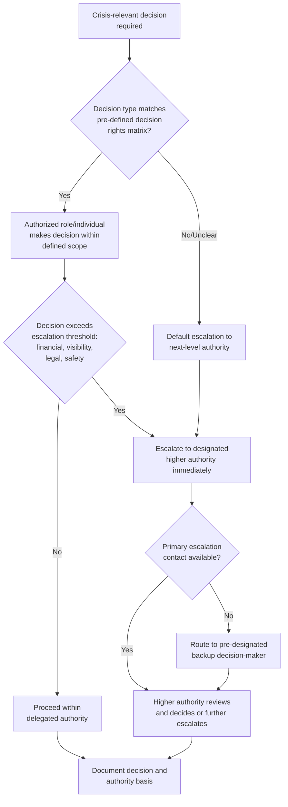

## Delegation, Authority, and Escalation Paths

### Overview

Delegation, authority, and escalation paths address the organizational design question of who is empowered to make which crisis decisions, at what threshold a decision must move to a higher level of authority, and how that structure is defined and communicated before a crisis occurs. This topic operationalizes the decision-making frameworks and psychological considerations addressed elsewhere in this chapter into a concrete governance architecture: even the best decision framework or the most psychologically prepared leader will underperform if the organization has not clearly defined who decides what, and how decisions move through the organization under time pressure.

### Why Clear Delegation Structure Is a Crisis-Specific Requirement

**Key Points**

- In normal operations, ambiguous or informally understood decision authority is frequently tolerable because time pressure is low and clarification is easy to obtain; during a crisis, the same ambiguity produces delay, duplicated effort, or contradictory action taken by different parts of the organization simultaneously.
- Without pre-defined delegation and escalation structure, crisis decisions frequently default either to whoever is most senior and available in the moment (regardless of whether they have the most relevant expertise or authority for that specific decision type) or to a diffuse, unclear process where no one is confident they have authority to act, producing paralysis.
- [Inference] Organizations that have pre-defined, tested delegation structures are generally believed by crisis management practitioners to respond with less internal friction and faster decision velocity than those improvising authority structures during the event itself, though this is difficult to measure precisely given the non-comparability of different crises.

### Core Design Elements

| Element | Description |
| --- | --- |
| Decision Rights Matrix | A pre-defined mapping of decision types (e.g., public statement approval, operational shutdown, financial commitment above a threshold) to the specific role or individual authorized to make that decision |
| Escalation Thresholds | Clearly defined criteria (financial magnitude, public visibility level, legal/regulatory implication, safety risk) that trigger automatic escalation to a higher authority level |
| Delegation of Authority During Absence | Pre-designated backup decision-makers for each key role, addressing the realistic scenario that a primary decision-maker may be unavailable, traveling, or otherwise unreachable when a crisis begins |
| Emergency Authority Provisions | Pre-authorized limited authority for specific roles to act immediately in narrowly defined circumstances (e.g., immediate safety stand-down authority) without needing real-time higher-level approval |

### Escalation Decision Flow





```
### Designing the Decision Rights Matrix

**Key Points**
- Effective decision rights matrices are specific enough to eliminate ambiguity in common scenarios (e.g., "any public statement referencing financial performance requires CFO and IR sign-off; any statement referencing safety incidents requires [specific operational leader] and legal sign-off") rather than relying on vague general principles that still require real-time interpretation under pressure.
- The matrix should be tested against realistic crisis scenarios in advance (tabletop exercises) to identify gaps — decision types not clearly covered, thresholds that are ambiguous in practice, or authority conflicts between roles — since these gaps are far easier to identify and correct in advance than during an actual crisis.
- Matrices should be periodically reviewed and updated as organizational structure changes (role changes, reorganizations, new business lines) to avoid the common failure of an outdated matrix referencing roles or reporting lines that no longer reflect current organizational structure.

### Escalation Thresholds: Balancing Speed and Appropriate Oversight

- Thresholds set too low (requiring escalation for minor decisions) create unnecessary bottlenecks and slow response for issues that do not warrant senior-level involvement, while thresholds set too high (allowing significant decisions to be made without adequate escalation) risk major decisions being made by individuals without full visibility into broader organizational implications (legal exposure, financial materiality, reputational scale).
- [Inference] The appropriate threshold calibration is highly organization-specific, depending on organizational size, risk tolerance, and the specific consequences of decision types under consideration; general benchmarks are difficult to provide, and thresholds are generally best set through deliberate cross-functional discussion (legal, finance, communications, operations) rather than defaulting to a single function's risk tolerance alone.
- Escalation thresholds should account for cumulative as well as individual decisions — a series of individually low-threshold decisions can collectively represent a much larger commitment or exposure than any single decision in isolation, a pattern that purely per-decision thresholds can miss.

### Backup Decision-Maker Provisions

**Key Points**
- A common and avoidable failure is a well-designed decision rights matrix that assumes each authorized decision-maker will be reachable and available at the moment a crisis-relevant decision is needed — a realistic assumption failure given that crises do not schedule themselves around key personnel's availability (travel, illness, being off-duty).
- Effective structures designate at least one, ideally two, backup decision-makers for each key crisis role, with those backups genuinely briefed on their potential role (not merely listed on an organizational chart) so they can act with appropriate confidence and context if called upon.
- Contact information, communication channels, and authentication/verification methods for reaching designated decision-makers (including backups) during off-hours or while traveling should be tested periodically, since an escalation structure that exists on paper but fails at the point of actual contact during a real crisis provides limited practical value.

### Emergency Authority for Time-Critical Situations

- Certain crisis situations (immediate safety risks, active security incidents, situations requiring immediate operational shutdown) cannot tolerate the delay inherent in even a well-designed escalation process, requiring pre-authorized emergency authority for specific roles to act immediately within narrowly defined boundaries.
- These provisions should be narrowly and specifically scoped (e.g., "any facility manager may order an immediate safety stand-down without prior approval") rather than broadly worded, to avoid emergency authority being invoked for situations it was not intended to address, while still providing genuine speed where time-critical action is required.
- Emergency authority exercised under these provisions should still require prompt (though not necessarily prior) notification to the broader crisis governance structure, ensuring the decision is documented and reviewed even though it was made without real-time higher-level approval.

### Common Failure Modes

1. **No Pre-Defined Decision Rights Matrix** — improvising who has authority to make which crisis decisions during the event itself, producing delay, duplicated effort, or contradictory parallel decisions.
2. **Outdated Matrix Following Organizational Change** — relying on a decision rights matrix that references roles, reporting lines, or individuals no longer accurate due to subsequent reorganization, discovered only when the matrix is needed during an actual crisis.
3. **No Backup Decision-Maker Provisions** — designing escalation structure around specific named individuals without accounting for the realistic likelihood of unavailability at the moment of crisis.
4. **Backup Decision-Makers Listed But Not Briefed** — designating backup authority on paper without ensuring the backup individual has sufficient context and familiarity with the decision rights structure to act confidently if called upon.
5. **Overly Broad Emergency Authority Provisions** — granting emergency decision-making authority in vague or expansive terms, risking that authority being invoked well beyond the narrow circumstances it was intended to address.
6. **Per-Decision Threshold Blindness to Cumulative Exposure** — evaluating each decision against escalation thresholds individually without considering whether a series of related decisions collectively exceeds a threshold that would trigger escalation if viewed as a whole.
7. **Untested Structure** — designing a decision rights and escalation framework on paper without testing it against realistic crisis scenarios, leaving gaps and ambiguities undiscovered until an actual crisis exposes them.

### Conclusion

Clear, pre-defined, and regularly tested delegation, authority, and escalation structures provide the organizational scaffolding that allows sound decision-making frameworks and psychologically prepared leaders to function effectively under crisis time pressure. Effective structures specify decision rights with sufficient precision to eliminate real-time ambiguity, set escalation thresholds calibrated to organizational risk tolerance while accounting for cumulative exposure, provide genuinely briefed backup decision-makers rather than paper-only designations, and include narrowly scoped emergency authority provisions for genuinely time-critical situations — all validated through advance testing rather than assumed to function correctly when first needed during an actual crisis.

**Next Steps**
- Designing and Testing Decision Rights Matrices via Tabletop Exercises
- Escalation Threshold Calibration Across Financial, Legal, and Reputational Dimensions
- Backup Decision-Maker Briefing and Readiness Verification
- Emergency Authority Provision Scoping and Governance
- Cumulative Decision Exposure Tracking Methodologies
- Periodic Review Cadence for Decision Rights Matrix Maintenance
- Communication Channel and Contact Verification for Crisis Escalation


```