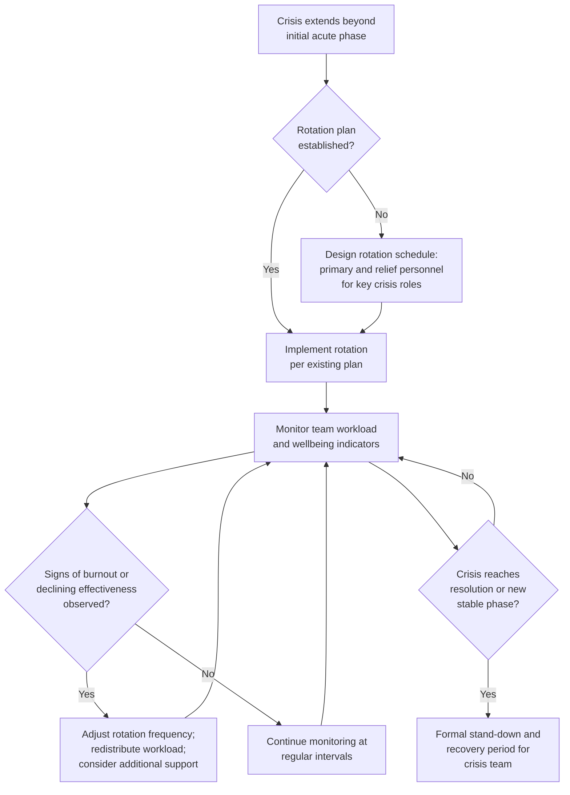

## Managing Crisis Fatigue and Team Burnout

### Overview

Managing crisis fatigue and team burnout addresses the sustained human-performance risks that emerge when crisis response extends beyond an acute initial phase into weeks or months of continued elevated demand, and the organizational practices needed to maintain response quality and team wellbeing over that extended duration. Where earlier topics in this chapter addressed acute-phase decision-making and psychology, this topic addresses the distinct dynamics of prolonged crisis response — a different risk profile requiring different management approaches, since sustained low-to-moderate stress over weeks produces different failure patterns than acute high-intensity stress over hours or days.

### Why Extended Crises Present Distinct Risk

**Key Points**

- Acute crisis response can often be sustained through short-term adrenaline-driven effort, but this is not a viable model for crises extending over weeks or months — sustained high-effort response without structural rest and rotation produces measurable decision-quality decline and burnout distinct from acute-phase stress responses.
- Extended crises frequently involve a demoralizing pattern where initial resolution attempts do not fully succeed, requiring teams to sustain effort through multiple response cycles without the psychological relief of clear closure — this differs meaningfully from a single acute incident with a defined beginning and end.
- Crisis teams frequently continue normal job responsibilities alongside crisis response duties, particularly in smaller organizations without dedicated crisis staff, compounding cumulative workload in ways that are easy to underestimate when planning for "how long can this team sustain this."

### Distinguishing Acute Stress Response from Burnout

| Dimension | Acute Crisis Stress | Extended Crisis Burnout |
| --- | --- | --- |
| Timeframe | Hours to days | Weeks to months |
| Primary risk | Cognitive distortion, hasty decisions (as addressed under leadership psychology) | Cumulative exhaustion, cynicism, reduced effectiveness, potential departure of key personnel |
| Typical mitigation | Structured decision protocols, brief pauses, dissent mechanisms | Rotation, workload redistribution, defined rest periods, realistic pacing of response expectations |
| Team composition risk | Individual decision quality degradation | Team-level attrition and loss of institutional crisis knowledge if key people leave or disengage |

[Inference] This distinction draws on general occupational stress and burnout literature applied to the crisis management context specifically; the exact timeframe at which acute stress dynamics give way to burnout dynamics varies by individual and situation and should not be treated as a fixed threshold.

### Structural Practices for Extended Crisis Management





```
### Rotation and Workload Redistribution

**Key Points**
- Building rotation into extended crisis response — ensuring no individual or small group is expected to sustain primary crisis responsibility for the entire duration — is among the most concretely actionable practices for managing extended-crisis burnout risk, directly connecting to the fatigue considerations raised under leadership psychology.
- Rotation requires advance planning (identifying and briefing relief personnel before they are needed, as addressed under delegation and escalation) rather than being improvised once fatigue is already advanced, since identifying and preparing capable relief personnel takes time that is harder to find once a team is already depleted.
- Workload redistribution should account for the compounding effect of crisis responsibilities layered onto ongoing normal job duties — simply adding crisis rotation without addressing the underlying dual-workload problem may not meaningfully reduce cumulative burden.

### Recognizing Burnout Indicators

| Category | Potential Indicators |
|---|---|
| Behavioral | Increasing errors or inconsistencies in previously reliable work; withdrawal from team discussion; uncharacteristic irritability |
| Effectiveness | Declining quality of analysis or communication output over time; slower response to routine requests; difficulty synthesizing new information |
| Team Dynamics | Increased interpersonal friction within the crisis team; reduced willingness to raise concerns or dissent (connecting to the groupthink risk addressed under leadership psychology, but arising here from exhaustion rather than acute time pressure) |
| Attrition Signals | Key personnel expressing intent to leave the crisis role or the organization; increased use of sick leave or disengagement from non-crisis responsibilities |

[Inference] These are general indicators drawn from occupational burnout literature adapted to a crisis management context; individual variation is substantial, and these signals should prompt further attention and conversation rather than being treated as a diagnostic checklist.

### Leadership Role in Sustaining Team Capacity

- Crisis leaders bear specific responsibility for monitoring team capacity, not only crisis substance — this requires leaders to actively check in on team wellbeing rather than assuming that continued task completion indicates continued sustainable capacity, since teams under pressure frequently continue producing output even as underlying capacity deteriorates.
- Modeling sustainable practice (leaders visibly taking necessary rest, respecting rotation schedules themselves) matters beyond the practical benefit to the leader individually — a leader who does not observe their own rotation or rest guidance implicitly signals to the team that such guidance is not truly expected to be followed.
- Providing psychological safety for team members to raise their own capacity concerns without it being perceived as insufficient commitment or resilience is a distinct leadership practice from simply scheduling rotation on a calendar — teams may continue working past sustainable capacity if they perceive raising concerns as career-risky, regardless of formally available rotation provisions.

### Formal Stand-Down and Recovery

**Key Points**
- Extended crises benefit from an explicit, formally recognized stand-down or transition point when the acute or extended-response phase concludes — rather than an ambiguous, gradual fade back to normal operations that leaves team members uncertain whether continued heightened effort is still expected.
- Recovery periods following extended crisis response (reduced workload expectations, explicit permission to deprioritize non-essential work temporarily) help address accumulated fatigue and reduce the risk of delayed burnout effects manifesting after the crisis has formally concluded.
- Post-crisis review processes (addressed in organizational learning topics) benefit from being scheduled with some deliberate distance from the most acute fatigue period, since teams still in a depleted state may be less capable of the reflective, balanced analysis effective post-crisis review requires.

### Distinguishing Genuine Ongoing Crisis from Extended Low-Grade Vigilance

- Some situations genuinely require sustained active crisis response over an extended period; others transition into a lower-intensity monitoring phase that does not require the same acute staffing and workload levels, but organizations sometimes fail to recognize and formally acknowledge this transition, maintaining acute-phase workload expectations well past the point they are actually necessary.
- Periodically and explicitly reassessing whether the situation still requires acute crisis-level staffing, or has transitioned to a lower-intensity monitoring phase, prevents the specific failure of sustaining unnecessary team strain based on outdated assumptions about the crisis's current intensity.

### Common Failure Modes

1. **No Rotation Planning** — sustaining the same personnel in acute crisis roles for the full duration of an extended crisis without relief, risking fatigue-driven decision and effectiveness decline.
2. **Ignoring Dual-Workload Compounding** — adding crisis responsibilities to personnel without adequately addressing their continuing normal job duties, understating true cumulative burden.
3. **Output-Based Capacity Assumption** — assuming continued task completion indicates continued sustainable team capacity, missing underlying depletion that has not yet visibly affected output quality.
4. **Leadership Modeling Unsustainable Practice** — crisis leaders not observing their own rest or rotation guidance, undermining the team's willingness to genuinely utilize such provisions themselves.
5. **Ambiguous Stand-Down** — allowing crisis response to gradually and ambiguously fade rather than formally recognizing a transition point, leaving team members uncertain about continued expectations and delaying recovery.
6. **Premature Post-Crisis Review** — conducting reflective organizational learning review while the team is still in an acutely fatigued state, reducing the quality of that review's insights.
7. **Failing to Reassess Intensity Level** — maintaining acute-phase staffing and workload expectations after a crisis has genuinely transitioned to a lower-intensity monitoring phase, causing unnecessary continued strain.

### Conclusion

Extended crisis response introduces distinct human-performance risks — cumulative fatigue, burnout, and potential attrition of key personnel — that differ from the acute-phase cognitive and psychological dynamics addressed elsewhere in this chapter, requiring correspondingly distinct management practices. Effective extended-crisis management requires advance rotation planning with genuinely briefed relief personnel, active leadership monitoring of team capacity (not merely output), psychological safety for team members to raise their own capacity concerns, formally recognized stand-down transitions, and periodic honest reassessment of whether the situation still warrants acute-level staffing and workload expectations.

**Next Steps**
- Designing Rotation Schedules for Extended Crisis Response Teams
- Recognizing and Responding to Early Burnout Indicators in Crisis Teams
- Leadership Practices for Modeling Sustainable Crisis Response
- Formal Stand-Down Protocol Design and Communication
- Distinguishing Acute Crisis Phase from Extended Monitoring Phase
- Building Psychological Safety for Capacity Concerns Within Crisis Teams
- Timing Post-Crisis Organizational Learning Reviews Appropriately


```