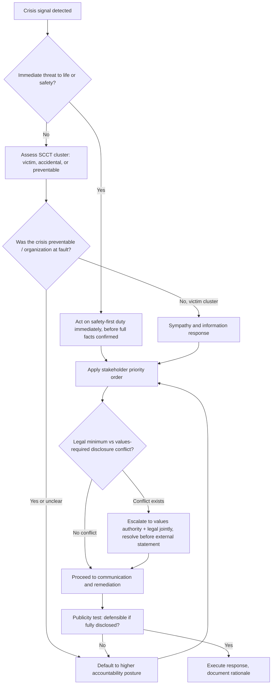
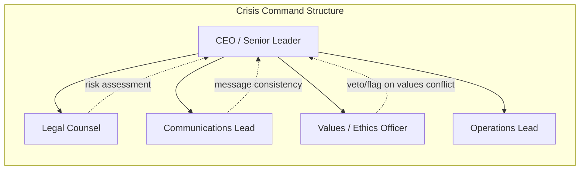

## Values-Based and Ethical Leadership in Crisis

### Definition and Scope

Values-based and ethical leadership in crisis refers to a decision-making orientation in which a leader's choices during high-stakes, high-ambiguity, time-compressed events are anchored to a stable set of organizational and personal values rather than solely to expedience, legal minimums, or short-term reputational optics. It is distinguished from generic crisis management by its explicit subordination of tactical convenience to moral consistency: the leader asks not only "what will resolve this fastest" but "what does acting rightly require here, and can I defend this choice publicly and to myself afterward."

This domain sits at the intersection of crisis leadership, business ethics, and reputation management. It matters most precisely when it is hardest to practice — under time pressure, incomplete information, and intense stakeholder scrutiny, all of which create incentives to cut ethical corners.

### Key Points

- **Values as decision filters, not slogans**: Stated corporate values (integrity, safety, transparency) function operationally only if they are pre-defined, ranked, and applied consistently before a crisis, not improvised during one.
- **Consistency over convenience**: Ethical crisis leadership requires the same values to govern decisions whether the outcome is favorable or damaging to the organization.
- **Transparency vs. legal caution tension**: Legal counsel typically advises minimal disclosure to limit liability; ethical leadership frequently requires disclosure beyond the legal minimum to preserve stakeholder trust. Resolving this tension is a core leadership task, not a peripheral one.
- **Stakeholder primacy ordering**: Ethical crisis leaders generally establish an explicit priority order (commonly: life/safety > affected victims > employees > customers > shareholders > media) and apply it visibly.
- **Accountability precedes recovery**: Genuine acceptance of responsibility (as opposed to non-apology or deflection) is consistently identified in crisis communication literature as a precondition for reputational recovery, not merely a courtesy.
- **Moral courage under asymmetric information**: Leaders frequently must act on ethical principle before all facts are confirmed, accepting the risk of being wrong about details while being right about values.

### Theoretical Foundations

**Situational Crisis Communication Theory (SCCT)** (Coombs) provides the dominant framework linking crisis type, perceived organizational responsibility, and response strategy. SCCT classifies crises into clusters by attributed responsibility:

| Cluster | Attributed Responsibility | Example | Ethically Appropriate Response Posture |
| --- | --- | --- | --- |
| Victim cluster | Low | Natural disaster, workplace violence, rumor | Sympathy, information provision |
| Accidental cluster | Moderate | Technical error, product harm without prior warning | Justification, compensation |
| Preventable cluster | High | Negligence, misconduct, prior violation ignored | Full apology, corrective action, accountability |

[Inference] The ethical weight of a leader's response should scale with the crisis cluster: a preventable-cluster crisis met with a victim-cluster response (minimization, deflection) is where the largest values-reputation gap and stakeholder backlash tends to occur, though the magnitude varies by industry and prior trust reserves.

**Image Restoration Theory** (Benoit) catalogs response strategies — denial, evasion of responsibility, reducing offensiveness, corrective action, mortification — and is frequently used descriptively to show how ethical and unethical leaders differ in which strategies they select. Values-based leadership disproportionately favors corrective action and mortification (genuine apology) over denial and evasion.

**Stakeholder Theory** (Freeman) underpins the "who do we owe duties to, and in what order" question central to ethical crisis triage, treating employees, customers, communities, and shareholders as holders of legitimate claims rather than instruments of shareholder value alone.

**Ethical decision-making frameworks** commonly applied in crisis contexts include:

- *Utilitarian test*: which response produces the greatest aggregate wellbeing across stakeholders
- *Deontological test*: which response honors duties and rights regardless of consequences (e.g., duty to disclose safety defects)
- *Virtue ethics test*: what would a person of practical wisdom and integrity do
- *Publicity test* (Rawls-derived heuristic): would this decision remain defensible if fully disclosed to the public and press

[Inference] In practice, experienced crisis advisors often apply the publicity test as a fast heuristic precisely because full utilitarian or deontological analysis is too slow for the decision windows involved.

### Core Components of Values-Based Crisis Leadership

**1. Pre-crisis values codification**

Values must be operationalized before a crisis, typically via:

- A documented ethical decision hierarchy (which stakeholder interests take precedence when they conflict)
- Pre-approved "red lines" (actions the organization will never take regardless of pressure — e.g., concealing a safety defect)
- A designated ethics/values authority in the crisis command structure (distinct from legal and communications) empowered to flag decisions inconsistent with stated values

**2. Rapid ethical triage under uncertainty**

A structured, repeatable sequence leaders apply in the first hours:

**3. Transparent, timely disclosure**

Ethical leadership favors:

- Speed of acknowledgment over completeness of information ("we know X, we are investigating Y, we will update by Z" rather than silence pending full certainty)
- Proactive disclosure of unfavorable facts rather than waiting for external discovery, since discovery-after-concealment compounds the original crisis with a trust crisis
- Single, consistent spokesperson messaging aligned with the values hierarchy, to avoid contradictory signals that suggest values are situational

**4. Accountability and genuine apology**

An ethically credible apology, per crisis communication literature, typically contains:

- Explicit acknowledgment of harm caused (not merely "if anyone was affected")
- Acceptance of responsibility appropriate to the SCCT cluster (not necessarily legal admission of fault, but moral acknowledgment)
- Concrete corrective action, not only expressed regret
- No conditional or minimizing language ("mistakes were made" passive constructions are widely identified as weak/non-credible apology markers)

**5. Post-crisis integrity verification**

- Follow-through audits confirming promised corrective actions were actually implemented
- Consistency checks: did the organization apply the same standard internally (discipline, policy change) as it communicated externally
- [Inference] Stakeholders and media disproportionately punish a gap between stated remediation and verified action more severely than they punish the original crisis, because it reframes the event as a pattern of dishonesty rather than a single failure — though this effect size is not uniformly quantified across studies.

### Common Ethical Failure Modes

| Failure Mode | Description | Typical Consequence |
| --- | --- | --- |
| Non-apology apology | Regret expressed without accountability ("I'm sorry if anyone was offended") | Perceived as insincere; can escalate rather than de-escalate crisis |
| Values-optics gap | Public values statements contradicted by internal decisions | Long-term erosion of employee and stakeholder trust; "hypocrisy penalty" |
| Legal-first override | Allowing legal risk minimization to fully override ethical disclosure duties | Delayed disclosure discovered externally, compounding reputational damage |
| Selective stakeholder favoring | Prioritizing shareholder/market reaction over affected victims | Perceived as confirming values are performative |
| Scapegoating | Attributing systemic failure to a single individual to protect leadership | Undermines credibility if organizational root cause later surfaces |
| Silence as strategy | Extended no-comment periods intended to let the story fade | Frequently backfires in high-visibility, social-media-amplified crises; vacuum filled by unverified narratives |

### Worked Example

**Scenario**: A mid-sized food manufacturer discovers, via an internal quality alert, that a contamination risk may affect a already-shipped product batch. Full lab confirmation will take 48 hours; anecdotal illness reports are just beginning to surface externally.

**Non-values-based response (illustrative contrast)**: Wait for full lab confirmation before any statement; issue a narrowly worded statement only after media inquiry; frame the issue as "isolated and unconfirmed."

**Values-based response**:

1. Immediate internal safety action: initiate voluntary hold/recall process before lab confirmation, treating consumer safety as the deciding value even at the cost of near-certain short-term financial and reputational cost if the alert proves to be a false alarm.
2. Proactive public disclosure within hours: "We have identified a potential contamination risk in [batch]. Out of caution, we are recalling this batch while we complete testing. We will share confirmed results within 48 hours." This satisfies the publicity test and the accountability-before-certainty principle.
3. Stakeholder sequencing: direct outreach to affected retailers/consumers first, regulatory notification concurrently, investor communication after safety stakeholders are addressed.
4. Post-confirmation: full disclosure of root cause and corrective process changes, regardless of whether the contamination is confirmed as severe or minor.

[Inference] This sequencing accepts a higher probability of short-term cost (an unnecessary recall, if the alert is a false positive) in exchange for lower long-term reputational and legal tail-risk; whether this trade-off is "correct" in expected-value terms depends on the specific probability and severity estimates available to the leader at decision time, which is precisely why it is treated as an ethical judgment rather than a purely quantitative one.

### Governance Structures Supporting Ethical Crisis Leadership

The distinguishing structural feature is the **Ethics/Values Officer role holding flag or escalation authority** independent of legal and communications, ensuring the values dimension is represented as a distinct input rather than subsumed under risk management or messaging optimization.

### Measurement and Assessment

Organizations and researchers commonly assess values-based crisis leadership post-hoc via:

- **Response latency**: time from crisis awareness to first public acknowledgment
- **Consistency scoring**: alignment between pre-stated values/policies and actual crisis decisions
- **Stakeholder trust recovery curves**: longitudinal trust or reputation index measurement (e.g., via reputation quotient surveys) pre- and post-crisis
- **Apology credibility coding**: content analysis of public statements against accountability-language rubrics (presence/absence of acknowledgment, responsibility acceptance, corrective commitment)

[Unverified] Specific proprietary reputation index scores (e.g., particular firms' quarterly trust index movements) are not something that can be generalized reliably without case-specific data; any numeric claim about "X% reputation recovery after Y months" should be treated as case-specific rather than a universal constant.

### Related Topics

- Situational Crisis Communication Theory (SCCT) in depth
- Apology and image restoration strategies (Benoit's typology)
- Stakeholder mapping and prioritization frameworks
- Crisis command structure and role design
- Legal vs. ethical disclosure conflict resolution
- Post-crisis trust recovery measurement
- Whistleblower protection and internal ethics escalation channels
- Organizational culture as a crisis-prevention mechanism
- Media relations under high-accountability crisis postures
- Case studies: preventable-cluster crises and leadership response comparison