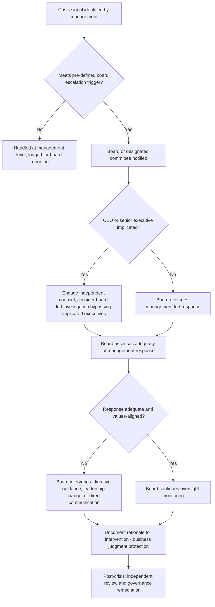

## Board-Level Crisis Governance

### Definition and Scope

Board-level crisis governance refers to the structures, duties, and decision-making processes through which a corporate board of directors oversees, participates in, and holds management accountable during a crisis event. It is distinct from operational crisis management (which is executed by management/executive teams) in that the board's role is oversight, fiduciary judgment, and — in severe cases — direct intervention, rather than day-to-day crisis command.

This domain sits at the intersection of corporate governance, fiduciary law, and crisis/reputation management, and becomes acutely visible when a crisis raises questions of management competence, legal exposure, or existential threat to the organization.

### Key Points

- **Oversight vs. management distinction**: Directors govern and oversee; they do not typically run the crisis response themselves, except in extreme circumstances (e.g., CEO implicated in the crisis, sudden leadership incapacity).
- **Fiduciary duties intensify, not change, in crisis**: The core duties of care, loyalty, and good faith remain constant, but the standard of diligence expected of directors is judged more strictly in crisis due to heightened foreseeability and stakes.
- **Board must assess whether management's response is adequate**, and has an affirmative duty to intervene if it is not — silence or passive deference during a mismanaged crisis is itself a governance failure.
- **Pre-crisis preparedness is a governance responsibility**: Boards are expected to ensure crisis plans, succession plans, and risk oversight structures exist before a crisis, not improvise oversight during one.
- **Information asymmetry management**: The board typically depends on management for crisis information, creating a structural risk that the board is oversight-blind precisely when oversight matters most; independent information channels (whistleblower lines, internal audit, outside counsel) mitigate this.
- **Reputational fiduciary dimension**: Courts and governance codes increasingly treat reputational risk oversight as encompassed within the board's risk oversight duty, not a separate "soft" concern.

### Legal and Governance Framework

**Fiduciary duties applicable in crisis** (jurisdiction-dependent, illustrated using widely-referenced U.S. Delaware corporate law concepts as the common academic baseline):

| Duty | Description | Crisis-Specific Application |
| --- | --- | --- |
| Duty of Care | Act on an informed basis, with the diligence a reasonably prudent person would exercise | Requires directors to seek adequate information about the crisis rather than rely passively on management summaries |
| Duty of Loyalty | Act in the best interest of the corporation, not personal or management interest | Requires directors to resist management's self-protective framing of a crisis (e.g., understating executive culpability) |
| Duty of Good Faith | Act honestly and not in conscious disregard of known duties | Prohibits willful blindness to red flags predating the crisis |
| Oversight Duty (*Caremark* standard, U.S.) | Directors must make a good-faith effort to establish reasonable information and reporting systems, and respond to red flags | Central standard invoked in post-crisis shareholder derivative litigation; failure of "Caremark oversight" is a common allegation after major corporate crises |

[Inference] The *Caremark* oversight standard specifically (a good-faith information-system and red-flag-response requirement) is the most frequently litigated theory following major corporate scandals, though its application and evidentiary bar vary by jurisdiction and are frequently contested; this should be treated as a general pattern rather than a universal legal rule outside U.S. Delaware-influenced jurisdictions.

**Business Judgment Rule** generally shields directors from liability for good-faith, informed decisions even if they turn out poorly — but this protection is weakened or lost where the board failed to inform itself adequately, acted in self-interest, or ignored known red flags, which is precisely why documented process (see below) matters more in crisis than in ordinary operations.

### Core Board Responsibilities During Crisis

**1. Pre-crisis governance infrastructure**

- Approved enterprise risk management (ERM) framework covering reputational, operational, legal, and strategic risk categories
- CEO/executive succession plan, including emergency succession for sudden incapacity or removal
- Defined crisis escalation triggers specifying at what severity a matter must be reported to the board (not left to management discretion alone)
- Designated board crisis committee or clear allocation of crisis oversight to an existing committee (audit, risk, or a standing/ad hoc crisis committee)
- Independent access channels: direct lines to internal audit, outside counsel, and whistleblower reporting that bypass management filtering

**2. Activation and information-gathering**

- Rapid convening protocol (emergency board meeting procedures, often defined in bylaws or board charters)
- Independent verification of management's account of facts, especially where management or the CEO may be implicated
- Engagement of independent outside counsel and, where financial/accounting issues are involved, forensic accountants, separate from management's usual advisors where a conflict is plausible

**3. Oversight of management's response**

- Evaluating whether management's crisis response aligns with organizational values and legal obligations (see Values-Based and Ethical Leadership content)
- Assessing CEO/executive performance under pressure, including whether leadership changes are warranted
- Approving material decisions exceeding management's authority (e.g., large settlements, recalls with major financial impact, public restatements)

**4. Direct board communication role**

- Determining whether and when the board chair or lead independent director should communicate directly with major shareholders, regulators, or media — separate from management's spokesperson role
- Managing communications with institutional investors and proxy advisors, who may demand direct board-level assurance during severe crises

**5. Post-crisis accountability and remediation**

- Commissioning independent post-mortem investigations
- Governance reforms (board composition, committee structure, disclosure controls) responsive to root causes
- Executive accountability decisions (compensation clawback, termination, non-renewal)

### Board Crisis Escalation and Decision Flow

### Board Crisis Committee Structures

| Structure | Description | When Typically Used |
| --- | --- | --- |
| Standing Risk/Audit Committee extension | Existing committee absorbs crisis oversight | Lower-severity or single-domain crises (financial, compliance) |
| Ad hoc Special Committee | Formed specifically for the crisis, often with independent directors only | Crises involving potential management or director conflicts of interest |
| Full board as crisis committee | Entire board convenes as unified body | Existential or company-wide crises (e.g., major safety failure, solvency risk) |
| Lead Independent Director / Non-Executive Chair activation | Independent leadership takes prominent role, particularly when CEO is implicated | CEO misconduct, sudden CEO departure, conflict-of-interest scenarios |

[Inference] Ad hoc special committees composed entirely of independent, disinterested directors are generally viewed as carrying the strongest business judgment rule protection in litigation because they most clearly demonstrate an unconflicted, informed decision-making process — though the specific procedural requirements to achieve this protection vary by jurisdiction and case law development.

### Common Governance Failure Modes

| Failure Mode | Description | Consequence |
| --- | --- | --- |
| Rubber-stamp oversight | Board defers entirely to management's framing without independent verification | Loss of Business Judgment Rule protection; personal director liability exposure |
| Information capture | Board's only information channel is the implicated executive team | Delayed or distorted crisis awareness; classic *Caremark*-type failure pattern |
| Reactive-only governance | No pre-crisis escalation triggers or crisis committee structure exists | Ad hoc, inconsistent, delayed board response |
| Conflict-blind committee composition | Directors with personal or financial ties to implicated executives sit on the oversight committee | Independence challenges in subsequent litigation or investigation |
| Communication vacuum | Board remains entirely silent externally even where major stakeholders (large investors, regulators) expect direct board assurance | Erodes confidence that oversight is genuinely independent of management |
| Late intervention | Board waits for overwhelming evidence before acting, despite earlier red flags | Amplifies "board knew or should have known" liability theories |

### Worked Example

**Scenario**: A public company's CFO is implicated in an accounting irregularity that inflated quarterly earnings; the CEO publicly defends the CFO before an internal investigation concludes.

**Board governance response**:

1. Audit committee (composed of independent directors) is notified per pre-defined escalation triggers tied to any accounting irregularity allegation.
2. Independent outside counsel and forensic accountants are engaged directly by the audit committee, not routed through the CFO's or CEO's usual counsel, to preserve independence.
3. The board assesses that the CEO's public defense of the CFO, made before investigation completion, itself constitutes a governance concern — an executive pre-judging an ongoing independent investigation.
4. The lead independent director, rather than the CEO, communicates to major investors that an independent investigation is underway and that the board is directly overseeing it.
5. Investigation findings determine subsequent accountability actions (restatement, personnel decisions, disclosure to regulators such as the SEC in the U.S. context).
6. Post-crisis, the board reviews why the escalation trigger did not fire earlier if red flags existed in prior audit committee reports, and adjusts reporting thresholds accordingly.

[Inference] The decision to have the lead independent director, rather than the CEO, communicate externally in this scenario reflects a widely-observed governance practice when the CEO's own conduct is part of what is under investigation, since CEO-led communication in that circumstance would itself raise independence concerns — this is a normative practice pattern rather than a fixed legal requirement in most jurisdictions.

### Regulatory and Disclosure Considerations

- **Materiality assessment**: Boards must oversee management's determination of whether a crisis constitutes material information requiring public disclosure under applicable securities law (e.g., 8-K filings in the U.S. for material events).
- **Insider trading controls**: Crisis periods typically trigger heightened blackout periods and information-barrier enforcement for directors and executives possessing material non-public information.
- **Regulatory notification duties**: Depending on sector (financial services, healthcare, publicly traded status), specific regulators may require board-level attestation or notification distinct from general public disclosure.
- [Unverified] Specific disclosure timelines and materiality thresholds vary significantly by jurisdiction, exchange listing requirements, and industry-specific regulation; any specific day-count or threshold figure should be verified against the applicable current regulatory text rather than treated as universal.

### Related Topics

- Enterprise Risk Management (ERM) frameworks and board risk committees
- *Caremark* oversight duty and shareholder derivative litigation
- CEO succession planning and emergency leadership transition
- Independent investigations: scope, privilege, and reporting structure
- Materiality and securities disclosure obligations in crisis
- Lead Independent Director / Non-Executive Chair role design
- Executive compensation clawback and accountability mechanisms
- Board composition and independence standards
- Institutional investor and proxy advisor engagement during crisis
- Values-Based and Ethical Leadership in Crisis (related chapter item)