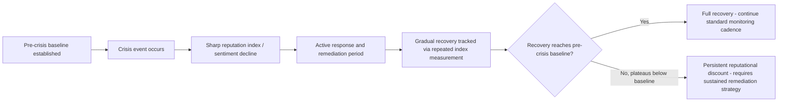

## Reputation Metrics and Index Models

### Definition and Scope

Reputation metrics and index models are the quantitative and semi-quantitative frameworks used to measure, track, and benchmark an organization's reputation among stakeholders over time. They convert the abstract construct of "reputation" — a perceptual, multi-stakeholder phenomenon — into structured indices that can be tracked longitudinally, compared across organizations, and correlated with crisis events and business outcomes.

This domain matters to crisis and reputation management specifically because it supplies the baseline and recovery-tracking instruments needed to answer: how damaged was reputation by this crisis, and has it recovered.

### Key Points

- **Reputation is multi-dimensional, not a single number**: Most established models decompose reputation into several underlying dimensions (e.g., products/services, financial performance, workplace, governance, citizenship, leadership, innovation) rather than treating it as one scalar quantity.
- **Perception-based, not purely factual**: Reputation indices measure stakeholder *perception* of the organization, which can diverge from objective performance — a core reason reputation can be damaged by perception-shifting events even absent factual wrongdoing.
- **Multi-stakeholder aggregation problem**: Different stakeholder groups (customers, employees, investors, media, general public) can hold materially different reputational assessments of the same organization; index models differ in how they weight or segment these groups.
- **Baseline dependency**: Reputation damage and recovery can only be measured meaningfully against a pre-crisis baseline; organizations without established baseline tracking cannot rigorously quantify crisis impact.
- **Lagging and leading indicator distinction**: Some metrics (media sentiment, social listening volume) update near-real-time and function as leading indicators during a crisis; others (annual survey-based indices) are lagging and better suited to post-crisis recovery assessment.
- **Correlation with financial outcomes is contested**: Academic literature shows correlation between reputation indices and outcomes like stock performance, customer loyalty, and talent attraction, but causal direction and effect size are actively debated rather than settled.

### Major Established Index Models

| Model | Originator | Core Dimensions | Methodology |
| --- | --- | --- | --- |
| Reputation Quotient (RQ) | Charles Fombrun / Reputation Institute (predecessor work) | Emotional appeal, products/services, vision & leadership, workplace environment, social responsibility, financial performance | Public survey-based, multi-dimensional scoring |
| RepTrak | RepTrak (successor to Reputation Institute) | Products/services, innovation, workplace, governance, citizenship, leadership, performance | Large-scale stakeholder survey, converted into a 0–100 pulse score plus dimensional breakdown |
| Fortune "World's Most Admired Companies" | Fortune / Korn Ferry (survey partner) | Innovation, people management, use of assets, social responsibility, quality of management, financial soundness, long-term investment value, quality of products/services, global competitiveness | Peer-executive survey (industry executives rating competitors) |
| Axios Harris Poll 100 | Harris Poll | Character, culture, ethics, citizenship, trust, vision, growth, products/services | Consumer survey-based, focused on U.S. general public perception |
| Edelman Trust Barometer | Edelman | Trust in institutions (business, government, NGOs, media), competence and ethics sub-dimensions | Large-scale international public opinion survey, annual |

[Inference] No single index model above is universally treated as "the" authoritative reputation measure; organizations and researchers typically select or combine models based on which stakeholder group and dimension set is most relevant to their specific crisis or industry context, and the choice materially affects reported scores.

### Reputation Measurement Approaches — Comparative Framework

```mermaid
flowchart TD
    A[Reputation Measurement Approaches] --> B[Survey-Based Index Models]
    A --> C[Media and Social Listening Metrics]
    A --> D[Financial Market Proxies]
    A --> E[Behavioral / Outcome Metrics]

    B --> B1[RepTrak, RQ, Fortune Most Admired, Axios Harris Poll]
    B --> B2[Strength: structured, multi-dimensional, comparable across firms]
    B --> B3[Weakness: lagging, expensive, infrequent - often annual]

    C --> C1[Sentiment analysis, share of voice, volume/velocity of mentions]
    C --> C2[Strength: near real-time, useful during active crisis]
    C --> C3[Weakness: noisy, sentiment classification error, not causally validated]

    D --> D1[Stock price reaction, analyst rating changes, cost of capital shifts]
    D --> D2[Strength: objective, market-validated]
    D --> D3[Weakness: confounded by many non-reputational factors]

    E --> E1[Customer churn, employee attrition, applicant volume, purchase intent]
    E --> E2[Strength: directly tied to business impact]
    E --> E3[Weakness: delayed, multi-causal, hard to isolate reputation as sole driver]
```

### Core Metric Categories in Detail

**1. Survey-based dimensional scoring**

Typically produces a composite score (e.g., RepTrak's 0–100 Pulse Score) alongside dimensional sub-scores. Statistical construction generally involves:

- Item-level Likert-scale responses aggregated into dimension scores (often via weighted averaging or factor analysis)
- Composite score as a weighted function of dimension scores, with weights derived from regression against an overall "trust/admiration/esteem" criterion variable

A simplified representative composite formula:

$$R = \sum_{i=1}^{n} w_i D_i$$

where $D_i$ represents the score on dimension $i$ (e.g., products, governance, citizenship) and $w_i$ represents the empirically or theoretically derived weight for that dimension, with $\sum w_i = 1$.

**2. Media and social listening metrics**

- **Sentiment score**: proportion of positive, negative, and neutral mentions, often expressed as a net sentiment score:

$$\text{Net Sentiment} = \frac{P - N}{P + N + U} \times 100$$

where $P$, $N$, $U$ are counts of positive, negative, and neutral/unclassified mentions.

- **Share of Voice (SOV)**: an organization's mention volume relative to a competitive set, used to track whether crisis coverage is disproportionately dominating the conversation relative to baseline
- **Velocity**: rate of change in mention volume, used as an early crisis-detection signal (a sudden spike in negative velocity often precedes traditional media pickup)

**3. Financial market proxies**

- Abnormal stock return analysis (event study methodology) comparing actual return to expected return absent the crisis event, isolating a reputation/crisis-attributable component
- Analyst rating and price target revisions following crisis disclosure
- Cost of capital or bond spread movements for severe, sustained reputational damage

[Inference] Event-study methodology is a well-established financial research technique for isolating abnormal returns around an event date, but attributing the abnormal return specifically to "reputational damage" as opposed to other simultaneous factors (litigation cost estimates, regulatory fine expectations, operational disruption) requires careful confound control that is not always rigorously applied in less formal reputation-crisis analyses.

**4. Behavioral and outcome metrics**

- Customer metrics: Net Promoter Score (NPS), churn rate, purchase intent surveys
- Employee metrics: attrition rate, employer brand ratings (e.g., Glassdoor-style platforms), recruitment applicant volume/quality
- Investor metrics: institutional ownership changes, ESG rating movements

### Building a Crisis-Specific Reputation Measurement Program

**1. Pre-crisis baseline establishment**

- Select and commit to a primary index model (or composite of 2–3) tracked at consistent intervals before any crisis occurs
- Establish social/media listening baseline (normal mention volume, typical sentiment ratio) so crisis-period deviation is measurable
- Document stakeholder segment weighting appropriate to the organization (e.g., a B2B firm may weight investor and partner perception more heavily than general consumer sentiment)

**2. Active-crisis monitoring**

- Shift to high-frequency (daily or hourly) media/social listening tracking, since survey-based indices update too slowly for in-crisis decision-making
- Track velocity and share-of-voice shifts as early indicators of crisis magnitude and trajectory
- Monitor stakeholder-segment-specific channels (e.g., employee internal sentiment surveys separate from public social sentiment) since a crisis can affect segments unevenly

**3. Post-crisis recovery tracking**

- Re-run baseline survey-based index at defined intervals (e.g., quarterly) post-crisis to quantify recovery trajectory against pre-crisis baseline
- Construct a recovery curve plotting composite score over time, often modeled as an asymptotic recovery approaching but not always returning to baseline

[Inference] Full recovery to pre-crisis baseline is commonly reported as the exception rather than the rule for high-severity, preventable-cluster crises (per SCCT classification), with many organizations settling at a persistently lower reputational plateau; however, the specific recovery percentage and timeframe are highly case- and industry-dependent and should not be generalized into a fixed rule of thumb.

### Common Measurement Pitfalls

| Pitfall | Description | Mitigation |
| --- | --- | --- |
| No pre-crisis baseline | Organization has no historical index tracking, making crisis impact unmeasurable | Establish continuous baseline tracking as standard governance practice, not crisis-triggered |
| Single-metric reliance | Using only social sentiment or only survey index, missing divergent stakeholder signals | Use a balanced scorecard across survey, media, financial, and behavioral categories |
| Sentiment analysis misclassification | Automated sentiment tools misclassify sarcasm, negation, or industry jargon | Human validation sampling of automated sentiment classifications, especially during high-stakes periods |
| Confounded financial attribution | Attributing all stock movement to reputation without controlling for concurrent factors | Apply event-study methodology with appropriate control/benchmark index |
| Survey timing lag blindness | Treating an annual survey-based index as current during an active fast-moving crisis | Supplement with high-frequency media/social listening during active crisis windows |
| Stakeholder segment averaging | Reporting a single blended score that masks severe damage in one stakeholder segment (e.g., employees) offset by stability in another (e.g., general public) | Report and monitor dimensional and segment-level scores, not only composite |

### Related Topics

- Situational Crisis Communication Theory (SCCT) and its link to reputational damage severity
- Event-study methodology for financial market impact analysis
- Social/media listening tool architecture and sentiment analysis techniques
- Employer brand and internal reputation measurement (employee-facing metrics)
- ESG rating systems and their intersection with reputation indices
- Reputation recovery strategy design following measured decline
- Benchmarking methodology: competitive set selection and normalization
- Crisis dashboard design for real-time leadership decision support