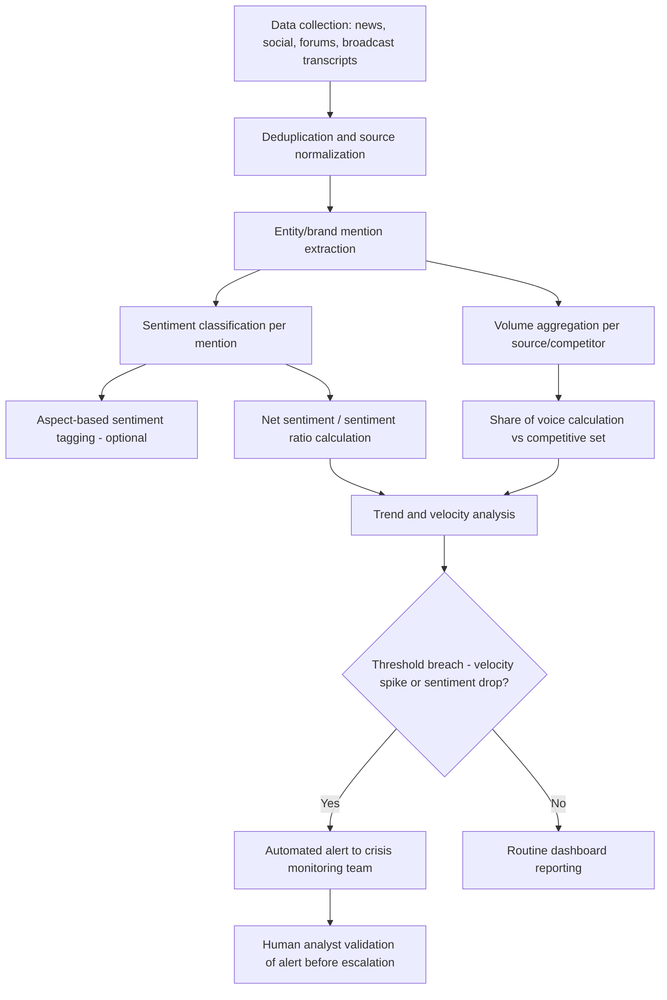

## Media Sentiment and Share of Voice Analysis

### Definition and Scope

Media sentiment and share of voice (SOV) analysis is the quantitative measurement of how an organization is discussed across media and social channels — capturing both the emotional/evaluative tone of coverage (sentiment) and the organization's relative visibility within a topic or competitive conversation (share of voice). Within crisis and reputation management, these metrics function as the primary near-real-time instrumentation layer, providing high-frequency signal where survey-based reputation indices are too slow to be operationally useful during an active crisis.

### Key Points

- **Sentiment measures tone; SOV measures volume/dominance** — the two metrics answer different questions ("how are we being talked about" vs. "how much are we being talked about, relative to others") and must be interpreted jointly, since high negative volume is a materially different situation from low negative volume.
- **Real-time detection function**: A sudden spike in mention velocity combined with negative sentiment shift is one of the most common automated early-warning signals for emerging crises, often preceding traditional press pickup.
- **Sentiment classification is probabilistic, not exact**: Automated sentiment analysis (rule-based or ML-based) produces classification error, particularly with sarcasm, negation, industry jargon, and mixed-sentiment statements; accuracy claims should be treated as approximate.
- **Share of voice requires a defined competitive/topic set**: SOV is meaningless without an explicit denominator (competitor set, industry conversation, or defined topic universe) against which the organization's mention volume is compared.
- **Channel divergence is common and diagnostically useful**: Sentiment and volume often diverge across channels (e.g., negative on social media, still neutral in traditional press) in the early hours of a crisis; this divergence is itself an indicator of a crisis's likely trajectory and audience.
- **Aggregate scores can mask segment severity**: A moderately negative blended sentiment score can conceal a severely negative sentiment concentration within one influential sub-audience (e.g., journalists, industry analysts, or a specific demographic).

### Core Metrics and Formulas

**1. Net Sentiment Score**

The most common baseline sentiment metric, expressed as a normalized score from classified mention counts:

$$\text{Net Sentiment} = \frac{P - N}{P + N + U} \times 100$$

where $P$ = positive mentions, $N$ = negative mentions, $U$ = neutral/unclassified mentions. Values range from $-100$ (entirely negative) to $+100$ (entirely positive).

**2. Sentiment Ratio**

A simpler positive-to-negative comparison, useful for trend-line tracking:

$$\text{Sentiment Ratio} = \frac{P}{N}$$

A ratio below 1 indicates negative mentions outnumber positive; crisis monitoring dashboards commonly flag threshold crossings (e.g., ratio dropping below 0.5) as an alert trigger.

**3. Share of Voice**

$$\text{SOV}_{org} = \frac{\text{Mentions}_{org}}{\sum_{i=1}^{n} \text{Mentions}_i} \times 100$$

where the denominator sums mentions across the organization and its defined competitive set ($i = 1$ to $n$).

**4. Share of Negative Voice (crisis-specific variant)**

A more diagnostic crisis metric isolating negative-mention dominance specifically:

$$\text{SONV}_{org} = \frac{\text{Negative Mentions}_{org}}{\sum_{i=1}^{n} \text{Negative Mentions}_i} \times 100$$

[Inference] Share of Negative Voice is a less standardized, less universally-named metric than SOV or net sentiment, but the underlying calculation is a straightforward variant commonly constructed by crisis monitoring teams even where it lacks a single agreed-upon industry label.

**5. Mention Velocity**

$$V = \frac{\Delta \text{Mentions}}{\Delta t}$$

Rate of change in mention volume over a time window, used as an early-detection trigger rather than a steady-state descriptive metric. A velocity spike exceeding a pre-defined multiple of baseline (e.g., 5x normal hourly volume) is a common automated crisis-alert threshold.

### Sentiment Analysis Methodology

**Rule-based (lexicon) approach**

- Uses pre-built sentiment dictionaries scoring individual words/phrases (positive, negative, intensity weighting)
- Fast, interpretable, but weak on context, sarcasm, negation ("not bad" scored incorrectly without negation handling), and domain-specific jargon
- [Inference] Lexicon-based approaches remain in use primarily for their speed and transparency in dashboard tooling, but are increasingly supplemented or replaced by ML-based classification for accuracy-sensitive applications.

**Machine learning classification approach**

- Supervised classifiers (traditional ML: Naive Bayes, SVM, logistic regression on TF-IDF features; or fine-tuned transformer-based language models) trained on labeled sentiment datasets
- Higher accuracy on context and domain-specific nuance when trained on relevant labeled data, but requires labeled training data representative of the specific domain and language register
- Transformer-based models (BERT-family and similar architectures) are commonly used in current commercial social listening tools for improved contextual understanding

**Aspect-based sentiment analysis (ABSA)**

- Decomposes sentiment by specific aspect/topic within a single mention rather than assigning one overall sentiment score (e.g., "the CEO's apology was clear [positive] but the compensation offer is inadequate [negative]" — two different aspect sentiments within one text)
- Particularly useful in crisis contexts where a single statement or article often contains mixed sentiment toward different elements (leadership response, company culpability, affected parties)

### Media Sentiment and SOV Analysis Pipeline

### Human Validation Layer

Automated sentiment and SOV tooling is standardly paired with human analyst review, particularly at two points:

- **Alert validation**: confirming an automated velocity/sentiment threshold breach reflects a genuine emerging issue rather than noise (bot activity, unrelated homonym mentions, satire misclassified as genuine criticism)
- **Sampling audits**: periodic manual review of a random sample of automatically classified mentions to estimate current classifier accuracy/error rate for the specific topic and time period

[Inference] The specific error rate of any given sentiment classification tool is highly dependent on language, domain, and text type (short social posts vs. long-form articles), so any general accuracy percentage claimed for sentiment tools should be treated as vendor- and context-specific rather than a fixed, universal benchmark.

### Comparative Table: Sentiment Analysis Methods

| Method | Speed | Context Sensitivity | Setup Cost | Typical Use Case |
| --- | --- | --- | --- | --- |
| Lexicon/rule-based | Very fast | Low | Low | Real-time dashboards, high-volume triage |
| Traditional ML (SVM, Naive Bayes) | Fast | Moderate | Moderate (requires labeled data) | Domain-tuned classification at scale |
| Transformer-based (fine-tuned) | Moderate | High | High (compute + labeled data) | High-stakes accuracy-critical crisis monitoring |
| Aspect-based sentiment analysis | Slower | Very high (per-aspect) | High | Detailed post-crisis message effectiveness analysis |
| Human coding | Slowest | Highest | Highest (labor) | Validation sampling, nuanced/ambiguous cases |

### Worked Example

**Scenario**: A retail company experiences a data breach disclosure. The crisis monitoring team tracks the following over 72 hours:

| Time | Mention Volume | Net Sentiment | SOV vs. 3 named competitors |
| --- | --- | --- | --- |
| T+0h (disclosure) | Baseline x1 | +10 | 15% |
| T+4h | Baseline x8 (velocity spike) | -35 | 62% |
| T+24h | Baseline x5 | -42 | 55% |
| T+48h | Baseline x3 | -28 | 40% |
| T+72h | Baseline x1.5 | -15 | 25% |

**Interpretation**:

- The velocity spike at T+4h (8x baseline) combined with the sharp sentiment drop (+10 to -35) constitutes a clear automated alert trigger requiring immediate escalation.
- SOV rising to 62% at T+4h indicates the company is dominating the competitive conversation — a diagnostic sign that public attention is concentrated on this organization specifically, not diffused across the industry, increasing reputational stakes.
- The gradual decline in both volume and negative sentiment intensity from T+24h onward suggests the crisis communication response (assumed deployed between T+4h and T+24h) is beginning to have an attenuating effect, though [Inference] confirming causal attribution to the specific communication response, as opposed to natural news-cycle decay, would require comparison against a counterfactual or similar historical crisis baseline rather than trend observation alone.
- SOV returning toward the T+0h baseline (25% vs. original 15%, not fully reverted) by T+72h suggests residual elevated attention rather than full return to pre-crisis conversational share.

### Common Pitfalls

| Pitfall | Description | Mitigation |
| --- | --- | --- |
| Treating sentiment and volume as interchangeable | Missing that low-volume negative sentiment and high-volume negative sentiment represent very different risk levels | Always report sentiment and volume/SOV jointly, never sentiment alone |
| Undefined competitive set | SOV calculated without a clear, consistent denominator | Fix and document the competitive/topic set before crisis; keep it stable for trend comparability |
| Ignoring channel divergence | Treating blended cross-channel sentiment as uniform | Break out sentiment by channel type (social, traditional media, forums) given differing audience and amplification dynamics |
| Bot/inauthentic activity inflation | Automated or coordinated inauthentic posting inflating volume and skewing sentiment | Apply bot-detection filtering before aggregation; flag anomalous posting patterns |
| Static baseline assumption | Using an outdated "normal" volume/sentiment baseline that no longer reflects current organizational visibility | Regularly refresh baseline calculation windows (e.g., rolling 90-day average) |
| Over-reliance on automated classification without validation | Escalation decisions made purely on unvalidated automated sentiment scores | Maintain human validation step before major escalation or public response decisions |

### Related Topics

- Reputation Metrics and Index Models (related chapter item)
- Social listening tool architecture and data source integration
- Crisis early-warning systems and alert threshold design
- Aspect-based sentiment analysis techniques
- Bot detection and inauthentic amplification analysis
- Event-study methodology linking media sentiment to financial market impact
- Crisis dashboard design for real-time decision support
- Post-crisis message effectiveness analysis