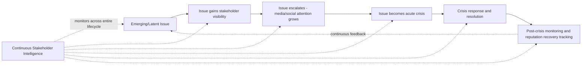
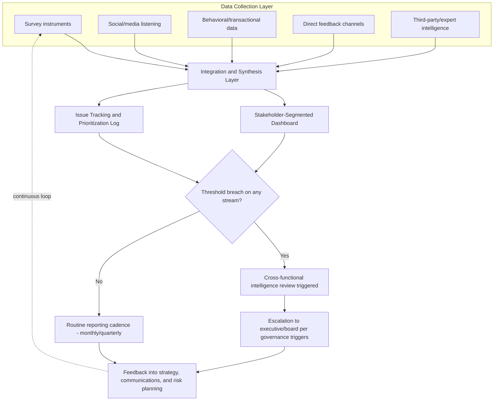

## Stakeholder Intelligence and Continuous Measurement

### Definition and Scope

Stakeholder intelligence and continuous measurement refers to the ongoing, systematic collection, analysis, and synthesis of data about stakeholder attitudes, concerns, and behaviors — sustained as a standing organizational capability rather than activated only during active crises. It integrates multiple measurement streams (survey-based reputation indices, media/social sentiment, behavioral data, direct stakeholder feedback channels) into a unified intelligence function that informs both crisis anticipation (early warning) and crisis response calibration (real-time adjustment).

This differs from the individual metric domains covered elsewhere (reputation indices, media sentiment/SOV) primarily in its emphasis on **continuity and integration**: a standing intelligence function versus discrete measurement tools, and a synthesized cross-stakeholder view versus single-metric tracking.

### Key Points

- **Continuous, not episodic**: The defining feature is always-on measurement infrastructure that operates identically before, during, and after a crisis, rather than a capability stood up reactively once a crisis begins.
- **Stakeholder segmentation is foundational**: Different stakeholder groups (employees, customers, investors, regulators, media, communities, suppliers) have materially different concerns, information needs, and influence patterns; a unified "stakeholder sentiment" number obscures more than it reveals.
- **Multi-source triangulation**: No single data source (survey, social listening, behavioral data) is treated as sufficient alone; continuous measurement programs deliberately combine sources with different strengths and blind spots.
- **Early warning function**: A primary organizational value of continuous stakeholder intelligence is detecting emerging issues before they escalate into full crises — sometimes termed "issues management" as a distinct but closely related discipline.
- **Feedback loop into strategy**: Intelligence outputs are meant to inform not only crisis response but ongoing strategic and communications decisions, closing the loop between measurement and action.
- **Governance and resourcing implications**: Sustaining continuous measurement requires standing budget, tooling, and cross-functional coordination (communications, investor relations, HR, customer experience, risk/legal) — a structural commitment distinct from ad hoc crisis measurement.

### Conceptual Model: From Issues to Crisis

Continuous stakeholder intelligence is closely linked to **issues management** theory, which frames crises as often preceded by a detectable "issue" life cycle:

[Inference] The premise that most crises are preceded by a detectable earlier-stage "issue" is a widely-cited organizing assumption in issues management literature, but not every crisis follows this pattern — sudden accidents or externally-imposed shocks (natural disasters, third-party attacks) may present with little or no detectable precursor signal, meaning continuous intelligence functions as risk-reduction rather than a guarantee of advance warning.

### Stakeholder Segmentation Framework

| Stakeholder Group | Primary Concerns | Key Measurement Channels |
| --- | --- | --- |
| Employees | Job security, leadership trust, workplace safety, organizational values alignment | Internal pulse surveys, engagement platforms, exit interview data, internal social/collaboration tool sentiment |
| Customers | Product/service reliability, value, ethical behavior, data/safety trust | NPS, CSAT, customer service ticket sentiment, social media mentions, churn data |
| Investors/Shareholders | Financial performance, governance quality, risk management credibility | Analyst commentary, institutional ownership shifts, proxy advisor reports, earnings call sentiment |
| Regulators | Compliance posture, transparency, cooperation history | Regulatory filing history, enforcement action tracking, direct regulatory correspondence patterns |
| Media/Journalists | Newsworthiness, access, perceived credibility of company communications | Media relationship tracking, response rate/quality logs, coverage tone over time |
| Communities | Local operational impact, environmental/social footprint, local employment | Community forum monitoring, local media coverage, direct community liaison feedback |
| Suppliers/Partners | Contract stability, reputational association risk, payment reliability | Partner satisfaction surveys, contract renewal/attrition rates |

[Inference] The relative priority weighting across these stakeholder groups is organization- and industry-specific (e.g., a consumer retail brand typically weights customer and media sentiment more heavily than a B2B industrial firm, which may weight regulator and partner intelligence more heavily); no universal weighting scheme applies across all organizations.

### Core Components of a Continuous Measurement Program

**1. Data source architecture**

A mature program typically integrates:

- **Survey-based instruments**: recurring (quarterly/annual) reputation index tracking, employee pulse surveys, customer satisfaction surveys
- **Digital listening**: social media monitoring, news media monitoring, review platform tracking, forum/community monitoring
- **Behavioral/transactional data**: customer churn, employee attrition, applicant volume, purchase/renewal patterns
- **Direct feedback channels**: customer service contact analysis, whistleblower/ethics hotline trend data (aggregated and anonymized), town hall/focus group input
- **Third-party and expert intelligence**: analyst reports, regulatory intelligence, competitive benchmarking, NGO/advocacy group monitoring where relevant to the sector

**2. Integration and synthesis layer**

- Cross-source dashboard consolidating disparate metrics into a coherent view, typically segmented by stakeholder group rather than presented as one blended score
- Defined escalation thresholds per data stream (e.g., employee engagement survey score drop exceeding X points, social sentiment velocity spike, regulatory inquiry frequency increase) feeding into a unified alerting process
- Regular (e.g., monthly or quarterly) cross-functional intelligence review bringing together communications, HR, investor relations, legal/risk, and customer experience functions to synthesize signals across silos

**3. Issue identification and prioritization**

- Systematic issue-tracking log capturing emerging concerns before they reach crisis intensity, often scored on a likelihood/impact matrix
- Horizon scanning: monitoring adjacent industries, regulatory trends, and social/political developments that could create emergent stakeholder concern even absent a direct organizational trigger

**4. Feedback into decision-making**

- Routing intelligence outputs to relevant decision-makers (board risk committee, executive team, communications leadership) on a defined cadence, not only during active crises
- Using continuous measurement baselines as the reference point for crisis-impact quantification (see Reputation Metrics and Index Models for baseline-dependency detail)

### Continuous Measurement Program Architecture

### Distinguishing Continuous Intelligence from Crisis-Only Measurement

| Dimension | Continuous Stakeholder Intelligence | Crisis-Only Measurement |
| --- | --- | --- |
| Timing | Always-on, standing capability | Activated reactively once crisis begins |
| Baseline availability | Established, enabling accurate impact quantification | Absent or reconstructed retroactively, weakening impact analysis |
| Scope | Cross-stakeholder, multi-source | Often narrowly focused on media/social sentiment only |
| Organizational function | Standing cross-functional team with defined governance | Ad hoc task force assembled during crisis |
| Primary value | Early warning + accurate recovery tracking | Damage assessment only, after the fact |
| Resourcing | Ongoing budget and tooling commitment | Emergency/one-off resource allocation |

### Worked Example

**Scenario**: A healthcare company operates a continuous stakeholder intelligence program. Over several months, the following signals accumulate:

1. Employee pulse survey shows a gradual 8-point decline in "trust in leadership" sub-score over two quarters, concentrated in a specific business unit.
2. Customer service ticket sentiment analysis shows rising complaint volume about a specific product line, still below crisis-alert thresholds.
3. Regulatory intelligence monitoring flags an uptick in industry-wide regulatory inquiries regarding the product category, though the company itself has not yet been contacted.

**Continuous intelligence function response**:

- These three signals, individually below any single-stream escalation threshold, are surfaced together at the monthly cross-functional intelligence review because the issue-tracking log correlates them under a shared "product line X" tag.
- The synthesis reveals a plausible emerging issue: internal leadership concerns in the relevant business unit may correlate with the product quality complaints, occurring against a backdrop of increasing regulatory attention to the category.
- This triggers proactive action (internal investigation, product quality review, and pre-drafted communications contingency) before any external crisis materializes — the intended function of continuous intelligence as distinct from reactive crisis measurement.

[Inference] This scenario illustrates the intended design purpose of cross-source synthesis (catching signals that are sub-threshold individually but meaningful in combination); the extent to which real-world organizational review processes reliably achieve this synthesis, rather than reviewing each stream in isolation, depends heavily on the quality of cross-functional governance and issue-tracking discipline in practice.

### Common Pitfalls

| Pitfall | Description | Mitigation |
| --- | --- | --- |
| Silo measurement | Each function (HR, comms, IR, customer experience) tracks its own metrics without cross-functional synthesis | Establish a regular cross-functional intelligence review with shared issue-tracking |
| Metric proliferation without prioritization | Tracking dozens of metrics with no clear escalation hierarchy | Define a limited set of top-tier threshold metrics per stakeholder group with clear escalation criteria |
| Treating continuous measurement as a crisis-only investment | Program funding/attention drops after a crisis passes, degrading baseline quality over time | Secure standing budget and governance mandate independent of crisis cycles |
| Overweighting the loudest channel | Social media volume dominates attention even when it is not the most consequential stakeholder segment for the organization | Weight channels according to the organization's actual stakeholder priority structure, not raw data volume |
| Ignoring internal stakeholder signals | Focusing intelligence exclusively externally (media, customers) while neglecting employee sentiment as an early indicator | Include employee-facing channels as a first-class, continuously monitored stream |
| Static issue-tracking taxonomy | Issue categories become outdated, causing related signals to be tagged inconsistently and missed in synthesis | Periodically review and refresh issue taxonomy and tagging conventions |

### Related Topics

- Reputation Metrics and Index Models (related chapter item)
- Media Sentiment and Share of Voice Analysis (related chapter item)
- Issues management theory and the issue life-cycle model
- Employee engagement measurement and internal communications
- Horizon scanning and emerging risk identification
- Cross-functional crisis governance structures
- Board-Level Crisis Governance (related chapter item)
- Post-crisis reputation recovery tracking methodology