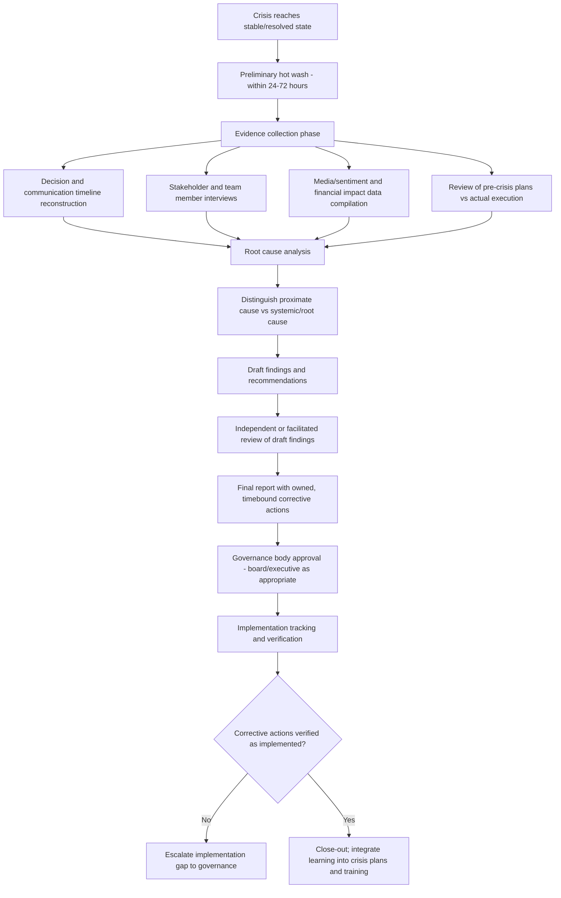

## Post-Crisis Audits and After-Action Reviews

### Definition and Scope

Post-crisis audits and after-action reviews (AARs) are structured, systematic evaluations conducted after a crisis has been resolved (or reached a stable state) to assess the effectiveness of the response, identify root causes, and generate actionable organizational learning. They constitute the final phase of the crisis management lifecycle, closing the loop between crisis response execution and future preparedness improvement.

This domain is distinguished from real-time crisis measurement (media sentiment, SOV, reputation index tracking) by its retrospective, diagnostic, and organizational-learning orientation: the goal is not tracking ongoing impact but understanding what happened, why, and what must change.

### Key Points

- **Distinct from blame attribution**: A well-designed after-action review process is structured to extract systemic and process learning, not to assign individual fault — conflating the two typically suppresses honest disclosure of what actually went wrong.
- **Timing matters**: AARs are most effective when conducted close enough to the event that details are fresh, but after the acute response phase has concluded enough that participants can reflect rather than remain in reactive mode; a common practice is a preliminary "hot wash" immediately post-crisis followed by a fuller formal review weeks later.
- **Multi-source evidence base**: Rigorous reviews draw on decision logs, communications timelines, media/sentiment data, financial impact data, and structured stakeholder interviews — not solely leadership's retrospective narrative, which is subject to hindsight bias and self-serving recall.
- **Root cause analysis is central**: The review must distinguish proximate triggers from underlying systemic causes (e.g., a specific product defect vs. an underlying quality-control governance gap that allowed it to reach market).
- **Actionable output is the success criterion**: An AAR that produces a report without specific, owned, tracked corrective actions is generally considered to have failed its core purpose, regardless of analytical quality.
- **Independence and psychological safety**: The credibility and honesty of findings depend heavily on participants believing the process will not be used punitively against them, and often benefit from independent facilitation rather than being run entirely by those who managed the crisis.

### Theoretical and Methodological Foundations

**Military/emergency management origin**: The after-action review format originates substantially from military and emergency management practice, structured around four core questions:

1. What was supposed to happen?
2. What actually happened?
3. Why was there a difference (if any)?
4. What can be learned and improved?

**Root Cause Analysis (RCA) techniques** commonly imported into crisis post-mortems:

- **The "5 Whys"**: iteratively asking "why" to a stated problem to move from symptom to systemic cause
- **Fishbone/Ishikawa diagram**: categorizing potential contributing causes across dimensions (people, process, technology, external factors) to map a comprehensive causal landscape rather than fixating on a single cause
- **Fault tree analysis**: more formal, logic-gate-based causal mapping, more common in engineering/safety-critical industries than general corporate crisis review, but increasingly borrowed for high-severity incidents

**Organizational learning theory** (drawing on figures such as Argyris and Schön) distinguishes:

- *Single-loop learning*: correcting the specific error without questioning underlying assumptions or systems (e.g., disciplining an individual employee)
- *Double-loop learning*: questioning and revising the underlying governing assumptions, policies, or systems that allowed the error to occur (e.g., redesigning the escalation policy that failed to surface the risk earlier)

[Inference] Post-crisis reviews that remain at the single-loop level (individual accountability only) are widely regarded in organizational learning literature as producing weaker long-term risk reduction than those that achieve double-loop learning, though achieving genuine double-loop learning is harder and less common in practice because it requires questioning leadership's own prior decisions and assumptions.

### The After-Action Review Process

### Core Components of a Rigorous Review

**1. Timeline reconstruction**

- Chronological documentation of key decisions, communications sent/received, and external developments, cross-referenced against multiple sources (internal logs, email/message records, media coverage timestamps, social sentiment shifts)
- Comparison against the pre-existing crisis plan (where one existed) to identify deviation points and whether deviations were justified adaptations or process failures

**2. Structured interviews**

- Conducted with crisis team members, affected employees, and where feasible external stakeholders (customers, regulators) to capture perspectives the internal record does not show
- Best practice generally favors interviews conducted or facilitated by a party perceived as independent from the crisis decision-making chain, to reduce self-protective framing and encourage candor
- [Inference] The specific interview protocols and psychological-safety framing used vary considerably by organization and consulting practice; there is no single universally standardized interview instrument for crisis AARs comparable to, for example, a validated psychometric survey.

**3. Root cause and contributing factor analysis**

- Application of structured techniques (5 Whys, fishbone diagram) to move beyond the immediate trigger event to systemic contributing factors
- Explicit examination of whether pre-crisis warning signs existed and, if so, why they were not acted upon (linking to issues management and continuous stakeholder intelligence gaps, where relevant)

**4. Performance evaluation against crisis plan and values**

- Assessment of whether the response adhered to the organization's documented crisis plan and stated values (see Values-Based and Ethical Leadership in Crisis)
- Evaluation of communication effectiveness: response speed, message consistency, accountability language quality, and channel appropriateness

**5. Corrective action development and ownership**

- Recommendations translated into specific, assigned, time-bound action items — not general statements of intent
- Categorization of recommendations by type: policy/process change, training, resourcing/staffing, technology/tooling, governance structure change

**6. Reporting and governance approval**

- Findings presented to appropriate governance level (executive team, board risk/audit committee) depending on crisis severity, per pre-defined escalation thresholds (see Board-Level Crisis Governance)
- Consideration of what findings, if any, require external disclosure (regulatory, investor, public) versus internal-only distribution

### After-Action Review Report Structure (Representative Template)

| Section | Content |
| --- | --- |
| Executive Summary | Crisis overview, severity classification, headline findings and recommendations |
| Timeline | Chronological reconstruction of key events, decisions, and communications |
| What Went Well | Explicit documentation of effective elements, to preserve and reinforce them going forward |
| What Went Wrong / Gaps | Systematic gap analysis against the crisis plan and stated values |
| Root Cause Analysis | Proximate cause(s) and underlying systemic cause(s), using structured RCA methodology |
| Stakeholder Impact Summary | Reputation metric, financial, employee, and customer impact data compiled from measurement sources |
| Recommendations | Specific, owned, time-bound corrective actions, categorized by type |
| Implementation Tracking Plan | Responsible owners, deadlines, and verification method for each recommendation |

[Inference] Including an explicit "What Went Well" section is a widely-recommended practice in after-action review methodology (both military-derived and corporate adaptations) because it reduces the perception that the review is purely punitive, which in turn supports more candid disclosure of what went wrong — though the specific structure and emphasis vary by organizational culture and review facilitator.

### Comparative Table: Review Approaches by Formality

| Approach | Timing | Formality | Typical Use Case |
| --- | --- | --- | --- |
| Hot wash | Within 24–72 hours of crisis stabilization | Low — informal team debrief | Immediate capture of fresh impressions before formal review |
| Internal after-action review | Weeks after crisis | Moderate — structured but internally run | Standard practice for moderate-severity crises |
| Independent/external investigation | Weeks to months after crisis | High — external counsel/investigators, formal findings | High-severity crises, especially those involving potential legal, regulatory, or governance failures |
| Regulatory-mandated review | Timeline set by regulator | Highest — externally imposed scope and standards | Crises triggering regulatory investigation (safety, financial, data protection incidents) |

### Worked Example

**Scenario**: A logistics company experiences a major service outage during peak season, causing significant customer and media backlash. The crisis is resolved within one week.

**AAR process applied**:

1. **Hot wash (48 hours post-resolution)**: crisis team captures immediate impressions — technical root cause understanding is still incomplete, but initial process observations (e.g., "customer communications lagged the technical team's awareness by six hours") are logged while fresh.
2. **Evidence collection (following two weeks)**: timeline reconstructed from system logs, customer service ticket data, social sentiment/SOV data (see related metrics chapters), and internal Slack/communication records; structured interviews conducted with the technical, communications, and customer service teams by an internal audit facilitator perceived as independent of the incident response chain.
3. **Root cause analysis**: 5 Whys applied to the six-hour communication lag reveals proximate cause (no pre-defined trigger for communications team notification below a certain severity threshold) and systemic cause (crisis severity classification system had not been updated since a prior reorganization, leaving unclear ownership of the notification trigger).
4. **Findings**: both a single-loop fix (update the specific notification trigger) and a double-loop finding (crisis severity classification and escalation ownership framework requires a broader redesign, not just a patch) are documented separately.
5. **Recommendations and ownership**: specific action items assigned — e.g., "VP Customer Communications to own redesign of escalation-trigger framework, target completion Q[X]" — with a defined verification checkpoint.
6. **Governance approval**: findings presented to the executive team; given customer and revenue impact severity, a summary is also presented to the board risk committee per pre-defined escalation thresholds.
7. **Close-out**: verified implementation is confirmed three months later via a follow-up audit check, and the case is incorporated into crisis response training materials.

### Common Pitfalls

| Pitfall | Description | Mitigation |
| --- | --- | --- |
| Blame-oriented framing | Review process feels punitive, suppressing honest disclosure | Establish explicit psychological-safety framing and, where feasible, independent facilitation |
| Single-source narrative reliance | Relying solely on crisis-team leadership's retrospective account | Triangulate with logs, communications records, and independent stakeholder interviews |
| Stopping at proximate cause | Fixing the immediate trigger without addressing systemic/root cause | Apply structured RCA methods (5 Whys, fishbone) to reach double-loop findings |
| No implementation tracking | Recommendations documented but never verified as implemented | Assign owners, deadlines, and follow-up verification checkpoints as a mandatory report component |
| Delayed or skipped review | Organization moves on without formal review once acute crisis passes | Institutionalize AAR as a mandatory, triggered process for crises above a defined severity threshold |
| Report shelved without governance visibility | Findings never reach appropriate oversight level | Route findings through pre-defined governance escalation channels matching crisis severity |

### Related Topics

- Board-Level Crisis Governance (related chapter item)
- Values-Based and Ethical Leadership in Crisis (related chapter item)
- Stakeholder Intelligence and Continuous Measurement (related chapter item)
- Root cause analysis techniques (5 Whys, fishbone/Ishikawa diagrams)
- Organizational learning theory: single-loop vs. double-loop learning
- Crisis plan design and pre-crisis preparedness auditing
- Independent investigation scope and privilege considerations
- Reputation Metrics and Index Models (impact quantification input to AARs)