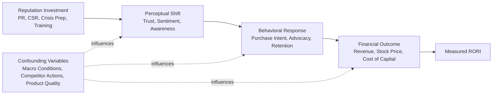
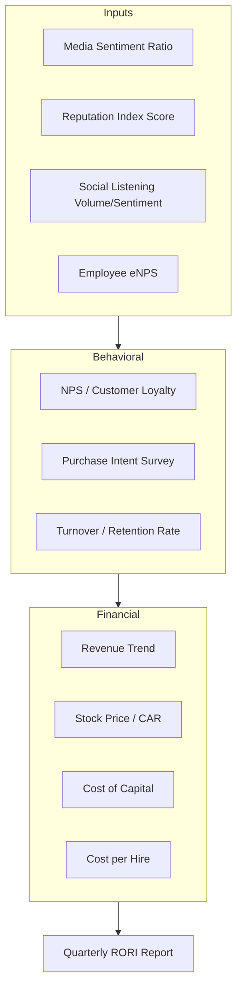

## Measuring Return on Reputation Investment

### Definition and Scope

Return on Reputation Investment (RORI, sometimes styled ROR) is the practice of quantifying the financial and operational value generated by reputation management activities relative to their cost. It extends traditional ROI logic to an intangible asset — corporate reputation — that does not have a single, universally accepted unit of measurement. Reputation investment includes spending on crisis preparedness, public relations, stakeholder engagement, corporate social responsibility (CSR), employer branding, issues management, and communications infrastructure (monitoring tools, agency retainers, training).

The core challenge is causal attribution: reputation sits upstream of many business outcomes (sales, retention, valuation, hiring cost) but rarely acts alone. Measurement frameworks in this space are therefore hybrid — combining hard financial proxies with validated perceptual indices.

### Why Reputation ROI Is Difficult to Measure

- **Intangibility**: Reputation is a perceptual construct held in the minds of stakeholders, not a ledger line item.
- **Time lag**: Reputational damage or gain often manifests financially months or years after the triggering event or investment.
- **Multi-causality**: Stock price, sales, and hiring outcomes are influenced by macroeconomic conditions, competitor actions, and product quality simultaneously with reputation.
- **Stakeholder heterogeneity**: Customers, investors, employees, regulators, and media each hold distinct reputational perceptions that may move independently of one another.
- **Counterfactual absence**: It is rarely possible to observe what would have happened without the reputation investment (no clean control group).

[Inference] Because of these constraints, most practitioner-grade RORI models are best understood as decision-support proxies rather than precise financial instruments, and are typically presented alongside confidence ranges rather than single-point figures.

### Core Formula Structures

**Basic Financial ROI Adaptation**

$$ROI_{reputation} = \frac{(Value\ Attributable\ to\ Reputation - Cost\ of\ Reputation\ Program)}{Cost\ of\ Reputation\ Program} \times 100$$

This requires isolating a "value attributable" figure, which is the hardest input to defend and is usually derived through one of the attribution methods below.

**Reputation Value Contribution (Market-Based)**

A widely cited academic approach (derived from work by Charles Fombrun and reputation economists) treats reputation as a driver of the gap between book value and market capitalization:

$$Reputation\ Premium = Market\ Capitalization - Book\ Value\ of\ Tangible\ \&\ Recognized\ Intangible\ Assets$$

The reputation-attributable share of this premium is then estimated via regression against reputation index scores (e.g., correlating RepTrak or Fortune "Most Admired" scores against premium size across a peer set). [Inference] This method is most defensible at the industry-benchmark level and weakest for single-company, single-event attribution.

**Cost-Avoidance Framing (Crisis Context)**

For crisis and reputation management specifically, ROI is often reframed as *loss avoided* rather than *value created*:

$$ROI_{crisis\ prep} = \frac{Estimated\ Loss\ Avoided - Cost\ of\ Preparedness\ Program}{Cost\ of\ Preparedness\ Program}$$

Estimated loss avoided is typically modeled using comparable-incident benchmarking (see below).

### Input Metrics Feeding RORI Models

**Perceptual / Leading Indicators**

- Reputation index scores (RepTrak Pulse, Axios Harris Poll 100, Fortune's World's Most Admired Companies)
- Net Promoter Score (NPS) and brand favorability trend lines
- Media sentiment ratio (positive:neutral:negative coverage share)
- Share of voice relative to competitors during and after incidents
- Employee engagement / employer brand indices (Glassdoor rating trends, eNPS)
- Social listening sentiment velocity and volume

**Financial / Lagging Indicators**

- Stock price movement and abnormal returns around reputation-relevant events (event study methodology)
- Cost of capital / credit rating shifts
- Customer churn rate and customer lifetime value (CLV) trend
- Sales recovery curve post-incident
- Cost-per-hire and time-to-fill, as proxies for employer reputation
- Insurance premium changes tied to reputational risk classification
- Legal and regulatory settlement costs avoided or incurred

**Operational Indicators**

- Crisis response time (detection-to-first-statement latency)
- Message consistency score across channels
- Stakeholder inquiry volume and resolution time during an incident

### Methodological Approaches to Attribution

**1. Event Study Methodology**

Borrowed from financial economics, this method measures abnormal stock returns in a window around a reputational event (crisis, scandal resolution, award, CSR announcement) against an expected return baseline (typically a market or industry index via CAPM or a market model).

$$AR_{it} = R_{it} - E(R_{it})$$

Where $AR_{it}$ is the abnormal return for firm $i$ at time $t$, $R_{it}$ is the observed return, and $E(R_{it})$ is the expected return predicted by the benchmark model. Cumulative Abnormal Return (CAR) is then summed across the event window to estimate total market-perceived impact.

[Unverified] The precision of event studies depends heavily on window length selection and the absence of confounding news in the same period; practitioners commonly report a range rather than a single CAR figure for this reason.

**2. Comparable Incident Benchmarking**

Used heavily in crisis ROI work: identify structurally similar past incidents (same industry, similar severity, similar response speed) and use their documented financial impact (revenue decline, stock drop, customer attrition) as a benchmark against which the current program's outcome is compared.

**3. Regression / Econometric Modeling**

Multi-variable regression models reputation scores against outcome variables (sales, stock price, employee retention) while controlling for confounders (macroeconomic indicators, product recalls, competitor actions, seasonality). Coefficients on the reputation variable, if statistically significant, provide an estimated marginal value per unit change in reputation score.

$$Y_t = \beta_0 + \beta_1 \cdot Reputation_t + \beta_2 \cdot Controls_t + \epsilon_t$$

**4. Survey-Based Willingness-to-Pay / Willingness-to-Recommend**

Conjoint analysis and willingness-to-pay surveys quantify how much reputation attributes (trust, ethics, quality perception) affect purchase intent or price tolerance, converting perceptual data into a monetizable proxy.

**5. Balanced Scorecard for Reputation**

Rather than forcing a single ROI number, many practitioners (Deloitte, Weber Shandwick, Reputation Institute successors) recommend a scorecard combining leading and lagging indicators across four quadrants: Financial, Customer, Internal Process, and Learning & Growth — adapted from Kaplan and Norton's original Balanced Scorecard framework.

### Reputation Value Chain Model

This chain illustrates why direct correlation between investment (A) and financial outcome (D) is unreliable without controlling for the confounding layer (F); most rigorous measurement approaches instrument each link separately rather than jumping straight from A to D.

### Practical Example: Crisis Preparedness ROI Calculation

**Scenario**: A mid-size retail company invests $250,000 annually in a crisis preparedness program (media training, monitoring software, a retained crisis communications agency, and a dark-site template system).

**Step 1 — Establish the benchmark incident.** A comparable retailer with no crisis preparedness program suffered a data breach that produced a 12% stock price decline sustained over 30 days and a 6% customer attrition rate, translating to an estimated $18M in lost market capitalization and $4.2M in lost annual revenue.

**Step 2 — Model the counterfactual.** Using comparable-incident benchmarking and industry event-study averages, analysts estimate that a company with an active crisis preparedness program experiences approximately 40–60% less severe reputational impact from a similar incident, due to faster response time and pre-approved messaging reducing narrative vacuum. [Inference] This percentage range itself is typically drawn from cross-industry crisis-response research rather than a company-specific measurement, so it functions as a scenario assumption, not an observed result.

**Step 3 — Calculate estimated loss avoided.**

$$Loss\ Avoided = \$4.2M \times 0.50 = \$2.1M\ (revenue)$$

**Step 4 — Compute RORI.**

$$ROI = \frac{\$2.1M - \$250{,}000}{\$250{,}000} \times 100 \approx 740\%$$

**Interpretation**: The program is presented as having paid for itself many times over *if* a comparable incident occurs. This is a contingent, scenario-based ROI, not a guaranteed annual return — it reflects the value of risk mitigation, which only fully materializes if a crisis actually occurs during the measurement period. Some practitioners annualize this by multiplying the avoided-loss figure by the estimated probability of a crisis event occurring in a given year (an expected-value approach) to avoid overstating a single large number as a recurring return.

### Reputation Measurement Dashboard Structure

### Common Pitfalls in Reputation ROI Reporting

- **Cherry-picked windows**: Selecting a favorable measurement period that overstates program impact.
- **Correlation presented as causation**: Reporting reputation score improvement alongside sales growth without controlling for other drivers.
- **Vanity metric substitution**: Using media impressions or social reach as a proxy for financial value without a validated conversion rate.
- **Single-point estimates without confidence ranges**: Presenting a precise ROI percentage (e.g., "312% ROI") without disclosing the assumptions and error margins behind it, which can mislead executive stakeholders. [Inference] This practice is a known criticism in the communications-measurement field (associated with the Barcelona Principles and AMEC's measurement standards), not merely a stylistic issue.
- **Ignoring cost of inaction**: Failing to model the downside scenario (what happens with zero reputation investment) makes any spend look unjustifiable in isolation.

### Standards and Frameworks Referenced in Practice

- **Barcelona Principles 3.0** (AMEC — International Association for the Measurement and Evaluation of Communication): industry-endorsed standards rejecting Advertising Value Equivalency (AVE) as a valid metric and calling for outcome-based measurement.
- **RepTrak Framework** (RepTrak, formerly Reputation Institute): a validated 7-dimension model (Products/Services, Innovation, Workplace, Governance, Citizenship, Leadership, Performance) used to produce a composite reputation score correlated against business outcomes.
- **Integrated Reporting Framework (IIRC/IFRS Foundation)**: encourages disclosure of intangible value drivers, including reputation-adjacent "social and relationship capital," in corporate reporting.

### Related Topics

- Crisis Cost Modeling and Loss Quantification Techniques
- Event Study Methodology in Corporate Communications
- Reputation Index Frameworks (RepTrak, Axios Harris Poll 100)
- Media Sentiment Analysis and Social Listening Tools
- Employer Brand ROI and Cost-per-Hire Impact
- Balanced Scorecard Adaptations for Communications Functions
- AMEC Barcelona Principles and Communications Measurement Standards
- Building a Crisis Preparedness Budget Justification