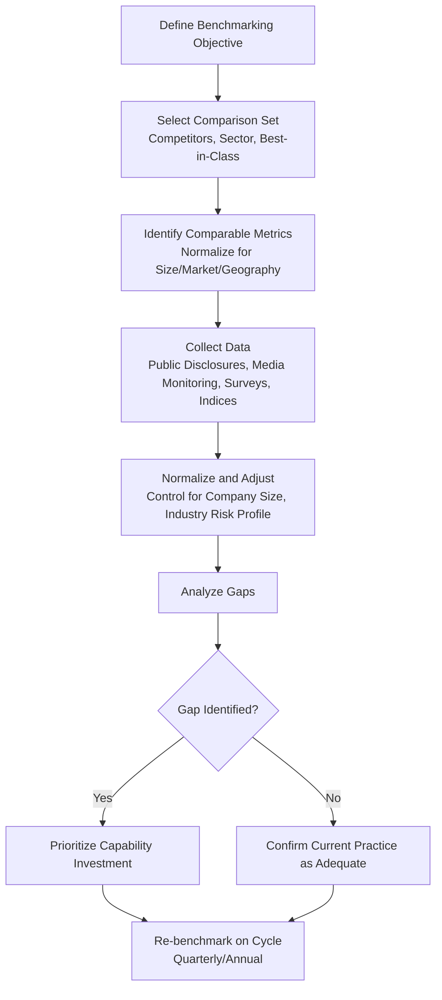

## Benchmarking Against Peers and Industry Norms

### Definition and Scope

Benchmarking against peers and industry norms is the systematic comparison of an organization's reputation-related metrics, crisis response capabilities, and communication performance against a defined set of comparable organizations (competitors, sector peers) or established industry-wide standards. In a crisis and reputation management context, benchmarking serves two functions: (1) contextualizing raw performance data so it is interpretable ("is a 15% negative sentiment share good or bad?"), and (2) identifying capability gaps relative to best-in-class practice before a crisis occurs.

Benchmarking is distinct from general performance measurement in that its output is always relative, not absolute — a metric only becomes meaningful once positioned against a comparison set.

### Why Benchmarking Matters in Reputation Management

- **Contextualizes isolated metrics**: A reputation score, sentiment ratio, or response time has no inherent meaning without a reference point.
- **Reveals blind spots**: Organizations often overestimate their crisis readiness relative to actual industry practice; benchmarking surfaces this gap.
- **Supports resource allocation arguments**: Comparative underperformance is a more persuasive basis for budget requests than internal trend data alone.
- **Informs risk exposure assessment**: Peer incident analysis reveals which crisis types are most common and costly in a given sector, guiding preparedness prioritization.
- **Sets realistic recovery targets**: Post-crisis recovery timelines are better calibrated using comparable-incident data than internal assumption.

### Types of Benchmarking

**1. Competitive Benchmarking**

Direct comparison against named competitors operating in the same market and facing similar stakeholder expectations. Typically covers reputation index scores, media share of voice, sentiment ratios, and social engagement rates.

**2. Industry/Sector Benchmarking**

Comparison against aggregated norms for an entire industry (e.g., "average crisis response time in the airline industry is X hours"), often sourced from industry associations, research firms, or measurement consultancies (AMEC, PRWeek, Institute for Public Relations).

**3. Best-in-Class (Aspirational) Benchmarking**

Comparison against organizations recognized as leaders in crisis management or reputation performance, regardless of industry — used to identify transferable practices rather than direct competitive positioning.

**4. Historical/Longitudinal Self-Benchmarking**

Comparison of an organization's current metrics against its own historical baseline, used to track trend direction independent of peer movement. [Inference] While technically a form of internal tracking rather than external benchmarking, it is commonly included in benchmarking programs as a control against market-wide sentiment shifts that could otherwise be misread as company-specific.

**5. Cross-Industry Functional Benchmarking**

Comparison of a specific process (e.g., time-to-first-statement during a crisis) against organizations in unrelated industries known for excellence in that specific function.

### Core Metrics Used in Benchmarking

**Reputation and Perception Metrics**

- Composite reputation index score (RepTrak Pulse, Axios Harris Poll 100, Fortune World's Most Admired Companies) and percentile ranking within sector
- Net sentiment ratio (positive minus negative share of media/social mentions)
- Share of voice (SOV) relative to competitor set
- Trust index scores from sector-specific surveys (e.g., Edelman Trust Barometer sector breakdowns)

**Crisis Response Metrics**

- Time-to-first-statement (detection to initial public response)
- Time-to-resolution (incident onset to sentiment normalization)
- Message consistency score across spokespersons and channels
- Stakeholder inquiry response time (customer service, media, regulator)

**Financial and Operational Proxies**

- Stock price recovery time post-incident (days to return to pre-incident baseline)
- Customer attrition rate following comparable incidents
- Employee turnover rate during/after reputational events
- Cost of crisis response as a percentage of revenue

**Digital and Media Metrics**

- Search interest volume/trend during and after incidents (relative search index)
- Owned-channel engagement rate versus sector average
- Earned media pickup rate and tone distribution

### Benchmarking Process Model

### Data Sources for Benchmarking

- **Reputation indices**: RepTrak, Axios Harris Poll 100, Fortune's World's Most Admired Companies, Corporate Reputation studies by regional bodies
- **Trust barometers**: Edelman Trust Barometer (annual, with sector-specific cuts)
- **Media monitoring platforms**: Meltwater, Cision, Brandwatch, Talkwalker — used to generate share-of-voice and sentiment comparisons against a defined competitor set
- **Financial disclosures**: 10-K/annual report risk factor sections, investor relations materials, and earnings call transcripts of peer companies, useful for understanding how competitors frame reputational risk
- **Industry associations and research bodies**: PRWeek, Institute for Public Relations (IPR), AMEC benchmarking studies, sector-specific trade associations
- **Case study databases and academic incident archives**: used for comparable-incident analysis in crisis-specific benchmarking
- **Employer review platforms**: Glassdoor, LinkedIn Talent Insights — for employer reputation benchmarking

[Unverified] Access to granular peer crisis-response timing data (e.g., exact time-to-first-statement) is rarely disclosed publicly by companies; most such benchmarks in practice are reconstructed from media timestamps and public statement archives rather than sourced directly from the peer organization, which introduces measurement uncertainty.

### Normalization Considerations

Raw comparison across organizations is often misleading without adjustment for:

- **Company size** (revenue, employee count, market capitalization) — larger organizations generally generate proportionally more media volume regardless of sentiment
- **Geographic footprint** — multinational versus single-market organizations face different media ecosystems
- **Industry risk baseline** — some sectors (e.g., oil and gas, pharmaceuticals) carry structurally higher negative sentiment baselines than others (e.g., consumer packaged goods), independent of management quality
- **Regulatory environment** — heavily regulated industries face different disclosure obligations that affect crisis timeline benchmarks
- **Public visibility/brand recognition** — highly visible consumer brands attract disproportionate media attention relative to B2B peers of similar size

A common normalization approach is to express metrics as **z-scores** relative to the peer set mean, rather than comparing raw values:

$$z_i = \frac{x_i - \mu_{peer\ set}}{\sigma_{peer\ set}}$$

Where $x_i$ is the organization's raw metric value, $\mu_{peer\ set}$ is the peer group mean, and $\sigma_{peer\ set}$ is the peer group standard deviation. This allows an organization to see how many standard deviations above or below the peer norm its performance falls, correcting for differences in group variance across metrics.

### Practical Example: Crisis Response Time Benchmarking

**Scenario**: A regional airline wants to benchmark its time-to-first-statement performance against sector peers following service disruption incidents.

**Step 1 — Define the comparison set.** Five regional airlines of similar fleet size and market scope are selected, plus two "best-in-class" global carriers recognized for crisis communication.

**Step 2 — Collect comparable incident data.** Using media monitoring archives and public statement timestamps, response times are reconstructed for a comparable disruption event (weather-related mass cancellation) at each peer airline over the past 24 months.

| Airline | Time-to-First-Statement | Sentiment Recovery (days) |
| --- | --- | --- |
| Subject Airline | 5.2 hours | 9 |
| Peer A | 3.1 hours | 6 |
| Peer B | 6.8 hours | 12 |
| Peer C | 2.4 hours | 5 |
| Best-in-Class (Global) | 1.5 hours | 4 |

**Step 3 — Normalize and interpret.** The subject airline's response time (5.2 hours) sits above the regional peer median (~4.5 hours) and well above best-in-class performance (1.5 hours), positioning it in a below-median percentile for this specific capability.

**Step 4 — Translate into action.** The gap between subject airline performance and best-in-class (3.7-hour differential) becomes the basis for a specific investment case: pre-drafted holding statements, delegated spokesperson authority during off-hours, and an escalation protocol redesign — each targeted at closing a measured, benchmarked gap rather than a generic "improve crisis response" objective.

### Common Pitfalls in Benchmarking

- **Comparing unlike organizations**: Benchmarking against peers with materially different size, risk profile, or regulatory context without normalization produces misleading conclusions.
- **Survivorship bias in best-in-class selection**: Organizations held up as crisis management exemplars are often selected retrospectively based on one successful outcome, which may not reflect a repeatable process.
- **Static benchmarking**: Treating a single benchmarking exercise as permanent rather than re-running it on a defined cycle, causing drift as peer practices evolve.
- **Metric availability bias**: Over-relying on publicly available metrics (media sentiment, stock price) while under-weighting harder-to-obtain but more diagnostic metrics (internal response time, message consistency).
- **Ignoring context-specific severity**: Comparing response performance across incidents of different actual severity without controlling for the scale of the underlying event.

### Related Topics

- Reputation Index Frameworks (RepTrak, Edelman Trust Barometer, Axios Harris Poll 100)
- Comparable Incident Analysis for Crisis Cost Modeling
- Media Share of Voice and Sentiment Analysis Methodology
- Setting Crisis Response KPIs and Service-Level Targets
- Measuring Return on Reputation Investment
- Competitive Intelligence in Corporate Communications
- Post-Crisis Recovery Timeline Modeling