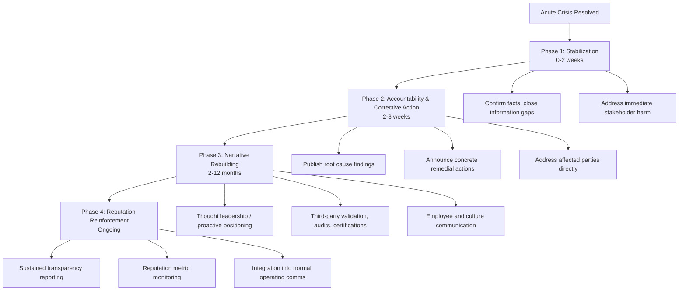

## Post-Crisis Communication Strategy

### Definition and Scope

Post-crisis communication strategy encompasses the deliberate, phased communication activities an organization undertakes after the acute phase of a crisis has passed, aimed at restoring stakeholder trust, demonstrating accountability, and repositioning the organization's narrative for long-term reputation recovery. It is distinct from crisis response communication (which occurs during the acute incident) in that it operates on a longer timescale, addresses underlying causes rather than immediate facts, and is oriented toward rebuilding relationships rather than containing damage.

This phase typically begins once the immediate operational threat has been resolved (the fire is out, the product is recalled, the breach is contained) and extends until reputation metrics return to, or stabilize at, an acceptable baseline — a period that can range from weeks to several years depending on severity.

### Objectives of Post-Crisis Communication

- **Demonstrate accountability**: Show that the organization has acknowledged fault where appropriate and taken concrete corrective action, not merely issued an apology.
- **Rebuild stakeholder trust incrementally**: Trust is rebuilt through consistent, verifiable behavior over time rather than through a single communication event.
- **Reassert organizational narrative control**: Shift media and public discourse away from the crisis framing toward forward-looking themes (reform, investment, renewed commitment).
- **Prevent recurrence perception**: Communicate structural changes that make stakeholders believe the same failure cannot easily happen again.
- **Support internal morale and retention**: Employees are a critical stakeholder audience whose confidence affects operational recovery and talent retention.
- **Protect long-term financial metrics**: Support recovery of stock price, customer retention, and cost of capital by demonstrating credible, monitorable progress.

### Theoretical Foundations

**Situational Crisis Communication Theory (SCCT)** (William Benoit, Timothy Coombs): Post-crisis strategy selection should match the assessed level of organizational responsibility for the crisis (victim, accidental, or preventable cluster). Higher attributed responsibility requires more accommodative post-crisis strategies (compensation, corrective action, apology) rather than purely defensive ones (denial, minimization), which become reputationally counterproductive once responsibility is publicly established.

**Image Repair Theory** (William Benoit): Identifies five broad post-crisis response strategies — denial, evasion of responsibility, reducing offensiveness, corrective action, and mortification (full apology/acceptance of responsibility) — with corrective action and mortification generally producing the most durable reputational recovery when responsibility is clear.

**Stakeholder Theory Application**: Post-crisis communication must be sequenced and tailored across distinct stakeholder groups (customers, employees, investors, regulators, media, communities) whose information needs, trust deficits, and preferred channels differ substantially.

[Inference] Because these frameworks originate primarily from communication and management academic literature rather than a single unified industry standard, practitioners commonly blend elements of SCCT and Image Repair Theory rather than applying either in strict isolation.

### Phased Post-Crisis Communication Model

**Phase 1 — Stabilization**: Focuses on closing remaining information gaps, correcting misinformation that circulated during the acute phase, and addressing any unresolved harm to directly affected stakeholders (compensation, remediation, direct outreach).

**Phase 2 — Accountability and Corrective Action**: The organization publicly communicates the findings of any internal or third-party investigation, states specific remedial measures being implemented (policy changes, personnel actions, system upgrades), and directly acknowledges impacted parties. This phase carries the highest reputational leverage — vague or delayed accountability communication at this stage is strongly associated with prolonged recovery timelines. [Unverified] Exact timelines vary substantially by industry, jurisdiction, and severity, and organizations should treat the 2–8 week window as an illustrative reference rather than a fixed rule.

**Phase 3 — Narrative Rebuilding**: The organization begins shifting from reactive to proactive communication — highlighting positive developments, engaging in thought leadership, seeking third-party validation (independent audits, certifications, awards), and re-engaging previously disrupted stakeholder relationships (customers, investors, partners).

**Phase 4 — Reputation Reinforcement**: Longer-term integration of transparency practices into standard operating communication (e.g., regular safety reporting, sustainability disclosures) that were catalyzed by the crisis, converting a one-time recovery effort into an ongoing credibility-building practice.

### Core Tactical Components

**Message Architecture**

- **Acknowledgment statement**: Clear, unambiguous recognition of what occurred and its impact, avoiding conditional or passive-voice framing that can appear evasive (e.g., "mistakes were made" versus "we made a mistake").
- **Root cause explanation**: Factual, non-defensive explanation of what caused the failure, calibrated to avoid appearing to shift blame.
- **Corrective action commitment**: Specific, measurable, and time-bound commitments rather than vague assurances ("we will conduct quarterly third-party safety audits beginning Q1" versus "we take this very seriously").
- **Forward-looking vision**: Reconnecting the corrective narrative to organizational values and future direction, giving stakeholders a reason to re-engage rather than merely tolerating continued relationship.

**Channel Strategy**

- **Owned channels** (website statements, investor relations pages, employee intranet): primary vehicle for detailed, controlled messaging
- **Earned media engagement**: proactive briefings with key reporters/outlets to shape follow-up coverage tone
- **Direct stakeholder outreach**: personalized communication to directly affected customers, investors, or community members, distinct from broad public statements
- **Social media**: shorter-form updates and community engagement, monitored closely for sentiment shift
- **Regulatory and legal channel coordination**: ensuring public statements remain consistent with any ongoing regulatory or litigation processes

**Spokesperson Strategy**

Post-crisis phases often shift spokesperson selection from the crisis-phase incident commander or communications lead to senior executive leadership (CEO, board chair) for major accountability statements, signaling organizational-level ownership rather than departmental-level handling.

### Stakeholder-Specific Considerations

| Stakeholder | Primary Concern | Communication Priority |
| --- | --- | --- |
| Customers | Product/service safety, value | Concrete remediation, service assurance |
| Employees | Job security, organizational integrity | Internal transparency, leadership accessibility |
| Investors | Financial impact, governance | Risk mitigation evidence, financial guidance clarity |
| Regulators | Compliance, systemic risk | Documented corrective action, audit cooperation |
| Media | Ongoing newsworthiness, accountability | Access, factual consistency, avoiding contradiction |
| Community/Public | Broader trust, values alignment | Visible, sustained follow-through |

### Practical Example: Post-Crisis Strategy Following a Data Breach

**Scenario**: A mid-size financial services firm experiences a data breach affecting 200,000 customer records, disclosed publicly after a two-week investigation.

**Stabilization (Weeks 1–2)**: The firm confirms the scope of affected data, sets up a dedicated customer support line and credit monitoring enrollment, and issues a factual statement addressing speculation that had circulated during the investigation period.

**Accountability and Corrective Action (Weeks 2–8)**: An independent cybersecurity audit's findings are summarized publicly, identifying a specific unpatched vulnerability as the root cause. The CEO issues a statement taking direct responsibility, and the firm announces a named Chief Information Security Officer hire, a fixed-date implementation of multi-factor authentication across all systems, and free credit monitoring extended to 24 months for affected customers.

**Narrative Rebuilding (Months 2–12)**: The firm publishes a public cybersecurity transparency report, participates in industry panels on financial sector data security, and pursues SOC 2 Type II certification, using the resulting certification as third-party validation in customer-facing communication.

**Reputation Reinforcement (Ongoing)**: Annual security posture updates become a standing feature of the firm's investor and customer communications, converting what began as a crisis response commitment into a recurring trust-building practice.

### Measuring Post-Crisis Communication Effectiveness

- Sentiment recovery trajectory (time to return to pre-crisis sentiment baseline)
- Message pull-through rate (how accurately corrective action commitments are represented in subsequent media coverage)
- Stakeholder trust survey delta (pre- vs. post-crisis trust index, where available)
- Customer retention and reactivation rate among directly affected customers
- Employee engagement/eNPS trend through the recovery period
- Share price recovery relative to sector benchmark (see Measuring Return on Reputation Investment and Benchmarking Against Peers and Industry Norms for methodology)

### Common Pitfalls

- **Premature declaration of resolution**: Communicating "this is behind us" before corrective actions are verifiably complete, which can reignite scrutiny if issues resurface.
- **Apology without specificity**: Generic apologies lacking concrete corrective commitments are frequently perceived as insincere and can prolong recovery.
- **Inconsistent messaging across stakeholder channels**: Divergence between what is communicated to investors versus customers versus regulators undermines credibility if surfaced.
- **Over-promising on timelines**: Committing to corrective action deadlines that are subsequently missed compounds the original reputational harm.
- **Neglecting internal communication**: Focusing exclusively on external messaging while employees receive information secondhand through media, damaging internal trust and increasing attrition risk.
- **Resuming normal marketing/promotional messaging too early**: Returning to unrelated promotional content before the recovery narrative has been established can appear tone-deaf and reset negative sentiment.

### Related Topics

- Situational Crisis Communication Theory (SCCT) in Depth
- Image Repair Theory and Apology Strategy Design
- Reputation Recovery Timeline Modeling
- Stakeholder Mapping and Prioritization
- Measuring Return on Reputation Investment
- Benchmarking Against Peers and Industry Norms
- Internal Communications During and After Crisis
- Third-Party Validation and Certification as Trust Signals