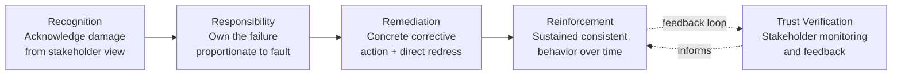
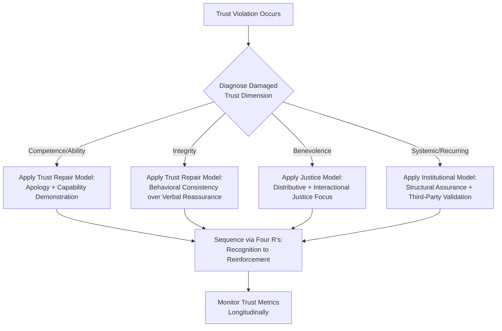

## Frameworks for Rebuilding Stakeholder Trust

### Definition and Scope

Frameworks for rebuilding stakeholder trust are structured, theory-grounded models that guide organizations through the process of restoring confidence, credibility, and relational commitment among stakeholders following a trust-damaging event (crisis, scandal, ethical breach, performance failure). Unlike general post-crisis communication strategy, which addresses messaging sequencing and tactics, trust-rebuilding frameworks focus specifically on the psychological and relational mechanics of trust restoration — what trust is composed of, how it is damaged, and which categories of intervention are effective at repairing each component.

Trust is generally treated in this literature as a multidimensional construct rather than a single variable, which is why effective frameworks typically diagnose *which type* of trust was damaged before prescribing a rebuilding approach.

### Dimensions of Trust (Diagnostic Foundation)

Most trust-rebuilding frameworks draw on a common three- or four-dimension model of trust, most closely associated with the work of Roger Mayer, James Davis, and F. David Schoorman ("An Integrative Model of Organizational Trust"):

- **Ability (Competence)**: Belief that the organization has the skills, resources, and capability to perform as expected. Damaged by operational failures, product defects, or service breakdowns.
- **Benevolence**: Belief that the organization has stakeholders' interests at heart, not merely its own. Damaged by perceived profit-over-people decisions.
- **Integrity**: Belief that the organization adheres to a set of principles stakeholders find acceptable, and is honest and consistent. Damaged by deception, cover-ups, or discovered dishonesty.
- **Predictability** (sometimes added as a fourth dimension): Belief that the organization behaves consistently over time, allowing stakeholders to anticipate its actions.

[Inference] Diagnosing which dimension(s) were damaged is treated as a prerequisite step in most applied frameworks, because a competence failure (e.g., a product defect) and an integrity failure (e.g., a cover-up) generally require different rebuilding strategies — a highly competent, transparent response to a competence failure can rebuild trust relatively quickly, whereas the same response applied to a discovered deception often deepens skepticism rather than resolving it.

### Framework 1: The Trust Repair Model (Kim, Ferrin, Cooper, Dirks)

Developed from organizational psychology research (notably Peter Kim's work on trust violations), this framework distinguishes trust-repair strategy based on the *type* of violation:

- **Competence-based violations**: Best repaired through *apologies that accept responsibility* combined with demonstrated capability improvements, because stakeholders are assessing whether the organization *can* perform, not whether it *intends* to act in good faith.
- **Integrity-based violations**: Apologies that accept responsibility can paradoxically reinforce the perception of untrustworthiness (confirming the organization is capable of dishonest behavior), whereas *denials* (when the organization is factually not at fault) or, where fault is real, sustained behavioral consistency over time tend to be more effective than verbal reassurance alone.

[Unverified] This asymmetry — that apology efficacy differs by violation type — is a documented finding within experimental organizational trust research, but real-world application requires care, since a false or unwarranted denial in a genuine integrity violation typically compounds reputational damage; the finding applies most cleanly to cases where fault is genuinely ambiguous or contested.

### Framework 2: The Four R's of Trust Restoration

A widely used applied framework (used in crisis consulting and organizational change contexts) structuring trust rebuilding into four sequential actions:

1. **Recognition**: Acknowledging that trust has been damaged and understanding specifically how, from the stakeholder's perspective rather than the organization's internal view.
2. **Responsibility**: Accepting appropriate ownership for the failure, calibrated to actual causal responsibility (see Situational Crisis Communication Theory for responsibility-attribution logic).
3. **Remediation**: Taking concrete, verifiable corrective action addressing both the direct harm caused and the systemic cause of the failure.
4. **Reinforcement**: Sustaining consistent trustworthy behavior over an extended period, since trust is rebuilt incrementally through repeated verification rather than restored by a single action.

### Framework 3: Procedural, Distributive, and Interactional Justice Model

Drawn from organizational justice theory, this framework holds that trust rebuilding after a perceived wrong depends on stakeholders' assessment of three justice dimensions:

- **Distributive justice**: Fairness of the outcome or remedy provided (e.g., is the compensation offered proportionate to the harm?).
- **Procedural justice**: Fairness of the process used to reach decisions and remedies (e.g., were affected stakeholders consulted, was the investigation process transparent and neutral?).
- **Interactional justice**: Fairness and respect in how stakeholders are personally treated during the resolution process (e.g., dignity, responsiveness, honesty in individual interactions).

[Inference] This model is particularly relevant when remediation involves compensation or settlement processes, since research in this tradition consistently finds that procedural and interactional justice perceptions influence trust recovery independently of the size of the distributive remedy — meaning a well-designed process can partially offset a modest settlement, while a poorly handled process can undermine even a generous one.

### Framework 4: Institutional Trust-Building (Systemic Approach)

Focuses on trust as embedded in organizational systems and third-party verification rather than solely in individual communication acts:

- **Structural assurance**: Building or strengthening systems (audits, compliance functions, independent oversight boards) that make future violations structurally less likely, addressing stakeholder concern about recurrence.
- **Third-party certification and validation**: External audits, industry certifications, regulatory sign-off, or independent monitor appointments that substitute external credibility for organizational self-assertion, which stakeholders may discount post-violation.
- **Transparency infrastructure**: Ongoing public reporting mechanisms (safety dashboards, sustainability disclosures, security posture updates) that convert one-time crisis commitments into durable, monitorable practices.

### Comparative Framework Selection Model

### Practical Example: Applying Multiple Frameworks to a Manufacturing Safety Failure

**Scenario**: A manufacturing company faces public backlash after a workplace safety incident reveals the company had received prior internal warnings about the hazard and failed to act, resulting in an employee injury.

**Diagnosis**: This is primarily an **integrity violation** (prior knowledge and inaction) compounded by a **competence** concern (inadequate safety systems), rather than a pure accident.

**Applying the Trust Repair Model**: Given the integrity dimension, a verbal apology alone is treated with skepticism internally by consultants; the company instead prioritizes visible, verifiable behavioral change — independent safety audit, published findings, named accountable executive.

**Applying the Four R's**:

- *Recognition*: The company acknowledges specifically that prior warnings were not acted upon, rather than characterizing the incident as an unforeseeable accident.
- *Responsibility*: A senior operations executive, not merely a communications spokesperson, publicly accepts accountability.
- *Remediation*: Direct compensation and support for the injured employee, combined with a facility-wide safety system overhaul with published implementation milestones.
- *Reinforcement*: Quarterly published safety audit results become a standing practice for the following two years.

**Applying the Justice Model**: The injured employee and affected work unit are given a transparent, participatory role in reviewing new safety protocols (procedural justice), treated with direct executive engagement rather than routed solely through HR/legal (interactional justice), and provided compensation exceeding minimum legal requirement (distributive justice).

**Applying the Institutional Model**: An independent occupational safety auditor is retained on an ongoing basis, and results are reported to a newly formed employee safety committee with representation authority, converting the response into a structural change rather than a one-time gesture.

### Measuring Trust Restoration Progress

- Longitudinal trust index surveys tracking ability, benevolence, and integrity perception separately (not only an aggregate trust score)
- Employee/community/customer willingness-to-recommend or willingness-to-re-engage metrics over time
- Reduction in trust-related negative sentiment themes in media/social monitoring (as distinct from general negative sentiment)
- Independent audit or third-party certification completion and renewal rates
- Recurrence rate of the underlying failure type (a direct test of whether structural remediation was effective)

See also Measuring Return on Reputation Investment and Post-Crisis Communication Strategy for related measurement and sequencing methodology.

### Common Pitfalls

- **Mismatched remedy to violation type**: Applying a competence-style apology-and-fix approach to an integrity violation, which can read as an admission that dishonest behavior is simply another operational bug to patch.
- **Front-loading reassurance without structural change**: Emphasizing verbal commitments and apologies while under-investing in the institutional/structural mechanisms that make recurrence less likely.
- **Treating trust as a single scalar metric**: Measuring only aggregate sentiment or reputation score without tracking which specific trust dimension (ability, benevolence, integrity) is recovering or still depressed.
- **Rushing the reinforcement phase**: Declaring trust "restored" after a short compliance period rather than sustaining the behavior long enough for stakeholders to update their beliefs, since trust judgments typically require repeated confirmatory evidence.
- **Neglecting procedural and interactional justice in remediation processes**: Focusing exclusively on the size of compensation (distributive justice) while handling the remedy process impersonally or opaquely, which research suggests can undermine trust recovery independent of remedy size.

### Related Topics

- Mayer, Davis & Schoorman Integrative Trust Model (Foundational Theory)
- Situational Crisis Communication Theory (SCCT)
- Post-Crisis Communication Strategy
- Organizational Justice Theory in Corporate Remediation
- Third-Party Validation and Certification as Trust Signals
- Measuring Return on Reputation Investment
- Longitudinal Trust and Sentiment Measurement Design
- Internal Communications During and After Crisis