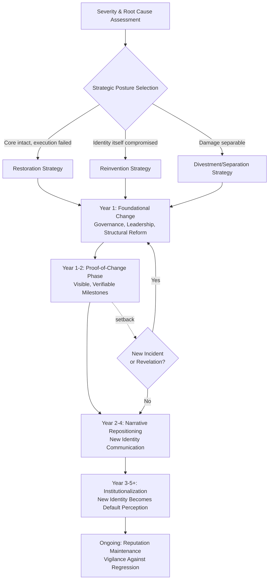

## Long-Term Reputation Repair Campaigns

### Definition and Scope

Long-term reputation repair campaigns are sustained, multi-year strategic communication and organizational change initiatives designed to fundamentally reposition an organization's public image following severe or chronic reputational damage — damage too extensive to be resolved through the phased post-crisis communication activities that typically conclude within 12–18 months. These campaigns are distinguished from standard post-crisis recovery by their scope (organization-wide rather than incident-specific), duration (multi-year rather than weeks-to-months), and integration with substantive organizational change rather than communication alone.

Long-term repair campaigns are typically triggered by: sustained pattern-of-behavior scandals (rather than single incidents), industry-wide reputational contagion, leadership/cultural failures requiring structural overhaul, or reputational damage severe enough to threaten organizational viability (loss of license to operate, existential regulatory threat, mass stakeholder defection).

### Distinguishing Long-Term Repair from Standard Post-Crisis Recovery

| Dimension | Standard Post-Crisis Recovery | Long-Term Repair Campaign |
| --- | --- | --- |
| Trigger | Single, bounded incident | Pattern of behavior, systemic failure, or existential threat |
| Duration | Weeks to ~18 months | 2–10+ years |
| Scope | Incident-specific narrative | Organization-wide identity repositioning |
| Primary lever | Communication and remediation | Communication + structural/cultural/governance change |
| Success measure | Sentiment/trust return to pre-incident baseline | New, durable reputational identity established |
| Leadership involvement | Communications and affected business unit | Board-level, often includes leadership change |

[Inference] This distinction is a practitioner heuristic rather than a formally codified boundary; in practice, a standard post-crisis recovery effort can escalate into a long-term repair campaign if initial remediation proves insufficient or if new damaging revelations emerge during the recovery window.

### Foundational Strategic Logic

Long-term reputation repair rests on the premise that severely damaged reputational capital cannot be restored to its prior state through messaging alone — the prior reputational identity itself may need to be replaced rather than repaired. This draws on corporate identity and rebranding theory as much as crisis communication theory, and often involves answering not "how do we explain what happened" but "who do we need to become."

Three broad strategic postures are available, generally selected based on severity and root-cause depth:

- **Restoration**: Rebuilding trust in the organization's existing identity and mission, appropriate when the core business model and values remain sound but execution or oversight failed.
- **Reinvention**: Substantially repositioning the organization's identity, values narrative, or even business model, appropriate when the crisis revealed the prior identity itself was reputationally unsustainable.
- **Divestment/Separation**: Distancing the ongoing enterprise from the damaged entity or brand (divesting a business unit, retiring a brand name, spinning off a subsidiary), appropriate when the reputational damage is concentrated in a specific, separable part of the organization.

### Long-Term Repair Campaign Architecture

### Phase Detail

**Foundational Change (Year 1)**: Structural and governance changes that address root causes credibly enough to support later narrative claims — board composition changes, executive leadership turnover, new compliance/oversight functions, revised incentive structures. [Inference] Communications professionals generally treat this phase as necessary but largely non-narrative: premature public claims of transformation before structural change is genuinely underway are a commonly cited cause of campaign failure, since stakeholders and media frequently verify claims against observable structural evidence.

**Proof-of-Change Phase (Year 1–2)**: Publication of concrete, independently verifiable milestones (completed audits, new certifications, published metrics, resolved litigation/regulatory matters) that give the organization a credible evidentiary basis for later narrative claims. This phase typically overlaps with, and extends beyond, standard post-crisis communication's "accountability and corrective action" phase.

**Narrative Repositioning (Year 2–4)**: Sustained thought leadership, brand campaign work, stakeholder engagement programs, and strategic partnerships designed to actively construct a new or renewed reputational identity, built on the evidentiary foundation established in earlier phases rather than preceding it.

**Institutionalization (Year 3–5+)**: The point at which the new reputational identity becomes the default, unprompted association among key stakeholder groups rather than requiring active reinforcement — measured through unprompted brand association studies and sustained third-party reputation index improvement.

**Ongoing Maintenance**: Continued vigilance, since long-term repair campaigns remain vulnerable to regression if new incidents occur, particularly if they resemble the original triggering failure (recurrence perception is highly damaging to a repair narrative already in progress).

### Organizational Components Beyond Communication

Long-term repair campaigns typically require coordinated change across functions beyond communications:

- **Governance reform**: Board refreshment, new oversight committees, revised executive compensation tied to non-financial risk metrics
- **Culture change programs**: Values realignment initiatives, internal communication and training, whistleblower protection mechanisms
- **Compliance and risk infrastructure**: New or strengthened compliance functions, independent monitors (sometimes court- or regulator-mandated), enhanced internal audit
- **Talent strategy**: Addressing reputational damage to employer brand, which affects recruiting and retention independent of customer/investor sentiment
- **Product/service portfolio changes**: In severe cases, discontinuing or substantially modifying the products or practices most associated with the damage
- **Stakeholder engagement architecture**: Formal advisory councils, community boards, or ongoing dialogue mechanisms with previously alienated stakeholder groups

### Practical Example: Long-Term Repair Following Systemic Regulatory Violations

**Scenario**: A financial institution faces years of reputational damage after regulators find systemic sales practice violations affecting millions of customer accounts, compounded by evidence the practices were known internally and tolerated for an extended period.

**Severity assessment**: This is classified as requiring a **reinvention** posture rather than restoration, given the systemic (not isolated) nature of the violations and evidence of internal tolerance, which damages the integrity dimension of trust broadly across the customer base (see Frameworks for Rebuilding Stakeholder Trust).

**Year 1 — Foundational change**: Board composition is substantially refreshed, the responsible business unit's leadership is replaced, sales incentive structures identified as root cause are eliminated entirely rather than merely adjusted, and an independent compliance monitor is engaged (in some real-world cases, this is regulator-mandated).

**Year 1–2 — Proof of change**: Customer remediation program results are published on a recurring basis, the terminated incentive structure's removal is independently verified, and a new whistleblower protection framework is publicly documented.

**Year 2–4 — Narrative repositioning**: The organization repositions its public narrative around a substantively different customer-first operating model, with communications explicitly referencing the specific structural changes (not vague values language) as evidence, and pursues visible, third-party-validated customer satisfaction improvements.

**Year 3–5+ — Institutionalization**: Unprompted brand perception studies begin showing the organization associated with its new positioning rather than the original scandal, and reputation index scores approach or exceed pre-crisis levels — though [Unverified] full parity with pre-crisis reputation metrics is not guaranteed within any fixed timeframe and depends heavily on whether new incidents occur during the repair window.

### Measuring Long-Term Repair Progress

- **Unprompted brand/reputation association studies**: Tracking whether spontaneous stakeholder associations shift away from the original crisis event over time (distinct from prompted recall, which can remain elevated even as sentiment improves)
- **Reputation index trajectory over multi-year windows**: RepTrak, Axios Harris Poll 100, or sector-specific indices tracked longitudinally rather than at single checkpoints
- **Structural milestone completion rate**: Percentage of announced governance/compliance/cultural commitments actually completed on the stated timeline, since credibility of the overall campaign depends on this track record
- **Employer brand recovery**: Time-to-fill and applicant volume/quality metrics, reflecting employer reputation distinct from customer/investor reputation
- **Regulatory relationship quality**: Frequency and severity of subsequent regulatory findings, as a proxy for whether structural change was genuine rather than cosmetic
- **Cost of capital normalization**: Credit rating and borrowing cost trends relative to sector peers over the multi-year window (see Benchmarking Against Peers and Industry Norms)

### Common Pitfalls

- **Narrative-first sequencing**: Launching repositioning communication before foundational structural change is genuinely underway, which is frequently detected by media, regulators, or stakeholder advocacy groups and can be more damaging than no campaign at all.
- **Underestimating required duration**: Applying standard post-crisis recovery timelines (months) to damage that requires years, leading to premature declarations of resolution and subsequent credibility loss when problems persist.
- **Communications-only approach**: Treating long-term repair as fundamentally a messaging challenge rather than requiring substantive governance, cultural, and operational change.
- **Leadership discontinuity in campaign ownership**: Multi-year campaigns often outlast the tenure of the leaders who initiated them; loss of institutional commitment at leadership transition is a documented cause of stalled repair efforts.
- **Failure to address employee-facing trust separately**: Focusing exclusively on external stakeholders (customers, investors, regulators) while internal trust and culture — the actual source of the original failure in many systemic cases — remains unaddressed.
- **Vulnerability to regression**: A single new incident resembling the original failure during the repair window can be disproportionately damaging, since it appears to confirm that promised change did not occur.

### Related Topics

- Frameworks for Rebuilding Stakeholder Trust
- Post-Crisis Communication Strategy
- Corporate Identity and Rebranding Theory
- Governance Reform and Board Oversight Post-Scandal
- Measuring Return on Reputation Investment
- Benchmarking Against Peers and Industry Norms
- Whistleblower Protection and Internal Compliance Architecture
- Employer Brand Recovery After Reputational Crisis