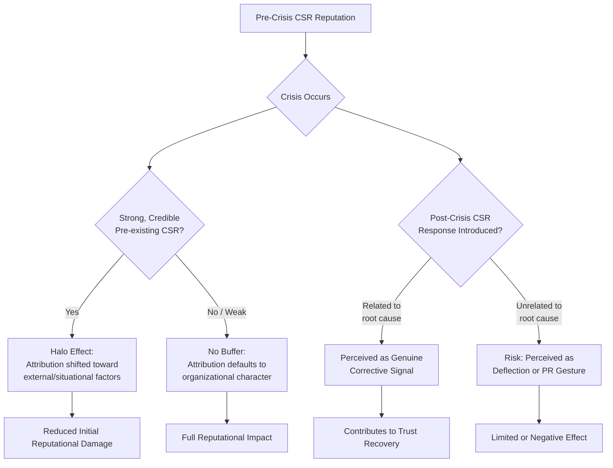

## Corporate Social Responsibility as a Recovery Tool

### Definition and Scope

Corporate Social Responsibility (CSR) as a recovery tool refers to the deliberate deployment of CSR initiatives — philanthropic giving, community investment, environmental commitments, employee welfare programs, and ethical business practice enhancements — as a structural component of post-crisis reputation rebuilding. This differs from CSR as a general, ongoing business practice in that its design, sequencing, and communication are specifically calibrated to address the reputational deficit created by a crisis, rather than pursued independently of any triggering event.

CSR-based recovery operates on the premise that demonstrated, verifiable prosocial action can offset reputational damage by shifting stakeholder perception of organizational benevolence and values-alignment (see Frameworks for Rebuilding Stakeholder Trust), particularly when the underlying crisis involved a perceived benevolence failure (profit prioritized over stakeholder welfare) rather than a pure competence failure.

### Theoretical Basis

**CSR as an Insurance-Like Reputational Buffer**: A substantial body of academic research (notably work building on Klein and Dawar's studies on CSR and consumer attribution) finds that pre-existing CSR reputation can create a "halo effect" that leads stakeholders to attribute a crisis to external or situational factors rather than to poor organizational character, softening the initial reputational impact. This buffer effect is generally found to be strongest when CSR investment *predates* the crisis and is *credible/substantive*, and weaker or potentially counterproductive when CSR activity is introduced only in direct response to the crisis and perceived as reactive.

**CSR as Signaling**: Under signaling theory, CSR actions function as costly, hard-to-fake signals of underlying organizational values, particularly effective when the CSR commitment involves genuine cost or forgone profit rather than low-cost gestures, since costly signals are more difficult for skeptical stakeholders to dismiss as opportunistic.

**Attribution Theory Application**: Following Situational Crisis Communication Theory logic, stakeholders assess organizational responsibility for a crisis; CSR actions taken post-crisis are most effective at aiding recovery when they demonstrably relate to the root cause of the crisis (a company facing an environmental violation investing credibly in environmental remediation) rather than being generic or unrelated to the failure (the same company instead funding an unrelated arts program), which can appear as deflection.

[Inference] This relatedness principle is a recurring theme across CSR-crisis-response literature and practitioner guidance, though the degree of "fit" required for effectiveness, and the point at which unrelated CSR activity becomes reputationally counterproductive rather than merely less effective, is not precisely quantified in the research base and is typically assessed case-by-case.

### The "CSR Halo" and Its Limits

[Unverified] The magnitude of the halo effect is context- and industry-dependent, and some research finds the effect can reverse (a "boomerang effect") when stakeholders perceive a mismatch between an organization's CSR claims and a revealed crisis, interpreting the prior CSR activity retroactively as hypocrisy rather than genuine values — this risk is generally considered highest in cases involving discovered deception (integrity violations) rather than accidental competence failures.

### Categories of CSR-Based Recovery Initiatives

**Direct Remediation CSR**: Initiatives directly addressing the specific harm caused by the crisis (environmental cleanup funding, affected community investment, product safety research funding) — generally regarded as the strongest form of recovery-oriented CSR due to direct relatedness.

**Root-Cause-Adjacent CSR**: Broader initiatives addressing the underlying issue category involved in the crisis without being narrowly limited to the specific incident (a data breach prompting broader digital literacy/cybersecurity education funding, not only affected-customer remediation).

**Stakeholder-Specific CSR**: Programs targeted at the specific stakeholder group most affected or most skeptical post-crisis (employee wellness and ethics programs following an internal culture scandal, community investment following a local environmental incident).

**Governance and Transparency CSR**: Commitments to enhanced disclosure, independent oversight, or industry standard-setting that function as CSR-adjacent trust signals even though they resemble compliance more than traditional philanthropy.

**Employee-Facing CSR**: Internal-facing initiatives (volunteering programs, ethics training, whistleblower protections) that address employer brand and internal trust distinctly from external stakeholder perception.

### Sequencing CSR Within Post-Crisis Recovery

CSR-based recovery initiatives are most effective when integrated into the broader post-crisis communication phase structure (see Post-Crisis Communication Strategy) rather than deployed as a standalone tactic:

- **Stabilization phase**: CSR is generally inappropriate to introduce here; premature CSR announcements during acute crisis stabilization risk appearing as distraction from direct harm resolution.
- **Accountability and corrective action phase**: Direct remediation CSR is introduced here, tightly coupled to the specific harm caused, alongside — not instead of — direct compensation to affected parties.
- **Narrative rebuilding phase**: Root-cause-adjacent and stakeholder-specific CSR initiatives are expanded and communicated as part of the forward-looking narrative, supported by third-party validation where possible.
- **Reputation reinforcement / long-term repair phase**: CSR becomes institutionalized as an ongoing practice (see Long-Term Reputation Repair Campaigns), with regular public reporting converting a crisis-triggered response into a durable organizational commitment.

### Practical Example: CSR Deployment Following a Product Safety Recall

**Scenario**: A consumer packaged goods company recalls a product line after a manufacturing defect causes consumer injuries, with media coverage suggesting cost-cutting in quality control contributed to the defect.

**Diagnosis**: This is a mixed competence/benevolence issue — a manufacturing failure (competence) compounded by a perception that cost considerations were prioritized over consumer safety (benevolence), making CSR relevance high for the benevolence dimension specifically.

**Direct Remediation CSR**: The company funds a consumer product safety research initiative at an independent university, directly tied to the defect category involved, alongside full compensation and recall logistics for affected consumers.

**Root-Cause-Adjacent CSR**: Recognizing that quality control resourcing was implicated, the company publicly commits to and funds an independent, ongoing third-party quality assurance auditing program across its manufacturing facilities — directly addressing the root-cause narrative rather than a generic unrelated cause.

**Stakeholder-Specific CSR**: The company launches a consumer advisory panel giving affected customer segments an ongoing voice in product safety review processes, addressing the interactional/procedural justice dimension of trust recovery (see Frameworks for Rebuilding Stakeholder Trust).

**What is avoided**: Consultants advising this scenario would typically flag a large, unrelated CSR announcement (e.g., a substantial donation to an unrelated cause such as arts education) introduced at the same time as reputationally risky, since it lacks relatedness to the root cause and could be interpreted by media and stakeholders as deflection rather than genuine corrective action.

**Long-term institutionalization**: Over subsequent years, the third-party quality audit program's results are published annually, converting the crisis-triggered CSR commitment into a standing operational transparency practice.

### Measuring CSR-Based Recovery Effectiveness

- **Attribution shift measurement**: Survey-based assessment of whether stakeholders attribute the crisis to external/situational factors versus organizational character, before and after CSR initiative communication
- **Perceived authenticity/sincerity scores**: Survey instruments specifically measuring whether stakeholders perceive CSR actions as genuine versus opportunistic, since perceived insincerity can neutralize or reverse intended benefits
- **Relatedness perception**: Whether stakeholders perceive the CSR initiative as connected to the specific crisis versus generic, often assessed via open-ended survey response coding
- **Media framing analysis**: Tracking whether media coverage frames CSR announcements as substantive corrective action versus "PR gesture" — a common negative framing risk for recovery-oriented CSR
- **Longitudinal reputation index movement**: Tracking whether reputation index scores (RepTrak, sector-specific trust barometers) show sustained improvement correlated with CSR initiative rollout, while controlling for other concurrent recovery actions
- **Third-party validation uptake**: Whether independent bodies (NGOs, industry certifiers, ESG rating agencies) recognize or validate the CSR initiative, providing external credibility beyond organizational self-reporting

See also Measuring Return on Reputation Investment for broader ROI attribution methodology applicable to CSR spend evaluation.

### Common Pitfalls

- **Low relatedness ("CSR-washing" perception)**: Deploying CSR initiatives unrelated to the crisis's root cause, which stakeholders and media frequently interpret as deflection rather than genuine accountability.
- **Reactive-only CSR with no pre-existing foundation**: Organizations with no prior CSR track record introducing CSR only in direct crisis response face a credibility disadvantage relative to organizations with an established, verifiable CSR history, since the halo/signaling effect depends partly on consistency over time.
- **Substituting CSR for direct remediation**: Emphasizing broader CSR initiatives while under-delivering on direct compensation or corrective action for specifically affected parties, which can appear as an attempt to change the subject rather than address the harm.
- **Insufficient cost/credibility of the signal**: Token or low-cost CSR gestures are more easily dismissed as opportunistic than substantive, costly commitments, weakening the signaling value described in signaling theory.
- **Timing misjudgment**: Announcing CSR initiatives during the acute stabilization phase, when stakeholder attention and goodwill are focused on direct harm resolution rather than broader values narratives.
- **Failure to sustain or report on commitments**: Announcing CSR initiatives without follow-through public reporting, which can trigger a credibility backlash if stakeholders later discover commitments were not fulfilled.

### Related Topics

- Frameworks for Rebuilding Stakeholder Trust
- Post-Crisis Communication Strategy
- Long-Term Reputation Repair Campaigns
- Signaling Theory in Corporate Communication
- ESG Reporting and Third-Party Validation
- Measuring Return on Reputation Investment
- Attribution Theory in Crisis Communication
- Employee-Facing CSR and Internal Culture Repair