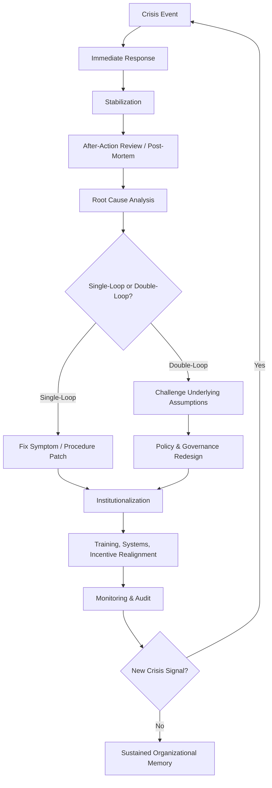

## Organizational Learning and Policy Change

### Definition and Scope

Organizational learning in the crisis management context refers to the systematic process by which an organization captures, analyzes, and institutionalizes lessons from a crisis event to prevent recurrence and improve future response capability. Policy change is the structural mechanism through which those lessons become durable — converting insight into rules, procedures, governance structures, and resource allocations that persist beyond the individuals involved in the original crisis.

This phase sits at the tail end of the crisis lifecycle (Pre-Crisis → Response → Post-Crisis Recovery) but is arguably the highest-leverage stage for long-term reputational resilience, since stakeholders — regulators, media, employees, customers — increasingly judge organizations not on whether a crisis occurred, but on what changed afterward.

### Why Organizations Fail at This Stage

**Key Points**

- **Crisis amnesia**: Once acute pressure subsides, urgency evaporates and pre-crisis norms reassert themselves (the "return to normal" reflex).
- **Single-loop vs. double-loop learning**: Most organizations only correct the immediate symptom (single-loop) rather than questioning the underlying assumptions, incentives, or mental models that allowed the crisis to occur (double-loop learning, per Argyris & Schön).
- **Defensive attribution**: Internal stakeholders often externalize blame ("bad luck," "a rogue employee," "unforeseeable market conditions") to protect reputations and avoid liability, which suppresses honest root-cause analysis.
- **Legal chilling effect**: Counsel may discourage written admissions of fault or detailed post-mortems out of litigation-exposure concerns, which can conflict with transparent organizational learning.
- **Structural inertia**: Existing incentive systems, reporting lines, and budget allocations resist change even when a post-mortem clearly identifies them as contributing causes.

### The Organizational Learning Cycle

### Core Components of a Post-Crisis Learning Process

**1. After-Action Review (AAR) / Post-Mortem**

A structured, time-boxed review conducted shortly after the acute phase ends, typically addressing four questions:

- What was supposed to happen?
- What actually happened?
- Why was there a difference (root cause, not just proximate cause)?
- What will we do differently?

Best practice separates the AAR into two tracks: a **blameless technical/operational review** (focused on systems and processes) and a **separate accountability review** (focused on individual conduct, often run by HR/Legal), so that fear of punishment doesn't suppress candid input into the systemic review.

**2. Root Cause Analysis (RCA) Techniques**

- **5 Whys**: Iteratively asking "why" to move from symptom to systemic cause.
- **Fishbone/Ishikawa diagram**: Categorizes contributing factors (people, process, technology, environment, management).
- **Fault Tree Analysis**: Used in high-reliability industries (aviation, nuclear, pharma) to map causal logic trees with probabilities.

**Fishbone Diagram (svg_diagram)**

<svg xmlns="http://www.w3.org/2000/svg" viewBox="0 0 800 420">
\<style\>
.lbl { font-family: sans-serif; font-size: 13px; fill: #222; }
.cat { font-family: sans-serif; font-size: 14px; font-weight: bold; fill: #1a1a1a; }
.title { font-family: sans-serif; font-size: 16px; font-weight: bold; fill: #111; }
.spine { stroke: #333; stroke-width: 3; }
.branch { stroke: #555; stroke-width: 2; fill: none; }
\</style\>
<text x="20" y="24" class="title">Root Cause Analysis: Crisis Contributing Factors (svg_diagram)</text>
<line x1="60" y1="220" x2="680" y2="220" class="spine" />
<polygon points="680,220 660,210 660,230" fill="#333" />
<rect x="690" y="200" width="90" height="40" fill="#b91c1c" rx="4" />
<text x="700" y="225" fill="white" class="lbl" font-weight="bold">CRISIS EVENT</text>

<line x1="160" y1="80" x2="260" y2="220" class="branch" />
<text x="120" y="70" class="cat">People</text>
<line x1="180" y1="120" x2="230" y2="150" class="branch" />
<text x="130" y="115" class="lbl">Training gaps</text>
<line x1="200" y1="160" x2="240" y2="180" class="branch" />
<text x="150" y="155" class="lbl">Unclear authority</text>

<line x1="300" y1="80" x2="380" y2="220" class="branch" />
<text x="270" y="70" class="cat">Process</text>
<line x1="320" y1="120" x2="360" y2="150" class="branch" />
<text x="270" y="115" class="lbl">No escalation path</text>
<line x1="340" y1="160" x2="370" y2="180" class="branch" />
<text x="290" y="155" class="lbl">Outdated SOPs</text>

<line x1="160" y1="360" x2="260" y2="220" class="branch" />
<text x="110" y="380" class="cat">Technology</text>
<line x1="180" y1="320" x2="230" y2="290" class="branch" />
<text x="130" y="335" class="lbl">Monitoring blind spot</text>
<line x1="200" y1="280" x2="240" y2="260" class="branch" />
<text x="150" y="300" class="lbl">Legacy systems</text>

<line x1="300" y1="360" x2="380" y2="220" class="branch" />
<text x="250" y="380" class="cat">Management</text>
<line x1="320" y1="320" x2="360" y2="290" class="branch" />
<text x="270" y="335" class="lbl">Incentive misalignment</text>
<line x1="340" y1="280" x2="370" y2="260" class="branch" />
<text x="290" y="300" class="lbl">Siloed reporting</text>

<line x1="450" y1="80" x2="500" y2="220" class="branch" />
<text x="420" y="70" class="cat">External Environment</text>
<line x1="460" y1="120" x2="490" y2="150" class="branch" />
<text x="420" y="115" class="lbl">Regulatory shift</text>
<line x1="470" y1="160" x2="495" y2="180" class="branch" />
<text x="430" y="155" class="lbl">Market pressure</text>
</svg>

**3. From Findings to Policy: The Translation Layer**

This is the step most organizations skip. A finding ("employees didn't escalate the safety concern") must be translated into a concrete policy artifact:

| Finding Type | Policy Instrument | Example |
| --- | --- | --- |
| Procedural gap | Revised SOP / playbook | New mandatory escalation protocol within 2 hours |
| Governance gap | Charter/committee change | Creation of a cross-functional Risk Council with board reporting line |
| Incentive misalignment | Compensation/KPI redesign | Removing volume-only bonuses that discouraged safety reporting |
| Cultural/behavioral gap | Training + psychological safety initiative | Mandatory "speak-up" training, anonymous reporting channel |
| Structural/authority gap | Org design change | Elevating Chief Risk Officer to report directly to CEO/Board |
| Disclosure/communication gap | Crisis communication protocol update | Pre-approved holding statement templates, revised spokesperson matrix |

### Institutionalizing Change (Making It Stick)

**Key Points**

- **Codify, don't just communicate**: Lessons must be written into formal documents (policy manuals, employee handbooks, board charters) — verbal commitments decay.
- **Assign explicit ownership**: Every policy change needs a named accountable owner and a review date, not a diffuse "the organization will."
- **Embed in onboarding and recurring training**: New hires and tenured staff alike must encounter the lesson repeatedly, not as a one-time memo.
- **Audit and metrics**: Establish leading indicators (e.g., number of near-miss reports filed, time-to-escalation) to verify the policy is functioning, not just present on paper.
- **Sunset review clauses**: Build in mandatory re-review dates (e.g., 12/24 months) so policies adapt rather than calcify into their own future liability.

### External Signaling of Learning (Reputational Dimension)

Internal change has limited reputational value unless credibly communicated to external stakeholders. Effective approaches include:

- **Independent review commissioning**: Engaging a third-party auditor or investigator (legal, technical, or governance expert) whose findings are published in full or substantial part, lending credibility beyond self-reported assurances.
- **Public commitment statements**: Concrete, measurable, time-bound commitments (e.g., "we will implement X by Q3") rather than vague pledges ("we take this seriously").
- **Regulatory engagement**: Proactively briefing regulators on remediation steps rather than waiting to be asked, which can influence enforcement posture.
- **Follow-through reporting**: Publishing a follow-up update once commitments are implemented — closing the loop is what separates genuine reputational rebuilding from a one-time apology.

[Inference] Stakeholder research in crisis communication literature (e.g., Coombs' Situational Crisis Communication Theory) suggests that follow-through evidence is weighted more heavily by publics than the initial apology itself, though the magnitude of this effect varies by industry and crisis severity and is difficult to isolate from confounding factors like media coverage intensity.

### Organizational Learning Maturity Model

**1. Reactive** — Learning only occurs after a crisis forces it; no formal process exists.

**2. Compliance-driven** — Post-mortems are conducted to satisfy regulatory or legal requirements; findings rarely reach policy.

**3. Systematic** — Formal AAR process exists, findings are routed to policy owners, and changes are tracked to completion.

**4. Adaptive/Generative** — Organization actively seeks weak signals and near-misses *before* they escalate (proactive learning), and double-loop learning is culturally normalized (related to High-Reliability Organization theory).

### Common Pitfalls

- **Policy proliferation without simplification**: Adding new rules after every incident without retiring or consolidating old ones, leading to policy bloat that itself becomes an operational risk.
- **Scapegoating substituting for systemic fix**: Terminating an individual is sometimes necessary but should not be presented as *the* solution if systemic factors were also causal.
- **Learning theater**: Conducting a review, publishing a statement, but making no structural changes — often detected by sophisticated stakeholders (journalists, activist investors, regulators) and can trigger a secondary reputational crisis of perceived insincerity.
- **Siloed learning**: Lessons captured in one business unit or geography failing to propagate organization-wide, especially in decentralized or multinational structures.

### Illustrative Example

A hospital system experiences a data breach exposing patient records.

- **Single-loop fix**: Patch the specific software vulnerability, reset passwords.
- **Double-loop fix**: Discover the vulnerability existed because security review was deprioritized under budget pressure tied to a cost-cutting KPI; restructure the CISO's reporting line to report to the board audit committee rather than the CFO, and add security review sign-off as a mandatory gate in the procurement policy, with quarterly public compliance reporting to reassure patients and regulators.

### Related Topics

- Crisis Communication Audits and Retrospectives
- Building a Crisis Management Playbook
- Psychological Safety and Speak-Up Culture
- Board Governance and Risk Oversight Structures
- Regulatory Remediation and Consent Decree Compliance
- High-Reliability Organization (HRO) Theory
- Stakeholder Trust Repair Metrics
- Change Management Frameworks (Kotter, ADKAR) Applied to Crisis-Driven Reform