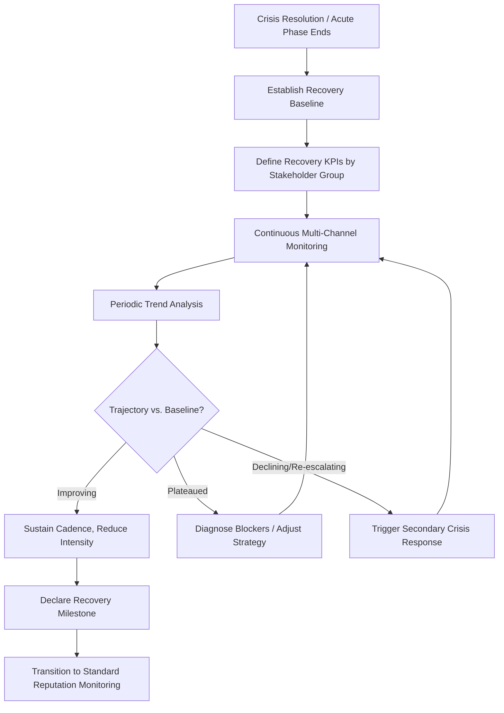

## Monitoring Long-Term Reputation Recovery

### Definition and Scope

Long-term reputation recovery monitoring is the disciplined, sustained measurement of stakeholder perception, behavior, and sentiment following a crisis, extending well beyond the acute response phase (typically 6 months to several years). Unlike crisis-phase monitoring — which tracks real-time sentiment velocity and media volume to inform tactical response — recovery monitoring is diagnostic and longitudinal, designed to answer: *Has trust actually been restored, and by which measurable dimensions?*

This distinction matters because reputational damage and reputational recovery follow different timelines and different indicators. Media coverage of a crisis typically decays within weeks; underlying stakeholder trust, purchase behavior, employee retention, and regulatory scrutiny can take years to normalize — or may never fully return to baseline.

### Why This Phase Is Frequently Under-Resourced

**Key Points**

- **Attention asymmetry**: Crisis response teams are resourced and mobilized; post-crisis monitoring is often quietly deprioritized once media attention fades, despite this being when the actual recovery trajectory is determined.
- **Attribution difficulty**: Isolating the crisis's lingering effect from normal market/competitive noise becomes harder over time, discouraging continued measurement.
- **False closure signals**: Declining media volume is often mistaken for "the crisis is over," when stakeholder trust metrics may still be depressed.
- **Budget cycle mismatch**: Reputation recovery can take 2–5 years depending on severity, but communications/PR budgets are typically allocated annually, creating pressure to declare victory prematurely.

### The Recovery Monitoring Framework

### Core Measurement Dimensions

**1. Media and Narrative Metrics**

- **Share of voice**: Proportion of brand-related media coverage that is crisis-related vs. neutral/positive, tracked monthly.
- **Sentiment ratio**: Positive-to-negative sentiment ratio in earned media and social mentions, benchmarked against pre-crisis baseline.
- **Narrative persistence**: Whether the crisis is still referenced as a qualifier in unrelated coverage (e.g., "Company X, which faced a data breach in 2024, announced...") — a strong indicator of unresolved reputational residue.
- **Search behavior**: Search volume for crisis-related keywords alongside brand name (via tools like Google Trends), which tends to decay slower than news coverage.

**2. Stakeholder Trust Metrics**

- **Net Promoter Score (NPS) / Customer trust surveys**: Tracked at intervals (quarterly is common) against pre-crisis and immediate post-crisis baselines.
- **Employee sentiment**: eNPS, retention rates, exit interview themes — internal reputation often lags external recovery and is a leading indicator of cultural repair.
- **Investor confidence**: Stock price recovery relative to sector index (abnormal returns analysis), analyst sentiment in earnings call commentary, credit rating agency commentary.
- **Regulatory relationship**: Frequency and tone of regulatory inquiries, audit findings, consent decree compliance status.

**3. Behavioral/Business Metrics**

- **Customer churn and acquisition cost**: Elevated churn or CAC post-crisis, tracked against pre-crisis trendlines rather than absolute numbers.
- **Partner/supplier relationship health**: Contract renewal rates, willingness of new partners to engage.
- **Talent pipeline health**: Application volume, offer-acceptance rate, employer-review site ratings (e.g., Glassdoor trend line).

### Recovery Metrics Dashboard Structure

| Dimension | Leading Indicator | Lagging Indicator | Typical Recovery Horizon |
| --- | --- | --- | --- |
| Media/Narrative | Sentiment ratio, share of voice | Crisis-qualifier persistence in coverage | 3–12 months |
| Customer Trust | Survey trust scores, NPS | Repeat purchase rate, churn | 6–24 months |
| Employee | eNPS, internal survey themes | Voluntary turnover, retention of key talent | 6–18 months |
| Investor | Analyst tone, short interest | Stock price vs. sector index | 3–18 months |
| Regulatory | Inquiry frequency, audit tone | Consent decree closure, fine resolution | 1–5 years |

[Inference] These recovery horizons are broad approximations drawn from general crisis-communication case literature; actual duration varies substantially by crisis severity, industry, and whether the underlying cause was perceived as intentional misconduct versus an honest failure, and no universal benchmark applies across all cases.

### Methodological Considerations

**Establishing a Valid Baseline**

Recovery cannot be measured without a credible "before" state. Best practice is to use a **rolling pre-crisis average** (e.g., trailing 12 months prior to the incident) rather than a single snapshot, since single-point baselines are vulnerable to seasonal or one-off distortions.

**Controlling for Confounds**

Reputation metrics move for many reasons unrelated to the crisis (macroeconomic shifts, competitor actions, unrelated product launches). Rigorous monitoring should:

- Track a **comparison set** of peer companies not affected by the crisis to distinguish sector-wide movement from crisis-specific movement.
- Use **event-study methodology** for financial metrics — measuring abnormal returns relative to expected performance based on market/sector movement, not raw stock price.

**Mixed-Methods Approach**

Quantitative dashboards should be paired with qualitative methods:

- Periodic structured stakeholder interviews (customers, key employees, journalists who covered the crisis)
- Focus groups probing residual associations and trust barriers not captured by numeric scores
- Social listening for qualitative theme shifts (e.g., moving from "outrage" to "cautious skepticism" to "neutral")

### Monitoring Cadence Model

**Key Points**

- **Months 0–3 (post-acute)**: Weekly monitoring across all channels; high sensitivity to re-escalation signals.
- **Months 3–12**: Bi-weekly to monthly cadence; focus shifts from volume to sentiment quality and narrative persistence.
- **Year 1–2**: Quarterly formal reporting to leadership/board; monitoring becomes integrated into standard reputation management rather than a standalone "crisis recovery" function.
- **Beyond Year 2**: Recovery metrics folded into routine brand health tracking, unless a specific trigger (anniversary media coverage, litigation developments, regulatory milestones) warrants a renewed spike in attention.

### Common Pitfalls

- **Premature declaration of recovery**: Ending dedicated monitoring once media coverage subsides while trust and behavioral metrics remain depressed.
- **Vanity metric substitution**: Reporting share-of-voice or impression counts to leadership as proxies for "recovery" when they don't correlate with actual trust repair.
- **Anniversary blindness**: Failing to anticipate renewed media attention around crisis anniversaries, litigation milestones, or related industry incidents that can reactivate dormant negative sentiment.
- **Siloed measurement**: Communications, HR, investor relations, and legal each tracking their own recovery metrics without a unified dashboard, preventing leadership from seeing the full recovery picture.
- **Ignoring internal recovery**: Over-indexing on external (media, customer) metrics while employee trust — often the slowest-recovering and most consequential for long-term culture — goes unmeasured.

### Illustrative Example

An airline experiences a highly publicized safety incident.

- **Month 1**: Media sentiment sharply negative; booking cancellations spike; monitoring is daily.
- **Month 4**: Media volume has dropped 90%, but customer trust surveys show trust scores still 15 points below pre-crisis baseline; internal eNPS among pilots and cabin crew is also depressed. Leadership is tempted to declare the crisis "over" based on media metrics alone.
- **Month 9**: Targeted transparency campaign (safety audit results, new training protocols) begins closing the customer trust gap; employee metrics lag further behind, prompting a dedicated internal communication and listening initiative.
- **Month 18**: Customer trust metrics return to within 3 points of baseline; regulatory audits close with no further findings; monitoring cadence steps down to standard quarterly brand tracking, with a flag set for the incident's anniversary date to watch for renewed media interest.

### Recovery Monitoring Metrics Dashboard (svg_diagram)

<svg xmlns="http://www.w3.org/2000/svg" viewBox="0 0 800 380">
\<style\>
.lbl { font-family: sans-serif; font-size: 12px; fill: #222; }
.title { font-family: sans-serif; font-size: 16px; font-weight: bold; fill: #111; }
.axis { stroke: #555; stroke-width: 1.5; }
.baseline { stroke: #999; stroke-width: 1.5; stroke-dasharray: 4,3; }
.media { stroke: #2563eb; stroke-width: 2.5; fill: none; }
.trust { stroke: #16a34a; stroke-width: 2.5; fill: none; }
.employee { stroke: #d97706; stroke-width: 2.5; fill: none; }
.legend { font-family: sans-serif; font-size: 12px; }
\</style\>
<text x="20" y="24" class="title">Recovery Trajectory by Metric Type (svg_diagram)</text>
<line x1="60" y1="320" x2="760" y2="320" class="axis" />
<line x1="60" y1="60" x2="60" y2="320" class="axis" />
<text x="10" y="190" class="lbl" transform="rotate(-90 10 190)">Recovery Index</text>
<text x="380" y="350" class="lbl">Months Since Crisis</text>
<line x1="60" y1="120" x2="760" y2="120" class="baseline" />
<text x="65" y="115" class="lbl">Pre-crisis baseline</text>

<polyline points="60,300 150,220 250,160 350,130 450,122 550,120 650,120 760,120" class="media" />

<polyline points="60,300 150,280 250,250 350,210 450,180 550,155 650,135 760,125" class="trust" />

<polyline points="60,300 150,290 250,275 350,255 450,225 550,195 650,165 760,140" class="employee" />
<rect x="580" y="60" width="12" height="12" fill="#2563eb" />
<text x="598" y="70" class="legend">Media Sentiment</text>
<rect x="580" y="80" width="12" height="12" fill="#16a34a" />
<text x="598" y="90" class="legend">Customer Trust</text>
<rect x="580" y="100" width="12" height="12" fill="#d97706" />
<text x="598" y="110" class="legend">Employee Trust</text>

<text x="90" y="335" class="lbl">0</text>

<text x="270" y="335" class="lbl">6</text>

<text x="460" y="335" class="lbl">12</text>

<text x="650" y="335" class="lbl">18</text>

<text x="745" y="335" class="lbl">24</text>

</svg>

### Related Topics

- Organizational Learning and Policy Change
- Crisis Communication Audits and Retrospectives
- Brand Health Tracking and Longitudinal Survey Design
- Event-Study Methodology for Reputational Financial Impact
- Employee Trust Repair and Internal Communications Strategy
- Social Listening Tools and Sentiment Analysis Architecture
- Anniversary and Trigger-Event Risk Planning
- Board-Level Reputation Risk Reporting