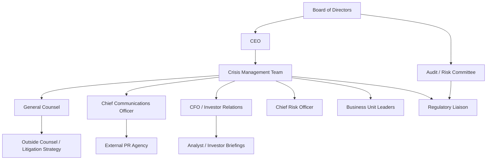
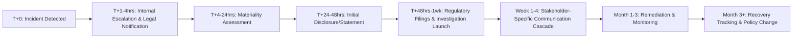

## Corporate and Private-Sector Applications

### Definition and Scope

Corporate and private-sector crisis management applies the general crisis lifecycle (Pre-Crisis Planning → Response → Post-Crisis Recovery) to the specific structural, legal, and market conditions that distinguish for-profit enterprises from government, nonprofit, or public-sector entities. Private-sector organizations answer to a distinct constellation of stakeholders — shareholders, boards, regulators, customers, competitors, and capital markets — and operate under disclosure obligations, competitive pressures, and fiduciary duties that shape how a crisis must be managed.

This domain spans multiple crisis archetypes: product safety/recall crises, data breaches, financial misconduct or fraud disclosure, executive misconduct, labor disputes, supply chain disruption, and M&A-related reputational events.

### Distinguishing Features of Private-Sector Crisis Management

**Key Points**

- **Fiduciary and disclosure obligations**: Publicly traded companies face securities law requirements (e.g., material event disclosure) that dictate *when* and *what* can be communicated, often creating tension with the instinct toward rapid, transparent crisis communication.
- **Competitive exposure**: Crises are frequently exploited by competitors for market advantage, requiring simultaneous crisis response and competitive positioning.
- **Shareholder primacy vs. stakeholder capitalism tension**: Boards must balance legal fiduciary duty to shareholders against broader stakeholder expectations (employees, communities, customers), which is an active and unsettled area of corporate governance debate.
- **M&A and valuation sensitivity**: Reputational damage translates directly into quantifiable financial impact (stock price, credit rating, deal valuation), giving crisis response a harder ROI case than in public-sector contexts.
- **Litigation exposure**: Private companies face shareholder derivative suits, class actions, and regulatory enforcement in ways that shape legal counsel's influence over communication strategy.

### Governance Structure for Corporate Crisis Management

### Key Corporate Crisis Archetypes

**1. Product Safety and Recall Crises**

Governed by regulatory frameworks specific to industry (e.g., CPSC for consumer products, NHTSA for automotive, FDA for pharmaceuticals/food in the U.S.). Requires coordination between legal (regulatory filing obligations), operations (supply chain/logistics for recall execution), and communications (consumer notification).

**2. Data Breach and Cybersecurity Incidents**

Subject to breach notification laws that vary by jurisdiction (e.g., GDPR's 72-hour notification requirement in the EU, U.S. state-level breach notification statutes). Requires forensic investigation before public statements, creating a common tension between the desire for speed and the legal/technical necessity of accuracy.

**3. Financial Misconduct and Restatement**

Involves SEC (or equivalent regulator) disclosure obligations, audit committee involvement, and often requires simultaneous internal investigation (frequently via outside counsel to preserve privilege) and external communication to markets.

**4. Executive Misconduct**

Board-level crises requiring independent investigation, succession planning, and careful sequencing of personnel action versus public disclosure — often the most reputationally volatile category due to leadership-trust implications.

**5. Labor and Workplace Crises**

Strikes, workplace safety incidents, harassment/discrimination allegations — increasingly amplified by social media and subject to NLRB or equivalent labor-relations regulatory scrutiny.

**6. Supply Chain and Operational Disruption**

Crises originating outside direct organizational control (supplier failure, geopolitical disruption, natural disaster affecting logistics) requiring crisis communication to distinguish the company's own culpability from external causation.

### Stakeholder Prioritization Matrix

| Stakeholder | Primary Concern | Key Communication Channel | Legal/Regulatory Overlay |
| --- | --- | --- | --- |
| Shareholders/Investors | Financial impact, governance response | 8-K/press release, earnings call | Securities disclosure law |
| Board of Directors | Fiduciary exposure, executive accountability | Board briefings, special committee reports | Duty of care/loyalty |
| Regulators | Compliance, public safety | Formal filings, direct liaison | Sector-specific regulatory regime |
| Customers | Product/service trust, safety | Direct notification, public statements | Consumer protection law |
| Employees | Job security, safety, leadership trust | Internal town halls, direct manager cascade | Labor law, whistleblower protections |
| Media/Public | Narrative accuracy, accountability | Press statements, spokesperson interviews | Defamation risk considerations |
| Competitors | Market opportunity | N/A (monitor, don't engage directly) | Antitrust considerations if coordinating |

### Legal-Communications Coordination Model

A persistent operational challenge in corporate crisis management is the structural tension between **Legal's risk-minimization instinct** (say less, admit nothing, preserve privilege) and **Communications' trust-repair instinct** (say more, show accountability, act quickly). Mature organizations resolve this through:

- **Pre-negotiated decision protocols**: Establishing in advance (during pre-crisis planning) which statements require joint legal-comms sign-off versus comms-only authority, avoiding real-time negotiation during acute crisis.
- **Privileged investigation tracks**: Conducting fact-finding under attorney-client privilege (often via outside counsel) while allowing a parallel, non-privileged communications track to proceed with what is already confirmed and public.
- **Designated crisis counsel role**: A single legal point-of-contact embedded in the crisis team (rather than rotating counsel) to maintain consistency and speed.

[Inference] The relative influence of Legal versus Communications in a given crisis response often depends heavily on company-specific culture, the personal dynamic between General Counsel and CCO, and the severity of litigation exposure — this is not a uniformly standardized allocation across companies and can shift meaningfully case by case.

### Regulatory and Disclosure Considerations (Illustrative, U.S.-Centric)

**Key Points**

- **Materiality threshold**: Public companies must assess whether a crisis constitutes a "material" event requiring disclosure (e.g., Form 8-K in the U.S.) — a legal determination, not a communications one, but one that constrains what can be said publicly and when.
- **Selective disclosure prohibition**: Regulation FD (Fair Disclosure) prevents companies from giving material non-public information to select analysts/investors ahead of the public, which shapes how investor relations must sequence crisis communications.
- **Safe harbor for forward-looking statements**: Companies often include legal disclaimers when discussing remediation timelines or projected recovery to limit liability if projections don't materialize.
- **Cross-jurisdictional complexity**: Multinational corporations face overlapping and sometimes conflicting disclosure/notification requirements (e.g., GDPR vs. U.S. state breach laws vs. sector regulators in other jurisdictions), requiring centralized legal coordination.

[Unverified] Specific disclosure timelines and materiality thresholds vary by jurisdiction and are subject to regulatory change; organizations should confirm current requirements with securities/regulatory counsel rather than relying on general frameworks, as rules in this area are actively evolving.

### Corporate Crisis Response Timeline (Illustrative)

### Common Pitfalls

- **Legal veto paralysis**: Allowing legal risk-aversion to indefinitely delay any public statement, ceding narrative control to media/social platforms during the vacuum.
- **Investor-employee message inconsistency**: Communicating a confident, controlled narrative to investors while internal employee messaging reveals a starkly different (more alarmed) picture — inconsistencies that surface externally via leaks.
- **Underestimating competitor exploitation**: Failing to anticipate competitors using the crisis window for targeted customer acquisition campaigns.
- **Board disengagement**: Treating the crisis as purely a management-level operational issue without adequate board oversight, which can itself become a governance-failure narrative if the crisis escalates.
- **Over-reliance on outside PR agency without internal ownership**: External agencies can execute tactics but cannot substitute for internal accountability and decision authority during a fast-moving crisis.

### Illustrative Example

A publicly traded consumer electronics company discovers a battery defect causing overheating in a flagship product.

- **Legal** determines the defect rate and injury reports meet the threshold for mandatory regulatory reporting and securities materiality disclosure.
- **Communications** prepares a phased statement: acknowledging the issue and announcing a voluntary recall program before regulators mandate one, framing the company as proactive.
- **Investor Relations** coordinates an 8-K filing and preemptive analyst briefing to control the earnings-call narrative before the next quarterly call.
- **Operations** stands up a reverse-logistics recall program with call-center scaling.
- **HR/Internal Comms** briefs frontline retail and support staff before public announcement to prevent employees from being blindsided by customer questions.
- **Post-crisis**: The company commissions an independent product-safety audit and publishes revised battery-testing protocols, later cited to regulators as evidence of remediation during settlement negotiations.

### Related Topics

- Organizational Learning and Policy Change
- Monitoring Long-Term Reputation Recovery
- Government and Public-Sector Crisis Management
- Nonprofit and NGO Crisis Management
- Securities Disclosure and Investor Relations During Crisis
- Legal-Communications Coordination Protocols
- Product Recall Management and Regulatory Compliance
- Executive Succession Planning Under Crisis Conditions