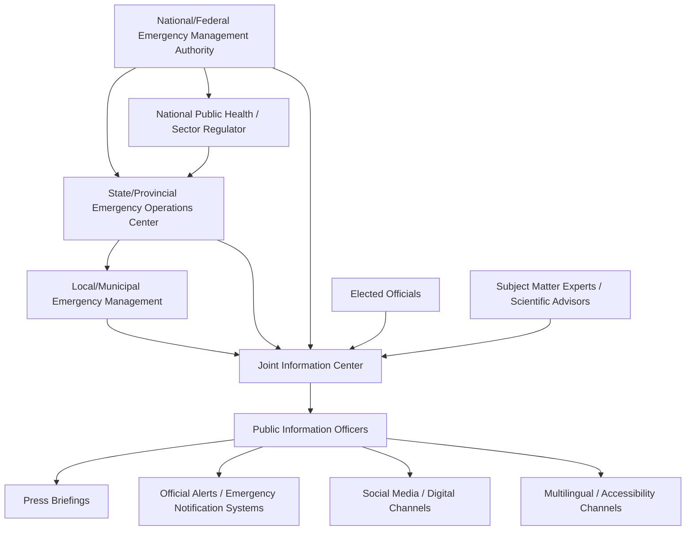

## Government and Public-Sector Crisis Communication

### Definition and Scope

Government and public-sector crisis communication applies crisis management principles within the distinct constraints of public accountability, legal mandate, and democratic legitimacy that separate government entities from private corporations. Public-sector bodies — municipal, state/provincial, national, and supranational — communicate during crises not merely to protect institutional reputation but to fulfill a statutory or constitutional duty to inform, protect, and coordinate the public, often under direct legal authority (emergency powers, public health mandates, disaster declarations).

This domain spans natural disaster response, public health emergencies, infrastructure failure, security incidents (terrorism, civil unrest), and governmental misconduct or policy failure crises.

### Distinguishing Features of Public-Sector Crisis Communication

**Key Points**

- **Legitimacy vs. reputation**: Government credibility failures can erode trust in public institutions broadly, not just in the specific agency involved — the stakes extend beyond the organization itself to democratic governance function.
- **Multi-jurisdictional coordination**: Crises frequently span overlapping authorities (federal/national, state/provincial, local/municipal, and sometimes international), requiring coordination structures that private companies rarely need.
- **No competitive exit option**: Citizens cannot "switch providers" the way consumers can abandon a brand, which changes crisis dynamics — but also means public backlash translates into political and electoral consequences rather than market share loss.
- **Transparency and public records obligations**: Freedom of Information / open records laws create a different disclosure environment than corporate confidentiality norms, and communications are often subject to eventual public archival.
- **Political dimension**: Elected officials and career civil servants often have divergent incentives (political survival vs. institutional continuity), which can create internal friction during crisis messaging decisions.
- **Resource and jurisdictional constraints**: Public agencies often operate with less communications infrastructure and budget than large private corporations, despite facing crises with population-wide stakes.

### Government Crisis Coordination Structure (Illustrative, Federated Model)

### The Joint Information Center (JIC) Model

A core structural mechanism in public-sector crisis communication (used extensively in U.S. FEMA/Incident Command System frameworks and adapted internationally) is the **Joint Information Center** — a centralized location or virtual structure where public information officers (PIOs) from multiple involved agencies coordinate messaging to avoid contradictory statements.

**Key Points**

- Ensures a **single, consistent public narrative** even when multiple agencies (health, law enforcement, emergency management, environmental) have jurisdiction over different aspects of the crisis.
- Assigns a **Lead PIO** or spokesperson hierarchy to prevent competing or conflicting statements from different agency representatives.
- Integrates **scientific/technical advisors** directly into message drafting to maintain accuracy on complex topics (epidemiology, engineering failure, environmental contamination).
- Coordinates **translation and accessibility functions** as a first-class requirement, not an afterthought, given the public-safety stakes of inaccessible communication.

### Key Public-Sector Crisis Archetypes

**1. Natural Disaster Response**

Governed by emergency management frameworks (e.g., FEMA's National Incident Management System in the U.S., or equivalent civil protection structures elsewhere) with pre-established roles, alert systems (e.g., Wireless Emergency Alerts, sirens), and evacuation communication protocols.

**2. Public Health Emergencies**

Requires balancing scientific uncertainty communication (evolving guidance as evidence develops) against public demand for definitive answers — a tension made highly visible during large-scale pandemic response, where messaging consistency across jurisdictions proved difficult.

**3. Infrastructure Failure**

Water contamination, power grid failure, transportation system incidents — often involve a specific accountability question (was this failure foreseeable/preventable) that intersects with public works funding and maintenance policy debates.

**4. Security and Public Order Incidents**

Terrorism, civil unrest, mass violence events — require close coordination between law enforcement operational security needs (withholding certain details) and public communications needs (providing reassurance and safety guidance), which can be in direct tension.

**5. Governmental Misconduct or Policy Failure**

Corruption revelations, policy implementation failures, oversight lapses — carry unique reputational dynamics because the "crisis manager" (the agency/official) is also frequently the subject of the accountability demand, unlike corporate crises where the company can position itself as the entity fixing an external problem.

### Communication Principles Specific to Public Health/Safety Crises

Drawing from established risk communication frameworks (e.g., CDC's Crisis and Emergency Risk Communication model):

| Principle | Description |
| --- | --- |
| Be First | Public agencies should be the first source of information; a vacuum is quickly filled by rumor and misinformation |
| Be Right | Accuracy takes precedence over speed when the two conflict; acknowledging uncertainty is preferable to false precision |
| Be Credible | Honesty about what is and isn't known builds more durable trust than false reassurance |
| Express Empathy | Acknowledging public fear/loss before presenting technical information |
| Promote Action | Giving the public concrete, actionable steps reduces anxiety and supports compliance |
| Show Respect | Communicating in a way that respects public autonomy and intelligence, avoiding paternalism |

### Managing Scientific Uncertainty in Public Communication

**Key Points**

- **Evolving guidance problem**: Public health/safety guidance often changes as evidence develops, which can be misinterpreted as incompetence or dishonesty if the *reason* for the change isn't clearly communicated.
- **Uncertainty framing**: Best practice communicates confidence levels explicitly ("based on current evidence," "this guidance may change as we learn more") rather than presenting provisional guidance as settled fact.
- **Avoiding false balance**: When scientific/expert consensus exists, communications should reflect that consensus rather than presenting fringe positions as equally weighted, while still respecting legitimate public debate about policy trade-offs (which are values questions, not purely scientific ones).

[Inference] The specific reputational cost of "changing guidance" versus "maintaining an incorrect position" is difficult to quantify empirically and likely depends heavily on how the change is framed and the pre-existing trust level in the institution — this is an area of ongoing study in risk communication research rather than a settled finding.

### Multi-Jurisdictional Coordination Challenges

- **Message consistency across levels of government**: National guidance and local/regional implementation can diverge due to differing local conditions, creating perceived contradictions even when both are technically correct for their context.
- **Resource asymmetry**: Local/municipal agencies often lack the communications infrastructure of national bodies, requiring national-to-local support structures (template messaging, translated materials, spokesperson training).
- **International coordination**: Cross-border crises (pandemics, environmental disasters, security threats) require coordination with international bodies (WHO, UN agencies) and other national governments, introducing additional consistency challenges.

### Common Pitfalls

- **Message fragmentation across agencies**: Multiple agencies issuing separate, uncoordinated statements that appear contradictory to the public, undermining trust even when each statement is individually accurate.
- **Political messaging overriding technical accuracy**: Elected officials pressuring technical agencies to soften or delay unfavorable information for political reasons, which — if later revealed — causes compounding institutional trust damage.
- **Underestimating misinformation velocity**: Failing to proactively monitor and rapidly counter misinformation/disinformation, particularly on social platforms, allowing false narratives to become entrenched before official correction.
- **Accessibility and equity gaps**: Communications that fail to reach non-native-language speakers, disabled populations, or areas with limited digital access — a public-sector-specific liability given the universal-service obligation absent in private markets.
- **Post-crisis accountability avoidance**: Public officials facing stronger incentive than private executives to minimize acknowledgment of institutional failure due to political survival concerns, which can delay the organizational learning processes needed for future crisis prevention.

### Illustrative Example

A regional water utility discovers contamination in the municipal water supply.

- **Immediate action**: Local emergency management issues a "boil water" advisory through emergency alert systems, translated into the region's major languages, with parallel notification via social media, local broadcast, and door-to-door outreach in areas with limited digital access.
- **Coordination**: A Joint Information Center is stood up involving the water utility, state environmental regulator, and local public health department, with a single spokesperson hierarchy established to prevent conflicting statements about contamination severity.
- **Scientific communication**: Public health officials explain the specific contaminant, health risks, and testing timeline, explicitly noting where information is still being confirmed.
- **Equity consideration**: Bottled water distribution is prioritized for elderly, disabled, and low-income residents who may have difficulty accessing alternative water sources.
- **Post-crisis**: An independent engineering review is commissioned; findings are made public under open-records obligations; infrastructure investment policy is revised, with the utility's governing board holding public hearings as part of the accountability and organizational learning process.

### Related Topics

- Corporate and Private-Sector Applications
- Nonprofit and NGO Crisis Communication
- Organizational Learning and Policy Change
- Risk Communication Theory and Frameworks (CERC Model)
- Misinformation and Disinformation Response Strategy
- Emergency Alert Systems and Public Warning Technology
- Multilingual and Accessibility-First Crisis Communication Design
- Political Accountability and Institutional Trust Repair