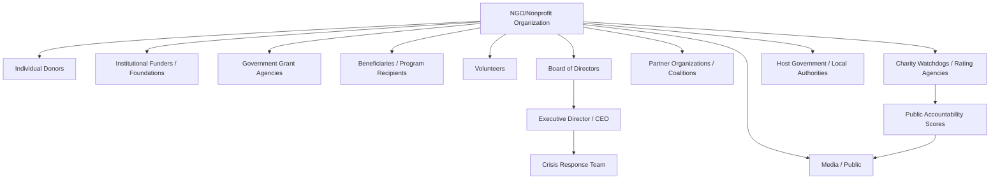

## Nonprofit and NGO Reputation Management

### Definition and Scope

Nonprofit and NGO reputation management applies crisis and reputation principles within the distinct operating conditions of mission-driven organizations that depend on donor trust, volunteer goodwill, beneficiary confidence, and public legitimacy rather than shareholder value or electoral mandate. Because nonprofits typically lack the financial reserves of large corporations and the coercive/statutory authority of government agencies, reputational damage can threaten organizational survival more directly and more quickly than in either the private or public sector.

This domain spans fundraising/financial scandals, program failure or beneficiary harm, leadership misconduct, mission drift controversies, partnership/funder controversies, and crises arising from the populations or causes NGOs serve (particularly for organizations operating in conflict zones, humanitarian crises, or politically sensitive advocacy areas).

### Distinguishing Features of Nonprofit/NGO Reputation Management

**Key Points**

- **Trust as the core operating asset**: Nonprofits' entire resource base (donations, grants, volunteer labor, government contracts) depends on perceived integrity and effectiveness; reputational damage translates almost immediately into funding risk, unlike corporations that may retain customers through product necessity or lock-in.
- **Resource asymmetry**: Most nonprofits operate with minimal dedicated communications staff or crisis budgets compared to corporations or government agencies, creating structural vulnerability during fast-moving crises.
- **Mission-reputation entanglement**: A nonprofit's reputation is often inseparable from public perception of its *cause* itself — a scandal can damage not only the organization but public willingness to support the broader mission or sector (e.g., "charity fatigue" or sector-wide donor skepticism following a high-profile scandal).
- **Multi-stakeholder complexity unique to the sector**: Donors, beneficiaries, volunteers, grant-making foundations, government funders, and partner organizations often have divergent and sometimes conflicting expectations and information needs.
- **Watchdog and rating agency exposure**: Sector-specific evaluators (e.g., charity rating/accountability organizations) monitor and publicly score financial efficiency and governance, creating an additional layer of reputational accountability not present for most private companies.
- **International/cross-cultural operating risk**: NGOs operating across borders, particularly in humanitarian or development contexts, face reputational risks tied to cultural missteps, local political entanglement, and safeguarding failures involving vulnerable populations.

### Nonprofit Crisis Stakeholder Map

### Key Nonprofit/NGO Crisis Archetypes

**1. Financial Mismanagement and Fundraising Scandals**

Misallocation of funds, excessive executive compensation relative to program spending, or fraud allegations — directly threatens the "trust in stewardship" that underlies all giving. Often triggers scrutiny of overhead ratios and administrative cost percentages by watchdog organizations and media.

**2. Program Failure or Beneficiary Harm**

Cases where the organization's own program causes unintended harm to the population it intends to serve (e.g., aid distribution errors, safeguarding failures, program interventions with adverse outcomes) — reputationally severe because it undermines the core mission legitimacy, not just operational competence.

**3. Leadership Misconduct**

Executive or founder misconduct (financial, ethical, or interpersonal) — often disproportionately damaging in nonprofits because founder/leader identity is frequently fused with organizational brand and mission narrative in public perception.

**4. Safeguarding Failures**

Sexual misconduct, exploitation, or abuse involving staff/volunteers and vulnerable beneficiaries (particularly acute in international humanitarian and child-serving organizations) — represents one of the most severe reputational and ethical crisis categories in the sector, with significant historical precedent of sector-wide reckoning following major scandals.

**5. Mission Drift and Values Controversies**

Public perception that the organization has strayed from its founding mission, engaged in excessive political activity relative to its charitable status, or made partnership/funding decisions perceived as compromising independence (e.g., accepting funding from sources seen as conflicting with the mission).

**6. Partnership and Funder-Related Controversies**

Reputational risk transferred from a corporate sponsor, partner organization, or funder whose own conduct becomes controversial, raising "guilt by association" questions about the nonprofit's due diligence in accepting the relationship.

### Nonprofit-Specific Crisis Response Considerations

**Key Points**

- **Board governance role is often more central and public-facing** than in corporations — nonprofit boards are frequently expected to take visible accountability action (independent investigation commissioning, leadership decisions) given their fiduciary and mission-oversight role.
- **Transparency expectations exceed private-sector norms**: Donors and watchdogs often expect a level of financial and operational transparency during crisis response that would be unusual for a private company, given the public-trust nature of charitable funds.
- **Resource-constrained crisis response**: Many nonprofits must rely on pro bono communications/legal support, board member expertise, or sector coalition resources (e.g., nonprofit association crisis-support networks) rather than in-house crisis capability.
- **Donor retention vs. new donor acquisition trade-off**: Crisis communication must address both reassuring existing donors (relationship-based, often personally invested) and managing new-donor acquisition messaging, which may require different tones.
- **Beneficiary-first framing**: Effective nonprofit crisis response typically centers the impact on and response for affected beneficiaries first, before institutional reputation concerns — both an ethical imperative and, pragmatically, the framing stakeholders expect from a mission-driven entity.

### Charity Accountability and Watchdog Considerations

Charity evaluation and rating organizations (which assess financial health, accountability, and transparency) play an outsized role in nonprofit reputation relative to analogous private-sector rating mechanisms, because:

- Their scores are often directly cited in individual donor decision-making and are searchable/comparable across organizations.
- A downgraded rating can trigger immediate and visible funding consequences, unlike a single negative product review affecting a private company.
- Proactive engagement with these evaluators during a crisis (transparent disclosure, timely audited financials) can materially affect rating outcomes and downstream reputational recovery speed.

[Unverified] Specific rating methodologies, weighting criteria, and thresholds vary across different charity evaluation organizations and are updated periodically; organizations should consult current published methodologies directly from the relevant rating body rather than relying on general assumptions, since these criteria are subject to change.

### Post-Crisis Recovery Considerations Specific to Nonprofits

- **Independent investigation and public reporting**: Given elevated transparency expectations, publishing investigation findings (or a credible summary) is often necessary for donor confidence restoration, more so than is typical in private-sector crises.
- **Governance reform visibility**: Board composition changes, new safeguarding policies, or financial oversight reforms need to be *publicly* communicated, not just internally implemented, since donor trust repair depends on visible structural change.
- **Sector coalition engagement**: Because scandals can trigger "sector contagion" (donor skepticism spreading to other organizations in the same cause area), some recovery strategies involve coordinating with sector associations on collective standard-setting responses.
- **Beneficiary relationship repair**: Distinct from donor-facing recovery, programs often require dedicated community trust-rebuilding efforts with the populations directly affected, which may follow a different timeline and require different methods (community engagement, local partnership) than donor-facing communications.

### Common Pitfalls

- **Defensive posture undermining mission credibility**: Responding to legitimate accountability questions with defensiveness rather than transparency, which is particularly damaging for organizations whose entire value proposition rests on public trust.
- **Underinvestment in crisis preparedness**: Treating crisis communication planning as an unaffordable luxury relative to program funding, leaving the organization unprepared when a crisis emerges.
- **Overhead ratio fixation backfiring**: Overemphasizing low administrative/overhead spending as a defensive metric, which can create pressure to underinvest in the governance, safeguarding, and oversight infrastructure that prevents crises in the first place — a dynamic sometimes referred to as the "overhead myth" tension in the sector.
- **Founder-dependency risk**: Organizations built heavily around a single charismatic founder/leader face acute reputational vulnerability if that individual is the source of the crisis, with no institutional identity to fall back on.
- **Slow safeguarding response**: Delayed or inadequate response to safeguarding allegations involving vulnerable populations, which carries both severe ethical stakes and disproportionate reputational and legal consequences if mishandled.
- **Sector contagion underestimation**: Failing to anticipate that a scandal at one organization can trigger heightened donor scrutiny across the entire cause area, requiring proactive reassurance even for unaffected peer organizations.

### Illustrative Example

An international humanitarian NGO discovers that field staff in a disaster-response program engaged in exploitation of aid recipients.

- **Immediate response**: The organization suspends implicated staff, notifies host-government authorities and relevant law enforcement, and commissions an independent, external investigation rather than relying solely on internal review — addressing both the ethical imperative and donor/public expectation of independence.
- **Beneficiary-first communication**: Establishes a confidential reporting and support mechanism for affected individuals before issuing broader public statements.
- **Donor and funder communication**: Proactively briefs major institutional funders and government grant agencies ahead of public disclosure, given contractual and compliance obligations tied to continued funding.
- **Board action**: The board commissions a governance review of safeguarding policy failures and publicly commits to specific structural reforms (e.g., independent safeguarding ombudsperson, revised vetting protocols).
- **Sector engagement**: The organization participates in a sector-wide coalition response addressing safeguarding standards across the humanitarian aid field, both to rebuild sector-wide trust and to demonstrate leadership rather than isolated damage control.
- **Long-term monitoring**: Donor retention, foundation grant renewal rates, and watchdog ratings are tracked over an extended recovery period, alongside separate community-trust indicators in the affected program region.

### Related Topics

- Government and Public-Sector Crisis Communication
- Corporate and Private-Sector Applications
- Organizational Learning and Policy Change
- Monitoring Long-Term Reputation Recovery
- Safeguarding Policy and Vulnerable Population Protection
- Charity Governance and Board Accountability Structures
- Donor Trust Repair and Fundraising Communication Strategy
- Sector Coalition Crisis Response and Collective Standard-Setting