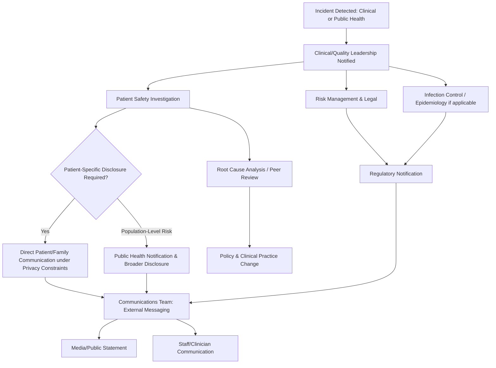

## Healthcare and Public Health Crisis Communication

### Definition and Scope

Healthcare and public health crisis communication addresses the distinct requirements of crises involving patient safety, clinical outcomes, disease outbreak, and health system integrity — a domain where communication decisions carry direct life-and-death stakes rather than solely reputational or financial ones. This spans two related but distinct institutional contexts: **healthcare provider organizations** (hospitals, health systems, medical practices) managing clinical/operational crises, and **public health authorities** (health departments, disease control agencies) managing population-level health threats.

The domain covers medical error and patient harm events, hospital-acquired infection outbreaks, disease outbreaks and pandemics, pharmaceutical/medical device safety issues, healthcare data breaches (a subset with heightened sensitivity given medical privacy expectations), health system operational failures (e.g., care access disruptions), and clinician misconduct.

### Distinguishing Features of Healthcare Crisis Communication

**Key Points**

- **Clinical uncertainty as an inherent condition**: Unlike many corporate crises where facts are eventually knowable, health crises often involve genuine scientific uncertainty (evolving disease understanding, individual patient variability) that must be communicated honestly without undermining public confidence.
- **Regulatory and clinical governance overlay**: Healthcare crises intersect with medical licensing boards, accreditation bodies, clinical quality regulators, and (for pharma/devices) product safety regulators — creating parallel clinical-governance and communications tracks.
- **HIPAA/medical privacy constraints** (or equivalent health-privacy regimes internationally): Legal restrictions on disclosing patient-specific information significantly constrain what can be publicly confirmed even when transparency is otherwise desirable, creating a communication environment structurally different from most other sectors.
- **Life-safety urgency**: Communication timing decisions can have direct clinical consequences (e.g., delayed outbreak notification enabling further transmission), raising the stakes of "be first vs. be right" tension beyond reputational consideration into public health outcome territory.
- **Trust as a clinical variable, not just a business one**: Patient trust in healthcare institutions and public health authorities directly affects care-seeking behavior, treatment adherence, and vaccination/public health measure uptake — meaning reputational damage has measurable downstream health impact, not only financial impact.
- **Clinician-institution dynamic**: Individual clinicians often have professional and ethical obligations (and their own licensing exposure) that can create distinct communication tracks from the institution's official position.

### Healthcare Crisis Response Structure

### Key Healthcare Crisis Archetypes

**1. Medical Error and Patient Harm Events**

Individual or systemic clinical errors (surgical errors, medication errors, diagnostic failures) requiring a dual-track response: direct, often legally sensitive disclosure to the affected patient/family, and separate broader public/regulatory communication if the error indicates systemic risk (e.g., a pattern suggesting other patients may be affected).

**2. Healthcare-Associated Infection Outbreaks**

Outbreaks within a facility (e.g., surgical site infections, multidrug-resistant organism transmission) requiring coordination between infection control/epidemiology, regulatory reporting, and patient notification — often complicated by the need to identify and notify potentially affected patients without inducing disproportionate alarm.

**3. Disease Outbreak and Pandemic Response**

Population-level public health emergencies requiring the risk communication principles common to government crisis communication (see related topic) but with healthcare-system-specific dimensions: surge capacity communication, care rationing/triage ethics communication, and clinical guidance for practitioners that must stay synchronized with public messaging.

**4. Pharmaceutical and Medical Device Safety Issues**

Adverse event signals, recalls, or safety communications regulated by pharmaceutical/device regulatory bodies (e.g., FDA in the U.S., EMA in the EU) — requiring careful risk-benefit framing since abrupt discontinuation communication can itself cause patient harm if patients stop needed treatment without medical guidance.

**5. Healthcare Data Breaches**

Subject to heightened sensitivity given the intimate nature of medical information (diagnoses, mental health, reproductive health, substance use treatment records) — breach notification often carries greater reputational and patient-trust risk than equivalent breaches of purely financial data.

**6. Health System Operational Failures**

Emergency department closures, care access disruptions, staffing crises affecting care quality — increasingly relevant given healthcare workforce and capacity strain across many health systems, requiring transparent community communication about care access changes.

### Disclosure Communication: Patient-Level vs. Population-Level

| Dimension | Patient-Level (Individual Harm) | Population-Level (Outbreak/Public Health) |
| --- | --- | --- |
| Primary obligation | Direct disclosure to patient/family, informed by medical ethics disclosure norms | Public health notification, often statutorily mandated |
| Privacy constraint | High — governed by medical privacy law | Lower for aggregate data, high for identifiable case information |
| Communication owner | Treating clinician + risk management | Public health/epidemiology + communications |
| Timing driver | Clinical ethics (prompt disclosure norms) + legal counsel | Outbreak containment urgency |
| External audience | Typically none beyond regulator, unless pattern indicates broader risk | Public, media, potentially international health bodies |

### Managing Scientific and Clinical Uncertainty

**Key Points**

- **Evolving evidence communication**: As with government public health communication, healthcare crises often require updating guidance as evidence develops (e.g., treatment protocols, risk assessments), which must be framed as normal scientific process rather than institutional failure.
- **Avoiding false reassurance**: Overstating certainty to calm public/patient anxiety in the short term can produce more severe trust damage if the situation evolves unfavorably — a well-documented risk-communication failure pattern.
- **Distinguishing individual risk from population risk**: Public health messaging must often communicate population-level risk assessments while individual patients/families are naturally focused on personal risk, requiring message layering (population guidance plus individualized clinical consultation pathways).
- **Managing dissenting clinical opinion publicly**: Healthcare crises, especially large-scale ones, often surface genuine clinical/scientific disagreement; institutions must communicate a coherent institutional position while acknowledging legitimate debate exists, without appearing to suppress dissent inappropriately.

[Inference] The optimal balance between projecting confident public health guidance and transparently acknowledging scientific uncertainty is an active area of risk-communication research without a single settled formula; the right approach likely varies by crisis type, population trust baseline, and information environment, and reasonable practitioners disagree on specific tactics.

### Clinician and Institutional Voice Coordination

A distinguishing structural feature of healthcare crisis communication is the need to coordinate multiple credible voices with different authority types:

- **Institutional spokesperson** (hospital administration/communications): speaks to policy, process, and organizational accountability.
- **Clinical/medical spokesperson** (Chief Medical Officer, relevant specialist): speaks to clinical facts, treatment guidance, and scientific context — often carries more public credibility on clinical questions than administrative spokespeople.
- **Public health officer** (in outbreak contexts): speaks with statutory authority on population-level guidance, sometimes independent of or alongside the healthcare institution.

Mature crisis communication plans pre-identify which spokesperson addresses which question category, avoiding both message conflicts and inappropriate use of administrative spokespeople for clinical questions they aren't positioned to credibly answer.

### Common Pitfalls

- **Privacy-driven communication vacuum**: Over-invoking privacy constraints to avoid any public comment, when a general (non-patient-identifying) statement addressing systemic concerns is both legally permissible and necessary for public trust.
- **Delayed outbreak notification**: Prioritizing reputational concerns over timely public health notification, which can cause both greater ultimate reputational damage (if discovered) and actual public health harm.
- **Clinical-administrative message misalignment**: Administrative spokespeople making clinical claims beyond their expertise, undermining credibility with both clinical staff and medically literate public audiences.
- **Underestimating the amplification of health misinformation**: Health topics are particularly susceptible to misinformation spread, requiring proactive and sustained correction efforts rather than one-time statements.
- **Treating uncertainty acknowledgment as weakness**: Avoiding honest uncertainty communication out of fear it undermines authority, when research on risk communication generally suggests appropriately framed uncertainty acknowledgment tends to support rather than undermine long-term credibility.
- **Neglecting clinician/staff communication**: Focusing crisis communication resources externally while frontline clinical staff — who face direct patient questions — are left uninformed or under-briefed.

### Illustrative Example

A hospital identifies a cluster of surgical site infections linked to a sterilization process failure in one operating suite.

- **Immediate clinical response**: Infection control halts use of the affected suite, epidemiology begins case investigation, and the hospital's regulatory/quality team initiates mandatory reporting to the relevant health authority.
- **Patient-level disclosure**: Affected patients and families are contacted directly by their treating clinicians (not administrative staff) under established medical disclosure protocols, before any public statement is made.
- **Population-level assessment**: Once the potentially affected patient cohort is identified, the hospital determines whether broader public notification is warranted (e.g., if a wider range of patients need testing) versus targeted individual outreach.
- **Public communication**: If broader disclosure is warranted, a joint statement from the Chief Medical Officer (clinical facts, patient guidance) and hospital administration (process failure, remediation steps) is issued, avoiding assigning administrative voice to clinical risk explanation.
- **Regulatory and clinical governance**: A root cause analysis is conducted, feeding into revised sterilization protocol and staff competency verification — both reported to the accrediting body and, per organizational learning best practice, converted into a policy change with a named accountable owner and review date.
- **Recovery monitoring**: Patient trust surveys, staff safety-culture surveys, and infection-rate metrics are tracked over an extended period, feeding into the hospital's standard patient-safety and quality dashboards.

### Related Topics

- Government and Public-Sector Crisis Communication
- Organizational Learning and Policy Change
- Monitoring Long-Term Reputation Recovery
- Risk Communication Theory and Frameworks (CERC Model)
- Medical Error Disclosure and Patient Safety Ethics
- Pharmaceutical and Medical Device Regulatory Communication
- Healthcare Data Privacy and Breach Notification Requirements
- Health Misinformation Response Strategy