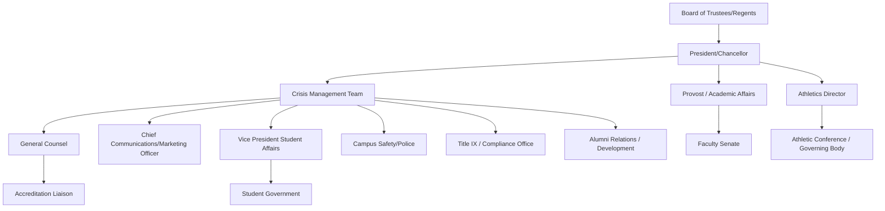

## Higher Education Crisis Management

### Definition and Scope

Higher education crisis management addresses the distinct institutional, governance, and stakeholder conditions of colleges and universities — organizations that combine elements of public-sector accountability (especially public institutions), corporate-style governance and financial exposure, and a uniquely dense, overlapping stakeholder ecosystem of students, faculty, staff, alumni, parents, trustees, and accreditors. Universities operate simultaneously as educational institutions, employers, research enterprises, campus communities, real estate/operational entities, and (for many) athletics organizations — each of which generates its own crisis exposure.

This domain spans campus safety incidents, student mental health and welfare crises, sexual misconduct and Title IX (or equivalent) matters, academic integrity and research misconduct, athletics scandals, free speech and protest controversies, financial/governance crises, and faculty/administrative misconduct.

### Distinguishing Features of Higher Education Crisis Management

**Key Points**

- **In loco parentis legacy and duty-of-care expectations**: Universities face elevated public expectation of responsibility for student welfare — physical, psychological, and academic — beyond what most employers owe employees, creating heightened scrutiny during student-harm crises.
- **Multiple overlapping and semi-autonomous constituencies**: Faculty governance (often via faculty senate structures with independent authority), student government, athletics departments, and academic units can each generate crises with limited central administrative control, unlike a corporate hierarchy.
- **Shared governance tension**: Decisions that would be unilateral in a corporation (e.g., program closures, policy changes) often require faculty senate consultation or approval, slowing crisis response and creating a distinct internal-politics dimension.
- **Academic freedom and free expression considerations**: Crises involving speech, protest, or controversial research/teaching content require balancing institutional reputation management against free expression and academic freedom principles — a tension largely absent in corporate crisis contexts.
- **Multi-year stakeholder relationships**: Students and families are stakeholders for 4+ years and often for life (as alumni/donors), meaning crisis mishandling has a longer relationship-damage horizon than most transactional consumer relationships.
- **Reputational fragility tied to rankings and admissions**: Institutional reputation directly affects application volume, admitted-student yield, and rankings — creating measurable enrollment and revenue consequences from reputational damage.
- **Athletics as a distinct high-visibility risk center**: Major athletics programs generate reputational exposure disproportionate to their share of institutional activity, often with separate governance/oversight structures (athletic conferences, national governing bodies) layered on top of institutional crisis response.

### Higher Education Crisis Governance Structure

### Key Higher Education Crisis Archetypes

**1. Campus Safety Incidents**

Violence, active threats, or emergencies requiring coordination between campus safety/police, emergency notification systems, and communications — governed in many jurisdictions by specific campus safety disclosure requirements (e.g., the Clery Act in the U.S., which mandates crime statistic reporting and timely warnings).

**2. Student Mental Health and Welfare Crises**

Individual student deaths (including suicide), mental health emergencies, or patterns suggesting systemic welfare gaps — carry acute reputational and duty-of-care scrutiny, often intersecting with questions about counseling resource adequacy and institutional responsiveness to warning signs.

**3. Sexual Misconduct and Title IX (or Equivalent) Matters**

Sexual harassment/assault allegations involving students, faculty, or staff — subject to specific federal/regulatory compliance frameworks in many jurisdictions, requiring parallel formal investigation processes (with their own procedural and confidentiality requirements) and separate public communication considerations.

**4. Academic Integrity and Research Misconduct**

Faculty research fraud, plagiarism, data fabrication — threatens institutional academic reputation and can affect research funding eligibility, requiring coordination with research integrity offices and funding agencies.

**5. Athletics Scandals**

Recruiting violations, athlete misconduct, coaching scandals, or safety failures in athletics programs — often the most publicly visible crisis category given media attention to college athletics, with governance overlap between the institution and external athletic conference/governing bodies.

**6. Free Speech, Protest, and Campus Expression Controversies**

Controversial speakers, student protests, faculty statements, or curriculum controversies — require institutions to navigate free expression commitments, safety considerations, and competing stakeholder demands (students, donors, political stakeholders) without appearing to suppress legitimate expression or fail to maintain campus order.

**7. Financial and Governance Crises**

Declining enrollment, endowment mismanagement, program closures, or leadership/board governance failures — increasingly relevant given financial pressures facing parts of the higher education sector, requiring transparent communication to faculty, staff, and students about institutional stability.

### Stakeholder Communication Considerations by Crisis Type

| Crisis Type | Primary Internal Audience | Primary External Audience | Key Regulatory/Compliance Overlay |
| --- | --- | --- | --- |
| Campus safety incident | Students, parents, faculty/staff | Media, local community | Campus safety disclosure laws |
| Student welfare/death | Affected community, students | Family, media (often limited/sensitive) | Privacy law (student records) |
| Title IX/misconduct | Complainant, respondent, campus community | Media (often limited during investigation) | Title IX or equivalent regulatory framework |
| Research misconduct | Faculty, research community | Funding agencies, academic press | Research integrity/funding compliance |
| Athletics scandal | Athletes, coaching staff, student body | Media, athletic conference, recruits | Athletic governing body rules |
| Free speech controversy | Faculty, students, board | Media, donors, political stakeholders | Constitutional/free expression principles (public institutions) |
| Financial crisis | Faculty, staff, students | Accreditors, bondholders (if applicable), alumni/donors | Accreditation standards |

### The Shared Governance Complication

**Key Points**

- Unlike corporate crisis response, where executive leadership can generally act decisively, many academic decisions require **faculty senate consultation or approval**, meaning crisis-driven policy changes (e.g., curriculum changes, program closures) may face longer decision timelines than the external communications timeline demands.
- **Tenure protections** mean that faculty-involved crises (misconduct, research fraud) often move through slower, procedurally protected disciplinary processes than would apply to at-will employees, creating a gap between public expectation of swift action and the institution's actual procedural constraints.
- **Student government and independent journalism** (many universities have active independent student newspapers) create an internal media environment with its own investigative capacity, sometimes surfacing information faster than institutional communications channels.

[Inference] The degree to which faculty governance structures slow crisis response varies significantly by institution type (research university vs. liberal arts college vs. community college) and specific governance culture; this is not a uniform constraint across all higher education institutions and depends heavily on institution-specific bylaws and history.

### Accreditation and Compliance Considerations

Crises that raise questions about institutional financial health, governance integrity, or academic quality can trigger **accreditation review** — a distinct compliance track from public communications, since accreditors assess institutional viability against defined standards and can place institutions on probation or warning status, which itself becomes a public and highly damaging reputational signal (affecting financial aid eligibility, credit transferability, and public perception of institutional legitimacy).

### Common Pitfalls

- **Underestimating parent/family as a distinct stakeholder group**: Treating students as the only "customer" stakeholder while parents/families (particularly at institutions serving traditional-age undergraduates) have independent expectations and, often, their own communication channels and advocacy capacity.
- **Legal caution suppressing compassionate communication**: Particularly in student death or Title IX-adjacent cases, over-lawyering institutional statements can appear cold or evasive to a grieving or traumatized community, compounding reputational harm.
- **Athletics-academic reputational spillover mismanagement**: Failing to anticipate that an athletics scandal will affect broader institutional reputation and admissions perception, treating it as a siloed athletics department issue.
- **Delayed or fragmented communication during shared-governance deliberation**: Allowing internal governance process timelines to dictate external communication timing, creating a perceived information vacuum.
- **Failure to leverage alumni/donor relationships proactively**: Not engaging trusted alumni or donor advocates during a crisis, missing an opportunity for credible third-party reassurance to key funding constituencies.
- **Inconsistent messaging across decentralized units**: Individual academic departments, athletics, or student affairs issuing uncoordinated statements that conflict with central institutional messaging.

### Illustrative Example

A university's athletics department faces allegations that coaching staff concealed a pattern of player safety-protocol violations.

- **Immediate response**: The university places the coaching staff on administrative leave, notifies the athletic conference/governing body per compliance obligations, and commissions an independent (non-athletics-department) investigation to preserve credibility.
- **Stakeholder sequencing**: Affected student-athletes and their families are briefed directly before public disclosure; the board of trustees and president's office are briefed given the governance-level reputational stakes.
- **Academic-athletic separation messaging**: Communications carefully distinguishes the athletics-specific failure from the institution's broader academic mission, while avoiding the appearance of minimizing the seriousness of player safety failures.
- **Shared governance engagement**: Faculty senate leadership is briefed given potential implications for broader institutional oversight and governance credibility, even though the incident originated in athletics.
- **External communication**: A joint statement from the university president and athletics director addresses accountability steps, while avoiding detailed comment on the ongoing independent investigation to preserve its integrity.
- **Post-crisis**: Recommendations from the independent investigation are converted into specific athletics oversight policy changes (e.g., independent athlete safety reporting channel, revised athletics department reporting line to a compliance officer outside the athletics department itself), with a public report to the board and, per accreditation and conference compliance requirements, to relevant external bodies.
- **Recovery monitoring**: Admissions inquiry volume, alumni giving patterns, and athletics program reputation metrics are tracked over an extended period alongside standard institutional reputation tracking.

### Related Topics

- Government and Public-Sector Crisis Communication
- Nonprofit and NGO Reputation Management
- Organizational Learning and Policy Change
- Monitoring Long-Term Reputation Recovery
- Title IX and Campus Misconduct Investigation Processes
- Athletics Governance and Conference Compliance
- Academic Freedom and Free Expression Policy in Crisis Contexts
- Accreditation Standards and Institutional Viability Communication