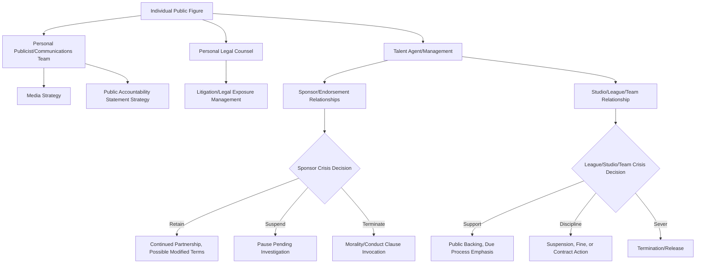

## Sports, Entertainment, and Celebrity Reputation

### Definition and Scope

Sports, entertainment, and celebrity reputation management addresses crisis dynamics centered on individual public figures — athletes, performers, executives, and cultural personalities — whose personal brand and public image function as both the primary asset and the primary point of failure. Unlike institutional crisis management, where an organization can distance itself from an individual's misconduct, this domain often involves cases where the individual *is* the brand, creating unique challenges around personal accountability, career longevity, and the blurred line between private conduct and public image.

This domain spans athlete misconduct and performance controversies, celebrity personal scandals, entertainment industry misconduct (including systemic industry issues), sponsorship/endorsement crisis management, social media-driven reputational events, and organizational crises within sports leagues, teams, and entertainment companies that intersect with individual public figures.

### Distinguishing Features of Individual/Celebrity Reputation Management

**Key Points**

- **Brand-person fusion**: Unlike a corporation that can terminate an employee to distance itself from misconduct, an individual public figure cannot separate from themselves — the reputation strategy must address personal rehabilitation, not institutional distancing.
- **Parasocial relationship dynamics**: Fans and audiences often have deep, one-sided emotional investment in celebrities, which can produce both intense loyalty (protective of the figure during controversy) and intense backlash (feeling personally betrayed), in ways more volatile than typical consumer-brand relationships.
- **24/7 media and social media exposure**: Public figures face continuous scrutiny of personal conduct with no "off-duty" period, and social media gives both the figure and critics/supporters direct, unmediated channels absent in most institutional crises.
- **Career-stage sensitivity**: Reputational management strategy differs significantly based on career stage — an established figure with a long track record has more reputational capital to draw on than an emerging figure, but also potentially more to lose.
- **Third-party dependency**: Athletes and celebrities depend on external institutions (leagues, studios, sponsors, agents, unions) whose independent reputational and business interests may not align with the individual's, creating multi-party crisis dynamics.
- **Public/private conduct boundary disputes**: Ongoing societal and legal debate over how much private conduct should affect public/professional standing, particularly acute for figures whose public image (family-friendly, "role model," edgy/controversial) is central to their commercial value.

### Multi-Party Crisis Structure for Public Figures

### Key Individual/Celebrity Crisis Archetypes

**1. Athlete Misconduct**

On-field or off-field conduct violations (doping, violence, criminal conduct, unsportsmanlike behavior) — involves parallel tracks: league/team disciplinary process, personal legal exposure, sponsor relationship management, and public image rehabilitation, often with distinct timelines that don't align (e.g., legal resolution taking years while public/sponsor reaction is immediate).

**2. Celebrity Personal Scandal**

Relationship controversies, substance abuse, personal conduct revelations — reputational impact heavily mediated by pre-existing public image (a figure whose brand includes public vulnerability/authenticity may face different reception than one whose brand rests on a curated "perfect" image, where revelation of a gap between image and reality compounds the damage).

**3. Entertainment Industry Systemic Misconduct**

Cases where individual allegations surface within a broader pattern of industry-wide conduct issues — creates dynamics where individual accountability intersects with systemic industry reckoning, institutional complicity questions (studios, agencies, unions who may have enabled or covered up conduct), and industry-wide policy change pressure.

**4. Sponsorship and Endorsement Crisis Management**

The specific decision architecture brands face when an endorser becomes reputationally compromised — governed by contractual **morality clauses** (provisions allowing termination for conduct that damages brand reputation), requiring rapid legal and reputational risk assessment.

**5. Social Media-Driven Reputational Events**

Controversies originating from or rapidly amplified through a public figure's own social media activity or user-generated content about them — often compressed timelines (hours, not days) requiring rapid response decisions with less investigative runway than traditional crisis types.

**6. League/Team/Studio Organizational Crises Intersecting with Individuals**

Cases where organizational crisis management (a sports league, a production studio) and individual reputation management must be coordinated but may have divergent interests — e.g., a team wanting to distance itself from a player while the player's camp seeks to preserve career value.

### The Morality Clause Decision Framework

**Key Points**

- **Contractual trigger threshold**: Most endorsement/sponsorship agreements define specific triggers (criminal charges, conviction, "conduct that brings disrepute") — the specific contractual language significantly affects whether a brand has clear termination grounds or must negotiate/settle.
- **Timing risk on both sides**: Terminating too quickly (before facts are established) risks reputational and legal blowback if allegations prove false or exaggerated; waiting too long risks the brand being seen as complicit or indifferent.
- **Reputational contagion assessment**: Brands assess not just the allegation's severity but its fit with brand values and audience — the same conduct may be more or less damaging depending on brand positioning (e.g., a family-oriented brand vs. an edgier brand may calculate differently).
- **Suspension as a middle path**: Many brands use temporary suspension of active campaigns/appearances (pausing advertising, removing from current promotional material) as a lower-commitment option pending fact development, rather than immediate full termination.

[Unverified] The specific legal enforceability and standard drafting of morality clauses varies by jurisdiction, industry, and individual contract negotiation; organizations facing an actual endorsement crisis should have contract-specific language reviewed by counsel rather than relying on general industry patterns, since actual terms differ substantially across agreements.

### Public Accountability Communication Strategies for Individuals

| Strategy | Description | When Typically Used |
| --- | --- | --- |
| Full public apology/accountability statement | Direct acknowledgment, often via social media or press statement, sometimes with specific commitments (treatment, restitution) | When evidence is clear/admitted and rehabilitation path is viable |
| Legal-driven minimal statement | Brief, legally vetted statement avoiding admission pending legal proceedings | When facts are disputed or litigation risk is high |
| Silence/no comment strategy | Declining public comment, sometimes paired with legal action against allegations | When allegations are contested and the figure's team assesses public engagement as more damaging than silence |
| Third-party validation | Statements from colleagues, family, or credible figures supporting the individual | Used to counter narrative momentum, though carries risk if those validators are later seen as misjudging the situation |
| Structured re-entry / rehabilitation narrative | Gradual public re-engagement, often including visible accountability actions (treatment completion, community service, changed behavior) | Longer-term reputational recovery after initial crisis phase |

### Reputational Recovery Considerations Specific to Individuals

- **Career-stage-dependent recovery paths**: Recovery strategy differs for a figure early in their career (more dependent on rebuilding trust from a lower base) versus a long-established figure (may have a reservoir of goodwill but also further to fall from a higher public standard).
- **Audience segmentation**: Different audience segments (core fanbase vs. general public vs. industry/professional peers vs. sponsors) may have different recovery timelines and different information needs, requiring differentiated rather than single-message strategies.
- **The "second crisis" risk**: A poorly handled response to the initial crisis (perceived insincerity, inconsistent statements, further revelations undermining an earlier denial) often causes more lasting reputational damage than the original conduct — a pattern frequently observed in celebrity crisis case studies.
- **Platform and algorithm dynamics**: Recovery is complicated by social media platforms' tendency to resurface old controversy content algorithmically, meaning "moving past" a crisis in traditional media terms doesn't equate to the same content disappearing from social feeds and search results.

### Common Pitfalls

- **Premature denial followed by contradiction**: Issuing categorical denials before facts are fully known, which — if later contradicted by evidence — compounds the original issue with a credibility/honesty crisis.
- **Over-reliance on publicist-crafted statements perceived as inauthentic**: Audiences increasingly scrutinize public apology statements for authenticity markers; statements perceived as legally sanitized or insincere can generate secondary backlash.
- **Sponsor/team misalignment creating public confusion**: When a team publicly "stands by" a figure while a sponsor simultaneously terminates the relationship (or vice versa), the visible inconsistency itself becomes a story.
- **Underestimating fan base fragmentation**: Assuming a monolithic audience reaction when in reality different fan/stakeholder segments may react with sharply different intensity and timeline.
- **Treating legal strategy and reputational strategy as identical**: Legal counsel's optimal strategy (minimize admission, preserve litigation position) can directly conflict with reputational recovery strategy (transparency, accountability), requiring deliberate reconciliation rather than defaulting entirely to legal caution.
- **Ignoring industry-wide context**: Responding to an individual allegation as an isolated incident when it's part of a broader industry reckoning, missing the opportunity (or failing to anticipate the expectation) to address systemic questions.

### Illustrative Example

A professional athlete with multiple major endorsement deals is charged with a serious offense following an off-field incident, with conflicting initial witness accounts.

- **Immediate response**: Personal legal counsel advises a minimal statement acknowledging awareness of the situation without admitting details, given the active legal proceeding and disputed facts.
- **Team/league response**: The team places the athlete on administrative leave pending league investigation (a middle path preserving the relationship without full public support), coordinated with league disciplinary policy.
- **Sponsor response**: Sponsors face independent decisions — one sponsor with a strict morality clause and a family-oriented brand suspends the endorsement campaign pending outcome; another with more brand tolerance for controversy maintains the relationship while monitoring developments; both decisions are made independently, creating visible divergence that media coverage highlights.
- **Athlete's personal camp**: Manages a longer-term rehabilitation narrative strategy in parallel, recognizing that the legal process will take months, while public/sponsor reputational decisions are being made on a compressed timeline.
- **Resolution and recovery**: Once legal proceedings conclude, the athlete's team develops a structured re-entry strategy (potentially including public accountability statements, community engagement, and gradual media re-engagement), while acknowledging that full endorsement relationship recovery may take significantly longer than legal resolution and may not fully return to pre-crisis levels — an outcome dependent on case-specific severity and public sentiment that is inherently difficult to predict in advance.

### Related Topics

- Higher Education Crisis Management
- Corporate and Private-Sector Applications
- Monitoring Long-Term Reputation Recovery
- Organizational Learning and Policy Change
- Endorsement Contract Structuring and Morality Clause Drafting
- Social Media Crisis Response and Platform Dynamics
- Parasocial Relationships and Fan Sentiment Analysis
- Industry-Wide Reckoning and Systemic Misconduct Response