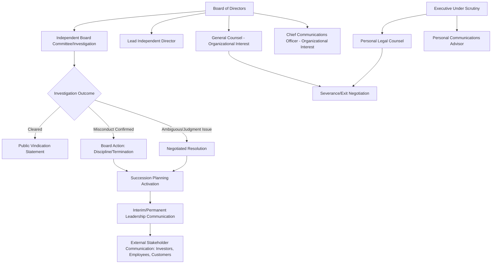

## Personal and Executive Reputation Management

### Definition and Scope

Personal and executive reputation management addresses crisis dynamics for individuals whose professional standing is tied to organizational leadership — CEOs, C-suite executives, board members, founders, and senior public officials — combining elements of institutional crisis management (since their conduct implicates the organizations they lead) with individual reputation dynamics (since their personal credibility, judgment, and character are directly scrutinized). This differs from the celebrity/athlete domain primarily in the governance dimension: executives operate within fiduciary, board-oversight, and corporate governance structures that create formal accountability mechanisms largely absent for entertainers or athletes.

This domain spans executive misconduct (financial, ethical, interpersonal), leadership judgment failures during organizational crises, executive succession and departure crises, personal conduct controversies affecting professional standing, activist investor/governance challenges to leadership, and the specific reputational dynamics of founder-led organizations.

### Distinguishing Features of Executive Reputation Management

**Key Points**

- **Dual exposure**: Executive misconduct or crisis mishandling creates simultaneous personal reputational risk and organizational/fiduciary risk, requiring coordination between personal counsel/advisors and the organization's crisis response — interests that can diverge significantly (e.g., the organization's interest in a swift, clean separation vs. the executive's interest in preserving reputation and negotiating exit terms).
- **Governance accountability structures**: Unlike athletes/celebrities, executives are subject to formal board oversight, fiduciary duty standards, and (for public companies) securities law implications — creating documented, procedural accountability mechanisms that shape both the crisis process and its public visibility.
- **Founder-identity fusion**: In founder-led organizations, the founder's personal reputation and the company's brand identity are often deeply fused, creating dynamics similar to celebrity brand-person fusion but layered with fiduciary and shareholder considerations absent for pure entertainment figures.
- **Succession and continuity stakes**: Executive crises inherently raise leadership continuity and succession questions that have direct business/operational consequences beyond reputational ones (strategy continuity, key relationship management, talent retention).
- **Peer and industry reputation network effects**: Executive reputation operates within professional/industry networks (board memberships, industry associations, peer CEO relationships) where reputational damage can affect future board appointments, career mobility, and industry standing in ways distinct from consumer-facing brand damage.
- **Legacy and post-tenure reputation**: Executive reputation management increasingly extends beyond active tenure into post-departure legacy management (board seats, advisory roles, memoirs/public commentary), an extended timeline distinct from most crisis contexts.

### Executive Crisis Governance and Advisory Structure

### Key Executive Crisis Archetypes

**1. Financial and Ethical Misconduct**

Fraud, expense/compensation impropriety, insider trading, or conflicts of interest — typically triggers formal board investigation (often via independent counsel to preserve credibility and privilege) and carries personal legal liability alongside organizational reputational exposure.

**2. Leadership Judgment Failures**

Poor decision-making during an organizational crisis (e.g., a CEO's mishandled public statement, delayed response, or perceived callousness during a company crisis) that becomes its own secondary reputational event distinct from the underlying crisis itself.

**3. Interpersonal Misconduct**

Harassment, discrimination, or abusive workplace conduct allegations — increasingly subject to board-level accountability expectations and heightened public scrutiny of how organizations respond to executive-level allegations specifically (given power dynamics and historical patterns of institutional protection of senior leaders).

**4. Executive Succession and Departure Crises**

Sudden, unexplained, or contentious executive departures generate reputational risk both for the departing executive (speculation about the reason) and the organization (governance and stability questions) — requiring careful sequencing of departure communication, especially when legal settlement terms constrain what can be publicly stated.

**5. Founder-Specific Crises**

Founder misconduct or judgment failures in founder-led companies create acute governance tension, since founders often hold disproportionate board influence, voting control (in dual-class share structures), or cultural authority that can complicate the board's ability to act as an independent check.

**6. Activist Investor and Governance Challenges**

Shareholder campaigns targeting executive leadership (performance, governance, or conduct-based) create a reputational contest playing out through proxy statements, public investor communications, and media — a hybrid of executive reputation management and corporate governance strategy.

### The Personal-Organizational Interest Divergence

**Key Points**

- **Severance negotiation dynamics**: Departure terms (severance amount, characterization of departure as resignation vs. termination, non-disparagement clauses) directly shape what can be publicly said by either party — often the single largest lever determining the public narrative of an executive crisis.
- **Non-disparagement and confidentiality tensions**: Settlement agreements often include mutual non-disparagement clauses that limit both the organization's and the executive's ability to fully explain their position publicly, sometimes leaving an unresolved public narrative that other parties (media, activists, former colleagues) fill in.
- **Independent investigation credibility**: Boards increasingly use outside/independent counsel (rather than internal general counsel, who has an inherent institutional-protection interest) for investigations involving senior executives, to enhance the credibility of findings with employees, investors, and the public.
- **Personal advisor vs. company advisor conflict of interest**: An executive using company-retained communications/legal resources during a personal-conduct crisis creates conflict-of-interest risk; well-governed boards typically require the executive to retain independent personal counsel once the matter moves beyond routine business judgment questions.

[Inference] The point at which an executive's interests are deemed to diverge sufficiently from the organization's to require independent representation is a judgment call typically made by the board or general counsel based on the severity and nature of allegations; this threshold is not governed by a single universal standard and varies by jurisdiction, company governance practice, and legal advice specific to the situation.

### Executive Communication Strategy Options

| Strategy | Description | Typical Context |
| --- | --- | --- |
| Board-led accountability statement | Board issues statement addressing findings and action taken, executive does not personally comment | Confirmed misconduct, board asserting governance control |
| Executive personal statement (contested) | Executive issues own statement disputing allegations, potentially independent of or alongside board statement | Disputed facts, executive contesting characterization |
| Joint departure statement | Coordinated statement from both parties characterizing departure (often vaguely, per negotiated terms) | Negotiated exit, mutual interest in controlled narrative |
| Silence pending investigation | No public statement from either party until investigation concludes | Early-stage, facts undeveloped, legal risk high |
| Vindication/reinstatement statement | Public statement following investigation clearing the executive | Investigation concludes allegations unsubstantiated |

### Board Governance Considerations During Executive Crises

- **Special committee formation**: Boards often form an independent special committee (excluding the implicated executive and any directors with conflicts) to oversee investigation and response, both for genuine independence and to demonstrate credible governance to investors/regulators.
- **Disclosure timing under securities law** (for public companies): Board must assess whether executive misconduct or departure constitutes a material event requiring disclosure, independent of reputational considerations — a legal determination that can create tension with a preference for a slower, more controlled reputational strategy.
- **Interim leadership communication**: Rapid, credible interim leadership announcement (naming an interim CEO or clear succession path) is a significant reputational stabilizer, signaling institutional continuity independent of the individual crisis.
- **Board's own reputational exposure**: If a board is perceived to have known about or tolerated misconduct for an extended period before acting, the board itself becomes a secondary subject of the reputational crisis (a governance-failure narrative distinct from the original executive misconduct).

### Common Pitfalls

- **Board delay perceived as protection**: Slow board action against a powerful or founder-executive, especially if it appears driven by financial/relationship considerations rather than governance principle, can generate a more damaging "cover-up" narrative than the original misconduct.
- **Inconsistent departure characterization**: Public statements describing a departure as voluntary/amicable when subsequent facts (litigation, investigative reporting) reveal a more adversarial reality, damaging both parties' credibility.
- **Founder exceptionalism**: Boards treating founder misconduct with different standards than they would apply to non-founder executives, which — if publicly perceived — raises governance credibility questions independent of the underlying conduct.
- **Underestimating employee/internal reaction**: Focusing external reputational strategy on investors/media while internal employee trust in leadership and governance erodes, affecting retention and internal culture independent of external reputation metrics.
- **Legal settlement silence creating a narrative vacuum**: Overly restrictive non-disparagement terms preventing the organization from providing any public context, allowing external parties to control the narrative entirely.
- **Reactive rather than proactive succession planning**: Lacking a pre-identified succession plan, forcing hurried interim leadership decisions during an already unstable crisis period, compounding investor and employee uncertainty.

### Illustrative Example

A publicly traded company's founder-CEO faces allegations of a hostile and abusive management style, substantiated by multiple current and former employee accounts reported by investigative journalists.

- **Board response**: The board's independent lead director convenes a special committee, retains outside counsel to conduct an independent investigation (given the founder's significant board influence and the internal conflict-of-interest risk of using in-house counsel).
- **Executive's independent representation**: The founder retains personal legal counsel and a personal communications advisor separate from the company's general counsel and communications team, given the personal conduct nature of the allegations.
- **Securities disclosure assessment**: The board's disclosure counsel assesses whether the situation constitutes a material event requiring public company disclosure, given potential business and leadership continuity implications, independent of the reputational strategy question.
- **Interim stabilization**: While the investigation proceeds, the board communicates publicly that an independent review is underway and reaffirms confidence in the company's operational leadership team and continuity, without prejudging the outcome.
- **Resolution**: If the investigation substantiates the allegations, the board negotiates a departure (balancing severance cost, non-disparagement terms, and public accountability expectations), announces the outcome with a clear governance-accountability statement, and activates a pre-considered succession plan; if allegations are not substantiated, the board and executive jointly determine an appropriate accountability/vindication statement addressing workplace culture concerns even absent formal findings against the individual.
- **Post-crisis governance**: The board commissions a broader workplace culture and reporting-channel review (a policy-change response addressing the systemic conditions that allowed sustained employee concerns to go unaddressed), reported to shareholders as part of governance reform.

### Related Topics

- Sports, Entertainment, and Celebrity Reputation
- Corporate and Private-Sector Applications
- Organizational Learning and Policy Change
- Monitoring Long-Term Reputation Recovery
- Board Governance and Special Committee Investigation Practice
- Executive Severance and Non-Disparagement Agreement Structuring
- Activist Investor Campaigns and Proxy Communication Strategy
- Founder-Led Company Governance Dynamics