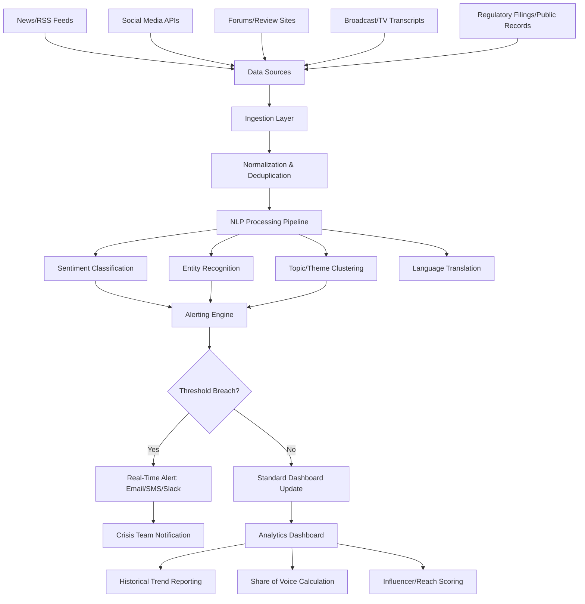
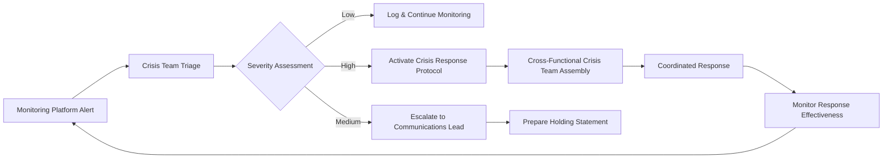

## Media and Social Monitoring Platforms

### Definition and Scope

Media and social monitoring platforms are the technology infrastructure underlying modern crisis detection, sentiment tracking, and recovery measurement — software systems that aggregate, analyze, and surface signals from news media, social platforms, forums, review sites, broadcast transcripts, and other public data sources in near-real-time. These platforms form the operational backbone for the "Be First" and situational awareness principles discussed throughout crisis communication frameworks, translating the theoretical monitoring requirements described in earlier chapters into concrete technical capability.

This domain covers platform architecture and data source coverage, alerting and threshold configuration, sentiment analysis methodology, dashboard/reporting design, vendor category landscape, and integration considerations for crisis management workflows.

### Core Platform Architecture

### Core Functional Capabilities

**1. Data Source Coverage**

- **Social platforms**: Coverage varies significantly by platform based on each platform's API access policies, which have become considerably more restrictive and commercially complex across major social networks in recent years — vendors differ in which platforms they can access natively versus through limited/licensed data partnerships.
- **News and broadcast media**: Aggregation from wire services, online news, print archives, and (for premium tiers) broadcast transcript monitoring (TV/radio).
- **Review and forum platforms**: Coverage of consumer review sites, discussion forums, and community platforms relevant to specific industries (e.g., healthcare review sites, employer review platforms, industry-specific forums).
- **Dark web/fringe platform monitoring**: Specialized (often separate, higher-tier) capability for monitoring extremist forums, leak sites, or platforms outside mainstream indexing — relevant for organizations with elevated threat profiles.

**2. Sentiment Analysis Methodology**

- **Lexicon-based approaches**: Rule-based scoring using pre-defined positive/negative word dictionaries — fast and interpretable but weak on sarcasm, context, and domain-specific language.
- **Machine learning classification**: Models trained on labeled data to classify sentiment, generally more accurate on nuanced or domain-specific text but requiring ongoing model maintenance and training data relevance.
- **Large language model-based analysis**: Increasingly used by newer platforms for more nuanced sentiment, theme extraction, and summarization, though [Unverified] specific accuracy benchmarks and methodologies vary considerably across vendors and are frequently updated, so current vendor-specific accuracy claims should be independently verified rather than assumed.
- **Human-in-the-loop verification**: Most enterprise platforms offer or require human analyst review for high-stakes classification, since automated sentiment analysis on sarcasm, cultural context, and crisis-specific nuance remains an area of known limitation across the industry.

**3. Alerting and Threshold Configuration**

- **Volume-based alerts**: Triggered by mention volume exceeding a defined baseline multiple (e.g., 3x normal daily mention volume).
- **Sentiment-shift alerts**: Triggered by a significant negative shift in sentiment ratio within a defined time window.
- **Keyword/entity-based alerts**: Triggered by specific term combinations (brand name plus crisis-indicative terms like "lawsuit," "recall," "breach").
- **Influencer-weighted alerts**: Triggered when a high-reach or high-credibility account/outlet mentions the organization, weighted by follower count, engagement rate, or historical influence scoring.

### Dashboard and Reporting Design Considerations

**Key Points**

- **Real-time vs. historical views**: Crisis-phase monitoring prioritizes real-time feed and alert views; recovery-phase monitoring (as discussed in long-term reputation recovery) prioritizes trend visualization against historical baselines.
- **Share of voice calculation**: Comparing organization-specific mention volume/sentiment against defined competitor or industry benchmark sets, essential for distinguishing crisis-specific reputational movement from sector-wide trends.
- **Customizable stakeholder views**: Enterprise platforms typically support role-based dashboard views (executive summary view vs. detailed analyst view vs. legal/compliance-focused view).
- **Export and integration requirements**: API access or integration capability with existing enterprise systems (CRM, business intelligence tools, incident management platforms) is a key differentiator for organizations embedding monitoring into broader crisis workflow rather than using it as a standalone tool.

### Vendor Category Landscape

**Key Points**

- **Enterprise social listening platforms**: Comprehensive, multi-source platforms typically serving large organizations with dedicated communications/PR teams, offering the broadest data coverage and most sophisticated analytics.
- **PR-industry-specific monitoring tools**: Platforms built specifically for communications/PR workflows, often integrating media contact databases and press release distribution alongside monitoring.
- **Specialized crisis/risk monitoring vendors**: Platforms focused specifically on early-warning crisis detection and risk scoring, sometimes with industry-specific specialization (e.g., financial services regulatory risk, executive protection/physical security risk).
- **General-purpose analytics platforms with monitoring modules**: Broader marketing/analytics suites that include social listening as one module among many, often more cost-effective for organizations without dedicated crisis monitoring budgets but with less specialized crisis-specific feature depth.

[Unverified] Specific vendor names, pricing tiers, and feature comparisons in this space change frequently as the market consolidates and platforms adjust their offerings; organizations evaluating specific tools should conduct current market research and vendor demonstrations rather than relying on point-in-time vendor comparisons, since this is a fast-evolving commercial landscape.

### Integration with Crisis Management Workflow

### Evaluation Criteria for Platform Selection

| Criterion | Consideration |
| --- | --- |
| Data source breadth | Coverage of platforms/languages/regions relevant to the organization's specific stakeholder geography |
| Sentiment accuracy | Performance on domain-specific and organization-specific language, not just generic benchmark accuracy |
| Alert customization | Granularity of threshold configuration to avoid both alert fatigue (over-triggering) and missed signals (under-triggering) |
| Historical data retention | Sufficient retention period to support the multi-year recovery monitoring timelines discussed in post-crisis recovery tracking |
| Integration/API access | Compatibility with existing crisis workflow tools and reporting infrastructure |
| Human analyst support | Availability of vendor-provided or internal analyst review for high-stakes classification decisions |
| Compliance/data privacy | Handling of data privacy regulations relevant to the organization's operating jurisdictions, particularly for platforms processing personal data from monitored sources |

### Common Pitfalls

- **Alert fatigue from poorly tuned thresholds**: Over-sensitive alerting configurations that generate high volumes of low-value notifications, causing crisis teams to disengage from or ignore the alerting system entirely.
- **Over-reliance on automated sentiment scoring**: Treating algorithmic sentiment classification as fully reliable without human verification, particularly problematic for sarcasm, culturally specific language, or crisis-specific nuanced context.
- **Data source coverage gaps**: Assuming comprehensive coverage when a platform may have limited or no access to specific platforms relevant to the organization's actual stakeholder base (e.g., regional social platforms, industry-specific forums).
- **Treating monitoring as detection-only**: Failing to integrate monitoring output into an actual response workflow (as shown in the integration diagram above), reducing an expensive monitoring investment to a passive dashboard nobody acts on.
- **Underinvesting in historical baseline establishment**: Not establishing adequate pre-crisis baseline data before an incident occurs, undermining the ability to measure genuine recovery trajectory (as discussed in long-term reputation recovery monitoring).
- **Single-vendor blind spots**: Relying entirely on one platform's data source coverage and methodology without any cross-validation, particularly risky given the inconsistent and evolving nature of social platform API access across vendors.

### Related Topics

- Monitoring Long-Term Reputation Recovery
- Organizational Learning and Policy Change
- Misinformation and Disinformation Response Strategy
- Crisis Communication Audits and Retrospectives
- Natural Language Processing Fundamentals for Sentiment Analysis
- Data Privacy Considerations in Social Media Monitoring
- Crisis Management Software and Incident Response Platforms
- Influencer Identification and Reach Scoring Methodology