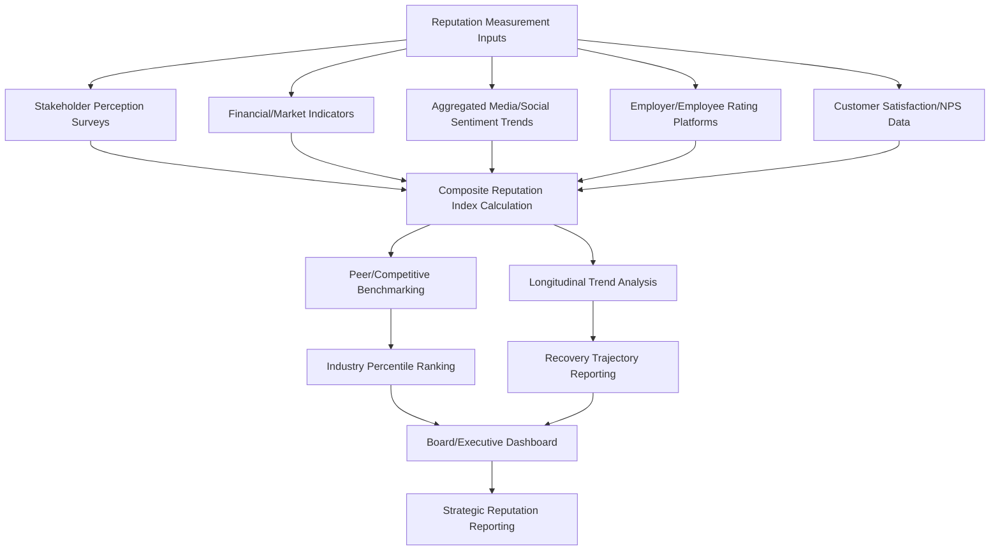
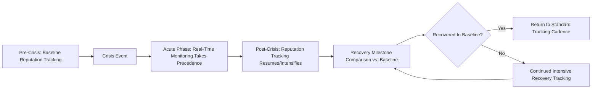

## Reputation and Brand Tracking Platforms

### Definition and Scope

Reputation and brand tracking platforms are the technology systems used to measure, benchmark, and report on organizational reputation as a longitudinal metric — distinct from the real-time media/social monitoring platforms covered previously, which focus on detecting and triaging discrete events. Where monitoring platforms answer "what is being said right now," reputation tracking platforms answer "how is our overall standing trending over time, and how does it compare to peers" — making them the primary technical infrastructure supporting the long-term reputation recovery measurement discussed earlier in this chapter.

This domain covers reputation index/scoring methodologies, survey-based brand health tracking, financial/market-based reputation measurement, competitive benchmarking architecture, and the distinct vendor categories serving this measurement function.

### Distinction from Media/Social Monitoring Platforms

**Key Points**

- **Measurement cadence**: Monitoring platforms operate on a real-time/daily cadence; reputation tracking platforms typically operate on quarterly, semi-annual, or annual measurement cycles aligned with strategic reporting needs (board reporting, annual reputation benchmarking).
- **Data source type**: Monitoring platforms primarily process unstructured public data (news, social posts); reputation tracking platforms often combine structured survey data (stakeholder perception surveys) with financial/market data and, secondarily, aggregated sentiment trend data.
- **Purpose**: Monitoring supports operational crisis detection and response; reputation tracking supports strategic measurement, board/leadership reporting, and long-term recovery validation.
- **Stakeholder scope**: Reputation tracking platforms are more likely to incorporate structured multi-stakeholder measurement (employees, investors, customers, general public) through deliberate survey design, rather than relying solely on organically occurring public commentary.

### Reputation Measurement Architecture

### Core Measurement Methodologies

**1. Composite Reputation Indices**

Multi-dimensional scoring frameworks that aggregate several reputation drivers (typically including dimensions like products/services quality perception, financial performance perception, workplace/employer perception, governance/leadership perception, social/citizenship perception, and innovation perception) into a single composite score, often benchmarked against industry peers or a broader corporate universe.

**2. Survey-Based Brand and Reputation Tracking**

- **Tracking studies**: Repeated survey waves (often quarterly or semi-annual) measuring consistent metrics over time (awareness, favorability, trust, purchase intent, recommendation likelihood) to establish trend lines.
- **Ad hoc pulse surveys**: Shorter, rapidly deployed surveys used specifically around crisis events to measure immediate perception shifts, complementing the standing tracking study cadence.
- **Segmented measurement**: Surveying distinct stakeholder populations (general public, customers, employees, investors, media/influencers) separately, since reputation perception and recovery timelines diverge meaningfully across these groups (as discussed in long-term recovery monitoring).

**3. Financial and Market-Based Reputation Proxies**

- **Event-study stock price analysis**: Measuring abnormal stock returns around reputation-relevant events relative to expected performance based on market/sector movement, providing a market-based reputational impact estimate distinct from survey perception.
- **Cost of capital indicators**: Bond rating and credit spread movements as a proxy for institutional/investor confidence, particularly relevant for reputation crises with governance or financial integrity dimensions.
- **Analyst sentiment tracking**: Systematic tracking of equity analyst commentary tone and rating changes as a structured proxy for investor-community reputation perception.

**4. Employer and Workplace Reputation Tracking**

Employee-facing reputation platforms (employer review sites, internal engagement survey tools) tracking employer brand reputation — increasingly integrated into overall reputation measurement given the established link between employee sentiment and broader organizational reputation and performance.

### Competitive Benchmarking Design

**Key Points**

- **Peer set definition**: Selecting an appropriate comparison group (direct competitors, industry peers, or a broader cross-industry reputation universe) significantly affects interpretation — a company may be improving in absolute terms while losing relative position if peers are improving faster.
- **Percentile/ranking reporting**: Presenting reputation scores as industry percentile rank rather than raw scores alone, providing more actionable context for leadership (e.g., "60th percentile in our sector" is more interpretable than an isolated numeric score).
- **Controlling for industry-wide sentiment shifts**: Distinguishing company-specific reputational movement from sector-wide trends (e.g., an entire industry facing declining public trust due to a macro trend unrelated to any single company's conduct) — directly relevant to the confound-control methodology discussed in recovery monitoring.

### Dashboard and Reporting Design for Leadership Audiences

| Report Type | Audience | Typical Cadence | Key Content |
| --- | --- | --- | --- |
| Board reputation briefing | Board of Directors | Quarterly or semi-annual | Composite index trend, peer benchmark, major driver movements |
| Executive reputation dashboard | C-suite/Communications leadership | Monthly or quarterly | Detailed driver breakdown, stakeholder segment comparison |
| Crisis recovery tracker | Crisis team, executive sponsors | Weekly/monthly during active recovery, tapering per the recovery cadence model | Recovery trajectory vs. baseline, milestone tracking |
| Annual reputation report | Broad internal/sometimes external audience | Annual | Comprehensive year-over-year trend, strategic narrative |

### Vendor Category Landscape

**Key Points**

- **Reputation index/ranking providers**: Organizations that publish structured, methodology-driven corporate reputation rankings, typically based on large-scale multi-stakeholder survey research, often used as external, third-party-validated reputation benchmarks.
- **Brand tracking research firms**: Market research organizations offering custom or syndicated brand health tracking studies, providing more customizable and organization-specific measurement than standardized public indices.
- **Employer brand/review platforms**: Platforms aggregating employee reviews and ratings, providing both a public-facing reputation signal and, often, employer-facing analytics tools.
- **Financial/ESG data providers**: Firms providing governance, sustainability, and reputation-adjacent scoring increasingly incorporated into investor decision-making and, by extension, corporate reputation strategy.
- **Enterprise reputation management suites**: Integrated platforms combining survey tracking, media sentiment aggregation, and benchmarking into a unified reporting tool, often marketed specifically to corporate communications and investor relations functions.

[Unverified] Specific vendors, index methodologies, and their relative market positioning change over time as firms update methodologies, launch new products, or are acquired/consolidated; organizations selecting a reputation tracking approach should review current, publicly available methodology documentation directly from prospective providers rather than relying on potentially outdated general characterizations, since this space evolves regularly.

### Integration with the Crisis and Recovery Lifecycle

### Common Pitfalls

- **Conflating monitoring data with reputation measurement**: Treating raw social sentiment volume/tone as a complete reputation measure, when it captures only vocal/online populations and may not represent broader stakeholder perception, particularly among less digitally vocal segments.
- **Infrequent measurement creating blind spots**: Relying solely on annual or semi-annual tracking cadence during a period requiring more frequent post-crisis recovery measurement, missing the ability to detect a stalled or reversing recovery trajectory in time to respond.
- **Peer set manipulation or misalignment**: Selecting an unrepresentative or overly favorable peer comparison set that inflates perceived relative performance, undermining the credibility and usefulness of benchmarking for genuine strategic insight.
- **Survey fatigue and declining response quality**: Over-surveying the same stakeholder populations, leading to declining response rates and data quality over extended tracking periods.
- **Methodology changes disrupting trend continuity**: Vendors updating survey methodology or index calculation approaches without adequate historical recalibration, creating artificial discontinuities in trend data that can be misread as genuine reputational shifts.
- **Underutilizing financial/market-based proxies**: Relying solely on survey-based perception data while ignoring available financial/market signals that can provide earlier or more objective indication of reputational impact, particularly for publicly traded organizations.

### Related Topics

- Media and Social Monitoring Platforms
- Monitoring Long-Term Reputation Recovery
- Organizational Learning and Policy Change
- Corporate and Private-Sector Applications
- Event-Study Methodology for Reputational Financial Impact
- Employee Trust Repair and Internal Communications Strategy
- ESG Scoring and Governance Reputation Metrics
- Survey Research Design for Longitudinal Brand Tracking