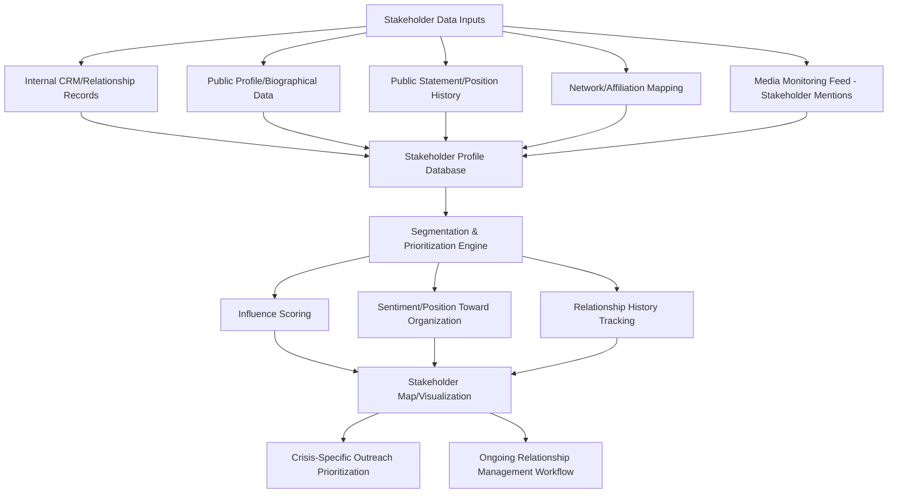

## Stakeholder Intelligence Platforms

### Definition and Scope

Stakeholder intelligence platforms are technology systems that aggregate, map, and analyze information about an organization's specific stakeholders — individuals and groups with a direct relationship or influence stake, as distinct from the general public sentiment captured by media monitoring or the aggregate reputation scores produced by brand tracking platforms. Where media monitoring answers "what is being said" and reputation tracking answers "how is our standing trending," stakeholder intelligence answers "who matters here, what is their specific position and influence, and how is our relationship with them evolving" — providing the relationship-specific granularity that crisis response teams need to prioritize outreach and tailor communication during and after a crisis.

This domain covers stakeholder mapping and segmentation architecture, relationship/CRM-style tracking for crisis-relevant stakeholders, influence and network analysis, integration with monitoring and reputation systems, and the vendor categories serving this function.

### Distinction from Monitoring and Reputation Tracking Platforms

**Key Points**

- **Unit of analysis**: Media monitoring analyzes content/mentions; reputation tracking analyzes aggregate scores; stakeholder intelligence analyzes individual entities (specific journalists, regulators, investors, community leaders, employee groups) and their relationships to the organization.
- **Directionality**: Stakeholder intelligence is inherently relational and often bidirectional — tracking not just what a stakeholder says publicly, but the organization's own history of engagement with that stakeholder (meetings, past commitments, prior crisis interactions).
- **Proactive relationship management function**: Unlike monitoring (reactive detection) or reputation tracking (periodic measurement), stakeholder intelligence platforms often support ongoing relationship management workflows (contact history, outreach scheduling, commitment tracking) that persist independent of any specific crisis.
- **Data sensitivity**: Because these platforms often contain detailed profiles of specific named individuals (regulators, journalists, activists, community leaders), they carry distinct data privacy and ethical handling considerations beyond the aggregate, largely anonymized data typical of sentiment/reputation platforms.

### Stakeholder Intelligence Architecture

### Core Functional Capabilities

**1. Stakeholder Mapping and Segmentation**

- **Power/interest grid classification**: Segmenting stakeholders by their level of influence over outcomes and their level of interest/investment in the issue at hand — a foundational stakeholder analysis technique adapted from general project and change management into crisis-specific application.
- **Relationship tier classification**: Distinguishing high-touch relationships requiring direct executive engagement (key regulators, major investors, influential journalists) from broader segments managed through standard channels (general customer base, broad employee population).
- **Dynamic reclassification during crisis**: A stakeholder's tier can shift rapidly during a crisis (a previously low-priority local official may become critical if the crisis has a regulatory dimension in their jurisdiction), requiring platforms to support rapid re-segmentation rather than only static, pre-defined categories.

**2. Influence and Network Analysis**

- **Network mapping**: Visualizing connections between stakeholders (e.g., which journalists follow/cite which analysts, which community leaders have relationships with which regulators) to identify high-leverage engagement points and anticipate information flow.
- **Influence scoring**: Quantifying a stakeholder's reach and credibility (distinct from simple follower counts) to prioritize engagement resources during time-constrained crisis response.
- **Coalition/opposition mapping**: Identifying aligned stakeholder clusters (e.g., activist coalitions, industry associations) versus organization-aligned or neutral stakeholders, informing coordinated response and messaging strategy.

**3. Relationship History and Commitment Tracking**

- **Engagement log**: Recording past meetings, communications, and commitments made to specific stakeholders — critical for consistency, since crisis response teams need to know what a given regulator or investor was previously told before making new statements.
- **Commitment/promise tracking**: Explicitly tracking public or private commitments made during crisis response (e.g., "we committed to publishing an independent audit by Q3") to support the organizational learning and follow-through reporting discussed earlier in this chapter.
- **Sentiment trajectory per stakeholder**: Tracking an individual stakeholder's position/sentiment over time (rather than only aggregate public sentiment), supporting targeted relationship repair strategies for specific high-priority relationships.

### Stakeholder Segmentation Framework (Illustrative)

| Segment | Influence Level | Engagement Approach | Platform Function Emphasis |
| --- | --- | --- | --- |
| Key regulators | High | Direct, proactive briefing | Commitment tracking, engagement history |
| Major investors/analysts | High | Direct executive engagement | Sentiment trajectory, network mapping |
| Influential media/journalists | Variable, high during crisis | Tailored briefing, relationship management | Influence scoring, past coverage history |
| Community/advocacy leaders | Variable, issue-dependent | Direct engagement, coalition awareness | Network/coalition mapping |
| Employee representative groups | Medium-high, internal | Structured internal communication | Sentiment tracking, engagement log |
| General customer base | Low individual, high aggregate | Broad-channel communication | Aggregate sentiment (overlaps with reputation tracking) |

### Integration with Monitoring and Reputation Systems

**Key Points**

- **Feed-in relationship from media monitoring**: Stakeholder intelligence platforms often ingest media monitoring data filtered specifically for mentions by or about tracked stakeholders (e.g., alerting when a specific tracked regulator or journalist publishes a statement), rather than duplicating general sentiment monitoring functions.
- **Feed-out relationship to crisis workflow**: Stakeholder prioritization output directly informs crisis team outreach task assignment — effective platforms integrate with task/workflow management tools so identified priority stakeholders translate into assigned outreach actions rather than remaining a static analytical view.
- **Complementary, not redundant, to reputation tracking**: Aggregate reputation scores (from brand tracking platforms) tell leadership *whether* recovery is occurring; stakeholder intelligence tells the crisis team *which specific relationships* are driving or lagging that recovery, supporting more targeted intervention.

### Data Privacy and Ethical Considerations

**Key Points**

- **Personal data on named individuals**: Because these platforms compile profiles on specific people (some of whom are private individuals, such as community members or employees, not just public figures), organizations must apply data privacy principles (data minimization, purpose limitation, retention limits) more rigorously than for aggregate sentiment data.
- **Distinguishing legitimate stakeholder management from surveillance**: There is an important ethical and reputational line between tracking public statements/positions relevant to legitimate stakeholder engagement and inappropriate monitoring of private conduct or protected activity (e.g., monitoring employee organizing activity, or compiling dossiers on activists beyond what is relevant to legitimate engagement) — crossing this line can itself become a reputational and legal crisis if discovered.
- **Jurisdictional data protection compliance**: Platforms processing personal data on identifiable individuals are subject to applicable data protection regulations (e.g., GDPR in the EU and similar frameworks elsewhere), requiring appropriate legal basis, access controls, and data governance.

[Unverified] The specific legal boundaries between legitimate stakeholder relationship management and problematic surveillance vary by jurisdiction, the nature of the stakeholder relationship, and applicable labor/privacy law; organizations should consult legal counsel regarding specific data collection and retention practices for stakeholder intelligence systems rather than relying on general industry norms, since this area involves genuine legal complexity that differs by context.

### Vendor Category Landscape

**Key Points**

- **Enterprise CRM platforms adapted for stakeholder relations**: General relationship management systems configured specifically for government affairs, investor relations, or media relations use cases rather than sales.
- **Government affairs and public policy intelligence platforms**: Specialized tools tracking legislative/regulatory stakeholders, bill/policy tracking, and government official positions — relevant for crises with regulatory or legislative dimensions.
- **Media relations and journalist database platforms**: Tools combining journalist contact management with coverage history and beat tracking, supporting targeted media stakeholder engagement.
- **Investor relations platforms**: Systems tracking analyst coverage, institutional investor positions, and shareholder engagement history, relevant for crises with market/investor dimensions.
- **Purpose-built stakeholder mapping/network analysis tools**: Specialized software focused specifically on network visualization and influence mapping, sometimes used for complex multi-stakeholder crises (e.g., large infrastructure projects, environmental/community-relations crises).

### Common Pitfalls

- **Static, outdated stakeholder maps**: Building a stakeholder map during pre-crisis planning but failing to update it dynamically as a crisis unfolds and stakeholder relevance/positions shift.
- **Over-indexing on high-visibility stakeholders**: Focusing exclusively on the most vocal or media-visible stakeholders while under-tracking quieter but highly influential stakeholders (e.g., a regulator who rarely speaks publicly but holds significant decision authority).
- **Siloed stakeholder data across functions**: Investor relations, government affairs, and communications maintaining separate, non-integrated stakeholder records, preventing a unified view of a given stakeholder's full relationship history with the organization.
- **Treating stakeholder data as static biographical record**: Failing to track sentiment/position *trajectory* over time, missing early warning signs of a shifting stakeholder relationship before it becomes a public issue.
- **Privacy/ethical boundary violations**: Compiling excessive or inappropriately sourced personal information on stakeholders (particularly private individuals or activists) beyond what is necessary for legitimate engagement purposes, creating independent legal and reputational risk.
- **Commitment tracking failures**: Not systematically tracking public commitments made to specific stakeholders during crisis response, leading to inconsistent follow-through that undermines the credibility gains from initial transparency efforts.

### Related Topics

- Media and Social Monitoring Platforms
- Reputation and Brand Tracking Platforms
- Monitoring Long-Term Reputation Recovery
- Organizational Learning and Policy Change
- Government and Public-Sector Crisis Communication
- Data Privacy Considerations in Stakeholder Data Management
- Government Affairs and Regulatory Relationship Management
- Coalition Mapping and Network Analysis Techniques