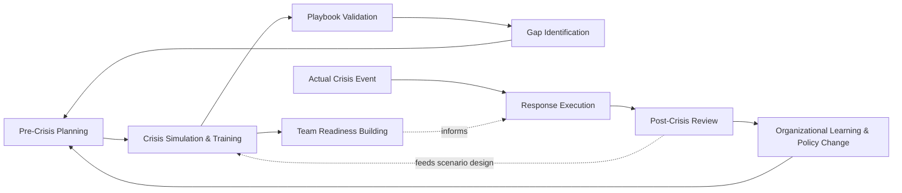
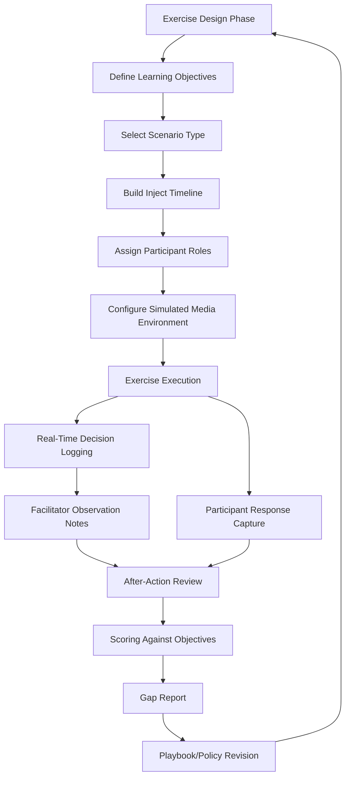

## Crisis Simulation and Training Software

### Definition and Scope

Crisis simulation and training software comprises the technology systems used to prepare organizations for crisis response before an actual event occurs — translating the pre-crisis planning frameworks referenced throughout earlier chapters into repeatable, measurable exercises. Unlike the monitoring, reputation-tracking, and stakeholder-intelligence platforms covered previously (all of which operate during or after real events), simulation and training platforms operate primarily in the pre-crisis phase, building organizational muscle memory, testing playbook effectiveness, and identifying gaps before they are exposed by a genuine crisis.

This domain covers tabletop exercise platforms, immersive/scenario-based simulation systems, crisis communication drafting and drill tools, gamified training platforms, and after-action assessment/scoring capability.

### Role Within the Crisis Lifecycle

### Core Categories of Simulation and Training Tools

**1. Tabletop Exercise Platforms**

Facilitated, discussion-based exercises where a crisis team walks through a scenario verbally/interactively without full operational deployment. Software support typically includes:

- **Scenario scripting and injection tools**: Pre-built or customizable scenario modules with scripted "injects" (new information introduced at intervals to test adaptive decision-making) delivered on a timed or facilitator-triggered basis.
- **Multi-channel simulated media environments**: Mock news sites, social media feed simulators, and simulated inbound press inquiries that create a realistic information environment without any real public exposure.
- **Decision logging and timeline capture**: Recording what decisions were made, when, and by whom during the exercise, supporting structured after-action review.

**2. Immersive/Scenario-Based Simulation Systems**

More technically sophisticated platforms that simulate a broader, more dynamic crisis environment:

- **Branching scenario logic**: Scenarios that adapt based on participant decisions (e.g., choosing to delay a statement triggers a different media escalation path than immediate disclosure), providing more realistic consequence modeling than a fixed linear script.
- **Simulated social media dynamics**: Some platforms simulate viral spread dynamics, follower/engagement metrics, and even synthetic "public reaction" content to stress-test how a team responds to escalating online pressure in real time.
- **Multi-team/multi-location exercises**: Supporting simultaneous exercises across geographically distributed teams (relevant for multinational organizations or those with federated crisis structures, as discussed in government and higher-education contexts), testing coordination across jurisdictions or business units.

**3. Crisis Communication Drafting and Drill Tools**

- **Rapid-drafting exercises**: Timed exercises requiring the communications team to draft holding statements, press releases, or social posts under simulated time pressure, often scored against pre-defined quality/accuracy criteria.
- **Message testing sandboxes**: Tools allowing draft crisis statements to be tested against simulated audience reaction models or reviewed by a panel for tone, clarity, and legal risk before live deployment protocols are exercised.
- **Spokesperson media training simulation**: Video-based or AI-assisted mock interview tools simulating hostile or difficult media questioning, often with recorded playback for coaching purposes.

**4. Gamified and Self-Paced Training Platforms**

- **Microlearning modules**: Short, scenario-based e-learning modules for broad employee populations (e.g., "what to do if a customer complaint escalates on social media" or "how to respond if a journalist calls you directly") — necessary given that crisis awareness training often needs to reach far beyond the core crisis team.
- **Scored/competitive simulation games**: Gamified exercises with scoring/leaderboard elements designed to increase engagement and completion rates for mandatory crisis-awareness training.
- **Role-specific certification tracks**: Structured training paths tailored to specific crisis team roles (spokesperson, legal liaison, social media responder), reflecting the specialized function coordination discussed throughout the sector-specific chapters.

### Simulation Exercise Design Architecture

### Exercise Types by Complexity and Realism

| Exercise Type | Format | Typical Duration | Best For |
| --- | --- | --- | --- |
| Discussion-based tabletop | Facilitated verbal walkthrough | 2–4 hours | Leadership team decision-process testing |
| Functional exercise | Simulated communications/actions without full deployment | Half-day to full day | Testing specific function coordination (e.g., legal-comms handoff) |
| Full-scale/immersive simulation | Multi-channel, real-time simulated environment | Full day to multi-day | Testing complete organizational response under realistic pressure |
| Microlearning module | Self-paced, individual | 10–30 minutes | Broad employee awareness training |
| Media training drill | Individual/small group, recorded | 1–2 hours | Spokesperson skill development |

### Scenario Design Considerations

**Key Points**

- **Realism calibration**: Scenarios should be challenging enough to expose genuine gaps without being so implausible that participants disengage or dismiss lessons as inapplicable to real conditions.
- **Sector/organization-specific customization**: Generic scenario templates provide a starting point, but the most valuable exercises are customized to the organization's actual risk profile (informed by the sector-specific crisis archetypes discussed throughout this chapter) rather than relying solely on off-the-shelf scenarios.
- **Cross-functional stress-testing**: Well-designed exercises deliberately test the friction points highlighted earlier in this chapter — legal-communications coordination tension, board notification timing, multi-jurisdictional coordination — rather than only testing a single function in isolation.
- **Progressive complexity across a training program**: Mature training programs sequence exercises from simpler tabletop formats toward more complex immersive simulations as team readiness matures, rather than starting with maximum complexity.
- **Incorporating past incident lessons**: Feeding findings from actual post-crisis reviews (the organizational learning process described earlier) back into future scenario design, closing the loop between real experience and simulated preparation.

[Inference] The optimal frequency and complexity progression for crisis simulation exercises likely depends on organizational risk profile, team turnover rate, and available budget/time; there is no single universally validated cadence, and different practitioner and industry sources offer varying recommendations without strong consensus on an exact optimal schedule.

### After-Action Assessment and Scoring

**Key Points**

- **Objective-based scoring rubrics**: Assessing performance against pre-defined learning objectives (e.g., "team issued initial holding statement within 60 minutes," "legal and communications reached aligned position within 2 hours") rather than purely subjective facilitator impression.
- **Decision timeline reconstruction**: Software-supported logging of when key decisions were made during the exercise enables precise identification of bottlenecks (e.g., consistent delay at the legal sign-off stage across multiple exercises indicates a systemic process issue, not an isolated event).
- **Participant self-assessment and peer feedback**: Structured feedback collection from exercise participants themselves, capturing qualitative insight (confusion points, unclear authority) that pure timeline/outcome data may miss.
- **Longitudinal team readiness tracking**: Tracking performance metrics across multiple exercises over time to demonstrate readiness improvement (or persistent gaps) to leadership, supporting the business case for continued training investment.

### Integration with Broader Crisis Management Infrastructure

- **Feed into playbook revision**: Gap reports from simulation exercises directly inform updates to written crisis playbooks and protocols, operationalizing the "policy change" component of organizational learning even in the absence of an actual crisis.
- **Integration with monitoring/stakeholder platforms for realistic drills**: More sophisticated simulation platforms can integrate mock feeds resembling the media monitoring and stakeholder intelligence dashboards teams use in real crises, so training occurs in an environment resembling actual operational tools rather than an artificial exercise-only interface.
- **Onboarding integration**: New crisis team members or newly appointed spokespersons often complete foundational simulation/training modules as part of role onboarding, ensuring consistent baseline readiness despite team turnover.

### Vendor Category Landscape

**Key Points**

- **Enterprise business continuity/emergency management software with simulation modules**: Broader business continuity platforms that include crisis simulation as one feature among broader continuity and emergency management functionality.
- **Dedicated crisis communication simulation platforms**: Tools built specifically around media/communication crisis scenario simulation, often including simulated news and social media environments.
- **Media training and spokesperson coaching services/tools**: Specialized services (sometimes software-supported, sometimes consultant-delivered) focused specifically on individual spokesperson skill development.
- **General corporate e-learning platforms with crisis-awareness content**: Broader learning management systems hosting crisis-awareness microlearning content as part of wider compliance/training curricula.

[Unverified] As with other technology categories in this landscape, specific vendors and their feature sets change over time; organizations should evaluate current platform capabilities and request live demonstrations against their specific scenario needs rather than relying on general category descriptions, since functionality and market offerings evolve.

### Common Pitfalls

- **Infrequent or one-time exercises**: Conducting a single tabletop exercise during initial crisis plan development but failing to establish a recurring cadence, allowing skills and plan familiarity to atrophy and team composition to change without retraining.
- **Overly scripted, low-realism scenarios**: Using rigid, predictable scenarios that fail to test genuine adaptive decision-making, producing false confidence in team readiness.
- **Leadership non-participation**: Excluding senior executives from simulation exercises (delegating only to operational staff), missing the opportunity to test the executive-level decision points (board notification, public statement approval authority) that are often the actual bottleneck in real crises.
- **No connection between exercise findings and actual policy change**: Conducting exercises, generating gap reports, but failing to feed findings into actual playbook or governance revisions — a "training theater" failure mode analogous to the "learning theater" pitfall discussed in organizational learning.
- **Testing only the crisis team, not broader organizational readiness**: Focusing exclusively on core crisis team simulation while neglecting the broader employee population's basic crisis-awareness training, leaving gaps in frontline response (e.g., how a retail employee or customer service representative should handle an escalating situation before it reaches the formal crisis team).
- **Scenario library staleness**: Failing to update scenario content to reflect evolving risk landscape (new regulatory requirements, emerging social media dynamics, previously untested crisis archetypes relevant to the sector), running exercises against an outdated threat model.

### Related Topics

- Organizational Learning and Policy Change
- Media and Social Monitoring Platforms
- Corporate and Private-Sector Applications
- Government and Public-Sector Crisis Communication
- Crisis Communication Playbook Development
- Spokesperson Training and Media Interview Preparation
- Business Continuity and Emergency Management Planning
- After-Action Review Methodology and Facilitation