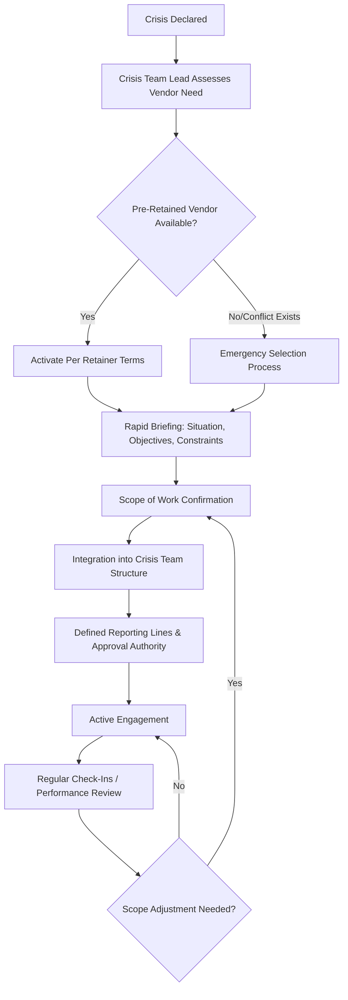

## Selecting and Managing Crisis Vendors and Agencies

### Definition and Scope

Selecting and managing crisis vendors and agencies addresses the procurement, governance, and operational integration of external service providers — PR/communications agencies, forensic investigation firms, legal counsel, monitoring/technology vendors, and specialized crisis consultancies — that most organizations rely on to supplement internal crisis capability. Unlike the technology platform categories covered earlier in this chapter (monitoring, reputation tracking, stakeholder intelligence, simulation), this topic addresses the human/organizational service layer: how to identify, contract, activate, and manage external partners so they function as an extension of the internal crisis team rather than an uncoordinated or reactively-engaged resource.

This domain covers vendor category taxonomy, pre-crisis vendor selection and retainer strategy, activation protocols, scope and governance management during live engagements, and post-engagement evaluation.

### Why Vendor Selection Belongs in Pre-Crisis Planning

**Key Points**

- **Activation speed**: Organizations that select and contractually pre-engage key vendors (through retainer agreements) before a crisis can activate support within hours; those that begin vendor selection *during* an active crisis lose critical early-response time to procurement processes, conflict checks, and onboarding.
- **Relationship and context continuity**: A vendor already familiar with the organization's business, prior commitments, brand voice, and stakeholder landscape can operate effectively immediately, whereas a vendor engaged cold during a crisis requires costly real-time briefing under time pressure.
- **Conflict-of-interest screening under time pressure**: Agencies and firms often represent multiple clients, including potential competitors or opposing parties; conflict checks conducted calmly in advance are far more reliable than those rushed during an active crisis, when the temptation to skip or abbreviate this step is highest.
- **Budget and authority pre-approval**: Emergency vendor engagement often requires rapid budget authorization; pre-negotiated retainer terms and pre-approved emergency spending authority (discussed further below) remove a significant bottleneck from crisis-phase activation.

### Vendor Category Taxonomy

```mermaid
flowchart TD
    A[Crisis Vendor Ecosystem] --> B[Communications/PR Agencies]
    A --> C[Legal Counsel - Outside/Specialized]
    A --> D[Forensic and Investigative Firms]
    A --> E[Technology and Monitoring Vendors]
    A --> F[Crisis Management Consultancies]
    A --> G[Specialized Function Vendors]
    B --> B1[General Crisis Comms Agency]
    B --> B2[Digital/Social Media Specialist Agency]
    C --> C1[Litigation Counsel]
    C --> C2[Regulatory/Compliance Counsel]
    C --> C3[Securities Disclosure Counsel]
    D --> D1[Cybersecurity Forensics]
    D --> D2[Financial Forensic Auditors]
    D --> D3[Independent Investigators]
    F --> F1[Strategy/Advisory Consultancies]
    F --> F2[Executive Coaching/Media Training]
    G --> G1[Translation/Localization Services]
    G --> G2[Physical Security/Executive Protection]
    G --> G3[Employee Assistance/Crisis Counseling Providers]
```

### Vendor Selection Criteria Framework

| Criterion | Key Questions |
| --- | --- |
| Relevant experience | Has the vendor handled crises in this specific sector/archetype, not just generalized reputation work? |
| Conflict-of-interest exposure | Does the vendor represent competitors, opposing parties, or entities with adverse interests? |
| Activation speed/availability | What is the vendor's guaranteed response time under a retainer agreement, and what capacity commitments exist? |
| Team depth and continuity | Will the same named individuals be available during an actual crisis, or does the pitch team differ from the delivery team? |
| Cross-functional coordination experience | Has the vendor successfully worked alongside internal legal counsel and other vendors in genuinely coordinated (not siloed) engagements? |
| Cultural/organizational fit | Does the vendor understand and respect the organization's values, risk tolerance, and decision-making culture? |
| Geographic/jurisdictional coverage | Can the vendor operate effectively across all relevant jurisdictions for a multinational or multi-region organization? |
| Cost structure transparency | Are retainer, activation, and hourly/project rates clearly defined in advance to avoid crisis-phase billing disputes? |

### Pre-Crisis Retainer and Contracting Strategy

**Key Points**

- **Retainer vs. on-call arrangements**: A paid retainer (even modest) typically secures priority access and faster activation commitments than a purely informal "call when needed" relationship, which carries no guaranteed capacity commitment.
- **Pre-negotiated scope and rate cards**: Establishing standard rates and scope-of-work templates in advance avoids negotiating commercial terms under crisis time pressure, when the organization has weaker negotiating leverage.
- **Pre-approved emergency spending authority**: Establishing in advance (often as part of the crisis governance charter referenced in earlier chapters) a pre-approved budget threshold that crisis team leadership can authorize without full standard procurement/approval cycles, specifically for crisis vendor activation.
- **Multi-vendor redundancy considerations**: For critical functions (e.g., primary crisis communications agency), some organizations maintain a secondary/backup vendor relationship in case the primary vendor has a conflict of interest specific to a given crisis (e.g., they represent the opposing party) or capacity constraints during a simultaneous industry-wide event.

### Vendor Activation Protocol

### Governance and Scope Management During Active Engagement

**Key Points**

- **Single internal point of contact**: Designating one internal crisis team member as the vendor's primary liaison prevents the common failure mode of multiple internal stakeholders giving a vendor conflicting instructions.
- **Clear approval authority boundaries**: Explicitly defining what a vendor can execute independently (e.g., routine media monitoring reports) versus what requires internal sign-off (e.g., any public-facing statement draft) before work begins, avoiding both bottlenecks and unauthorized actions.
- **Legal privilege considerations**: When forensic investigators or consultants are engaged to support a legal investigation, engaging them *through outside counsel* (rather than directly) can help preserve attorney-client privilege and work-product protections over their findings — a structuring decision with real legal consequences that should be made deliberately with legal counsel's guidance rather than by default.
- **Multi-vendor coordination**: When multiple vendors are engaged simultaneously (e.g., a PR agency, forensic investigators, and specialized legal counsel), establishing clear communication protocols between vendors — or explicitly routing all cross-vendor coordination through the internal team — prevents siloed or contradictory external advice.
- **Confidentiality and information security**: Ensuring vendor engagement agreements include appropriate confidentiality provisions and that sensitive crisis information shared with vendors is handled through secure channels, particularly important given that vendors may be handling material non-public information in situations with securities disclosure implications.

### Distinguishing Roles: When to Engage Which Vendor Type

| Situation | Primary Vendor Type Needed | Secondary Considerations |
| --- | --- | --- |
| Data breach/cyber incident | Cybersecurity forensics firm | Often engaged through outside counsel for privilege; coordinate with breach notification legal counsel |
| Financial misconduct allegations | Forensic auditors, securities counsel | Independent investigation credibility considerations (as discussed in executive reputation management) |
| Product safety/recall | Regulatory compliance counsel, logistics/recall management vendor | Coordinate with existing PR agency for consumer communication |
| Executive misconduct | Independent investigation counsel, personal/organizational communications advisors (separately) | Conflict-of-interest separation between executive's and organization's advisors |
| High-volume social media crisis | Digital/social media specialist agency | May supplement rather than replace primary crisis PR agency |
| Multi-jurisdictional crisis | Local/regional PR and legal partners in each relevant jurisdiction | Central coordination function to maintain message consistency |

### Post-Engagement Evaluation

**Key Points**

- **Performance review against pre-defined objectives**: Assessing vendor performance against the specific goals set during activation (responsiveness, quality of work product, strategic judgment) rather than only informal impression.
- **Retainer relationship continuation decision**: Using post-crisis evaluation to inform whether to continue, renegotiate, or replace a retained vendor relationship ahead of the next potential crisis.
- **Cost/value analysis**: Reviewing actual vendor spend against the pre-negotiated rate structure and the value delivered, informing future contract negotiation and budget planning.
- **Feeding vendor performance into broader organizational learning**: Vendor management effectiveness (or failure) should be incorporated into the after-action review and policy change process discussed earlier in this chapter, not treated as a separate, unexamined line item.

### Common Pitfalls

- **Cold vendor selection during an active crisis**: Beginning the vendor search, conflict-check, and contracting process only after a crisis has already begun, losing critical early-response hours or days.
- **Unclear approval authority causing bottlenecks or overreach**: Failing to define in advance what a vendor can execute independently, leading either to excessive internal review bottlenecks or to a vendor taking unauthorized public-facing action.
- **Multiple uncoordinated points of contact**: Different internal stakeholders directly instructing the vendor without central coordination, producing inconsistent or conflicting guidance to the external partner.
- **Neglecting privilege-preserving engagement structure**: Engaging forensic or investigative vendors directly rather than through outside counsel when privilege protection is legally advisable, potentially exposing sensitive findings to discovery in subsequent litigation.
- **Assuming pitch-team continuity**: Failing to confirm that the specific senior individuals who impressed the organization during vendor selection will actually be the ones staffed on a real engagement, rather than more junior team members.
- **No pre-approved emergency budget authority**: Requiring full standard procurement approval cycles for crisis vendor spending, creating an internal bureaucratic bottleneck precisely when speed matters most.
- **Treating vendor relationships as static after initial selection**: Failing to periodically reassess vendor fit, conflicts, and performance between crises, discovering only during a live crisis that a previously reliable vendor now has a disqualifying conflict of interest.

### Illustrative Example

A mid-sized financial services company experiences a data breach affecting customer account information.

- **Pre-crisis foundation**: The company had previously established a modest retainer with a crisis communications agency and pre-identified a cybersecurity forensics firm, with both relationships including pre-negotiated emergency activation rates and a 4-hour response commitment.
- **Activation**: Upon breach discovery, the general counsel engages the forensics firm *through outside breach-response counsel* (preserving privilege over the technical investigation), while the crisis team lead simultaneously activates the retained PR agency directly, since public communications strategy does not carry the same privilege consideration.
- **Coordination structure**: A single internal crisis team member is designated as the PR agency's point of contact; the forensics firm reports exclusively through outside counsel to maintain the privilege structure; a brief daily coordination call between internal legal, communications, and both vendor teams (with appropriate confidentiality protocols) prevents siloed or conflicting guidance.
- **Scope management**: The PR agency is authorized to draft but not independently publish any statement; all customer notification language requires joint legal and communications sign-off given breach notification law requirements.
- **Post-crisis evaluation**: Following resolution, the company reviews both vendors' performance against response-time commitments and work-product quality, renegotiates the forensics firm's retainer terms based on lessons learned about scope ambiguity during the engagement, and incorporates the finding that daily cross-vendor coordination calls were highly effective into the standing crisis playbook for future incidents.

### Related Topics

- Crisis Simulation and Training Software
- Media and Social Monitoring Platforms
- Organizational Learning and Policy Change
- Corporate and Private-Sector Applications
- Legal-Communications Coordination Protocols
- Attorney-Client Privilege in Crisis Investigations
- Crisis Governance Charters and Emergency Decision Authority
- Multi-Jurisdictional Crisis Coordination Strategy