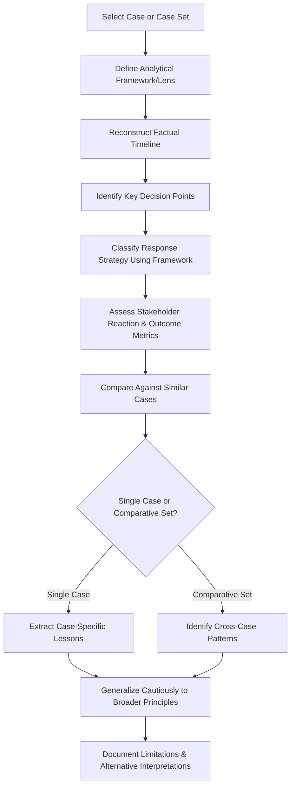

## Frameworks for Analyzing Historical Crises

### Definition and Scope

Frameworks for analyzing historical crises provide the structured analytical methodology for extracting generalizable lessons from past crisis events — the case-study counterpart to the real-time frameworks and post-crisis processes covered elsewhere in this text. Where organizational learning (covered earlier) addresses how a single organization processes its own crisis experience, historical crisis analysis addresses how practitioners, researchers, and students systematically study *other* organizations' crises to build transferable pattern recognition, theoretical understanding, and comparative benchmarks.

This domain covers established crisis communication theoretical models used as analytical lenses, comparative case study methodology, timeline and causal-chain reconstruction techniques, and the specific pitfalls of applying historical analysis to future crisis prediction.

### Why Systematic Frameworks Matter for Case Analysis

**Key Points**

- **Avoiding narrative bias**: Unstructured retrospective analysis of a crisis is vulnerable to hindsight bias (treating outcomes as more predictable than they were) and narrative fallacy (constructing a clean causal story that oversimplifies a messier reality) — structured frameworks impose discipline against these tendencies.
- **Comparability across cases**: A consistent analytical framework allows meaningful comparison across dissimilar crises (a product recall vs. a data breach vs. an executive scandal), which a purely descriptive narrative account does not support.
- **Separating description from evaluation**: Frameworks typically separate "what happened" (descriptive reconstruction) from "how well was it handled" (evaluative judgment), preventing premature evaluation from distorting the factual reconstruction.
- **Building transferable pattern recognition**: The goal of historical analysis is not to memorize specific cases but to identify recurring structural patterns (e.g., the legal-communications tension discussed throughout this text) that transfer across sectors and crisis types.

### Core Theoretical Models Used as Analytical Lenses

**1. Situational Crisis Communication Theory (SCCT)**

Developed by W. Timothy Coombs, SCCT provides a framework for matching crisis response strategy to the attributed level of organizational responsibility for the crisis, categorizing crises into clusters (victim, accidental, preventable) based on attributed responsibility, and proposing that response strategy (from denial through full apology/corrective action) should align with that attribution level to protect reputation most effectively.

**2. Image Restoration Theory / Image Repair Theory**

Developed by William Benoit, this framework catalogs a taxonomy of response strategies available to a crisis-affected entity — including denial, evasion of responsibility, reducing offensiveness, corrective action, and mortification (full apology) — useful for classifying and comparing the rhetorical strategy an organization actually chose in a historical case.

**3. Contingency Theory of Accommodation**

Focuses on the range of stances an organization can take toward a stakeholder or issue, from pure advocacy of its own position to full accommodation of stakeholder demands, useful for analyzing how an organization's stance shifted over the course of a prolonged crisis.

**4. Organizational Learning Theory (Single-Loop/Double-Loop)**

As discussed earlier in this chapter (Argyris & Schön), useful specifically for evaluating the post-crisis phase of a historical case — did the organization merely patch the symptom, or did it fundamentally revise underlying assumptions and governance structures?

**5. Diffusion of Innovation / Issue Attention Cycle**

Useful for analyzing the media and public attention lifecycle of a historical crisis — how it moved from initial emergence through peak attention to gradual decline (or, in some cases, unusual persistence) — relevant to the media/narrative metrics discussed in reputation recovery monitoring.

[Unverified] These theoretical models represent influential and widely cited frameworks in crisis communication scholarship, but the field continues to develop and critique them; specific application to any individual historical case involves interpretive judgment, and different analysts may reasonably classify the same case differently depending on which framework and which facts they emphasize.

### Comparative Case Study Methodology

### Timeline and Causal-Chain Reconstruction

**Key Points**

- **Establishing a verified factual timeline first**: Before any evaluative analysis, reconstructing a chronological sequence of what actually happened (based on verifiable public record — regulatory filings, contemporaneous media coverage, court documents, official statements) separate from post-hoc characterizations or contested narratives.
- **Distinguishing proximate cause from root cause**: Applying the same root-cause-analysis discipline described earlier in this chapter (5 Whys, fishbone analysis) to historical cases — the immediate trigger event is rarely the full explanatory story.
- **Mapping decision points, not just events**: Identifying the specific junctures where organizational actors made choices (to disclose or delay, to apologize or deny, to terminate or retain an executive) and what information was available to them *at that time* — critical for avoiding hindsight bias in evaluation.
- **Reconstructing the information environment at each decision point**: Understanding what the organization actually knew (versus what became known later) when each decision was made, since fair evaluation requires judging decisions against contemporaneous knowledge, not retrospective certainty.

### Comparative Analysis Dimensions

| Dimension | Analytical Questions |
| --- | --- |
| Attribution of responsibility | Was the crisis perceived as victim-based, accidental, or preventable (per SCCT)? How did this framing evolve? |
| Response strategy selection | Which image-repair/response strategy was chosen, and did it align with the attributed responsibility level? |
| Timing | How quickly did the organization respond relative to the information environment? Was speed prioritized over accuracy, or vice versa? |
| Stakeholder sequencing | Which stakeholders were informed first, and did this sequencing align with sound crisis communication principles discussed throughout this text? |
| Legal-communications balance | Did legal caution appear to dominate the response, and with what apparent reputational cost or benefit? |
| Organizational learning evidence | Did the organization demonstrate single-loop or double-loop learning in its post-crisis actions (per the framework discussed earlier)? |
| Long-term outcome | What happened to key reputation, financial, or leadership metrics in the months/years following the crisis? |

### Avoiding Common Analytical Distortions

**Key Points**

- **Hindsight bias**: The tendency to view past events as having been more predictable than they actually were at the time, leading to unfairly harsh (or unfairly generous) evaluation of decisions made under genuine uncertainty.
- **Survivorship bias in case selection**: Studying only prominent, well-documented crises (often those with dramatic outcomes) while less visible or less severe crises that were handled well (and thus generated little media attention) are systematically underrepresented in available case material.
- **Outcome bias**: Judging the quality of a decision by its ultimate outcome rather than by the reasonableness of the decision given information available at the time — a crisis response can be well-reasoned and still produce a poor outcome due to factors outside organizational control, or vice versa.
- **Availability and recency bias**: Overweighting recent or highly memorable cases in forming general principles, rather than systematically sampling across a broader and more representative case set.
- **Single-case overgeneralization**: Drawing broad universal principles from a single case study without acknowledging that crisis dynamics vary significantly by sector, severity, cultural context, and media environment — a pattern that held in one prominent case may not transfer cleanly to a different context.

[Inference] Because crisis communication case analysis often relies on incomplete public information (organizations rarely disclose their full internal decision-making process, especially regarding legal deliberations), any historical analysis inherently involves some reconstruction and interpretation rather than complete access to ground truth; analysts should treat their conclusions as informed interpretation rather than definitive fact, particularly regarding internal motivations and decision rationale that were not publicly documented.

### Structuring a Case Study Write-Up

A rigorous historical crisis case analysis typically follows a structure that separates factual reconstruction from evaluation:

1. **Background and context**: Organizational and industry context prior to the crisis, including any relevant pre-existing reputational conditions.
2. **Timeline of events**: Chronological, source-cited reconstruction of what occurred and when.
3. **Response analysis**: Application of the chosen theoretical framework(s) to classify and describe the actual response strategy chosen.
4. **Stakeholder reaction and outcome data**: Documented reaction across relevant stakeholder groups and available outcome metrics (media sentiment, financial performance, regulatory outcome, leadership changes).
5. **Evaluative discussion**: Explicit, framework-grounded assessment of what worked, what didn't, and why — clearly distinguished from the factual sections above.
6. **Lessons and transferability**: Extracted principles, with explicit acknowledgment of the specific conditions (sector, severity, era, media environment) that may limit their transferability to other contexts.

### Common Pitfalls

- **Analysis without an explicit framework**: Producing a purely narrative account of "what happened" without applying a structured analytical lens, limiting the ability to extract comparable, transferable lessons.
- **Conflating description and judgment**: Blending factual reconstruction with evaluative commentary throughout, making it difficult for readers to distinguish established fact from the analyst's interpretation.
- **Ignoring the information environment at decision time**: Criticizing a decision using facts that only became known after the decision was made, rather than assessing it against what was genuinely knowable at that time.
- **Treating a single case as universally representative**: Extracting a "rule" from one case (e.g., "companies should always apologize immediately") without acknowledging the specific conditions under which that approach succeeded, when other cases show contrary examples under different conditions.
- **Neglecting the role of external context and luck**: Attributing outcomes entirely to organizational decision quality while ignoring the role of external factors (media environment saturation, competing news events, broader social/political climate) that meaningfully affected how a crisis unfolded independent of the organization's choices.
- **Insufficient source verification**: Relying on secondary or opinion-based media commentary as factual source material rather than verifying against primary sources (regulatory filings, court records, direct organizational statements) where available.

### Related Topics

- Organizational Learning and Policy Change
- Corporate and Private-Sector Applications
- Government and Public-Sector Crisis Communication
- Monitoring Long-Term Reputation Recovery
- Situational Crisis Communication Theory (SCCT) in Depth
- Image Restoration and Repair Theory Applications
- Root Cause Analysis Techniques (5 Whys, Fishbone, Fault Tree)
- Bias and Heuristics in Retrospective Organizational Analysis