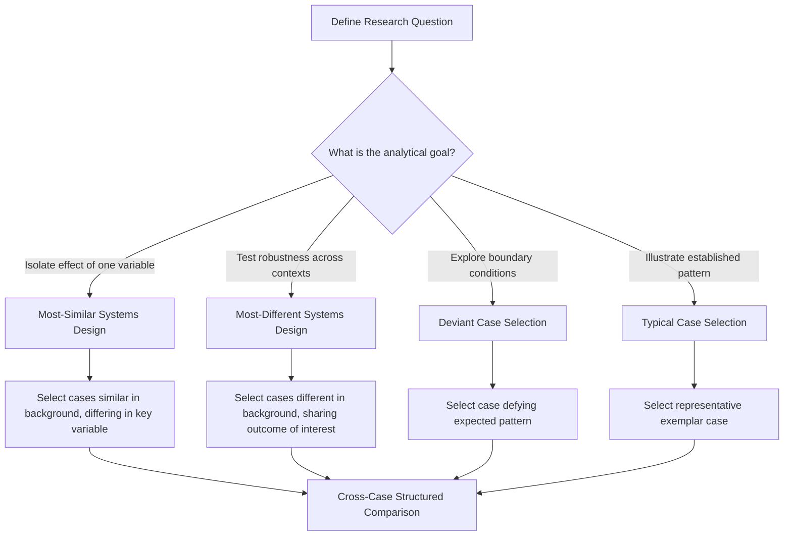

## Comparative Case Study Techniques

### Definition and Scope

Comparative case study techniques provide the specific methodological toolkit for analyzing *multiple* crisis cases side-by-side to identify patterns, test theoretical propositions, and build more robust generalizable knowledge than any single case can support. This extends the general analytical frameworks covered in the previous section into concrete comparative research design — addressing how many cases to select, on what basis to select them, how to structure comparison to isolate meaningful variables, and how to draw defensible conclusions from cross-case patterns.

This domain covers case selection methodology (most-similar and most-different systems designs), structured-focused comparison technique, cross-case matrix construction, process tracing for causal inference, and the specific validity threats unique to comparative (as opposed to single-case) analysis.

### Why Comparison Requires Distinct Methodology from Single-Case Analysis

**Key Points**

- **Isolating variables of interest**: A single case cannot distinguish which specific factors caused a particular outcome, since everything about that case is simultaneously present; comparison across cases that share some characteristics but differ in others allows more confident attribution of outcome differences to specific variables.
- **Testing rather than just illustrating theory**: A single case study is often used to *illustrate* a theoretical framework (as in the previous section); a well-designed comparative study can genuinely *test* whether a theoretical proposition holds across varied conditions, providing stronger evidentiary support.
- **Building toward generalizable principles with defined scope conditions**: Comparison across a structured case set helps identify not just *whether* a pattern holds, but the specific conditions (sector, severity, cultural context) under which it does or doesn't hold — producing more precise, appropriately bounded generalizations than single-case analysis typically allows.

### Case Selection Methodology

**1. Most-Similar Systems Design (MSSD)**

Selecting cases that are similar across most background characteristics (sector, size, region, crisis type) but differ on the specific variable of interest (e.g., response speed, or choice of spokesperson) — allowing the analyst to more confidently attribute outcome differences to that variable, since other confounding factors are held roughly constant.

**2. Most-Different Systems Design (MDSD)**

Selecting cases that differ substantially across background characteristics but share a common outcome or pattern of interest (e.g., crises across very different sectors that all resulted in successful trust recovery) — useful for identifying whether a proposed causal factor holds robustly across highly varied contexts, suggesting a more universal (rather than context-specific) principle.

**3. Deviant/Outlier Case Selection**

Deliberately including a case that defies the expected pattern (e.g., a crisis where rapid transparent disclosure was followed by *worse* reputational outcomes than a comparison case with slower disclosure) — outlier cases are often analytically valuable precisely because they reveal boundary conditions or additional variables not captured by the dominant pattern.

**4. Typical Case Selection**

Selecting a case that is broadly representative of a well-established category (e.g., a "typical" product recall crisis) primarily to illustrate or confirm an already well-supported pattern, useful for pedagogical purposes though less valuable for generating new theoretical insight than the designs above.

### Case Selection Design Comparison

### Structured-Focused Comparison Technique

Developed originally in political science case study methodology (Alexander George), this technique imposes discipline on comparative case analysis by requiring the analyst to:

- **Ask the same set of standardized questions of every case** (the cross-case matrix dimensions listed in the previous section's comparative table are an example) rather than allowing each case write-up to organically develop its own unique structure.
- **Focus the inquiry on specific research objectives** rather than attempting an exhaustive, unfocused description of each case, keeping comparison analytically tractable.
- **Structure findings into a cross-case matrix** enabling direct visual and analytical comparison across cases on each standardized dimension.

### Cross-Case Matrix Construction (Illustrative Template)

| Case | Sector | Crisis Type | Responsibility Attribution (SCCT) | Response Strategy | Disclosure Timing | Recovery Trajectory |
| --- | --- | --- | --- | --- | --- | --- |
| Case A | [Sector] | [Type] | [Victim/Accidental/Preventable] | [Denial/Corrective/Mortification] | [Fast/Delayed] | [Recovery duration/outcome] |
| Case B | [Sector] | [Type] | [Attribution] | [Strategy] | [Timing] | [Outcome] |
| Case C | [Sector] | [Type] | [Attribution] | [Strategy] | [Timing] | [Outcome] |

Populating such a matrix with actual documented cases allows the analyst to visually scan for patterns (e.g., "cases with 'preventable' attribution and 'denial' strategy consistently show the longest recovery trajectories") while making the comparative basis for any claimed pattern fully transparent and auditable by other researchers or practitioners.

### Process Tracing for Causal Inference

**Key Points**

- **Within-case causal chain analysis**: Rather than only comparing outcomes across cases, process tracing examines the specific causal mechanism *within* each case — the sequence of intermediate steps connecting a hypothesized cause to an observed outcome — providing more confident causal inference than correlation across cases alone.
- **Testing for the presence of a hypothesized mechanism**: If a comparative pattern suggests, for example, that "legal-communications misalignment causes slower recovery," process tracing within specific cases examines whether the documented evidence actually shows that misalignment occurring and producing the delays in question, rather than merely inferring the mechanism from correlated timing.
- **Distinguishing necessary, sufficient, and contributing causes**: Rigorous process tracing considers whether a given factor was necessary for the outcome (removing it would have prevented the outcome), sufficient (its presence alone guaranteed the outcome), or merely a contributing factor among several — a more precise causal claim than simple association.

### Validity Threats Specific to Comparative Analysis

**Key Points**

- **Case selection bias**: Choosing cases that happen to support a pre-existing hypothesis (consciously or unconsciously) rather than selecting cases according to a defensible, pre-specified methodology — one of the most significant threats to comparative case study credibility.
- **Confounding variable neglect**: Attributing an outcome difference to the variable of primary interest when an unaddressed background difference between cases (industry maturity, media environment era, regulatory context) may be the actual driver.
- **Small-N generalization overreach**: Comparative case studies typically involve a small number of cases (often 2–10) compared to large-sample quantitative research; conclusions should be framed with appropriately bounded confidence rather than presented with the statistical confidence associated with large-sample studies.
- **Temporal confounds across eras**: Comparing a crisis from one media/technology era (e.g., pre-social-media) against a more recent case without accounting for how fundamentally the information environment has changed can produce misleading comparative conclusions.
- **Publication/documentation asymmetry**: Some cases have far richer publicly available documentation (extensive media coverage, court records, regulatory findings) than others, creating an analytical imbalance where better-documented cases may be given disproportionate interpretive weight simply due to information availability, not actual relevance.

[Inference] The appropriate number of cases and the specific comparative design for a given research question involves genuine methodological judgment without a single universally correct answer; different case study methodologists have proposed varying guidance on case-count and design selection, and reasonable disagreement exists in the broader qualitative research methodology literature on these questions.

### Structuring a Comparative Case Study Write-Up

1. **Research question and rationale for comparison**: Explicit statement of what the comparison is designed to reveal and why a comparative (rather than single-case) approach was selected.
2. **Case selection methodology and justification**: Explicit statement of the selection design used (MSSD, MDSD, deviant, typical) and why the specific cases were chosen under that design.
3. **Individual case summaries**: Brief, standardized summaries of each case following the structured-focused comparison questions.
4. **Cross-case matrix and pattern identification**: Visual/tabular comparison highlighting observed patterns and, importantly, disconfirming or complicating evidence.
5. **Process tracing for key causal claims**: Deeper within-case examination of the mechanism behind any pattern claimed to be causal, not merely correlational.
6. **Bounded conclusions and scope conditions**: Explicit statement of the conditions under which the identified pattern is believed to hold, and appropriate acknowledgment of the small-sample and documentation-asymmetry limitations discussed above.

### Common Pitfalls

- **Post-hoc case selection to fit a conclusion**: Selecting cases after having already formed a conclusion, then presenting the comparison as if it had been the basis for reaching that conclusion — undermines the analytical integrity of the exercise even if the underlying pattern is genuinely real.
- **Comparing cases across incompatible timeframes without adjustment**: Directly comparing crisis response effectiveness between a case from decades ago and a recent case without accounting for the substantially different media/technology environment.
- **Treating correlation from a small case set as established causation**: Presenting a pattern observed across a handful of cases with the same confidence as a large-sample statistical finding, without appropriate hedging language.
- **Uneven depth of research across cases**: Conducting deep, well-sourced analysis of one or two cases while relying on superficial secondary sources for comparison cases, creating an analytically lopsided comparison.
- **Ignoring disconfirming cases**: Selectively emphasizing cases that fit an emerging pattern while omitting or downplaying known cases that contradict it, rather than explicitly grappling with disconfirming evidence as the structured-focused comparison method requires.
- **Static case snapshots ignoring within-case evolution**: Treating each case as a single fixed data point rather than recognizing that a crisis and its recovery unfold over an extended timeline (as discussed in long-term reputation recovery monitoring), potentially at different comparative "stages" if cases are examined at different points post-crisis.

### Related Topics

- Frameworks for Analyzing Historical Crises
- Organizational Learning and Policy Change
- Monitoring Long-Term Reputation Recovery
- Situational Crisis Communication Theory (SCCT) in Depth
- Root Cause Analysis Techniques (5 Whys, Fishbone, Fault Tree)
- Qualitative Research Methodology and Small-N Case Study Design
- Bias and Heuristics in Retrospective Organizational Analysis
- Process Tracing and Causal Mechanism Analysis