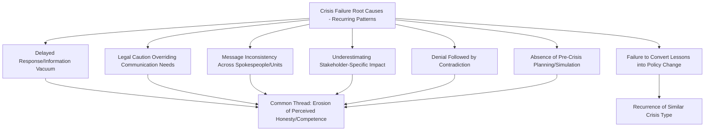
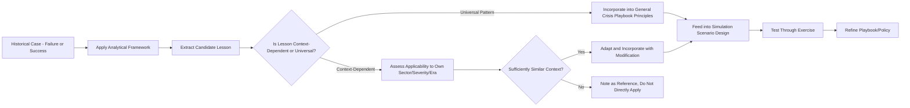

## Learning from Crisis Failures and Successes

### Definition and Scope

Learning from crisis failures and successes addresses the specific analytical discipline of extracting *actionable* lessons from historical cases — moving beyond the descriptive and comparative methodologies covered in the previous two sections toward the practical synthesis question: given what has been documented and compared, what should practitioners actually do differently? This closes the loop between case study methodology and applied practice, and connects historical analysis back to the organizational learning and policy change processes discussed earlier in this text.

This domain covers the asymmetric analytical treatment of failure versus success cases, common cross-cutting lesson categories that recur across sectors, the specific challenge of learning from "near-miss" cases, and methods for translating case-derived lessons into an organization's own crisis preparedness without inappropriate direct transplantation.

### The Asymmetry Between Studying Failure and Studying Success

**Key Points**

- **Failure cases are more numerous and better documented**: Crisis failures generate media attention, litigation records, and regulatory findings that create rich public documentation; well-handled crises often generate comparatively little public record precisely because they were managed well and didn't escalate — creating a documentation asymmetry that can bias the available case literature toward failure analysis.
- **Success is harder to attribute causally**: A crisis that resolved well might reflect genuinely excellent management, or might reflect a lower-severity underlying situation, favorable external circumstances, or simple luck — disentangling skill from favorable conditions is analytically harder for success cases than identifying clear errors in failure cases.
- **Survivorship bias in success stories**: Organizations and consultants have a natural incentive to publicize their crisis-management successes (case studies, award submissions, conference presentations) while suppressing or minimizing public discussion of failures, creating a skewed sample of readily available "success" case material that may not represent success as rigorously as failure cases represent failure.
- **Failure analysis yields clearer actionable lessons**: Identifying what went wrong and why (using root cause analysis techniques discussed earlier) often produces more direct, specific, and actionable process lessons than studying success, where the lesson may be more diffuse ("good judgment," "strong pre-existing trust") and harder to operationalize into a repeatable practice.

### Cross-Cutting Lesson Categories from Failure Analysis

**Key Points on Recurring Failure Patterns**

- **The information vacuum pattern**: Across sectors and eras, delayed initial response consistently appears as a contributing factor to worse outcomes — recurring so frequently across documented failure cases that it represents one of the most robustly supported cross-cutting lessons in the field.
- **The "second crisis" pattern**: A poorly handled response to an initial crisis (denial later contradicted, inconsistent statements, perceived insincerity) frequently generates a secondary reputational crisis distinct from and often more damaging than the original triggering event — a pattern observed across corporate, celebrity, and institutional cases alike.
- **The legal-communications tension pattern**: Cases across virtually every sector covered in this text show recurring tension between legal risk-minimization advice and communications transparency needs, suggesting this is a structural feature of crisis response rather than an idiosyncratic failure specific to any one organization or industry.
- **The "learning theater" pattern**: Organizations conducting visible post-crisis reviews or issuing accountability statements without underlying structural change recur across multiple sectors, and are frequently identified (sometimes years later, upon a repeat incident) as having failed to convert stated lessons into actual policy change.

### Learning from "Near-Miss" and Averted Crisis Cases

**Key Points**

- **Definitional challenge**: A near-miss (a situation with clear crisis potential that was contained before escalating) is inherently harder to identify and study than an actualized crisis, since near-misses often remain entirely internal and undocumented externally.
- **Value despite documentation scarcity**: Near-miss cases, where available (often through internal organizational archives, industry safety reporting systems, or practitioner interviews rather than public media record), can be analytically valuable precisely because they show what effective early intervention looks like, distinct from post-hoc crisis response.
- **High-reliability organization theory connection**: Industries with strong high-reliability organization (HRO) cultures — aviation, nuclear power — have established formal near-miss reporting systems specifically because they recognize near-misses as valuable, underutilized learning data relative to their scarcity of actual catastrophic events; this practice offers a transferable model for organizations in other sectors seeking to build a richer internal learning case base beyond only their own actualized crises.
- **Risk of near-miss complacency**: A documented psychological risk is that successfully averting a near-miss can reinforce overconfidence in existing systems ("it worked, so our processes must be fine") rather than prompting the same rigorous root-cause inquiry a full crisis would trigger — near-miss review processes should apply comparably rigorous analysis to avoid this complacency trap.

### Translating Case Lessons into Organizational Practice

**Key Points**

- **Avoiding direct transplantation without context adaptation**: A lesson extracted from a case in a different sector, era, or severity level should be adapted to the analyzing organization's specific context (as emphasized in comparative case study methodology) rather than mechanically copied — what worked for a large multinational corporation's data breach response may not directly transfer to a small nonprofit's safeguarding crisis.
- **Distinguishing universal principles from context-specific tactics**: Some lessons appear to hold quite broadly across the case literature (the value of speed, the risk of denial-then-contradiction, the importance of pre-crisis planning); others are more tactically specific to a particular sector or era and require more careful evaluation before adoption.
- **Feeding case lessons into simulation scenario design**: As discussed in the crisis simulation and training section, documented historical failure patterns provide a rich source of realistic scenario material for tabletop and immersive exercises, connecting historical analysis directly to forward-looking preparedness.
- **Institutionalizing lesson review as an ongoing practice**: Mature crisis management functions maintain a living internal repository of case lessons (both from their own history and from external case study) reviewed periodically, rather than treating case study as a one-time academic exercise disconnected from operational practice.

### A Framework for Lesson Extraction and Application

### Common Pitfalls

- **Over-indexing on famous failure cases**: Repeatedly citing the same few widely publicized crisis failures as universal object lessons, while a broader and more representative sample of both well-known and lesser-known cases would likely surface a richer and more nuanced set of patterns.
- **Uncritical adoption of "success story" lessons**: Treating a publicized success case's stated strategy as the proven cause of its good outcome, without considering that favorable underlying conditions (lower severity, strong pre-existing trust, favorable media environment) may have been the actual primary driver, independent of the specific tactical choices made.
- **Failing to update lessons as the media/technology environment evolves**: Applying lessons drawn primarily from a pre-social-media era case set without adjusting for how fundamentally the speed and dynamics of public reaction have changed, producing outdated tactical guidance even when the underlying structural lesson remains valid.
- **Near-miss underutilization**: Failing to systematically capture and analyze an organization's own near-miss experiences, relying solely on external, publicly documented failure cases and missing a potentially richer and more directly relevant internal learning source.
- **Lesson extraction without simulation follow-through**: Identifying valuable case lessons in a written case-study exercise but failing to operationalize them into actual simulation scenarios or playbook revisions, repeating the "learning theater" failure pattern in the case-study function itself.
- **Ignoring the role of luck and external context**: Attributing a good or bad outcome entirely to organizational skill or failure, without acknowledging that documented cases across the literature show outcomes are also meaningfully shaped by external circumstances (competing news cycles, broader social/political climate, industry-wide conditions) not fully within any organization's control.

### Illustrative Synthesis Example

An organization conducting a lessons-learned exercise ahead of updating its crisis playbook draws on a comparative case set spanning a product recall failure, a data breach handled relatively well, and an internal near-miss from its own prior operations.

- From the **product recall failure case**, the analysis extracts a well-supported, broadly transferable lesson: delayed disclosure pending "complete certainty" consistently correlated with worse outcomes across the comparative case set, supporting a playbook principle favoring earlier, appropriately caveated disclosure over delayed, fully-certain disclosure.
- From the **data breach handled relatively well**, the analysis notes the organization's rapid, coordinated legal-communications response, but explicitly flags uncertainty about how much of the favorable outcome reflected that coordination versus the breach's comparatively lower severity — leading the team to adopt the coordination *process* as a lesson while avoiding overconfident claims about guaranteed outcome replication.
- From the **internal near-miss**, the team identifies an early-warning signal (a minor customer complaint pattern) that, in hindsight, presaged the externally documented recall failure case's early stages — leading to a new internal near-miss reporting and review protocol modeled on high-reliability-organization practice.
- These three lessons are then explicitly built into revised tabletop exercise scenarios (connecting back to the crisis simulation function) rather than remaining solely as a written case-study document, closing the loop from historical analysis to operational preparedness.

### Related Topics

- Frameworks for Analyzing Historical Crises
- Comparative Case Study Techniques
- Organizational Learning and Policy Change
- Crisis Simulation and Training Software
- High-Reliability Organization (HRO) Theory
- Bias and Heuristics in Retrospective Organizational Analysis
- Root Cause Analysis Techniques (5 Whys, Fishbone, Fault Tree)
- Crisis Communication Playbook Development