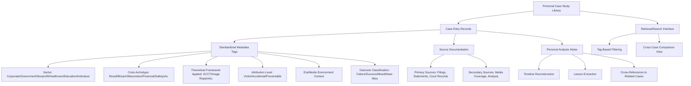
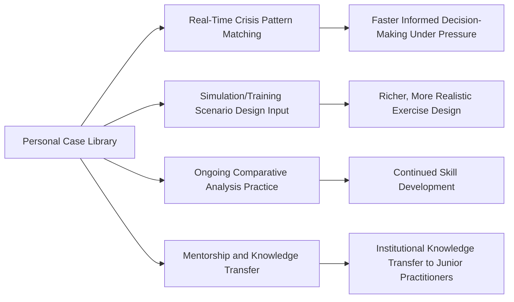

## Building a Personal Case Study Library

### Definition and Scope

Building a personal case study library addresses the practical, ongoing discipline of assembling and maintaining an individual practitioner's curated collection of crisis cases — the capstone practice that operationalizes the frameworks, comparative techniques, and lesson-extraction methods covered throughout this chapter into a durable professional resource. Unlike organizational case repositories (which serve institutional memory, as discussed in organizational learning), a personal case study library is an individual crisis management practitioner's own accumulated reference system, built and refined over a career to support faster pattern recognition, more confident decision-making under pressure, and continued professional development.

This domain covers library structure and taxonomy design, sourcing and documentation standards, maintenance and currency practices, and methods for actively using the library in real-time crisis response and ongoing skill development rather than allowing it to become a static, unused archive.

### Why Practitioners Benefit from a Personal (Not Only Organizational) Library

**Key Points**

- **Career mobility and portability**: A practitioner's personal case knowledge travels with them across organizations and roles, unlike an employer's internal case repository, which typically remains with the organization when a practitioner moves on.
- **Cross-sector pattern recognition**: A personal library assembled from external, publicly available cases (rather than only the practitioner's own organizational experience) exposes the practitioner to a far broader range of crisis archetypes, sectors, and eras than any single organization is likely to generate internally.
- **Faster real-time pattern-matching under pressure**: Practitioners who have deeply internalized a well-organized set of prior cases can draw on that mental library rapidly during an actual live crisis, recognizing "this resembles Case X, and here's how that unfolded" far faster than researching a comparable precedent from scratch under time pressure.
- **Foundation for the comparative techniques discussed earlier**: A practitioner cannot conduct rigorous most-similar or most-different systems comparison, or structured-focused comparison, without first having assembled a sufficiently deep and well-documented set of cases to draw from — the personal library is the raw material for applying the methodologies covered in this chapter.

### Library Architecture and Taxonomy

### Case Entry Documentation Standard

A well-structured personal case entry should consistently capture, at minimum:

| Field | Content |
| --- | --- |
| Case identifier | Organization, crisis type, and year (for unique reference) |
| Sector and archetype tags | Standardized taxonomy tags for later filtering and comparison |
| Factual timeline | Chronological reconstruction, dated and source-cited |
| Theoretical classification | Applicable framework classification (SCCT attribution category, image-repair strategy type) |
| Key decision points | Specific junctures where organizational choices were made, with contemporaneous information context |
| Outcome data | Available reputational, financial, regulatory, or leadership-change outcome metrics |
| Extracted lessons | Practitioner's own distilled takeaways, explicitly flagged as universal vs. context-dependent |
| Source citations | Links/references to primary and secondary sources, enabling later verification or deeper research |
| Cross-references | Links to related or comparable cases already in the library |
| Personal reflection notes | The practitioner's own evolving interpretation, which may be revised as the practitioner's experience and judgment develop over time |

### Sourcing Strategy

**Key Points**

- **Primary sources first**: Regulatory filings, official statements, court records, and organizational disclosures should be prioritized as the factual foundation, consistent with the source-verification discipline discussed in the historical crisis analysis framework.
- **Diverse secondary source triangulation**: Drawing on multiple independent media/analytical sources rather than a single outlet's account, to identify areas of factual consensus versus contested interpretation.
- **Trade press and sector-specific publications**: Industry-specific trade publications often provide more technically detailed and sector-contextualized coverage than general media, valuable for sector-specific archetype cases (healthcare, higher education, nonprofit).
- **Academic and professional case study literature**: Published academic case studies and professional association case libraries (where accessible) often apply more rigorous, source-verified methodology than general news coverage, and often already apply the theoretical frameworks discussed earlier in this chapter.
- **Practitioner networks and professional communities**: Informal knowledge-sharing within professional crisis management communities can surface less publicly documented cases or additional context/nuance not captured in public reporting — subject, of course, to appropriate confidentiality and ethical handling where such information is shared in confidence.
- **One's own direct professional experience**: Cases the practitioner has personally worked on (subject to appropriate confidentiality obligations to past employers/clients) often provide the richest and most nuanced entries, given direct access to context unavailable in any public case.

### Maintenance and Currency Practices

**Key Points**

- **Periodic review cadence**: Establishing a regular practice (e.g., quarterly or semi-annual) of reviewing and updating existing entries as new information emerges (litigation outcomes, subsequent regulatory findings, long-term recovery data that wasn't available at initial documentation) and adding newly emerging cases.
- **Retrospective updating as outcomes unfold**: Many crisis cases have outcome data that only becomes available months or years after the initial event (litigation resolution, multi-year recovery trajectory); a living library should be revisited to add this data as it becomes available, rather than treating the initial write-up as permanently final.
- **Pruning and consolidation**: As the library grows, periodically consolidating redundant or superseded entries and retiring cases that, on reflection, no longer provide distinct analytical value relative to better-documented comparable cases — avoiding a library that grows so large it becomes difficult to navigate.
- **Framework currency updates**: As crisis communication theory evolves (or as the practitioner develops more sophisticated understanding of existing frameworks), revisiting the theoretical classifications applied to earlier entries to ensure they reflect current best understanding rather than the practitioner's earlier-career analytical framework.

### Active Use Practices (Avoiding a Static, Unused Archive)

**Key Points**

- **Deliberate practice through periodic re-analysis**: Returning to previously documented cases and re-applying frameworks or comparative techniques as one's own analytical skill develops, treating the library as a training ground for continued methodological practice rather than a one-time documentation exercise.
- **Direct input to simulation scenario design**: As discussed in the crisis simulation section, a well-developed personal case library provides realistic, well-researched raw material for designing tabletop and immersive training scenarios, whether for one's own organization or for broader training/consulting work.
- **Supporting real-time advisory judgment**: During an actual live crisis, a practitioner with a well-internalized case library can more quickly recognize which historical pattern the current situation most resembles, informing (though never mechanically dictating) real-time strategic recommendations.
- **Teaching and mentorship value**: A well-organized personal case library serves as valuable teaching material for mentoring junior practitioners, presenting or writing case-based training content, or contributing to professional development programs within one's organization or industry.

### Ethical and Confidentiality Considerations

**Key Points**

- **Respecting confidentiality obligations from direct professional experience**: Cases drawn from a practitioner's own direct work must respect any applicable confidentiality agreements, attorney-client privilege considerations, or professional ethical obligations — often requiring careful anonymization, generalization, or, in some cases, complete exclusion of certain details even in a purely personal, non-shared library.
- **Distinguishing public record from privileged/confidential information**: A practitioner should maintain clear internal discipline about which case details are drawn from public record (freely usable and shareable) versus confidential professional knowledge (which may inform the practitioner's own judgment but should not be documented or shared in ways that could breach confidentiality).
- **Responsible handling if the library is ever shared or published**: If portions of a personal library are later used in teaching, publication, or consulting work, the practitioner should apply appropriate source attribution and avoid presenting speculative interpretation as established fact, consistent with the rigor expected of the broader case study methodology discussed in this chapter.

### Common Pitfalls

- **Unstructured collection without a taxonomy**: Accumulating case notes or bookmarked articles without a consistent tagging/metadata structure, making the collection difficult to search or use for structured comparison as it grows.
- **Documentation without analysis**: Building a library of purely descriptive case summaries without applying the theoretical frameworks or extracting explicit lessons, reducing the library to a reference archive rather than an active analytical tool.
- **Static library, never revisited**: Building an initial library early in one's career but failing to maintain the periodic review and updating practice, resulting in a library with stale outcome data and outdated framework classifications.
- **Over-reliance on secondary sources**: Populating the library primarily from easily accessible news commentary rather than prioritizing primary source verification, propagating potential factual errors or contested characterizations as if they were settled fact.
- **Confidentiality breaches through inadequate anonymization**: Documenting details from direct professional experience with insufficient care about confidentiality obligations, creating professional and ethical risk if the library is ever inadvertently shared or discovered.
- **Narrow sourcing producing a skewed sample**: Drawing cases predominantly from one's own sector or a narrow set of highly publicized examples, missing the broader cross-sector pattern recognition value that a deliberately diverse library provides.
- **Treating the library as a finished project**: Approaching library-building as a one-time task to "complete" rather than as an ongoing professional practice that should continue and evolve throughout a practitioner's career.

### Illustrative Practice Example

A communications professional early in their crisis management career begins building a personal case library, starting with five well-documented public cases spanning corporate, government, and nonprofit sectors, each tagged using a consistent taxonomy (sector, archetype, SCCT attribution category, outcome classification) and documented with primary-source-verified timelines.

- Over the following two years, the practitioner adds cases encountered through professional reading, industry conference case presentations, and their own direct (appropriately anonymized) professional experience, gradually building toward several dozen entries.
- Every six months, the practitioner reviews existing entries, updating outcome data for cases where litigation has since resolved or longer-term recovery data has become available, and occasionally revising earlier theoretical classifications as their own understanding of the frameworks deepens.
- When asked to help design a tabletop exercise for their organization, the practitioner draws directly on three library entries sharing a similar archetype to their organization's highest-priority risk scenario, adapting documented real-world decision points into realistic exercise injects.
- During an actual live crisis at their organization years later, the practitioner recognizes structural similarities to a case documented early in their library-building process, informing (though not mechanically dictating) a real-time recommendation to prioritize early stakeholder disclosure over waiting for full investigative certainty — directly applying a lesson extracted years earlier from comparative case analysis.

### Related Topics

- Frameworks for Analyzing Historical Crises
- Comparative Case Study Techniques
- Learning from Crisis Failures and Successes
- Crisis Simulation and Training Software
- Organizational Learning and Policy Change
- Situational Crisis Communication Theory (SCCT) in Depth
- Professional Development and Mentorship in Crisis Management
- Source Verification and Primary Document Research Methods