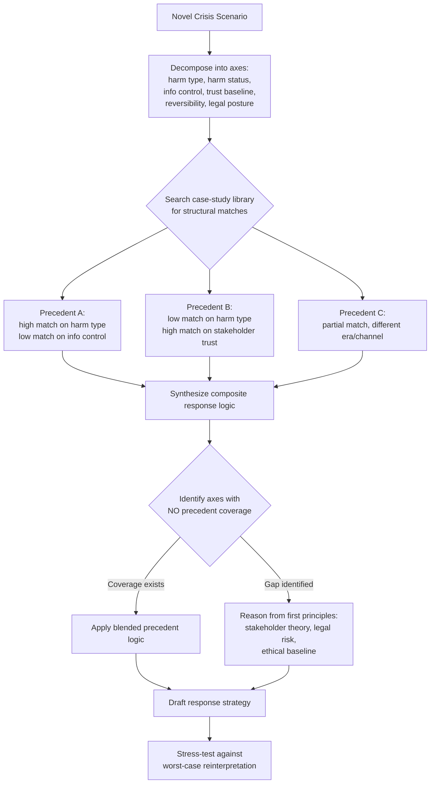

## Applying Precedent to Novel Crisis Scenarios

### Overview

Applying precedent to novel crisis scenarios is the disciplined practice of using prior crisis case studies as analytical scaffolding for situations that lack a direct historical analogue. Unlike simple pattern-matching ("this looks like Tylenol 1982"), rigorous precedent application requires decomposing past cases into transferable structural components — stakeholder dynamics, decision timelines, information asymmetries, institutional constraints — and testing which components genuinely transfer to the new context versus which create false confidence.

**Key Points**

- Precedent is a reasoning tool, not a template; surface-level similarity between crises is often misleading
- The core skill is abstraction: extracting the *mechanism* of what worked or failed, separate from the *specifics* of the original case
- Novel crises (new technology, unprecedented stakeholder configurations, unfamiliar regulatory terrain) require blending multiple partial precedents rather than relying on one
- Misapplied precedent is a documented failure mode in crisis response and can be as damaging as having no framework at all

---

### Why Precedent Application Is Difficult

Crises that feel unprecedented usually aren't *entirely* unprecedented — they combine familiar sub-problems in an unfamiliar configuration. The difficulty is threefold:

1. **Surface vs. structural similarity.** Two crises can look alike (product recall, executive scandal, data breach) but differ in the variables that actually determine outcome: speed of information spread, regulatory exposure, whether the harm is ongoing or contained, and whether the organization is trusted or already suspect.
2. **Survivorship bias in the case-study canon.** Widely taught precedents (Johnson & Johnson's Tylenol response, Exxon Valdez, United Airlines' 2017 passenger-removal incident) are often taught *because* the outcome was unusually good or bad, not because they are statistically representative of how similar crises typically unfold.
3. **Context decay.** Media ecosystems, regulatory regimes, and public expectations shift. A precedent from the 1980s pre-internet era may misstate the *speed* dimension entirely, even if the stakeholder logic still holds.

---

### A Framework for Structural Decomposition

Before asking "what precedent applies," decompose the novel scenario into comparable axes. This is the core transferable technique.

#### 1. Extract the mechanism, not the surface story

For any candidate precedent, ask what *causal mechanism* produced the outcome — not what the story sounds like.

- Surface story: "Company recalled a product and survived."
- Mechanism: "Company voluntarily absorbed short-term cost to signal credible commitment to safety before being compelled by regulators, which preserved trust capital that was later monetizable."

The mechanism is portable across industries and eras; the surface story is not.

#### 2. Map the axes of comparison

| Axis | Question to ask | Why it matters |
| --- | --- | --- |
| Harm type | Physical, financial, reputational, informational? | Determines urgency and legal exposure |
| Harm status | Ongoing, contained, or ambiguous? | Ongoing harm demands action-first; contained harm allows more deliberation |
| Information control | Does the organization control the primary facts, or is a third party (journalist, regulator, whistleblower) driving disclosure? | Determines whether "get ahead of the story" is even possible |
| Stakeholder trust baseline | Was the organization trusted before the crisis? | High baseline trust affords more benefit of the doubt; eroded trust compounds skepticism |
| Decision reversibility | Can early statements/actions be walked back without further damage? | Precedents involving irreversible early missteps (e.g., premature blame denial) warn against speed-over-accuracy tradeoffs |
| Regulatory/legal posture | Is there an active investigation, litigation exposure, or disclosure obligation? | Legal counsel constraints can override "best practice" communications advice |
| Novelty source | New technology, new stakeholder group (e.g., AI-generated content, gig workers, algorithmic bias), or new channel (viral video, generative misinformation)? | Determines which part of the precedent is genuinely inapplicable |

#### 3. Score partial precedents against the axes

Rather than selecting one "best" precedent, build a short table scoring 2–4 candidate precedents against the axes above. High-transfer axes get weighted more heavily; low-transfer axes flag where the organization must reason from first principles instead of history.

---

### Worked Example: Applying Precedent to an AI-Generated Misinformation Crisis

**Scenario:** A company discovers that AI-generated deepfake content falsely depicting its CEO endorsing a fraudulent investment scheme is circulating virally, and the origin is external (not an internal leak or employee error).

**Step 1 — Decompose the axes:**

- Harm type: reputational + financial (investors may be defrauded using the company's brand)
- Harm status: ongoing and accelerating (viral spread)
- Information control: low — the company did not create the content and cannot unilaterally remove it from all platforms
- Trust baseline: [Inference] depends on pre-existing brand trust, which must be assessed case-by-case rather than assumed
- Reversibility: statements made early can be corrected, but delay allows the false narrative to calcify
- Legal posture: potential trademark/impersonation claims, plus possible securities-fraud adjacent exposure if investors act on the fraud
- Novelty source: the technology (synthetic media) is new; the underlying mechanism (impersonation-based fraud using a trusted brand) is not

**Step 2 — Candidate precedents and what transfers:**

- *Corporate impersonation/phishing scandals* (e.g., fake executive emails authorizing wire transfers): transfers the "rapid, unambiguous public disavowal" playbook and the "coordinate with law enforcement/financial regulators" step. Does not transfer guidance on platform-level content takedown speed, since deepfakes exploit visual/audio trust in a way email spoofing does not.
- *Product tampering crises (Tylenol precedent)*: transfers the core mechanism of "visible, costly, proactive action signals credibility" but the specific action (recall) has no equivalent — there is no product to recall. The transferable abstraction is "take a visible, verifiable, costly-to-fake action" (e.g., cryptographically signed statements from verified executive channels).
- *Platform-driven misinformation cases (unrelated brand hijacking on social media)*: transfers escalation pathways to platform trust & safety teams and the value of pre-established platform relationships, which is where organizations without such relationships find themselves reasoning from first principles rather than precedent.

**Step 3 — Identify the genuine gap:**

No historical precedent fully covers "synthetic media exploiting biometric likeness at scale." The organization must reason from first principles on: verification infrastructure (how do stakeholders confirm what's real?), and speed of technical detection (does the company have deepfake-detection capability or must it rely on third parties?).

**Output — Synthesized approach:**

1. Immediate, verifiable disavowal through pre-authenticated channels (verified accounts, direct stakeholder outreach) — drawn from impersonation precedent
2. Visible, costly, hard-to-fake countersignal (e.g., real-time verified video statement, coordination with platforms for expedited review) — abstracted from the Tylenol mechanism
3. Parallel legal/regulatory notification given the fraud-adjacent exposure — drawn from securities/impersonation precedent
4. Explicit acknowledgment of the technology gap ("we cannot yet guarantee removal at the pace of spread") — a first-principles addition with no direct precedent, included because false confidence about control would be reversibility risk

---

### Common Failure Modes in Precedent Application

- **Anchoring on the most famous case rather than the best-matched case.** Tylenol is over-applied to situations where the harm is not physical/product-based and where the company does not have unilateral control over remediation.
- **Ignoring era-specific variables.** Applying a 1990s "24-hour response window" standard to a media environment where the expected window is now measured in hours — or minutes for ongoing harm.
- **Treating a single precedent as sufficient.** Novel crises typically require blending 2–3 partial precedents; relying on one increases the risk that an untested axis (e.g., legal posture) is overlooked entirely.
- **Confusing "what an organization said" with "why it worked."** Public communications framing (tone, apology language) is often mimicked, but the mechanism (timing, verifiable action, information control) is what actually determined the outcome. [Unverified] The extent to which tone/framing independently affects outcomes versus riding on top of the mechanism is contested in the crisis-communications literature and not settled by any single case study.
- **Assuming legal and communications precedent point the same direction.** Legal precedent often counsels minimal admission; reputational precedent often counsels rapid acknowledgment. Novel scenarios frequently surface this tension more acutely because there is no settled convention for resolving it in the new context.

---

### Practical Checklist for Applying Precedent Under Time Pressure

1. Name the harm type and harm status first — this determines your time budget
2. Identify who controls the primary facts (you, a journalist, a regulator, the public)
3. Pull 2–3 candidate precedents; score them against the axes table, not by topical similarity
4. Explicitly flag any axis with no historical coverage — do not silently default to the nearest precedent
5. For uncovered axes, reason from stakeholder-trust and legal-risk first principles rather than analogy
6. Stress-test the synthesized plan against the worst plausible reinterpretation of your intended action
7. Document the reasoning trail (not just the decision) so the case itself becomes a usable precedent afterward

---

**Related Topics**

- Case study library construction and tagging by structural axis (rather than by industry or era)
- Stakeholder theory as a first-principles substitute when precedent coverage is absent
- Media ecosystem evolution and its effect on response-time benchmarks
- Legal vs. communications strategy conflicts during active litigation
- Post-crisis case documentation methodology for building future precedent
- Scenario planning and red-teaming for crises with no historical analogue